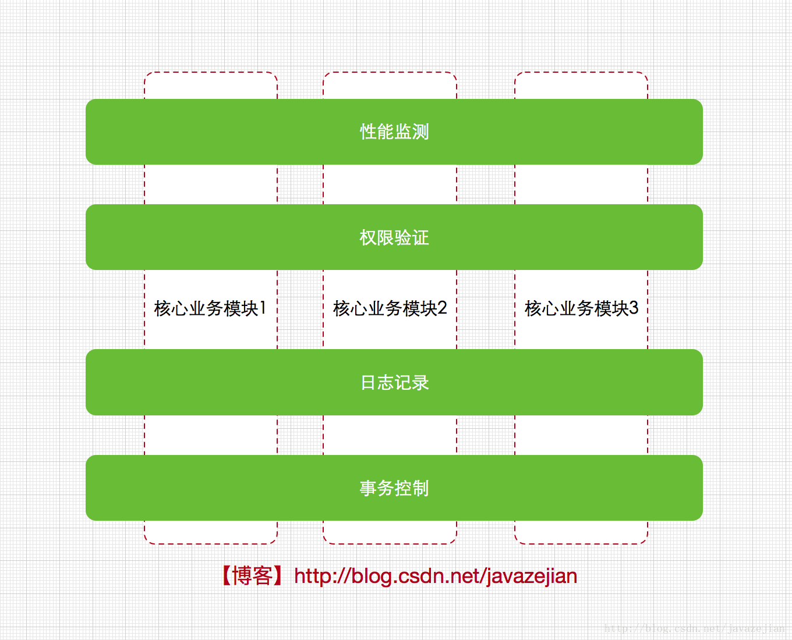
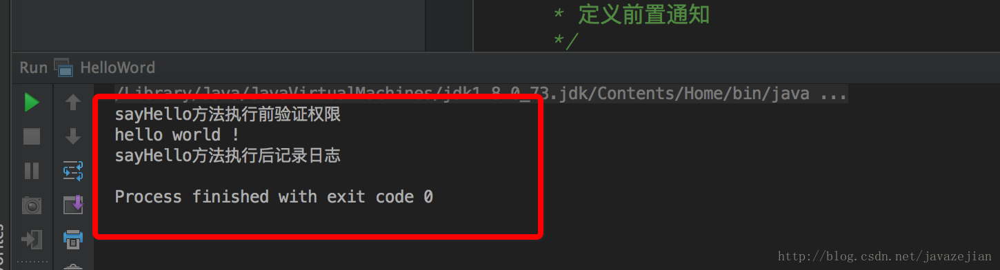
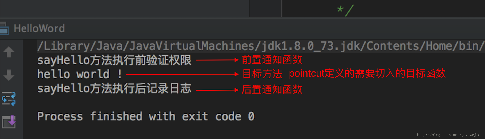
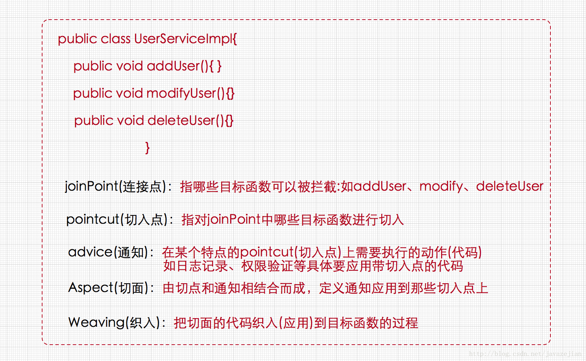
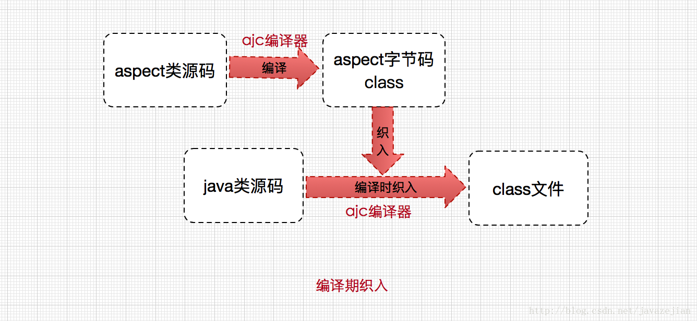
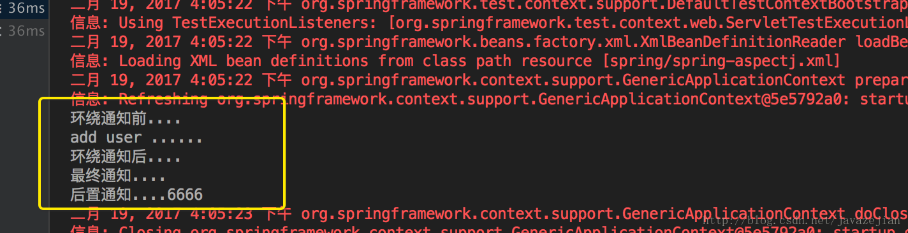

# Spring AOP 和 AspectJ 详解

## 1.OOP 新生机前夕

OOP即面向对象的程序设计，谈起了OOP，我们就不得不了解一下POP即面向过程程序设计，它是以功能为中心来进行思考和组织的一种编程方式，强调的是系统的数据被加工和处理的过程，说白了就是注重功能性的实现，效果达到就好了，而OOP则注重封装，强调整体性的概念，以对象为中心，将对象的内部组织与外部环境区分开来。

在实际的软件开发中，整个软件系统事实也是由系列相互依赖的对象所组成，而这些对象也是被抽象出来的类。相信大家在实际开发中是有所体验的。但是随着软件开发的系统越来越复杂，工程师认识到，传统的OOP程序经常表现出一些不自然的现象，核心业务中总掺杂着一些不相关联的特殊业务，如日志记录，权限验证，事务控制，性能检测，错误信息检测等等，这些特殊业务可以说和核心业务没有根本上的关联而且核心业务也不关心它们，比如在用户管理模块中，该模块本身除了用户相关的业务信息处理，还需要处理权限，日志，事务等待这些杂七杂八的不相干业务的外围操作，而且这些外围操作同样会在其他业务模块中出现，这样就会造成如下问题。

- 代码混乱：核心业务模块可能需要兼顾处理其他不相干的业务外围操作，这些外围操作可能会混乱核心操作的代码，而且当外围模块有重大修改时也会影响到核心模块，这显然是不合理的。
- 代码分散和冗余：同样的功能代码，在其他的模块几乎随处可见，导致代码分散并且冗余度高。
- 代码质量低扩展难：由于不太相关的业务代码混杂在一起，无法专注核心业务代码，当进行类似无关业务扩展时又会直接涉及到核心业务的代码，导致拓展性低。

显然前面分析的两种解决方案已束手无策了，那么该如何解决呢？事实上我们知道诸如日志，权限，事务，性能监测等业务几乎涉及到了所有的核心模块，如果把这些特殊的业务代码直接到核心业务模块的代码中就会造成上述的问题，而工程师更希望的是这些模块可以实现热插拔特性而且无需把外围的代码入侵到核心模块中，这样在日后的维护和扩展也将会有更佳的表现，假设现在我们把日志、权限、事务、性能监测等外围业务看作单独的关注点(也可以理解为单独的模块)，每个关注点都可以在需要它们的时刻及时被运用而且无需提前整合到核心模块中，这种形式相当下图：

<div align="center">
    
</div>

从图可以看出，每个关注点与核心业务模块分离，作为单独的功能，横切几个核心业务模块，这样的做的好处是显而易见的，每份功能代码不再单独入侵到核心业务类的代码中，即核心模块只需关注自己相关的业务，当需要外围业务 (日志，权限，性能监测、事务控制) 时，这些外围业务会通过一种特殊的技术自动应用到核心模块中，这些关注点有个特殊的名称，叫做横切关注点，上图也很好的表现出这个概念，另外这种抽象级别的技术也叫 AOP（面向切面编程），正如上图所展示的横切核心模块的整面，因此 AOP 的概念就出现了，而所谓的特殊技术也就面向切面编程的实现技术，AOP 的实现技术有多种，其中与 Java 无缝对接的是一种称为 AspectJ 的技术。

那么这种切面技术（AspectJ）是如何在 Java 中的应用呢？不必担心，对于 AspectJ，我们只会进行简单的了解，从而为理解 Spring 中的 AOP 打下良好的基础 (Spring AOP 与 AspectJ 实现原理上并不完全一致，但功能上是相似的，这点后面会分析)，毕竟 Spring 中已实现 AOP 主要功能，开发中直接使用 Spring 中提供的 AOP 功能即可，除非我们想单独使用 AspectJ 的其他功能。

## 2. AspectJ 简介

这里先进行一个简单案例的演示，然后引出 AOP 中一些晦涩难懂的抽象概念。编写一个 HelloWord 的类，然后利用 AspectJ 技术切入该类的执行过程。

```java{.line-numbers}
public class HelloWord {
    public void sayHello(){
        System.out.println("hello world !");
    }
    public static void main(String args[]){
        HelloWord helloWord =new HelloWord();
        helloWord.sayHello();
    }
}
```

编写 AspectJ 类，注意关键字为 aspect(**`MyAspectJDemo.aj`**, 其中 aj 为 AspectJ 的后缀)，含义与 class 相同，即定义一个 AspectJ 的类：

```java{.line-numbers}
/**
 * Created by zejian on 2017/2/15.
 * Blog 
 * 切面类
 */
public aspect MyAspectJDemo {
    /**
     * 定义切点,日志记录切点
     */
    pointcut recordLog():call(* HelloWord.sayHello(..));

    /**
     * 定义切点,权限验证(实际开发中日志和权限一般会放在不同的切面中,这里仅为方便演示)
     */
    pointcut authCheck():call(* HelloWord.sayHello(..));

    /**
     * 定义前置通知!
     */
    before():authCheck(){
        System.out.println("sayHello方法执行前验证权限");
    }

        /**
     * 定义后置通知
     */
    after():recordLog(){
        System.out.println("sayHello方法执行后记录日志");
   }
```

运行 helloworld 的 main 函数：

<div align="center">
    
</div>

我们发现，明明只运行了 main 函数，却在 sayHello 函数运行前后分别进行了权限验证和日志记录，事实上这就是 AspectJ 的功劳了。

对 aspectJ 有了感性的认识后，再来聊聊 aspectJ 到底是什么？**<font color="red">AspectJ 是一个 java 实现的 AOP 框架，它能够对 java 代码进行 AOP 编译（一般在编译期进行）</font>**，让 java 代码具有 AspectJ 的 AOP 功能（当然需要特殊的编译器），可以这样说 AspectJ 是目前实现 AOP 框架中最成熟，功能最丰富的语言，更幸运的是，AspectJ 与 java 程序完全兼容，几乎是无缝关联，因此对于有 java 编程基础的工程师，上手和使用都非常容易。

在案例中，我们使用 aspect 关键字定义了一个类，这个类就是一个切面，它可以是单独的日志切面 (功能)，也可以是权限切面或者其他。在切面内部使用了 pointcut 定义了两个切点，一个用于权限验证，一个用于日志记录，而所谓的切点就是那些需要应用切面的方法，如需要在 sayHello 方法执行前后进行权限验证和日志记录，那么就需要捕捉该方法，**<font color="red">而 pointcut 就是定义这些需要捕捉的方法（常常是不止一个方法的），这些方法也称为目标方法</font>**。

**<font color="red">最后还定义了两个通知，通知就是那些需要在目标方法前后执行的函数</font>**，如 **`before()`** 即前置通知在目标方法之前执行，即在 **`sayHello()`** 方法执行前进行权限验证，另一个是 **`after()`** 即后置通知，在 **`sayHello()`** 之后执行，如进行日志记录。到这里也就可以确定，**<font color="red">切面就是切点和通知的组合体，组成一个单独的结构供后续使用</font>**，下图协助理解。

<div align="center">
    
</div>

这里简单说明一下切点的定义语法：关键字为 pointcut，定义切点，后面跟着通知的函数名称，最后编写匹配表达式（表明要捕捉的方法），此时函数一般使用 **`call()`** 或者 **`execution()`** 进行匹配，这里我们统一使用 **`call()`**。

```java{.line-numbers}
pointcut 函数名 : 匹配表达式
```

案例：**`recordLog()`** 是函数名称，自定义的，* 表示任意返回值，接着就是需要拦截的目标函数，**`sayHello(..)`** 的 ..，表示任意参数类型。这里理解即可，后面 Spring AOP 会有关于切点表达式的分析，整行代码的意思是使用 pointcut 定义一个名为 recordLog 的切点函数，其需要拦截的 (切入) 的目标方法是 HelloWord 类下的 sayHello 方法，参数任意，返回值也是任意。

```java{.line-numbers}
pointcut recordLog():call(* HelloWord.sayHello(..));
```

关于定义通知的语法：首先通知有 5 种类型分别如下：

- **`before`** 目标方法执行前执行，前置通知；
- **`after`** 目标方法执行后执行，后置通知；
- **`after returning`** 目标方法返回时执行，后置返回通知；
- **`after throwing`** 目标方法抛出异常时执行异常通知
- **`around`** 在目标函数执行中执行，可控制目标函数是否执行，环绕通知；

语法：

```java{.line-numbers}
[返回值类型] 通知函数名称(参数) [returning/throwing 表达式]：切点函数 { 
    函数体 
}
```

案例如下，其中要注意 around 通知即环绕通知，可以通过 **`proceed()`** 方法控制目标函数是否执行。

```java{.line-numbers}
/**
  * 定义前置通知
  *
  * before(参数):切点函数{
  *     函数体
  * }
  */
before():authCheck() {
    System.out.println("sayHello方法执行前验证权限");
}

/**
 * 定义后置通知
 * after(参数):切点函数{
 *     函数体
 * }
 */
after():recordLog(){
    System.out.println("sayHello方法执行后记录日志");
}

/**
  * 定义后置通知带返回值
  * after(参数)returning(返回值类型):切点函数{
  *     函数体
  * }
  */
after()returning(int x): get(){
    System.out.println("返回值为:"+x);
}

/**
  * 异常通知
  * after(参数) throwing(返回值类型):切点函数{
  *     函数体
  * }
  */
after() throwing(Exception e):sayHello2(){
    System.out.println("抛出异常:"+e.toString());
}

/**
 * 环绕通知 可通过proceed()控制目标函数是否执行
 * Object around(参数):切点函数{
 *     函数体
 *     Object result=proceed();//执行目标函数
 *     return result;
 * }
 */
Object around():aroundAdvice(){
    System.out.println("sayAround 执行前执行");
    Object result=proceed();//执行目标函数
    System.out.println("sayAround 执行后执行");
}
```

切入点 (pointcut) 和通知 (advice) 的概念已比较清晰，而切面则是定义切入点和通知的组合如上述使用 aspect 关键字定义的 MyAspectJDemo，把切面应用到目标函数的过程称为织入 (weaving)。在前面定义的 HelloWord 类中除了 sayHello 函数外，还有 main 函数，以后可能还会定义其他函数，而这些函数都可以称为目标函数，也就是说这些函数执行前后也都可以切入通知的代码，这些目标函数统称为连接点，切入点 (pointcut) 的定义正是从这些连接点中过滤出来的，下图协助理解。

<div align="center">
    
</div>

## 3.AspectJ 的织入方式及其原理概要

经过前面的简单介绍，我们已初步掌握了 AspectJ 的一些语法和概念，但这样仍然是不够的，我们仍需要了解 AspectJ 应用到 java 代码的过程（这个过程称为织入），对于织入这个概念，可以简单理解为 Aspect (切面) 应用到目标函数 (类) 的过程。

对于这个过程，一般分为动态织入和静态织入，动态织入的方式是在运行时动态将要增强的代码织入到目标类中，这样往往是通过动态代理技术完成的，如 Java JDK 的动态代理 (Proxy，底层通过反射实现) 或者 CGLIB 的动态代理 (底层通过继承实现)。Spring AOP 采用的就是基于动态代理技术，这点后面会分析，这里主要重点分析一下静态织入，AspectJ 采用的就是静态织入的方式。AspectJ 主要采用的是编译期织入，**<font color="red">在这个期间使用 AspectJ 的 ajc 编译器 (类似 javac) 把 aspect 类编译成 class 字节码后，在 java 目标类编译时织入，即先编译 aspect 类再编译目标类</font>**。

<div align="center">
    
</div>

关于 ajc 编译器，是一种能够识别 aspect 语法的编译器，它是采用 java 语言编写的，由于 javac 并不能识别 aspect 语法，便有了 ajc 编译器，注意 ajc 编译器也可编译 java 文件。为了更直观了解 aspect 的织入方式，我们打开前面案例中已编译完成的 **`HelloWord.class`** 文件，反编译后的 java 代码如下：

```java{.line-numbers}
package com.zejian.demo;

import com.zejian.demo.MyAspectJDemo;
//编译后织入aspect类的HelloWord字节码反编译类
public class HelloWord {
    public HelloWord() {
    }

    public void sayHello() {
        System.out.println("hello world !");
    }

    public static void main(String[] args) {
        HelloWord helloWord = new HelloWord();
        HelloWord var10000 = helloWord;

        try {
            // MyAspectJDemo 切面类的前置通知织入
            MyAspectJDemo.aspectOf().ajc$before$com_zejian_demo_MyAspectJDemo$1$22c5541();
            // 目标类函数的调用
            var10000.sayHello();
        } catch (Throwable var3) {
            MyAspectJDemo.aspectOf().ajc$after$com_zejian_demo_MyAspectJDemo$2$4d789574();
            throw var3;
        }
        // MyAspectJDemo 切面类的后置通知织入 
        MyAspectJDemo.aspectOf().ajc$after$com_zejian_demo_MyAspectJDemo$2$4d789574();
    }
}
```

显然 AspectJ 的织入原理已很明朗了，**<font color="red">当然除了编译期织入，还存在链接期 (编译后) 织入，即将 aspect 类和 java 目标类同时编译成字节码文件后，再进行织入处理，这种方式比较有助于已编译好的第三方 jar 和 Class 文件进行织入操作</font>**。


## 4.基于 Spring AOP 开发

Spring AOP 与 AspectJ 的目的一致，都是为了统一处理横切业务，但与 AspectJ 不同的是，Spring AOP 并不尝试提供完整的 AOP 功能 (即使它完全可以实现)，Spring AOP 更注重的是与 Spring IOC 容器的结合，并结合该优势来解决横切业务的问题，因此在 AOP 的功能完善方面，相对来说 AspectJ 具有更大的优势。

同时，Spring 注意到 AspectJ 在 AOP 的实现方式上依赖于特殊编译器 (ajc 编译器)，因此 Spring 很机智回避了这点，**<font color="red">采用动态代理技术的实现原理来构建 Spring AOP 的内部机制（动态织入）</font>**，这是与 AspectJ（静态织入）最根本的区别。在 AspectJ 1.5 后，引入 @Aspect 形式的注解风格的开发，Spring 也非常快地跟进了这种方式，因此 Spring 2.0 后便使用了与 AspectJ 一样的注解。请注意，Spring 只是使用了与 AspectJ 5 一样的注解，但仍然没有使用 AspectJ 的编译器，底层依是动态代理技术的实现，因此并不依赖于 AspectJ 的编译器。下面我们先通过一个简单的案例来演示 Spring AOP 的入门程序。

定义目标类接口和实现类：

```java{.line-numbers}
// 接口类
public interface UserDao {
    int addUser();
    void updateUser();
    void deleteUser();
    void findUser();
}

// 实现类
import com.zejian.spring.springAop.dao.UserDao;
import org.springframework.stereotype.Repository;

/**
 * Created by zejian on 2017/2/19.
 * Blog
 */
@Repository
public class UserDaoImp implements UserDao {
    @Override
    public int addUser() {
        System.out.println("add user ......");
        return 6666;
    }

    @Override
    public void updateUser() {
        System.out.println("update user ......");
    }

    @Override
    public void deleteUser() {
        System.out.println("delete user ......");
    }

    @Override
    public void findUser() {
        System.out.println("find user ......");
    }
}
```

使用 Spring 2.0 引入的注解方式，编写 Spring AOP 的 aspect 类：

```java{.line-numbers}
@Aspect
public class MyAspect {
    /**
     * 前置通知
     */
    @Before("execution(* com.zejian.spring.springAop.dao.UserDao.addUser(..))")
    public void before(){
        System.out.println("前置通知....");
    }

    /**
     * 后置通知
     * returnVal,切点方法执行后的返回值
     */
    @AfterReturning(value="execution(* com.zejian.spring.springAop.dao.UserDao.addUser(..))",returning = "returnVal")
    public void AfterReturning(Object returnVal){
        System.out.println("后置通知...."+returnVal);
    }

    /**
     * 环绕通知
     * @param joinPoint 可用于执行切点的类
     * @return
     * @throws Throwable
     */
    @Around("execution(* com.zejian.spring.springAop.dao.UserDao.addUser(..))")
    public Object around(ProceedingJoinPoint joinPoint) throws Throwable {
        System.out.println("环绕通知前....");
        Object obj= (Object) joinPoint.proceed();
        System.out.println("环绕通知后....");
        return obj;
    }

    /**
     * 抛出通知
     * @param e
     */
    @AfterThrowing(value="execution(* com.zejian.spring.springAop.dao.UserDao.addUser(..))",throwing = "e")
    public void afterThrowable(Throwable e){
        System.out.println("出现异常:msg="+e.getMessage());
    }

    /**
     * 无论什么情况下都会执行的方法
     */
    @After(value="execution(* com.zejian.spring.springAop.dao.UserDao.addUser(..))")
    public void after(){
        System.out.println("最终通知....");
    }
```

编写配置文件交由 Spring IOC 容器管理：

```java{.line-numbers}
<beans xmlns="http://www.springframework.org/schema/beans"
        xmlns:xsi="http://www.w3.org/2001/XMLSchema-instance"
        xmlns:aop="http://www.springframework.org/schema/aop"
        xmlns:context="http://www.springframework.org/schema/context"
        xsi:schemaLocation="http://www.springframework.org/schema/beans http://www.springframework.org/schema/beans/spring-beans.xsd
    http://www.springframework.org/schema/aop
    http://www.springframework.org/schema/aop/spring-aop.xsd 
    http://www.springframework.org/schema/context 
    http://www.springframework.org/schema/context/spring-context.xsd">
    <!-- 启动@aspectj的自动代理支持-->
    <aop:aspectj-autoproxy />
    <!-- 定义目标对象 -->
    <bean id="userDaos" class="com.zejian.spring.springAop.dao.daoimp.UserDaoImp" />
    <!-- 定义aspect类 -->
    <bean name="myAspectJ" class="com.zejian.spring.springAop.AspectJ.MyAspect"/>
</beans>
```

编写测试类：

```java{.line-numbers}
/**
 * Created by zejian on 2017/2/19.
 * Blog 
 */
@RunWith(SpringJUnit4ClassRunner.class)
@ContextConfiguration(locations= "classpath:spring/spring-aspectj.xml")
public class UserDaoAspectJ {
    @Autowired
    UserDao userDao;

    @Test
    public void aspectJTest(){
        userDao.addUser();
    }
}
```

简单说明一下，定义了一个目标类 UserDaoImpl，利用 Spring2.0 引入的 aspect 注解开发功能定义 aspect 类即 MyAspect，在该 aspect 类中，编写了 5 种注解类型的通知函数，分别是前置通知 **`@Before`**、后置通知 **`@AfterReturning`**、环绕通知 **`@Around`**、异常通知 **`@AfterThrowing`**、最终通知 **`@After`**，这 5 种通知与前面分析 AspectJ 的通知类型几乎是一样的，并注解通知上使用 execution 关键字定义的切点表达式。

即指明该通知要应用的目标函数，当只有一个 execution 参数时，value 属性可以省略，当含两个以上的参数，value 必须注明，如存在返回值时。当然除了把切点表达式直接传递给通知注解类型外，还可以使用 @pointcut 来定义切点匹配表达式，这个与 AspectJ 使用关键字 pointcut 是一样的，后面分析。目标类和 aspect 类定义完成后，最后需要在 xml 配置文件中进行配置，同样的所有类的创建都交由 SpringIOC 容器处理，注意，使用 Spring AOP 的 aspectJ 功能时，需要使用以下代码启动 aspect 的注解功能支持：

```java{.line-numbers}
<aop:aspectj-autoproxy />
```

<div align="center">
    
</div>

### 4.1 再谈 Spring AOP 术语

通过简单案例的分析，也就很容易知道，Spring AOP 的实现是遵循 AOP 规范的，特别是以 AspectJ（与 java 无缝整合）为参考，因此在 AOP 的术语概念上与前面分析的 AspectJ 的 AOP 术语是一样的，如切点 (pointcut) 定义需要应用通知的目标函数，通知则是那些需要应用到目标函数而编写的函数体，切面 (Aspect) 则是通知与切点的结合。织入 (weaving)，将 aspect 类应用到目标函数 (类) 的过程，只不过 Spring AOP 底层是通过动态代理技术实现罢了。

### 4.2 定义切入点函数

在案例中，定义过滤切入点函数时，是直接把 execution 已定义匹配表达式作为值传递给通知类型的如下：

```java{.line-numbers}
@After(value="execution(* com.zejian.spring.springAop.dao.UserDao.addUser(..))")
public void after(){
    System.out.println("最终通知....");
}
```

除了上述方式外，还可采用与 ApectJ 中使用 pointcut 关键字类似的方式定义切入点表达式如下，使用 @Pointcut 注解：

```java{.line-numbers}
/**
 * 使用Pointcut定义切点
 */
@Pointcut("execution(* com.zejian.spring.springAop.dao.UserDao.addUser(..))")
private void myPointcut(){}

/**
 * 应用切入点函数
 */
@After(value="myPointcut()")
public void afterDemo(){
    System.out.println("最终通知....");
}
```

使用 @Pointcut 注解进行定义，应用到通知函数 **`afterDemo()`** 时直接传递切点表达式的函数名称 **`myPointcut()`** 即可，比较简单，下面接着介绍切点指示符。