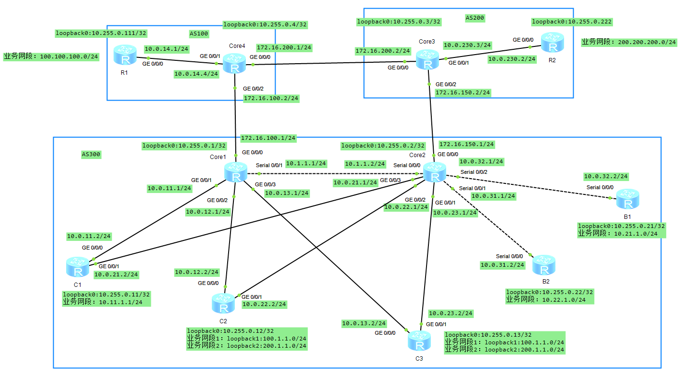

# BGP 反射器

## 1.大型 BGP

在一个大型的 AS 当中受到 iBGP 水平分割（从 iBGP 的邻居接收到的路由不能再传递给其他的 iBGP 邻居）的影响，将会造成 BGP 的路由无法通过 iBGP 邻居接收。解决办法有三种：

- 建立全互联的 iBGP 邻居；
- 路由反射器；
- BGP 的联盟；

说明：建立全互联的 iBGP 邻居将会需要更多的资源，由于 BGP 基于 TCP 连接，每建立一个 BGP 邻居就需要一个 TCP 连接，这样会极大地消耗 CPU 资源。TCP 连接数可以通过一个公式：**`n(n-1)/2`** 来计算。**<font color="red">在大型的 BGP 网络中一般不采用全连接方式，通常会采用路由反射器和联盟来解决</font>**。

## 2.路由反射器的概念

在大型的网络中，在一个 AS 内有可能超过百台设备，也就是每台设备都会建立全互联的 iBGP 邻居关系，这是由于 iBGP 的水平分割原则，从一台 iBGP 邻居学习到的路由，不会再通告给其他的 iBGP 邻居。而多台路由器可以只与一台中心的路由器来建立邻居关系，这台中心路由器就是路由反射器，不需要全互联的邻居。而路由反射机制允许该路由被反射出去，打破该限制。下面介绍一下路由反射器几种角色：

<div align="center">
    
</div>

- 路由反射器（Route Reflector）：简称 RR，允许把从 iBGP 对等体学到的路由反射到其他 iBGP 对等体的 BGP 设备，主要用来反射路由给相应的客户机；
- 客户机（Client）：与 RR 形成反射邻居关系的 iBGP 设备，在 AS 内部客户机只需要与 RR 直连，被 RR 指定用来反射路由的设备，由 RR 来决定哪台设备作为客户机；
- 非客户机（Non-Client）：既不是 RR 也不是客户机的 iBGP 设备。**<font color="red">在 AS 内部非客户机与 RR 之间以及所有的非客户机之间仍然必须建立全连接关系</font>**；
- 始发者（Originator）：在 AS 内部始发路由的设备。**`Originator_ID`** 属性用于防止集群内产生路由环路；
- 集群（Cluster）：路由反射器及其客户机集合。**`Cluster_List`** 属性用于防止集群间产生路由环路。

## 3.路由反射器的原理

同一集群内的客户机只需要与该集群的 RR 直接交换路由信息，因此客户机只需要与 RR 之间建立 iBGP 连接，不需要与其他客户机建立 iBGP 连接，从而减少了 iBGP 连接数量。在向多个对等体发送路由更新时，可以对 RR 实现进行优化，使 RR 只简单地复制 Update 消息，而不是针对每个对等体逐一生成相同的路由进行更新。如下图所示，在 **`AS 65000`** 内，一台设备作为 RR，三台设备作为客户机，形成 Cluster1。此时 AS 65000 中 iBGP 的连接数从配置 RR 前的 10 条减少到 4 条。

<div align="center">
    
</div>

RR 打破了 iBGP 水平分割的限制，并采用 **`Cluster_List`** 属性和 **`Originator_ID`** 属性防止路由环路。RR 向 iBGP 邻居发布路由规则：

- 从非客户机学到的路由，发布给所有客户机；
- 从客户机学到的路由，发布给所有非客户机和客户机（发起此路由的客户机除外）；
- 从 eBGP 对等体学到的路由，发布给所有的非客户机和客户机。

与路由反射相关的属性如下所示，这两个属性可以用来检测集群内或者集群间环路。

- **`Originator_ID`** 为可选非过渡属性，该属性由 RR 产生，封装在 Update 消息中，使用的 Router_ID 的值标识路由的始发者，用于防止集群内产生路由环路。
- **`Cluster_List`**：可选非过渡属性，该属性是集群 ID（**`Cluster_ID`**）的列表，AS 内的每个集群都由唯一的 **`Cluster_ID`** 来标识（可以在 BGP 进程中使用 **`Cluster_ID`** 命令来修改，默认为 BGP 的 **`Router_ID`**）。路由反射器使用 **`Cluster_List`** 属性记录路由经过的每个集群的 **`Cluster_ID`**（类似 **`AS_PATH`** 属性），用来在集群间避免环路。**<font color="red">当一条路由第一次被 RR 反射的时候，RR 会把本地 **`Cluster_ID`** 添加到 **`Cluster_List`** 的前面。如果没有 **`Cluster_List`** 属性，RR 就创建一个</font>**。当 RR 接收到一条更新路由时，RR 会检查 **`Cluster_List`**。如果 **`Cluster_List`** 中已经有本地 **`Cluster_ID`**，丢弃该路由；如果没有本地 **`Cluster_ID`**，将其加入 **`Cluster_List`**，然后反射该路由。

## 4.集群内环路

<div align="center">
    
</div>

如上拓扑图所示，一个集群中部署两个 RR（RR1 的 **`Cluster_id`** 是 100，RR2 的 **`Cluster_id`** 是 200），每个 RR 和集群中每个客户建立 iBGP 邻居关系。一条路由从 Client1 发送给 RR1，RR1 将该路由反射给 RR2（RR2 可以不是 RR1 的客户），RR2 继续反射该路由给其客户 Client1，路由回到始发路由器，Client1 如果使用该路由，则环路出现。

在反射集群内使用 **`Originator_ID`** 属性来解决环路，具体过程如下：

- Client 1 将路由传递给 RR 1。
- RR 1 将为该路由添加 **`Originator_ID`** 属性，该属性为始发者的 **`Router_ID`**（Client 1）。
- 该路由反射给 RR 2 后，再继续由 RR2 反射给 Client 1。反射过程中 **`Originator_ID`** 属性不变化。
- Client 1 收到带有 **`Originator_ID`** 的路由，将 **`Originator_ID`** 属性值和本地的 **`Router_ID`** 进行比较，如果一致，说明 Client 1 收到的这条路由是其通告出去的路由，路由形成了环路，Client 1 拒绝接收该路由以避免环路。

RR1 的具体配置如下所示，client1、client2、client3 都是 RR1 的客户机，RR1 的 **`Cluster_id`** 是 100。

```java{.line-numbers}
#
sysname RR1
#
interface GigabitEthernet0/0/0
 ip address 10.1.12.1 255.255.255.0 
#
interface GigabitEthernet0/0/1
 ip address 10.1.11.1 255.255.255.0 
#
interface GigabitEthernet0/0/2
 ip address 10.1.13.1 255.255.255.0
#
interface GigabitEthernet0/0/3
 ip address 10.1.14.1 255.255.255.0
#
interface LoopBack0
 ip address 1.1.1.1 255.255.255.255 
#
bgp 650
 router-id 1.1.1.1
 peer 2.2.2.2 as-number 650 
 peer 2.2.2.2 connect-interface LoopBack0
 peer 11.11.11.11 as-number 650 
 peer 11.11.11.11 connect-interface LoopBack0
 peer 12.12.12.12 as-number 650 
 peer 12.12.12.12 connect-interface LoopBack0
 peer 13.13.13.13 as-number 650 
 peer 13.13.13.13 connect-interface LoopBack0
 #
 ipv4-family unicast
  undo synchronization
  reflector cluster-id 100
  peer 2.2.2.2 enable
  peer 11.11.11.11 enable
  peer 11.11.11.11 reflect-client
  peer 12.12.12.12 enable
  peer 12.12.12.12 reflect-client
  peer 13.13.13.13 enable
  peer 13.13.13.13 reflect-client
#
ospf 1 router-id 1.1.1.1 
 area 0.0.0.0 
  network 1.1.1.1 0.0.0.0 
  network 10.1.11.0 0.0.0.255 
  network 10.1.13.0 0.0.0.255 
  network 10.1.14.0 0.0.0.255 
  network 10.1.12.0 0.0.0.255 
```

RR2 的具体配置如下所示，RR2 的 **`Cluster_id`** 是 200。

```java{.line-numbers}
#
sysname RR2
#
interface GigabitEthernet0/0/0
 ip address 10.1.12.2 255.255.255.0 
#
interface GigabitEthernet0/0/1
 ip address 10.1.21.1 255.255.255.0 
#
interface GigabitEthernet0/0/2
 ip address 10.1.23.1 255.255.255.0 
#
interface GigabitEthernet0/0/3
 ip address 10.1.24.1 255.255.255.0 
#
interface LoopBack0
 ip address 2.2.2.2 255.255.255.255 
#
bgp 650
 router-id 2.2.2.2
 peer 1.1.1.1 as-number 650 
 peer 1.1.1.1 connect-interface LoopBack0
 peer 11.11.11.11 as-number 650 
 peer 11.11.11.11 connect-interface LoopBack0
 peer 12.12.12.12 as-number 650 
 peer 12.12.12.12 connect-interface LoopBack0
 peer 13.13.13.13 as-number 650 
 peer 13.13.13.13 connect-interface LoopBack0
 #
 ipv4-family unicast
  undo synchronization
  reflector cluster-id 200
  peer 1.1.1.1 enable
  peer 1.1.1.1 route-policy PREFER-RR1 import
  peer 11.11.11.11 enable
  peer 11.11.11.11 reflect-client
  peer 12.12.12.12 enable
  peer 12.12.12.12 reflect-client
  peer 13.13.13.13 enable
  peer 13.13.13.13 reflect-client
#
ospf 1 router-id 2.2.2.2 
 area 0.0.0.0 
  network 2.2.2.2 0.0.0.0 
  network 10.1.12.0 0.0.0.255 
  network 10.1.21.0 0.0.0.255 
  network 10.1.23.0 0.0.0.255 
  network 10.1.24.0 0.0.0.255 
#
route-policy PREFER-RR1 permit node 10 
 apply local-preference 200 
```

Client1 的具体配置如下所示，Client1 注入的测试前缀为 **`203.0.113.0/24`**。

```java{.line-numbers}
#
sysname Client1
#
interface GigabitEthernet0/0/0
 ip address 10.1.11.2 255.255.255.0 
#
interface GigabitEthernet0/0/1
 ip address 10.1.21.2 255.255.255.0 
#
interface LoopBack0
 ip address 11.11.11.11 255.255.255.255 
#
bgp 650
 router-id 11.11.11.11
 peer 1.1.1.1 as-number 650 
 peer 1.1.1.1 connect-interface LoopBack0
 peer 2.2.2.2 as-number 650 
 peer 2.2.2.2 connect-interface LoopBack0
 #
 ipv4-family unicast
  undo synchronization
  network 203.0.113.0 
  peer 1.1.1.1 enable
  peer 2.2.2.2 enable
#
ospf 1 router-id 11.11.11.11 
 area 0.0.0.0 
  network 11.11.11.11 0.0.0.0 
  network 10.1.11.0 0.0.0.255 
  network 10.1.21.0 0.0.0.255 
#
ip route-static 203.0.113.0 255.255.255.0 NULL0
```

在本实验中，Client1 发布测试路由 **`203.0.113.0/24`**。该路由首先由 Client1 通告给 RR1，RR1 选中该路由后将其反射给 RR2，RR2 再将其反射给自己的 Client，包括 Client1。这样可以模拟如下的路由传播路径：

```java{.line-numbers}
Client1 -> RR1 -> RR2 -> Client1
```

需要说明的是，RR1 与 RR2 的 **`Cluster_ID`** 不同，因此 RR2 不会因为 **`CLUSTER_LIST`** 中包含本地 **`Cluster_ID`** 而丢弃 RR1 反射的路由。为了使 RR2 优先选择从 RR1 学到的路径，配置了如下入方向策略，将该路径的 **`Local Preference`** 设置为 200：

```java{.line-numbers}
#
route-policy PREFER-RR1 permit node 10 
 apply local-preference 200 
#
bgp 650
  peer 1.1.1.1 route-policy PREFER-RR1 import
```

RR2 同时还会直接从 Client1 学到同一个前缀，但该路径的默认 Local Preference 为 100。因此，RR2 的路由表中会出现两条路径：

```java{.line-numbers}
<RR2>display bgp routing-table 
 BGP Local router ID is 2.2.2.2 
 Status codes: * - valid, > - best, d - damped,
               h - history,  i - internal, s - suppressed, S - Stale
               Origin : i - IGP, e - EGP, ? - incomplete
 Total Number of Routes: 2
      Network            NextHop        MED        LocPrf    PrefVal Path/Ogn
 *>i  203.0.113.0        11.11.11.11     0          200        0      i                  // 表示从 RR1 学到的路径，并被 RR2 选为最佳路径
 * i                     11.11.11.11     0          100        0      i
```

接下来，我们在 RR1 的 **`G0/0/0`** 和 RR2 的 **`G0/0/2`** 端口上进行抓包，结果如下。RR1 发给 RR2 的 UPDATE 数据包 **`Originator_id`** 属性为 **`11.11.11.11`**，也就是说是从 RR1 发过来的数据包，**`Cluster_list`** 属性为 100，即 RR1 将本地 **`Cluster_id`** 保存到 **`Cluster_list`** 中。接下来，RR2 将同样路由前缀的 UPDATE 数据包发送给 Client1，**`Originator_id`** 属性为 **`11.11.11.11`**，**`Cluster_list`** 属性为 **`[200,100]`**，即 RR2 将本地 **`Cluster_id`** 200 保存到 **`Cluster_list`** 中。

```java{.line-numbers}
Frame 9: 123 bytes on wire (984 bits), 123 bytes captured (984 bits) on interface -, id 0
Ethernet II, Src: HuaweiTe_cc:6d:51 (54:89:98:cc:6d:51), Dst: HuaweiTe_fc:4b:1c (54:89:98:fc:4b:1c)
Internet Protocol Version 4, Src: 1.1.1.1, Dst: 2.2.2.2
Transmission Control Protocol, Src Port: 179, Dst Port: 55743, Seq: 20, Ack: 20, Len: 69
Border Gateway Protocol - UPDATE Message
    Marker: ffffffffffffffffffffffffffffffff
    Length: 69
    Type: UPDATE Message (2)
    Withdrawn Routes Length: 0
    Total Path Attribute Length: 42
    Path attributes
        Path Attribute - ORIGIN: IGP
        Path Attribute - AS_PATH: empty
        Path Attribute - NEXT_HOP: 11.11.11.11 
        Path Attribute - MULTI_EXIT_DISC: 0
        Path Attribute - LOCAL_PREF: 100
        Path Attribute - ORIGINATOR_ID: 11.11.11.11 
        Path Attribute - CLUSTER_LIST: 0.0.0.100
    Network Layer Reachability Information (NLRI)
        203.0.113.0/24
Frame 218: 127 bytes on wire (1016 bits), 127 bytes captured (1016 bits) on interface -, id 0
Ethernet II, Src: HuaweiTe_fc:4b:1d (54:89:98:fc:4b:1d), Dst: HuaweiTe_1e:15:c2 (54:89:98:1e:15:c2)
Internet Protocol Version 4, Src: 2.2.2.2, Dst: 11.11.11.11
Transmission Control Protocol, Src Port: 54189, Dst Port: 179, Seq: 248, Ack: 303, Len: 73
Border Gateway Protocol - UPDATE Message
    Marker: ffffffffffffffffffffffffffffffff
    Length: 73
    Type: UPDATE Message (2)
    Withdrawn Routes Length: 0
    Total Path Attribute Length: 46
    Path attributes
        Path Attribute - ORIGIN: IGP
        Path Attribute - AS_PATH: empty
        Path Attribute - NEXT_HOP: 11.11.11.11 
        Path Attribute - MULTI_EXIT_DISC: 0
        Path Attribute - LOCAL_PREF: 200
        Path Attribute - ORIGINATOR_ID: 11.11.11.11 
        Path Attribute - CLUSTER_LIST: 0.0.0.200 0.0.0.100
    Network Layer Reachability Information (NLRI)
        203.0.113.0/24
```

Client1 收到 RR2 发来的 UPDATE 后，会检查其中的 **`ORIGINATOR_ID`** 发现和自己的相同，随后会丢弃这个 UPDATE 报文。Client1 上的 **`203.0.113.0`** 路由来自 **`0.0.0.0`**，也就是 Client1 本地产生，而不是来自于 RR2 反射过来的前缀路由，这样就使用 **`Originator_id`** 属性避免了集群内环路。

```java{.line-numbers}
<Client1>display bgp routing-table 203.0.113.0 24

 BGP local router ID : 11.11.11.11
 Local AS number : 650
 Paths:   1 available, 1 best, 1 select
 BGP routing table entry information of 203.0.113.0/24:
 Network route. 
 From: 0.0.0.0 (0.0.0.0)
 Route Duration: 00h42m20s  
 Direct Out-interface: NULL0
 Original nexthop: 0.0.0.0
 Qos information : 0x0
 AS-path Nil, origin igp, MED 0, pref-val 0, valid, local, best, select, pre 60
 Advertised to such 2 peers:
    2.2.2.2
    1.1.1.1
```

## 5.集群间环路

接下来，将实验环境恢复为 RR1 和 RR2 属于同一个 Cluster 的场景。首先，在两台 RR 上配置相同的 **`Cluster_ID`**（100）：

```java{.line-numbers}
# RR1
bgp 650
    reflector cluster-id 100
# RR2
bgp 650
    reflector cluster-id 100
```

同时，暂时关闭 Client1 与 RR2 之间的 IPv4 单播 BGP 邻居，使测试路由只能沿着 **`Client1->RR1->RR2`** 传播，并且取消 RR2 针对 RR1 配置的入方向路由策略。

```java{.line-numbers}
# Client1
bgp 650
    undo peer 2.2.2.2 enable
# RR2
bgp 650
    undo peer 11.11.11.11 enable
```

此时，实验应满足以下条件：Client1 只向 RR1 通告 **`203.0.113.0/24`** 前缀路由，RR1 将该路由反射给 RR2，RR2 没有从 Client1 直接学习该前缀的路径。因此，RR2 获取 **`203.0.113.0/24`** 的唯一可能来源是 RR1 的反射通告。然后再 Client1 上先撤销，再重新发布测试前缀 **`203.0.113.0/24`**。同时，在 RR1 与 RR2 之间的链路上进行抓包，观察该 BGP UPDATE。

在 RR1 的 **`GE0/0/0`** 接口抓到的 UPDATE 如下：

```java{.line-numbers}
Frame 25: 123 bytes on wire (984 bits), 123 bytes captured (984 bits) on interface -, id 0
Ethernet II, Src: HuaweiTe_cc:6d:51 (54:89:98:cc:6d:51), Dst: HuaweiTe_fc:4b:1c (54:89:98:fc:4b:1c)
Internet Protocol Version 4, Src: 1.1.1.1, Dst: 2.2.2.2
Transmission Control Protocol, Src Port: 179, Dst Port: 55743, Seq: 20, Ack: 20, Len: 69
Border Gateway Protocol - UPDATE Message
    Marker: ffffffffffffffffffffffffffffffff
    Length: 69
    Type: UPDATE Message (2)
    Withdrawn Routes Length: 0
    Total Path Attribute Length: 42
    Path attributes
        Path Attribute - ORIGIN: IGP
            Flags: 0x40, Transitive, Well-known, Complete
            Type Code: ORIGIN (1)
            Length: 1
            Origin: IGP (0)
        Path Attribute - AS_PATH: empty
        Path Attribute - NEXT_HOP: 11.11.11.11 
        Path Attribute - MULTI_EXIT_DISC: 0
        Path Attribute - LOCAL_PREF: 100
        Path Attribute - ORIGINATOR_ID: 11.11.11.11 
            Flags: 0x80, Optional, Non-transitive, Complete
            Type Code: ORIGINATOR_ID (9)
            Length: 4
            Originator identifier: 11.11.11.11
        Path Attribute - CLUSTER_LIST: 0.0.0.100
            Flags: 0x80, Optional, Non-transitive, Complete
            Type Code: CLUSTER_LIST (10)
            Length: 4
            Cluster List: 0.0.0.100
    Network Layer Reachability Information (NLRI)
        203.0.113.0/24
            NLRI prefix length: 24
            NLRI prefix: 203.0.113.0
```

这个 UPDATE 报文的源地址为 **`1.1.1.1`**（RR1），目的地址为 **`2.2.2.2`**（RR2），**`ORIGINATOR_ID`** 为 **`11.11.11.11`**，表示始发路由器为 Client1，**`Cluster List`** 为 100。RR2 检测到这个 **`Cluster List`** 中有本地 **`Cluster_ID`**，因此会丢弃该 UPDATE 报文。

>需要注意，RR2 是收到了 UPDATE 后丢弃，而不是没有收到 UPDATE。

最后在 RR2 的 BGP 路由表中查看 **`203.0.113.0`** 前缀路由，发现为空，说明 RR2 收到该 UPDATE 报文后直接丢弃。
 
```java{.line-numbers}
[RR2-bgp]display bgp routing-table 203.0.113.0 // 结果为空
```

## 6.BGP 反射器组网实验

如下图所示，AS300 为某企业网络，要求为其设计一个内部网络有两个核心节点 Core1 和 Core2、三个分支节点，分别为 C1、C2、C3。C2 与 C3 双归属到一个网络，同时能接收该网络通告的两条相同路由 **`100.1.1.0/24`**、**`200.1.1.0/24`**，为满足新业务扩充，新加入了节点 B1 和 B2。

组网需求如下：

- 要求分支节点之间能直接交互路由信息，必须通过核心节点来交互；
- 要求 B1 和 B2 这两个节点彼此之间不需要交互路由，但是能够学习到其他所有路由，两个节点只需与 Core2 相连；
- 设计网络时注意冗余性、可靠性；
- 考虑到 B1 和 B2 能够访问到 AS100；

路由控制需求如下。

- 要求 C1 访问 **`100.1.1.0`** 网段选择经过 C2，访问 **`200.1.1.0`** 网段选择经过 C3；
- 要求 C1 访问 **`100.1.1.0`** 网段选择经过 Core1，访问 **`200.1.1.0`** 网段选择经过 Core2；
- AS100 访问 AS200 或者 AS200 访问 AS100 不能将 AS300 作为穿越 AS；

<div align="center">
    
</div>

### 6.1 组网需求

#### 6.1.1 组网需求1

由于分支节点之间不能直接交互路由信息，因此 C1、C2、C3 之间没有直接的物理连线，都与两台核心路由器相连（Core1 和 Core2），两台核心设备部署为路由反射器 RR，各分支部署为客户端 Client，这样就可以将各自分支之间的路由通过 RR 来反射。

#### 6.1.2 组网需求2

由于新加入的节点（B1 和 B2）之间不能学习各自路由，但是可以学习其他所有路由，那么将 B1 和 B2 作为非客户端，两台设备之间无任何物理连线，且只与 Core2 相连。B1、B2 均仅与 Core2 建立 iBGP 邻居，并在 Core2 上作为 RR 的 Non-Client。根据 BGP 路由反射规则，RR 从一个 Non-Client 学到的路由不会反射给另一个 Non-Client，因此 B1 与 B2 无法学习对方的业务路由。而来自 RR Client 及 eBGP 邻居的路由仍可正常发布给两者。

#### 6.1.3 组网需求3

将 C1、C2、C3 都双上连到 Core1 和 Core2，且都作为两个 RR 的客户端，实现网络的冗余性和可靠性。

#### 6.1.4 组网需求4

在该需求中，B1、B2 均作为 Core2 的 Non-Client iBGP Peer。为了让 B1、B2 既能够学习来自 AS100 的路由，又保持彼此之间不直接学习对方路由，**<font color="red">可以将 Core1 配置为 Core2 的 Client</font>**。需要注意，Core1 是 Core2 的 Client 并不意味着 Core2 同时也是 Core1 的 Client。

对于 AS100 到 B1、B2 的方向，AS100 首先通过 eBGP 将路由通告给 Core1。**<font color="red">这里要特别注意 Core1 从 AS100 学到的是 eBGP 路由，并不是反射路由。华为官方明确规定，BGP Speaker 从 eBGP Peer 学到的最佳路由，可以通告给其所有符合策略要求的 BGP Peer</font>**。在 RR 场景下，从 eBGP Peer 学到的路由可以发布给所有 Client 和 Non-Client。 因此 Core1 可以把 AS100 路由通过 iBGP 发送给 Core2。由于 Core1 在 Core2 上被配置为 Client，Core2 收到该路由并选为最佳路径后，就可以发送给所有的客户机和非客户机，从而将路由继续反射给 B1 和 B2。

反方向同样成立。假设 B1 向 Core2 通告自己的网段 **`10.21.1.0/24`**。由于 B1 是 Core2 的 Non-Client，Core2 从 B1 学到的最佳 iBGP 路由只能反射给自己的 Client，而不能反射给另一个 Non-Client B2。这样正好保证 B1 和 B2 不互相学习路由。Core2 将 B1 的路由反射给 Core1，Core1 合法收到并选中这条 iBGP 路由后，根据华为文档，**<font color="red">从 iBGP 对等体收到的路由，BGP 设备只发布给它的 eBGP 对等体（水平分割）</font>**，因此 Core1 可以把它继续通告给自己的 eBGP Peer AS100。

### 6.2 路由控制需求

#### 6.2.1 路由控制需求1

需求 1：在该拓扑中，C2 和 C3 都能够通告 **`100.1.1.0/24`** 和 **`200.1.1.0/24`** 两个网段，并且由于分别与 Core1、Core2 建立 BGP 邻居关系，因此，对于每一个目标网段，比如 **`100.1.1.0/24`** 实际上有 4 条路径，即 **`C2->Core1->C1`**、**`C2->Core2->C1`**、**`C3->Core1->C1`**、**`C3->Core2->C1`**，对于 **`200.1.1.0/24`** 也是同理。但是要求 C1 必须经过 C2 来访问 **`100.1.1.0`**，需要将 C2 通告 **`100.1.1.0`** 网段路径属性修改得比 C3 通告的更优。而通过 C3 访问 **`200.1.1.0`**，就需要将 C3 通告的 **`200.1.1.0`** 网段路径属性修改得比 C2 通告的更优。

本需求实现采用 PrefVal（Preferred Value） 对 Core1 和 Core2 的本地 BGP 选路进行干预。对于 **`100.1.1.0/24`**，分别在 Core1 和 Core2 从 C2 接收路由的入方向，将该前缀的 PrefVal 设置为 100，而从 C3 接收到的同一前缀保持默认值 0。由于华为 BGP 选路时优先选择 PrefVal 较大的路径，因此两台核心都会优先选择 C2 通告的 **`100.1.1.0/24`**。对于 **`200.1.1.0/24`** 则采用相反策略：从 C3 接收该前缀时设置 PrefVal 为 100，从 C2 接收时保持默认值，从而使 Core1 和 Core2 都选择 C3 作为该网段的最佳出口。需要特别注意，PrefVal 是本地选路参数，只在配置它的设备上有效，不会作为 **`BGP Path Attribute`** 随 UPDATE 报文继续传递给 C1。

关于 **`100.1.1.0`** 网段的选路：
- 在 Core1 连接 C2 的入方向调整 **`100.1.1.0`** 路由的 PrefVal 值改为 100，而连接 C3 的入方向不调整，默认为 0，这样来自 C2 通告的 **`100.1.1.0`** 要优于 C3 通告的，C1 将会选择 C2 到达 **`100.1.1.0`** 网段。
- 在 Core2 上连接 C2 的入方向同样将 **`100.1.1.0`** 路由的 PrefVal 值改为 100，而连接 C3 的入方向不调整，确保所有到达该网段的路径都选择 C2。

关于 **`200.1.1.0`** 网段的选路：
- 在 Core1 连接 C3 的入方向调整 **`200.1.1.0`** 路由的 PrefVal 值改为 100，而连接 C2 的入方向不调整，默认为 0，这样来自 C3 通告的 **`200.1.1.0`** 要优于 C2 通告的，C1 将会选择 C3 到达 **`200.1.1.0`** 网段。
- 在 Core2 上连接 C3 的入方向同样将 **`200.1.1.0`** 路由的 PrefVal 值改为 100，而连接 C2 的入方向不调整，确保所有到达该网段的路径都选择 C3。

```java{.line-numbers}
<Core1>display bgp routing-table 100.1.1.0 

 BGP local router ID : 10.255.0.1
 Local AS number : 300
 Paths:   3 available, 1 best, 1 select                              // 3 条候选路径

 BGP routing table entry information of 100.1.1.0/24:
 RR-client route.
 From: 10.255.0.12 (10.255.0.12)
 Route Duration: 01h16m59s  
 Relay IP Nexthop: 10.0.12.2
 Relay IP Out-Interface: GigabitEthernet0/0/2
 Original nexthop: 10.255.0.12
 Qos information : 0x0
 AS-path Nil, origin igp, MED 0, localpref 100, pref-val 100, valid, internal, b
est, select, active, pre 255, IGP cost 1
 Advertised to such 5 peers:
    10.255.0.2
    172.16.100.2
    10.255.0.11
    10.255.0.13
    10.255.0.12

 BGP routing table entry information of 100.1.1.0/24:
 RR-client route.
 From: 10.255.0.13 (10.0.13.2)
 Route Duration: 01h16m59s  
 Relay IP Nexthop: 10.0.13.2
 Relay IP Out-Interface: GigabitEthernet0/0/3
 Original nexthop: 10.255.0.13
 Qos information : 0x0
 AS-path Nil, origin igp, MED 0, localpref 100, pref-val 0, valid, internal, pre
 255, IGP cost 1, not preferred for PreVal
 Not advertised to any peer yet

 BGP routing table entry information of 100.1.1.0/24: 
 From: 10.255.0.2 (10.255.0.2)                                    //  Core2 反射 C2 获取到的 100.1.1.0/24 路由
 Route Duration: 01h16m52s   
 Relay IP Nexthop: 10.0.12.2
 Relay IP Out-Interface: GigabitEthernet0/0/2
 Original nexthop: 10.255.0.12
 Qos information : 0x0
 AS-path Nil, origin igp, MED 0, localpref 100, pref-val 0, valid, internal, pre
 255, IGP cost 1, not preferred for Cluster List
 Originator:  10.255.0.12
 Cluster list: 0.0.0.200
 Not advertised to any peer yet
```

Core1 针对 **`100.1.1.0/24`** 当前一共存在 3 条候选路径：第一条直接来自 **`C2 10.255.0.12`**，第二条直接来自 **`C3 10.255.0.13`**，第三条则是由 **`Core2 10.255.0.2`** 反射过来的 C2 路由。虽然从拓扑关系看，理论上 C2 和 C3 都可以分别向 Core1、Core2 发布该前缀，**<font color="red">但 RR 默认不会把所有候选路径全部反射出去，而是在本地完成 BGP 最优路径选择后，再反射所选路由</font>**。因此 Core2 已经通过 PrefVal 将 C2 发布的 **`100.1.1.0/24`** 选为 Best Path，最终只把 C2 的路径反射给 Core1。

>RFC 4456 的基本 RR 工作机制就是 RR 先执行 BGP Decision Process，再根据反射规则传播路由。

第一条路径中还有：

```java{.line-numbers}
Original nexthop: 10.255.0.12
Relay IP Nexthop: 10.0.12.2
Relay IP Out-Interface: GigabitEthernet0/0/2
```

这里要区分 BGP 原始下一跳和实际转发下一跳。**`Original nexthop 10.255.0.12`** 表示 BGP 路由携带的 **`NEXT_HOP`** 是 C2 的 Loopback 地址，Core1 还需要依靠内部 IGP 对该 Loopback 地址进行递归解析，最终得到实际下一跳 **`10.0.12.2`** 和出接口 **`GE0/0/2`**。

这也说明 BGP 控制平面的路径与数据平面的转发路径不能简单等同。例如第三条路由虽然显示 **`From: 10.255.0.2`**，表示该 UPDATE 是 Core2 发给 Core1 的，但它的 **`Original nexthop`** 仍然是 **`10.255.0.12`**。因此即使该反射路径被采用，Core1 的数据流量也可能直接依据 IGP 递归结果发送给 C2，而不是经过 Core2。**<font color="red">BGP 控制平面的路由传播路径，不等于数据平面的实际转发路径</font>**。上述路径属性中的 **`origin igp`** 并不表示 **`100.1.1.0`** 是从 OSPF 学来的。而是代表该前缀通常通过 **`network 前缀`** 这种方式进入 BGP。**<font color="red">使用 **`BGP network`** 命令加入的路由，其 Origin 属性为 IGP，而使用 import-route 引入的路由通常属性是 Incomplete</font>**。

第三条路径的详细属性为：

```java{.line-numbers}
From: 10.255.0.2
Original nexthop: 10.255.0.12

Originator: 10.255.0.12
Cluster list: 0.0.0.200
not preferred for Cluster List
```

说明这条路由是 **`C2->Core2->Core1`** 传播过来的。**`From 10.255.0.2`** 表示 UPDATE 的直接发送者是 Core2，**`Original nexthop 10.255.0.12`** 表明原始 BGP 下一跳仍然是 C2，而 **`Originator: 10.255.0.12`** 进一步说明该路由最初由 C2 产生。**`Cluster list: 0.0.0.200`** 则证明该路由已经经过 Cluster-ID 为 200 的 RR，也就是 Core2。根据 Huawei 的选路规则，在其他属性无法继续区分路径时，会优选 **`Cluster_List`** 更短的路由。因此直接从 C2 Client 学到的路径通常比经过额外 RR 反射（Core2）的路径更有优势。

Core1 同时获得了来自 C2、C3 以及 Core2 RR 的候选路径，其中直接来自 C2 的路径经过入方向策略后获得 PrefVal=100，最终显示为 best, select, active。因此可以确认 Core1 对 **`100.1.1.0/24`** 优先经 C2 转发的路由控制需求已经实现。

#### 6.2.2 路由控制需求2

默认情况下，默认不能通过出口策略修改反射路由的路径属性，目的是为了防止环路，因此需要通过配置命令 **`reflect change-path-attribute`** 来允许修改出口的策略。因此可以改为在 C1 上使用 **`route-policy`** 路由策略 **`apply ip-address next-hop <IPv4地址>`** 来强制修改下一跳，即采用核心节点先完成 C2/C3 的路径选择，C1 再根据业务前缀指定下一跳的方式实现。具体配置如下所示，该策略匹配 **`100.1.1.0/24`** 后将下一跳设置为 Core1 的 **`10.0.11.1`**，匹配 **`200.1.1.0/24`** 后将下一跳设置为 Core2 的 **`10.0.21.1`**。

```java{.line-numbers}
route-policy FROM_CORE1 permit node 10 
 if-match ip-prefix P100 
 apply ip-address next-hop 10.0.11.1 
#
route-policy FROM_CORE1 permit node 20 
 if-match ip-prefix P200 
 apply ip-address next-hop 10.0.21.1 
#
route-policy FROM_CORE1 permit node 30 
#
ip ip-prefix P100 index 10 permit 100.1.1.0 24
ip ip-prefix P200 index 10 permit 200.1.1.0 24
bgp 300
 router-id 10.255.0.11
 #
 ipv4-family unicast
  network 10.11.1.0 255.255.255.0 
  peer 10.255.0.1 route-policy FROM_CORE1 import
  peer 10.255.0.2 route-policy FROM_CORE1 import
```

C1 上收到的 UPDATE 报文如下所示：

```java{.line-numbers}
<C1>display bgp routing-table 200.1.1.0

 BGP local router ID : 10.255.0.11
 Local AS number : 300
 Paths:   2 available, 1 best, 1 select

 BGP routing table entry information of 200.1.1.0/24:
 From: 10.255.0.1 (10.255.0.1)
 Route Duration: 00h00m49s  
 Relay IP Nexthop: 0.0.0.0
 Relay IP Out-Interface: GigabitEthernet0/0/1
 Original nexthop: 10.0.21.1
 Qos information : 0x0
 AS-path Nil, origin igp, MED 0, localpref 100, pref-val 0, valid, internal, bes
t, select, active, pre 255
 Originator:  10.255.0.13
 Cluster list: 0.0.0.100
 Not advertised to any peer yet

 BGP routing table entry information of 200.1.1.0/24:
 From: 10.255.0.2 (10.255.0.2)
 Route Duration: 01h20m25s  
 Relay IP Nexthop: 0.0.0.0
 Relay IP Out-Interface: GigabitEthernet0/0/1
 Original nexthop: 10.0.21.1
 Qos information : 0x0
 AS-path Nil, origin igp, MED 0, localpref 100, pref-val 0, valid, internal, pre
 255, not preferred for peer address
 Originator:  10.255.0.13
 Cluster list: 0.0.0.200
 Not advertised to any peer yet
```

**`Paths: 2 available, 1 best, 1 select`** 表示 C1 同时从两个 RR 获得了 **`200.1.1.0/24`**，保留了两条候选路由。第一条的参数信息说明该路由由 Core1 反射给 C1，而真正的原始发布节点是 Router-ID 为 **`10.255.0.13`** 的 C3，另一条由 Core2 反射，同样源自 C3。因此，两台 RR 最终向 C1 提供的 **`200.1.1.0/24`** 都是 C3 路径。这两条路径的 **`Original nexthop`** 都是 **`10.0.21.1`**，是因为配置的 route-policy 将匹配 **`200.1.1.0/24`** 后将下一跳设置为 Core2 的 **`10.0.21.1`**。

```java{.line-numbers}
From: 10.255.0.1
Originator: 10.255.0.13
Cluster list: 0.0.0.100
Original nexthop: 10.0.21.1
From: 10.255.0.2
Originator: 10.255.0.13
Cluster list: 0.0.0.200
Original nexthop: 10.0.21.1
```

最后，C1 选择的最佳路由是来自 Core1 的，这是 BGP Tie-Break 结果，两条路由的 **`PrefVal=0、LocalPref=100、AS_PATH=Nil、Origin=IGP、MED=0`** 均相同，**`Originator_ID`** 都是 **`10.255.0.13`**，Cluster List 长度也同为 1，因此最终比较到 Peer IP Address。根据华为的选路原则，在此前条件都相同时，优选从 Peer IP 地址较小的邻居收到的路由，也就是优选 Core1 收到的路由。

```java{.line-numbers}
<C1>tracert -a 10.0.11.2 100.1.1.0
 traceroute to  100.1.1.0(100.1.1.0), max hops: 30 ,packet length: 40,press CTRL_C to break 
 1 10.0.11.1 40 ms  50 ms  50 ms 
 2 10.0.12.2 60 ms  60 ms  70 ms 
 3 100.1.1.1 60 ms  60 ms  80 ms 
<C1>tracert -a 10.0.21.2 200.1.1.0
 traceroute to  200.1.1.0(200.1.1.0), max hops: 30 ,packet length: 40,press CTRL_C to break 
 1 10.0.21.1 50 ms  30 ms  50 ms 
 2 10.0.23.2 90 ms  80 ms  60 ms 
 3 200.1.1.1 60 ms  70 ms  90 ms 
```

根据上述 tracert 结果，可以确认 **`200.1.1.0/24`** 的实际访问路径稳定为 **`C1->Core2->C3->200.1.1.0/24`**，**`C1->Core1->C2->100.1.1.0/24`**。

#### 6.2.3 路由控制需求3

为了防止 AS 300 成为外部 AS 100 与 AS 200 之间的穿越（Transit）AS，应在 AS 300 向外部 EBGP 邻居发布路由时进行出方向过滤，**<font color="red">只允许 AS 300 本地始发的路由向外通告，禁止将从一个外部 AS 学到的路由再通告给另一个外部 AS</font>**。可以使用 **`as-path-filter`** 实现。由于 AS 300 本地始发路由在本地 BGP 表中的 **`AS_PATH`** 为空，因此可以使用正则表达式 **`^$`** 匹配这类路由，并将其设置为 permit；其他从外部 AS 学到的路由，其 **`AS_PATH`** 非空，无法匹配 **`^$`**，因此被默认拒绝。最后，将该 **`AS-Path Filter`** 分别应用在 AS 300 面向 AS 100 和 AS 200 的 EBGP 邻居 export 方向，即可避免 AS 100 与 AS 200 通过 AS 300 进行中转，从而保证 AS 300 不成为穿越 AS。

总的来说，就是当 AS300 向外部 AS 通告路由时，只允许 AS300 本地始发的路由向外发布，过滤掉从其他外部 AS 学到的路由，避免这些外部路由经 AS300 再发布给另一个外部 AS，从而防止 AS300 成为 Transit AS。Core1 和 Core2 上的配置如下所示：

```java{.line-numbers}
bgp 300
 router-id 10.255.0.2
 peer 172.16.150.2 as-number 200 
 #
 ipv4-family unicast
  peer 172.16.150.2 as-path-filter 10 export 
#
ip as-path-filter 10 permit ^$
bgp 300
 router-id 10.255.0.1
 #
 ipv4-family unicast
  peer 172.16.100.2 as-path-filter 10 export 
#
ip as-path-filter 10 permit ^$
```

配置完成之后，Core1 和 Core2 向自己的 eBGP 对等体发布的路由如下所示，可以看到 Core1 和 Core2 学习到 **`200.200.200.0/24`** 和 **`100.100.100.0/24`**，但是 Core1 和 Core2 都没有向自己的 eBGP peer 进行宣告。但是 AS 300 内部的路由，比如 **`100.1.1.0/24`** 和 **`200.1.1.0/24`** 会向 AS100 和 AS200 进行宣告。

```java{.line-numbers}
<Core1>display bgp routing-table 
 BGP Local router ID is 10.255.0.1 
 Total Number of Routes: 13
      Network            NextHop        MED        LocPrf    PrefVal Path/Ogn
 *>i  10.11.1.0/24       10.255.0.11     0          100        0      i
 * i                     10.255.0.11     0          100        0      i
 *>i  10.21.1.0/24       10.255.0.21     0          100        0      i
 *>i  10.22.1.0/24       10.255.0.22     0          100        0      i
 *>i  100.1.1.0/24       10.255.0.12     0          100        100    i
 * i                     10.255.0.13     0          100        0      i
 * i                     10.255.0.12     0          100        0      i
 *>   100.100.100.0/24   172.16.100.2                          0      100i
 *>i  200.1.1.0          10.255.0.13     0          100        100    i
 * i                     10.255.0.12     0          100        0      i
 * i                     10.255.0.13     0          100        0      i
 *>i  200.200.200.0      10.255.0.2                 100        0      200i
 *                       172.16.100.2                          0      100 200i
[Core2-bgp]display bgp routing-table peer 172.16.150.2 advertised-routes
 BGP Local router ID is 10.255.0.2 
 Total Number of Routes: 5
      Network            NextHop        MED        LocPrf    PrefVal Path/Ogn
 *>i  10.11.1.0/24       172.16.150.1                          0      300i
 *>i  10.21.1.0/24       172.16.150.1                          0      300i
 *>i  10.22.1.0/24       172.16.150.1                          0      300i
 *>i  100.1.1.0/24       172.16.150.1                          100    300i
 *>i  200.1.1.0          172.16.150.1                          100    300i

<Core1>display bgp routing-table 
 BGP Local router ID is 10.255.0.1 
 Total Number of Routes: 13
      Network            NextHop        MED        LocPrf    PrefVal Path/Ogn
 *>i  10.11.1.0/24       10.255.0.11     0          100        0      i
 * i                     10.255.0.11     0          100        0      i
 *>i  10.21.1.0/24       10.255.0.21     0          100        0      i
 *>i  10.22.1.0/24       10.255.0.22     0          100        0      i
 *>i  100.1.1.0/24       10.255.0.12     0          100        100    i
 * i                     10.255.0.13     0          100        0      i
 * i                     10.255.0.12     0          100        0      i
 *>   100.100.100.0/24   172.16.100.2                          0      100i
 *>i  200.1.1.0          10.255.0.13     0          100        100    i
 * i                     10.255.0.12     0          100        0      i
 * i                     10.255.0.13     0          100        0      i
 *>i  200.200.200.0      10.255.0.2                 100        0      200i
 *                       172.16.100.2                          0      100 200i
<Core1>display bgp routing-table peer 172.16.100.2 advertised-routes
 Total Number of Routes: 5
      Network            NextHop        MED        LocPrf    PrefVal Path/Ogn
 *>i  10.11.1.0/24       172.16.100.1                          0      300i
 *>i  10.21.1.0/24       172.16.100.1                          0      300i
 *>i  10.22.1.0/24       172.16.100.1                          0      300i
 *>i  100.1.1.0/24       172.16.100.1                          100    300i
 *>i  200.1.1.0          172.16.100.1                          100    300i
```

