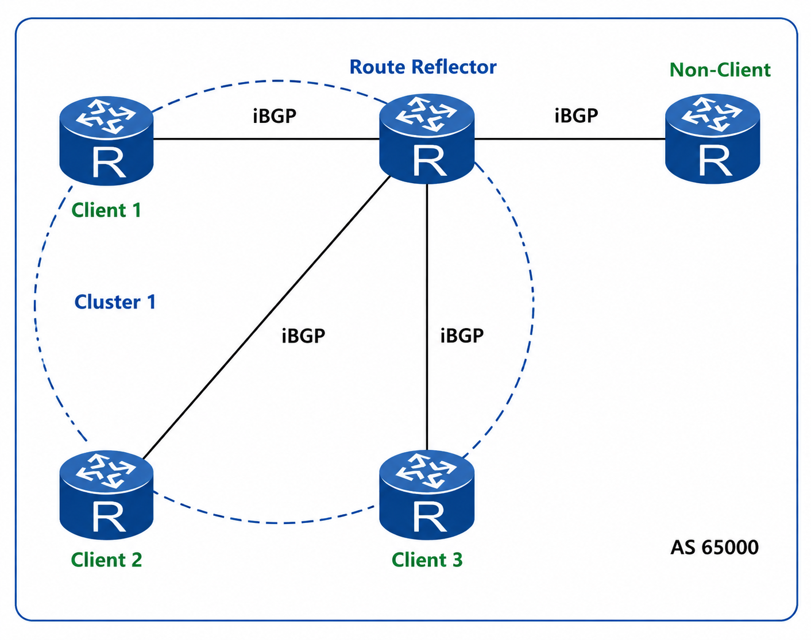
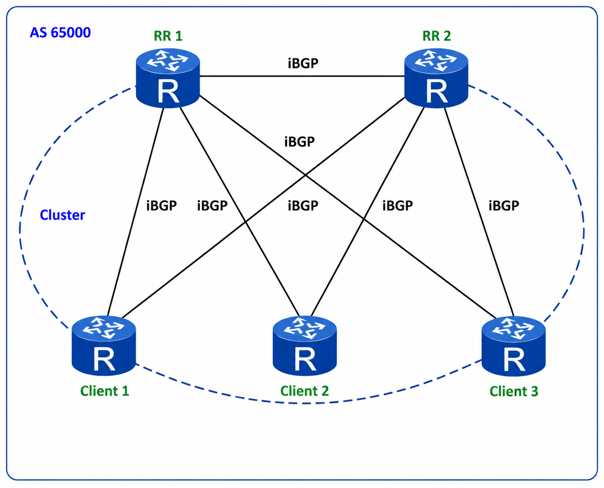
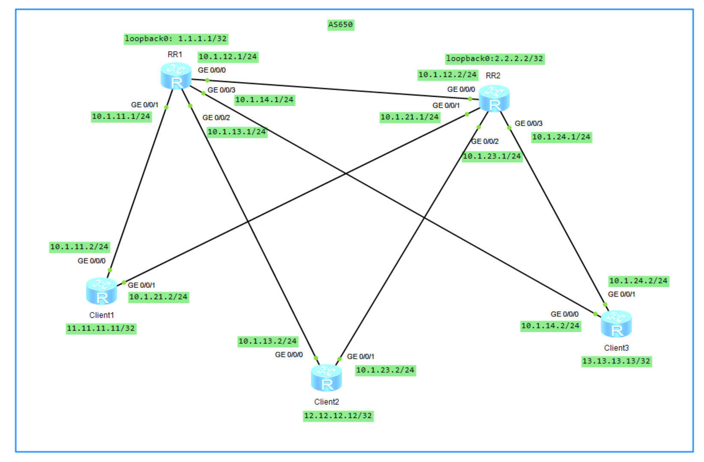

# BGP 反射器

## 1.大型 BGP

在一个大型的 AS 当中受到 iBGP 水平分割（从 iBGP 的邻居接收到的路由不能再传递给其他的 iBGP 邻居）的影响，将会造成 BGP 的路由无法通过 iBGP 邻居接收。解决办法有三种：

- 建立全互联的 iBGP 邻居；
- 路由反射器；
- BGP 的联盟；

说明：建立全互联的 iBGP 邻居将会需要更多的资源，由于 BGP 基于 TCP 连接，每建立一个 BGP 邻居就需要一个 TCP 连接，这样会极大地消耗 CPU 资源。TCP 连接数可以通过一个公式：**`n(n-1)/2`** 来计算。**<font color="red">在大型的 BGP 网络中一般不采用全连接方式，通常会采用路由反射器和联盟来解决</font>**。

## 2.路由反射器的概念

在大型的网络中，在一个 AS 内有可能超过百台设备，也就是每台设备都会建立全互联的 iBGP 邻居关系，这是由于 iBGP 的水平分割原则，从一台 iBGP 邻居学习到的路由，不会再通告给其他的 iBGP 邻居。而多台路由器可以只与一台中心的路由器来建立邻居关系，这台中心路由器就是路由反射器，不需要全互联的邻居。而路由反射机制允许该路由被反射出去，打破该限制。下面介绍一下路由反射器几种角色：

<div align="center">
    
</div>

- 路由反射器（Route Reflector）：简称 RR，允许把从 iBGP 对等体学到的路由反射到其他 iBGP 对等体的 BGP 设备，主要用来反射路由给相应的客户机；
- 客户机（Client）：与 RR 形成反射邻居关系的 iBGP 设备，在 AS 内部客户机只需要与 RR 直连，被 RR 指定用来反射路由的设备，由 RR 来决定哪台设备作为客户机；
- 非客户机（Non-Client）：既不是 RR 也不是客户机的 iBGP 设备。**<font color="red">在 AS 内部非客户机与 RR 之间以及所有的非客户机之间仍然必须建立全连接关系</font>**；
- 始发者（Originator）：在 AS 内部始发路由的设备。**`Originator_ID`** 属性用于防止集群内产生路由环路；
- 集群（Cluster）：路由反射器及其客户机集合。**`Cluster_List`** 属性用于防止集群间产生路由环路。

## 3.路由反射器的原理

同一集群内的客户机只需要与该集群的 RR 直接交换路由信息，因此客户机只需要与 RR 之间建立 iBGP 连接，不需要与其他客户机建立 iBGP 连接，从而减少了 iBGP 连接数量。在向多个对等体发送路由更新时，可以对 RR 实现进行优化，使 RR 只简单地复制 Update 消息，而不是针对每个对等体逐一生成相同的路由进行更新。如下图所示，在 **`AS 65000`** 内，一台设备作为 RR，三台设备作为客户机，形成 Cluster1。此时 AS 65000 中 iBGP 的连接数从配置 RR 前的 10 条减少到 4 条。

<div align="center">
    
</div>

RR 打破了 iBGP 水平分割的限制，并采用 **`Cluster_List`** 属性和 **`Originator_ID`** 属性防止路由环路。RR 向 iBGP 邻居发布路由规则：

- 从非客户机学到的路由，发布给所有客户机；
- 从客户机学到的路由，发布给所有非客户机和客户机（发起此路由的客户机除外）；
- 从 eBGP 对等体学到的路由，发布给所有的非客户机和客户机。

与路由反射相关的属性如下所示，这两个属性可以用来检测集群内或者集群间环路。

- **`Originator_ID`** 为可选非过渡属性，该属性由 RR 产生，封装在 Update 消息中，使用的 Router_ID 的值标识路由的始发者，用于防止集群内产生路由环路。
- **`Cluster_List`**：可选非过渡属性，该属性是集群 ID（**`Cluster_ID`**）的列表，AS 内的每个集群都由唯一的 **`Cluster_ID`** 来标识（可以在 BGP 进程中使用 **`Cluster_ID`** 命令来修改，默认为 BGP 的 **`Router_ID`**）。路由反射器使用 **`Cluster_List`** 属性记录路由经过的每个集群的 **`Cluster_ID`**（类似 **`AS_PATH`** 属性），用来在集群间避免环路。**<font color="red">当一条路由第一次被 RR 反射的时候，RR 会把本地 **`Cluster_ID`** 添加到 **`Cluster_List`** 的前面。如果没有 **`Cluster_List`** 属性，RR 就创建一个</font>**。当 RR 接收到一条更新路由时，RR 会检查 **`Cluster_List`**。如果 **`Cluster_List`** 中已经有本地 **`Cluster_ID`**，丢弃该路由；如果没有本地 **`Cluster_ID`**，将其加入 **`Cluster_List`**，然后反射该路由。

## 4.集群内环路

<div align="center">
    
</div>

如上拓扑图所示，一个集群中部署两个 RR（RR1 的 **`Cluster_id`** 是 100，RR2 的 **`Cluster_id`** 是 200），每个 RR 和集群中每个客户建立 iBGP 邻居关系。一条路由从 Client1 发送给 RR1，RR1 将该路由反射给 RR2（RR2 可以不是 RR1 的客户），RR2 继续反射该路由给其客户 Client1，路由回到始发路由器，Client1 如果使用该路由，则环路出现。

在反射集群内使用 **`Originator_ID`** 属性来解决环路，具体过程如下：

- Client 1 将路由传递给 RR 1。
- RR 1 将为该路由添加 **`Originator_ID`** 属性，该属性为始发者的 **`Router_ID`**（Client 1）。
- 该路由反射给 RR 2 后，再继续由 RR2 反射给 Client 1。反射过程中 **`Originator_ID`** 属性不变化。
- Client 1 收到带有 **`Originator_ID`** 的路由，将 **`Originator_ID`** 属性值和本地的 **`Router_ID`** 进行比较，如果一致，说明 Client 1 收到的这条路由是其通告出去的路由，路由形成了环路，Client 1 拒绝接收该路由以避免环路。

RR1 的具体配置如下所示，client1、client2、client3 都是 RR1 的客户机，RR1 的 **`Cluster_id`** 是 100。

```java{.line-numbers}
#
sysname RR1
#
interface GigabitEthernet0/0/0
 ip address 10.1.12.1 255.255.255.0 
#
interface GigabitEthernet0/0/1
 ip address 10.1.11.1 255.255.255.0 
#
interface GigabitEthernet0/0/2
 ip address 10.1.13.1 255.255.255.0
#
interface GigabitEthernet0/0/3
 ip address 10.1.14.1 255.255.255.0
#
interface LoopBack0
 ip address 1.1.1.1 255.255.255.255 
#
bgp 650
 router-id 1.1.1.1
 peer 2.2.2.2 as-number 650 
 peer 2.2.2.2 connect-interface LoopBack0
 peer 11.11.11.11 as-number 650 
 peer 11.11.11.11 connect-interface LoopBack0
 peer 12.12.12.12 as-number 650 
 peer 12.12.12.12 connect-interface LoopBack0
 peer 13.13.13.13 as-number 650 
 peer 13.13.13.13 connect-interface LoopBack0
 #
 ipv4-family unicast
  undo synchronization
  reflector cluster-id 100
  peer 2.2.2.2 enable
  peer 11.11.11.11 enable
  peer 11.11.11.11 reflect-client
  peer 12.12.12.12 enable
  peer 12.12.12.12 reflect-client
  peer 13.13.13.13 enable
  peer 13.13.13.13 reflect-client
#
ospf 1 router-id 1.1.1.1 
 area 0.0.0.0 
  network 1.1.1.1 0.0.0.0 
  network 10.1.11.0 0.0.0.255 
  network 10.1.13.0 0.0.0.255 
  network 10.1.14.0 0.0.0.255 
  network 10.1.12.0 0.0.0.255 
```

RR2 的具体配置如下所示，RR2 的 **`Cluster_id`** 是 200。

```java{.line-numbers}
#
sysname RR2
#
interface GigabitEthernet0/0/0
 ip address 10.1.12.2 255.255.255.0 
#
interface GigabitEthernet0/0/1
 ip address 10.1.21.1 255.255.255.0 
#
interface GigabitEthernet0/0/2
 ip address 10.1.23.1 255.255.255.0 
#
interface GigabitEthernet0/0/3
 ip address 10.1.24.1 255.255.255.0 
#
interface LoopBack0
 ip address 2.2.2.2 255.255.255.255 
#
bgp 650
 router-id 2.2.2.2
 peer 1.1.1.1 as-number 650 
 peer 1.1.1.1 connect-interface LoopBack0
 peer 11.11.11.11 as-number 650 
 peer 11.11.11.11 connect-interface LoopBack0
 peer 12.12.12.12 as-number 650 
 peer 12.12.12.12 connect-interface LoopBack0
 peer 13.13.13.13 as-number 650 
 peer 13.13.13.13 connect-interface LoopBack0
 #
 ipv4-family unicast
  undo synchronization
  reflector cluster-id 200
  peer 1.1.1.1 enable
  peer 1.1.1.1 route-policy PREFER-RR1 import
  peer 11.11.11.11 enable
  peer 11.11.11.11 reflect-client
  peer 12.12.12.12 enable
  peer 12.12.12.12 reflect-client
  peer 13.13.13.13 enable
  peer 13.13.13.13 reflect-client
#
ospf 1 router-id 2.2.2.2 
 area 0.0.0.0 
  network 2.2.2.2 0.0.0.0 
  network 10.1.12.0 0.0.0.255 
  network 10.1.21.0 0.0.0.255 
  network 10.1.23.0 0.0.0.255 
  network 10.1.24.0 0.0.0.255 
#
route-policy PREFER-RR1 permit node 10 
 apply local-preference 200 
```

Client1 的具体配置如下所示，Client1 注入的测试前缀为 **`203.0.113.0/24`**。

```java{.line-numbers}
#
sysname Client1
#
interface GigabitEthernet0/0/0
 ip address 10.1.11.2 255.255.255.0 
#
interface GigabitEthernet0/0/1
 ip address 10.1.21.2 255.255.255.0 
#
interface LoopBack0
 ip address 11.11.11.11 255.255.255.255 
#
bgp 650
 router-id 11.11.11.11
 peer 1.1.1.1 as-number 650 
 peer 1.1.1.1 connect-interface LoopBack0
 peer 2.2.2.2 as-number 650 
 peer 2.2.2.2 connect-interface LoopBack0
 #
 ipv4-family unicast
  undo synchronization
  network 203.0.113.0 
  peer 1.1.1.1 enable
  peer 2.2.2.2 enable
#
ospf 1 router-id 11.11.11.11 
 area 0.0.0.0 
  network 11.11.11.11 0.0.0.0 
  network 10.1.11.0 0.0.0.255 
  network 10.1.21.0 0.0.0.255 
#
ip route-static 203.0.113.0 255.255.255.0 NULL0
```

在本实验中，Client1 发布测试路由 **`203.0.113.0/24`**。该路由首先由 Client1 通告给 RR1，RR1 选中该路由后将其反射给 RR2，RR2 再将其反射给自己的 Client，包括 Client1。这样可以模拟如下的路由传播路径：

```java{.line-numbers}
Client1 -> RR1 -> RR2 -> Client1
```

需要说明的是，RR1 与 RR2 的 **`Cluster_ID`** 不同，因此 RR2 不会因为 **`CLUSTER_LIST`** 中包含本地 **`Cluster_ID`** 而丢弃 RR1 反射的路由。为了使 RR2 优先选择从 RR1 学到的路径，配置了如下入方向策略，将该路径的 **`Local Preference`** 设置为 200：

```java{.line-numbers}
#
route-policy PREFER-RR1 permit node 10 
 apply local-preference 200 
#
bgp 650
  peer 1.1.1.1 route-policy PREFER-RR1 import
```

RR2 同时还会直接从 Client1 学到同一个前缀，但该路径的默认 Local Preference 为 100。因此，RR2 的路由表中会出现两条路径：

```java{.line-numbers}
<RR2>display bgp routing-table 
 BGP Local router ID is 2.2.2.2 
 Status codes: * - valid, > - best, d - damped,
               h - history,  i - internal, s - suppressed, S - Stale
               Origin : i - IGP, e - EGP, ? - incomplete
 Total Number of Routes: 2
      Network            NextHop        MED        LocPrf    PrefVal Path/Ogn
 *>i  203.0.113.0        11.11.11.11     0          200        0      i                  // 表示从 RR1 学到的路径，并被 RR2 选为最佳路径
 * i                     11.11.11.11     0          100        0      i
```

接下来，我们在 RR1 的 **`G0/0/0`** 和 RR2 的 **`G0/0/2`** 端口上进行抓包，结果如下。RR1 发给 RR2 的 UPDATE 数据包 **`Originator_id`** 属性为 **`11.11.11.11`**，也就是说是从 RR1 发过来的数据包，**`Cluster_list`** 属性为 100，即 RR1 将本地 **`Cluster_id`** 保存到 **`Cluster_list`** 中。接下来，RR2 将同样路由前缀的 UPDATE 数据包发送给 Client1，**`Originator_id`** 属性为 **`11.11.11.11`**，**`Cluster_list`** 属性为 **`[200,100]`**，即 RR2 将本地 **`Cluster_id`** 200 保存到 **`Cluster_list`** 中。

```java{.line-numbers}
Frame 9: 123 bytes on wire (984 bits), 123 bytes captured (984 bits) on interface -, id 0
Ethernet II, Src: HuaweiTe_cc:6d:51 (54:89:98:cc:6d:51), Dst: HuaweiTe_fc:4b:1c (54:89:98:fc:4b:1c)
Internet Protocol Version 4, Src: 1.1.1.1, Dst: 2.2.2.2
Transmission Control Protocol, Src Port: 179, Dst Port: 55743, Seq: 20, Ack: 20, Len: 69
Border Gateway Protocol - UPDATE Message
    Marker: ffffffffffffffffffffffffffffffff
    Length: 69
    Type: UPDATE Message (2)
    Withdrawn Routes Length: 0
    Total Path Attribute Length: 42
    Path attributes
        Path Attribute - ORIGIN: IGP
        Path Attribute - AS_PATH: empty
        Path Attribute - NEXT_HOP: 11.11.11.11 
        Path Attribute - MULTI_EXIT_DISC: 0
        Path Attribute - LOCAL_PREF: 100
        Path Attribute - ORIGINATOR_ID: 11.11.11.11 
        Path Attribute - CLUSTER_LIST: 0.0.0.100
    Network Layer Reachability Information (NLRI)
        203.0.113.0/24
Frame 218: 127 bytes on wire (1016 bits), 127 bytes captured (1016 bits) on interface -, id 0
Ethernet II, Src: HuaweiTe_fc:4b:1d (54:89:98:fc:4b:1d), Dst: HuaweiTe_1e:15:c2 (54:89:98:1e:15:c2)
Internet Protocol Version 4, Src: 2.2.2.2, Dst: 11.11.11.11
Transmission Control Protocol, Src Port: 54189, Dst Port: 179, Seq: 248, Ack: 303, Len: 73
Border Gateway Protocol - UPDATE Message
    Marker: ffffffffffffffffffffffffffffffff
    Length: 73
    Type: UPDATE Message (2)
    Withdrawn Routes Length: 0
    Total Path Attribute Length: 46
    Path attributes
        Path Attribute - ORIGIN: IGP
        Path Attribute - AS_PATH: empty
        Path Attribute - NEXT_HOP: 11.11.11.11 
        Path Attribute - MULTI_EXIT_DISC: 0
        Path Attribute - LOCAL_PREF: 200
        Path Attribute - ORIGINATOR_ID: 11.11.11.11 
        Path Attribute - CLUSTER_LIST: 0.0.0.200 0.0.0.100
    Network Layer Reachability Information (NLRI)
        203.0.113.0/24
```

Client1 收到 RR2 发来的 UPDATE 后，会检查其中的 **`ORIGINATOR_ID`** 发现和自己的相同，随后会丢弃这个 UPDATE 报文。Client1 上的 **`203.0.113.0`** 路由来自 **`0.0.0.0`**，也就是 Client1 本地产生，而不是来自于 RR2 反射过来的前缀路由，这样就使用 **`Originator_id`** 属性避免了集群内环路。

```java{.line-numbers}
<Client1>display bgp routing-table 203.0.113.0 24

 BGP local router ID : 11.11.11.11
 Local AS number : 650
 Paths:   1 available, 1 best, 1 select
 BGP routing table entry information of 203.0.113.0/24:
 Network route. 
 From: 0.0.0.0 (0.0.0.0)
 Route Duration: 00h42m20s  
 Direct Out-interface: NULL0
 Original nexthop: 0.0.0.0
 Qos information : 0x0
 AS-path Nil, origin igp, MED 0, pref-val 0, valid, local, best, select, pre 60
 Advertised to such 2 peers:
    2.2.2.2
    1.1.1.1
```

## 5.集群间环路

接下来，将实验环境恢复为 RR1 和 RR2 属于同一个 Cluster 的场景。首先，在两台 RR 上配置相同的 **`Cluster_ID`**（100）：

```java{.line-numbers}
# RR1
bgp 650
    reflector cluster-id 100
# RR2
bgp 650
    reflector cluster-id 100
```

同时，暂时关闭 Client1 与 RR2 之间的 IPv4 单播 BGP 邻居，使测试路由只能沿着 **`Client1->RR1->RR2`** 传播，并且取消 RR2 针对 RR1 配置的入方向路由策略。

```java{.line-numbers}
# Client1
bgp 650
    undo peer 2.2.2.2 enable
# RR2
bgp 650
    undo peer 11.11.11.11 enable
```

此时，实验应满足以下条件：Client1 只向 RR1 通告 **`203.0.113.0/24`** 前缀路由，RR1 将该路由反射给 RR2，RR2 没有从 Client1 直接学习该前缀的路径。因此，RR2 获取 **`203.0.113.0/24`** 的唯一可能来源是 RR1 的反射通告。然后再 Client1 上先撤销，再重新发布测试前缀 **`203.0.113.0/24`**。同时，在 RR1 与 RR2 之间的链路上进行抓包，观察该 BGP UPDATE。

在 RR1 的 **`GE0/0/0`** 接口抓到的 UPDATE 如下：

```java{.line-numbers}
Frame 25: 123 bytes on wire (984 bits), 123 bytes captured (984 bits) on interface -, id 0
Ethernet II, Src: HuaweiTe_cc:6d:51 (54:89:98:cc:6d:51), Dst: HuaweiTe_fc:4b:1c (54:89:98:fc:4b:1c)
Internet Protocol Version 4, Src: 1.1.1.1, Dst: 2.2.2.2
Transmission Control Protocol, Src Port: 179, Dst Port: 55743, Seq: 20, Ack: 20, Len: 69
Border Gateway Protocol - UPDATE Message
    Marker: ffffffffffffffffffffffffffffffff
    Length: 69
    Type: UPDATE Message (2)
    Withdrawn Routes Length: 0
    Total Path Attribute Length: 42
    Path attributes
        Path Attribute - ORIGIN: IGP
            Flags: 0x40, Transitive, Well-known, Complete
            Type Code: ORIGIN (1)
            Length: 1
            Origin: IGP (0)
        Path Attribute - AS_PATH: empty
        Path Attribute - NEXT_HOP: 11.11.11.11 
        Path Attribute - MULTI_EXIT_DISC: 0
        Path Attribute - LOCAL_PREF: 100
        Path Attribute - ORIGINATOR_ID: 11.11.11.11 
            Flags: 0x80, Optional, Non-transitive, Complete
            Type Code: ORIGINATOR_ID (9)
            Length: 4
            Originator identifier: 11.11.11.11
        Path Attribute - CLUSTER_LIST: 0.0.0.100
            Flags: 0x80, Optional, Non-transitive, Complete
            Type Code: CLUSTER_LIST (10)
            Length: 4
            Cluster List: 0.0.0.100
    Network Layer Reachability Information (NLRI)
        203.0.113.0/24
            NLRI prefix length: 24
            NLRI prefix: 203.0.113.0
```

这个 UPDATE 报文的源地址为 **`1.1.1.1`**（RR1），目的地址为 **`2.2.2.2`**（RR2），**`ORIGINATOR_ID`** 为 **`11.11.11.11`**，表示始发路由器为 Client1，**`Cluster List`** 为 100。RR2 检测到这个 **`Cluster List`** 中有本地 **`Cluster_ID`**，因此会丢弃该 UPDATE 报文。

>需要注意，RR2 是收到了 UPDATE 后丢弃，而不是没有收到 UPDATE。

最后在 RR2 的 BGP 路由表中查看 **`203.0.113.0`** 前缀路由，发现为空，说明 RR2 收到该 UPDATE 报文后直接丢弃。
 
```java{.line-numbers}
[RR2-bgp]display bgp routing-table 203.0.113.0 // 结果为空
```

