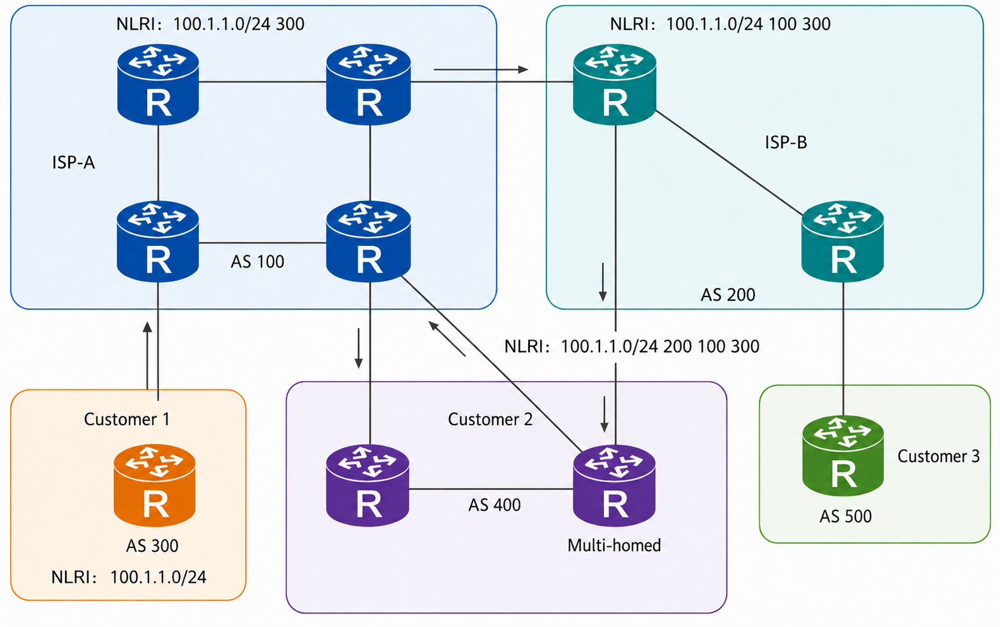
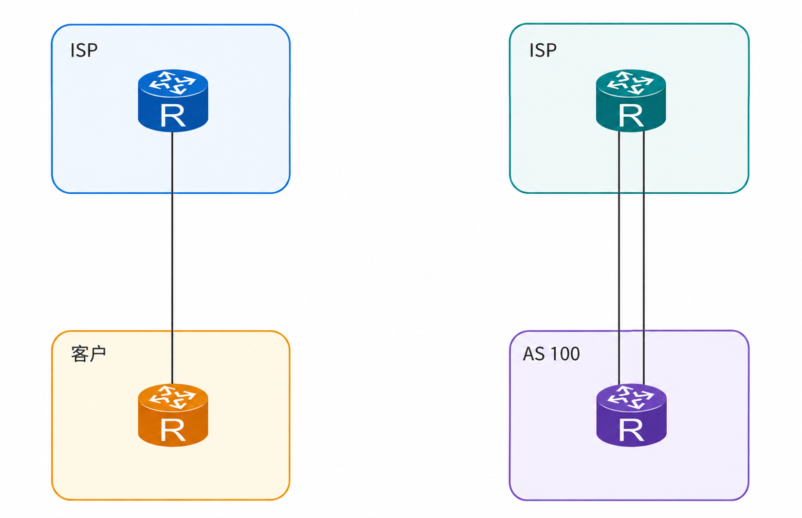
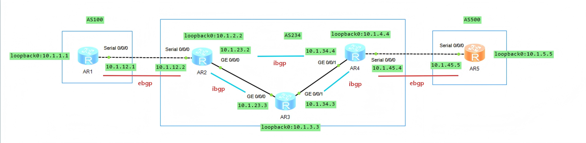

# BGP 基础

## 1.BGP 基础

### 1.1 BGP 概述

BGP（Border Gateway Protocol）边界网关协议，是一种在自治系统 AS（Autonomous System）之间传递并选择最佳路由的高级矢量路由协议。BGP 能够进行路由优选，避免路由环路，能更高效率地传递路由和维护大量的路由信息。虽然 BGP 用于在 AS 之间传递路由信息，但并不是所有 AS 之间传递路由信息都需要运行 BGP。**比如在数据中心上行连入 Internet 的出口上，为了避免 Internet 海量路由对数据中心内部网络的影响，设备采用静态路由代替 BGP 与外部网络通信**。

BGP 使用 TCP 作为其传输层协议（端口号为 179），并支持 BGP 与 BFD 联动、BGP Tracking 和 BGP GR，提高了网络的可靠性。

### 1.2 路径矢量路由协议

BGP 是一种路径矢量协议，将 AS 作为一个节点来计算，因此每一个节点都依靠下游邻居来将它的路由表中的路由传递下去，节点在路由的基础上进行路由计算并且将结果传递给上游邻居。

不同的是 IGP 协议以一个路由器作为一个节点，而 BGP 协议以一个 AS 作为节点，BGP 使用的是一个 AS 的列表，数据包经过这些 AS 才能够到达目的，因为这些列表中记录了数据包所经过的路径，因此将 BGP 称为路径矢量路由协议。**与 BGP 路由相关的 AS 号列表被称为 **`AS_PATH`**。BGP 可以通过 **`AS_PATH`** 属性来检测环路，如果路由器中收到一个更新消息中存在本地的 AS 号，就说明存在环路**。

<div align="center">
    
</div>

如上图所示，有两家运营商 ISP-A 和 ISP-B，分别工作在 AS 100 和 AS 200 中，三个客户 AS 分别为 AS 300、AS 400、AS 500，每个 AS 之内运行 iBGP，AS 之间运行 eBGP。AS 300 通告了一条网段 **`100.1.1.0/24`**，该路由通过 eBGP 传递到 AS 100，并且该路由将会携带 AS 号 300 记录在 **`AS_PATH`** 列表中。**在 AS 100 内部传递给 iBGP 邻居时，AS 号 100 不会添加在 **`AS_PATH`** 列表中，当传递给 eBGP 邻居时才会携带**。当路由传递到 AS 200，**`AS_PATH`** 的路径为 300 100。该路由也通过从 AS 200 传递到 AS 400，将 200 的 AS 号添加进 **`AS_PATH`** 列表，如果 AS 400 将路由重新传递到 AS 100，那么该路由将会导致环路。

### 1.3 BGP 邻居

**<font color="red">BGP 到它每一个运行 BGP 的对等体都形成一个独特的、基于单播的连接</font>**，为了提供对等体连接的可靠性，BGP 使用 TCP（端口号 179）作为底层的传输机制。

对于 OSPF 或 RIP 等内部路由协议通常通过组播（Multicast）或广播（Broadcast）在局域网内自动寻找邻居。而 BGP 不会自动搜寻邻居，**<font color="red">必须由网络管理员在路由器上手动配置对端路由器的 IP 地址</font>**。因为已经明确指定了目标 IP，BGP 发送的所有数据包都是发给特定 IP 的单播报文。这也意味着，只要两台路由器之间 IP 可达，即使它们相隔数个网络节点（Hop），也能成功建立 BGP 对等体关系。

>需要注意的是 iBGP 通常可跨多跳建立；eBGP 默认要求邻居直连，如需跨多跳建立 eBGP 邻居，还需额外配置 **`ebgp-max-hop`** 等相关参数。

BGP 需要在自治系统之间交换大量路由信息。为保证路由更新能够可靠、有序地传输，BGP 不自行实现报文重传、排序、流量控制等机制，而是使用 TCP 作为底层传输协议，并监听 TCP 179 端口。**建立连接时，发起方路由器使用随机端口，向目标路由器的 TCP 179 端口发送连接请求（TCP SYN）**。完成三次握手后，两者之间便建立起一条稳定的 TCP 数据流。

#### 1.3.1 iBGP 通常支持跨多跳建立

iBGP 邻居通常使用 Loopback 接口地址建立会话。例如：

```java{.line-numbers}
AR1 Loopback0：1.1.1.1/32
AR2 Loopback0：2.2.2.2/32

AR1 <--- IGP 或静态路由可达 ---> AR2
```

只要双方的 Loopback 地址在底层网络中可达，并正确配置 BGP 建邻源接口，即使中间经过多个三层节点，也可以建立 iBGP 邻居关系：

```java{.line-numbers}
AR1 ---- R3 ---- R4 ---- AR2
```

#### 1.3.2 eBGP 默认仅支持直连建邻

eBGP 默认发送的 TCP 报文 TTL 值通常为 1，因此默认要求两台 eBGP 邻居在三层上直接相连：

```java{.line-numbers}
AR1 ---- AR2
```

在该情况下，TCP 报文可以直接到达对端，eBGP 会话能够正常建立，如果中间经过其他三层设备：

```java{.line-numbers}
AR1 ---- R3 ---- AR2
```

**TCP 报文经过 R3 转发时，TTL 会减 1 并变为 0，设备会丢弃该报文**。因此，在未进行额外配置时，非直连 eBGP 邻居无法建立会话。若确实需要跨多个三层节点建立 eBGP 邻居，应显式配置 eBGP 多跳功能。例如，华为设备上可使用类似命令：

```java{.line-numbers}
peer <邻居地址> ebgp-max-hop <跳数>
```

该配置会允许 eBGP TCP 报文使用更大的 TTL 值，从而跨越指定数量的三层跳数建立会话。

### 1.4 BGP 接入

事实上并不是所有的网络都需要使用 BGP，在一个单一的企业网内，通常使用 IGP 协议做路由策略就足够了。但是如果需要跨运营商在不同的自治系统之间传递路由时，就必须用到 BGP 了。即使是自治系统之间，BGP 也不是必须要使用的。例如以下几种场景无需使用 BGP：

<div align="center">
    
</div>

- 单宿主自治系统。用户和 ISP 之间只有一条线连接，在这种场景下面，BGP 或者 IGP 都是没有必要的，当链路出现故障时，不需要路由协议来选路，只需要一条缺省路由就可以，并把缺省路由通告到 AS 内其他路由器，如上图左边所示。
- 多宿主到单一的自治系统。用户和 ISP 之间有多条链路，多宿主到一个 ISP 典型的做法是使用一条链路作为主用链路，另外一条链路作为备用链路。此时也不需要运行 BGP，只需要将备份链路的路由优先级设置较高，只有当主链路失效以后才使用备份链路，如上图右边所示。

## 2.BGP 连接方式

BGP 按照运行方式分为 eBGP（External BGP）和 iBGP（Internal BGP）邻居关系。

- eBGP：运行于不同 AS 之间的 BGP 称为 eBGP。为了防止 AS 间产生环路，当 BGP 设备接收 eBGP 对等体发送的路由时，会将带有本地 AS 号的路由丢弃。
- iBGP：运行在相同的 AS 之内的 BGP 称为 iBGP。为了防止 AS 内产生环路，在 AS 内需要保持全连接的 iBGP 邻居。

eBGP 的防环机制是基于 **`AS_PATH`**，iBGP 的局限性是路由在同一个 AS 内部的 iBGP 对等体之间传递时，不会追加 AS 号（**`AS_PATH`** 保持不变）。因此，内部路由器无法通过 **`AS_PATH`** 来判断路由是否在 AS 内部产生了环路。

根据 RFC 4271 的规定，When a BGP speaker receives an UPDATE message from an internal peer, the receiving BGP speaker SHALL NOT re-distribute the routing information contained in that UPDATE message to other internal peers (unless the speaker acts as a BGP Route Reflector). 也就是说 iBGP 的真正防环规则为水平分割原则（Split Horizon）：从任何 iBGP 对等体学到的路由更新，绝对不能再转发给其他的 iBGP 对等体。由于路由器不能转发从内部学到的路由，这就直接切断了环路产生的路径。

iBGP 水平分割需要全连接，假设某 AS 内部存在三台路由器 R1、R2 和 R3，且仅建立如下 iBGP 邻居关系：

```java{.line-numbers}
R1 —— R2 —— R3
```

若 R1 从外部 eBGP 邻居学习到一条路由，则可以将该路由通告给 R2。R2 接收该路由后可以使用该路由进行选路，但由于该路由来源于 iBGP 邻居，R2 不能再将其通告给 R3。因此，R3 无法通过 R2 学习到 R1 从外部获得的路由。若要保证 R3 也能获得该路由，R1 与 R3 必须直接建立 iBGP 邻居关系。

在未部署路由反射器或 BGP 联邦的传统 iBGP 网络中，**<font color="red">为确保任意一台 BGP 路由器均能学习到其他路由器从外部获得的路由，AS 内所有普通 iBGP 路由器需要两两建立邻居关系，即形成 iBGP 全连接（Full Mesh）</font>**。

对于三台路由器，需要建立以下三条 iBGP 会话：

```java{.line-numbers}
R1 <------> R2
 \          /
  \--------/
     R3
```

### 2.1 BGP 全互联

<div align="center">
    
</div>

我们以上面的拓扑图来介绍 BGP 全互联。AR1-AR5 的基础配置如下所示：

```java{.line-numbers}
// AR1
#
sysname AR1
#
interface Serial0/0/0
 link-protocol ppp
 ip address 10.1.12.1 255.255.255.0 
#
interface LoopBack0
 ip address 10.1.1.1 255.255.255.0 
#
bgp 100
 router-id 1.1.1.1
 peer 10.1.12.2 as-number 234 
 #
 ipv4-family unicast
  undo synchronization
  network 10.1.1.0 255.255.255.0 
  peer 10.1.12.2 enable
// AR2
#
sysname AR2
#
interface Serial0/0/0
 link-protocol ppp
 ip address 10.1.12.2 255.255.255.0 
#
interface GigabitEthernet0/0/0
 ip address 10.1.23.2 255.255.255.0 
#
interface LoopBack0
 ip address 10.1.2.2 255.255.255.0 
#
bgp 234
 router-id 2.2.2.2
 peer 10.1.3.3 as-number 234 
 peer 10.1.3.3 connect-interface LoopBack0
 peer 10.1.4.4 as-number 234 
 peer 10.1.4.4 connect-interface LoopBack0
 peer 10.1.12.1 as-number 100 
 #
 ipv4-family unicast
  undo synchronization
  peer 10.1.3.3 enable
  peer 10.1.4.4 enable
  peer 10.1.12.1 enable
#
ospf 1 router-id 2.2.2.2 
 area 0.0.0.0 
  network 10.1.2.2 0.0.0.0 
  network 10.1.23.0 0.0.0.255 
// AR3
#
sysname AR3
#
interface GigabitEthernet0/0/0
 ip address 10.1.23.3 255.255.255.0 
#
interface GigabitEthernet0/0/1
 ip address 10.1.34.3 255.255.255.0 
#
interface LoopBack0
 ip address 10.1.3.3 255.255.255.0 
#
bgp 234
 router-id 3.3.3.3
 peer 10.1.2.2 as-number 234 
 peer 10.1.2.2 connect-interface LoopBack0
 peer 10.1.4.4 as-number 234 
 peer 10.1.4.4 connect-interface LoopBack0
 #
 ipv4-family unicast
  undo synchronization
  peer 10.1.2.2 enable
  peer 10.1.4.4 enable
#
ospf 1 router-id 3.3.3.3 
 area 0.0.0.0 
  network 10.1.3.3 0.0.0.0 
  network 10.1.23.0 0.0.0.255 
  network 10.1.34.0 0.0.0.255 
// AR4
#
sysname AR4
#
interface Serial0/0/0
 link-protocol ppp
 ip address 10.1.45.4 255.255.255.0 
#
interface GigabitEthernet0/0/1
 ip address 10.1.34.4 255.255.255.0 
#
interface LoopBack0
 ip address 10.1.4.4 255.255.255.0 
#
bgp 234
 router-id 4.4.4.4
 peer 10.1.2.2 as-number 234 
 peer 10.1.2.2 connect-interface LoopBack0
 peer 10.1.3.3 as-number 234 
 peer 10.1.3.3 connect-interface LoopBack0
 peer 10.1.45.5 as-number 500 
 #
 ipv4-family unicast
  undo synchronization
  peer 10.1.2.2 enable
  peer 10.1.3.3 enable
  peer 10.1.45.5 enable
#
ospf 1 router-id 4.4.4.4 
 area 0.0.0.0 
  network 10.1.4.4 0.0.0.0 
  network 10.1.34.0 0.0.0.255 
// AR5
#
sysname AR5
#
interface Serial0/0/0
 link-protocol ppp
 ip address 10.1.45.5 255.255.255.0 
#
interface LoopBack0
 ip address 10.1.5.5 255.255.255.0 
#
bgp 500
 router-id 5.5.5.5
 peer 10.1.45.4 as-number 234 
 #
 ipv4-family unicast
  undo synchronization
  network 10.1.5.0 255.255.255.0 
  peer 10.1.45.4 enable
```

#### 2.1.1 connect-interface 配置

以 AR2 的配置为例，在实际网络中，iBGP 邻居通常使用 Loopback 地址建立，而不是直接使用物理接口地址。因为 Loopback 是逻辑接口，不依赖某一条具体物理链路，更适合作为路由器稳定的逻辑标识。

```java{.line-numbers}
 peer 10.1.4.4 as-number 234 
 peer 10.1.4.4 connect-interface LoopBack0
```

例如，AR2 的 Loopback0 为 **`10.1.2.2`**，AR4 的 Loopback0 为 **`10.1.4.4`**，两者通过 **`AR2->AR3->AR4`** 建立 iBGP。此时 BGP 会话的端点始终是 **`10.1.2.2<->10.1.4.4`**，实际经过哪条物理路径则由 IGP 决定。如果原路径故障，但 IGP 能重新找到到对端 Loopback 的备用路径，BGP 会话就有机会继续保持或重新建立。**<font color="red">需要注意，Loopback 本身并不会提供冗余，真正的前提仍然是底层存在其他可达路径</font>**。

如果直接使用物理接口地址建立邻居，例如使用 **`10.1.23.2`**，一旦该接口失效，即使网络中还有其他路径可以到达对端，原来以该接口地址为端点的 BGP 会话通常仍会中断。当使用 Loopback 接口的 IP 地址建立 BGP 连接时，建议对等体两端同时配置命令 **`peer connect-interface`**，保证两端 TCP 连接的接口和地址的正确性。

若 AR2 配置了 **`peer 10.1.4.4`**，但未配置 **`connect-interface LoopBack0`**，AR2 主动连接 AR4 时可能以出接口地址 **`10.1.23.2`** 作为源地址。若 AR4 仅配置 peer **`10.1.2.2`**，则不会将来自 **`10.1.23.2`** 的连接识别为已配置邻居，AR2 发起的连接可能被拒绝。

#### 2.1.2 BGP 全互联

AR1 位于 AS 100，通过 eBGP 向 AR2 通告本地网络 **`10.1.1.0/24`**。AR2 接收该路由后，在 BGP 路由表中会记录其下一跳为 AR1 的地址 **`10.1.12.1`**。此时，该路由的 **`AS_PATH`** 中通常包含 AS 100，表明该前缀来自 AS 100。

```java{.line-numbers}
<AR2>display bgp routing-table 
 BGP Local router ID is 2.2.2.2 
 Total Number of Routes: 2
      Network            NextHop        MED        LocPrf    PrefVal Path/Ogn
 *>   10.1.1.0/24        10.1.12.1       0                     0      100i
   i  10.1.5.0/24        10.1.45.5       0          100        0      500i
```

随后，AR2 会将该路由通告给 AS 234 内的 iBGP 对等体 AR3 和 AR4。**<font color="red">需要注意，iBGP 在默认情况下不会修改路由的 **`NEXT_HOP`** 属性</font>**。因此，如果 AR2 不作额外处理，AR3 和 AR4 接收到的 **`10.1.1.0/24`** 路由，其下一跳仍然是 **`10.1.12.1`**，即 AR1 与 AR2 之间链路上 AR1 的地址。

```java{.line-numbers}
<AR3>display bgp routing-table 
 BGP Local router ID is 3.3.3.3 
 Total Number of Routes: 2
      Network            NextHop        MED        LocPrf    PrefVal Path/Ogn
   i  10.1.1.0/24        10.1.12.1       0          100        0      100i
   i  10.1.5.0/24        10.1.45.5       0          100        0      500i
<AR4>display bgp routing-table 
 BGP Local router ID is 4.4.4.4 
 Total Number of Routes: 2
      Network            NextHop        MED        LocPrf    PrefVal Path/Ogn
   i  10.1.1.0/24        10.1.12.1       0          100        0      100i
 *>   10.1.5.0/24        10.1.45.5       0                     0      500i
```

这会带来一个可达性问题，AR3 和 AR4 位于 AS 234 内部，它们路由表上不存在到 **`10.1.12.1`** 的路由。因此，即使 AR3、AR4 的 BGP 表中已经有 **`10.1.1.0/24`**，若下一跳 **`10.1.12.1`** 不可达，该 BGP 路由也无法被正常用于转发。

实际部署中，通常会在 AR2 向 iBGP 邻居发布该路由时配置 **`next-hop-local`**，使 AR2 将下一跳改写为自身的 Loopback 地址，例如 **`10.1.2.2`**。由于该 Loopback 地址通过 OSPF 等 IGP 在 AS 234 内可达，AR3 和 AR4 就能正确地将到达 **`10.1.1.0/24`** 的流量先转发给 AR2，再由 AR2 转发至 AR1。在 AR2-AR4 上配置完成后，BGP 路由表如下所示：

```java{.line-numbers}
[AR3-bgp]display bgp routing-table
 BGP Local router ID is 3.3.3.3 
 Total Number of Routes: 2
      Network            NextHop        MED        LocPrf    PrefVal Path/Ogn
 *>i  10.1.1.0/24        10.1.2.2        0          100        0      100i
 *>i  10.1.5.0/24        10.1.4.4        0          100        0      500i
[AR3-bgp]displ	
[AR3-bgp]display ip ro	
[AR3-bgp]display ip routing-table 10.1.2.2
Route Flags: R - relay, D - download to fib
Routing Table : Public
Summary Count : 1
Destination/Mask    Proto   Pre  Cost      Flags NextHop         Interface
       10.1.2.2/32  OSPF    10   1           D   10.1.23.2       GigabitEthernet0/0/0
[AR4-bgp]display bgp routing-table 
 BGP Local router ID is 4.4.4.4 
 Total Number of Routes: 2
      Network            NextHop        MED        LocPrf    PrefVal Path/Ogn
 *>i  10.1.1.0/24        10.1.2.2        0          100        0      100i
 *>   10.1.5.0/24        10.1.45.5       0                     0      500i
```

最后，AR4 再通过 eBGP 将该路由发布给 AS 500 中的 AR5。**<font color="red">eBGP 通告路由时默认会修改下一跳</font>**，因此 AR5 接收 **`10.1.1.0/24`** 后，下一跳会变为 AR4 的对外接口地址 **`10.1.45.4`**。因此，AR5 访问 **`10.1.1.0/24`** 时，会先将报文发送给 AR4；AR4 再依据其 iBGP 和 IGP 路由，将流量转发至 AR2，最终到达 AR1。

```java{.line-numbers}
<AR5>display bgp routing-table 
 BGP Local router ID is 5.5.5.5 
 Total Number of Routes: 2
      Network            NextHop        MED        LocPrf    PrefVal Path/Ogn
 *>   10.1.1.0/24        10.1.45.4                             0      234 100i
 *>   10.1.5.0/24        0.0.0.0         0                     0      i
```

当 AR5 向 **`10.1.1.1`** 发起 Ping 时，会根据路由表中到达 **`10.1.1.0/24`** 的 eBGP 路由，将报文发送给下一跳 AR4 的接口地址 **`10.1.45.4`**。AR4 学到该路由后，其 BGP 下一跳为 AR2 的 Loopback 地址 **`10.1.2.2`**。这是因为 AR2 向 iBGP 邻居发布路由时使用了 **`next-hop-local`**，将下一跳改写为自身的 Loopback 地址。

**<font color="red">AR4 通过 OSPF 递归解析到达 **`10.1.2.2`** 的路径，发现实际下一跳是 AR3 的 `10.1.34.3`</font>**，因此将报文转发给 AR3。AR3 的 BGP 路由下一跳同样为 **`10.1.2.2`**。AR3 再通过 OSPF 查询到达该 Loopback 地址的路径，实际下一跳为 AR2 的 **`10.1.23.2`**，于是将报文转发给 AR2。

AR2 从 AR1 经 eBGP 学到 **`10.1.1.0/24`**，其下一跳为 AR1 的 **`10.1.12.1`**。AR2 直接通过 **`Serial1/0/0`** 将报文转发给 AR1，最终到达 **`10.1.1.1`**。**这里的关键是 **`10.1.2.2`** 是 BGP 标记的逻辑下一跳；AR3、AR4 通过 OSPF 将其递归解析为实际可直接转发的下一跳地址**。

```java{.line-numbers}
<AR5>ping -a 10.1.5.5 10.1.1.1
  PING 10.1.1.1: 56  data bytes, press CTRL_C to break
    Reply from 10.1.1.1: bytes=56 Sequence=1 ttl=252 time=130 ms
    Reply from 10.1.1.1: bytes=56 Sequence=2 ttl=252 time=110 ms
    Reply from 10.1.1.1: bytes=56 Sequence=3 ttl=252 time=130 ms
    Reply from 10.1.1.1: bytes=56 Sequence=4 ttl=252 time=90 ms
    Reply from 10.1.1.1: bytes=56 Sequence=5 ttl=252 time=110 ms

  --- 10.1.1.1 ping statistics ---
    5 packet(s) transmitted
    5 packet(s) received
    0.00% packet loss
    round-trip min/avg/max = 90/114/130 ms
```

### 2.2 BGP 部分互联