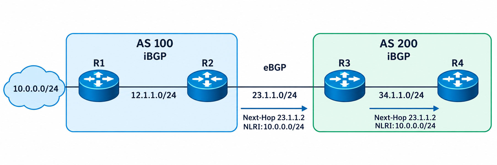
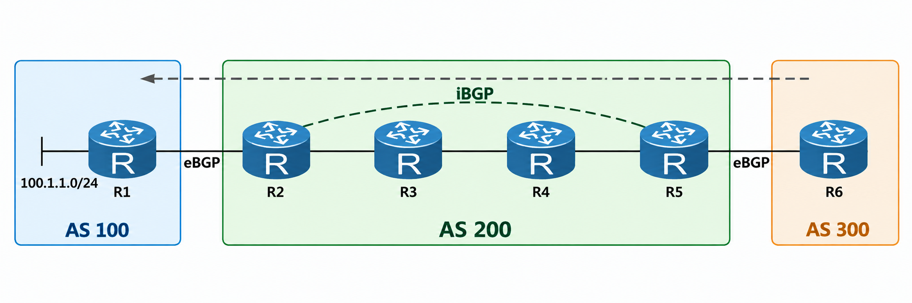
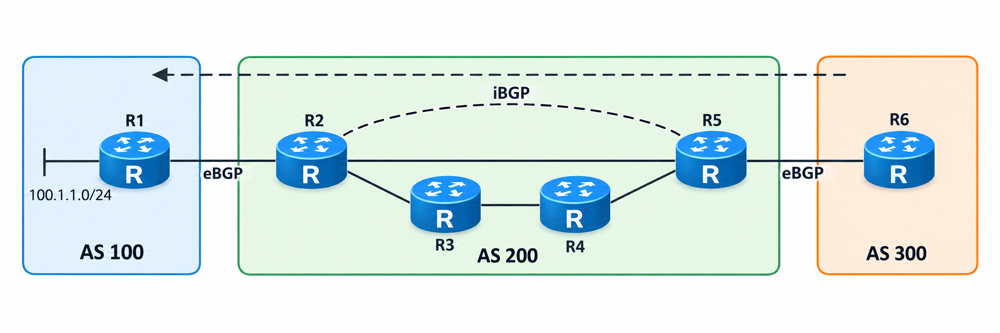
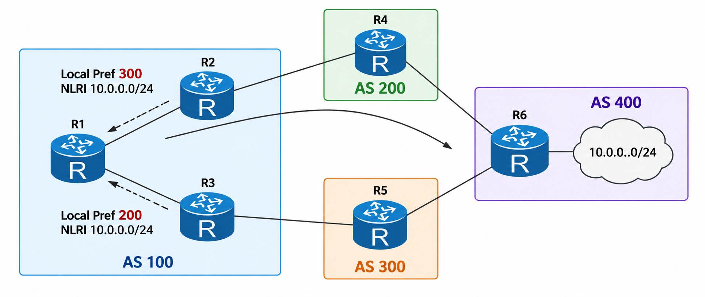
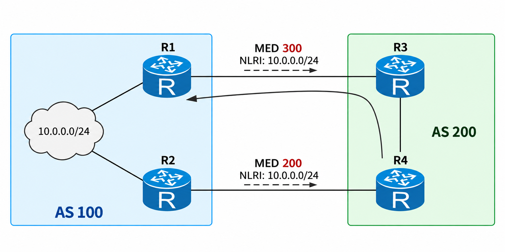

# BGP 属性

## 1.Origin 属性

该属性为公认必遵属性，用来代表 BGP 路由的起源，还用来标记一条路由是如何进入 BGP 中，有以下 3 种类型：

- IGP：通过内部网关协议学习的路由，通过 Network 的方式注入到 BGP 中的路由或者聚合路由，它们的起源属性的数值为 IGP；
- EGP：通过 EGP 学习到的路由，其 origin 属性为 EGP；
- incomplete：表明路径不完整，未知源，通常通过 import 将其他路由协议或本地路由表中的路由引入 BGP 时，其 Origin 属性会被标记为 Incomplete。部分聚合路由也可能具有该属性。

聚合路由的起源属性可以是 IGP，也可能是 incomplete，这依赖于聚合路由的成员路由的起源属性。如果成员路由的 origin 属性都是 IGP，则聚合路由的起源属性为 IGP；如果成员路由的 origin 属性是 incomplete，则聚合路由的起源属性为 incomplete；而如果有些成员路由是 IGP，而有些成员路由的属性是 incomplete，则生成的聚合路由的起源属性是 incomplete。

**<font color="red">origin 类型的 3 个数值之间有优先顺序，`IGP>EGP>incomplete`，也就是说从 IGP 学习到的路由优于从 EGP 学到的路由，优于路由引入进 BGP 的路由</font>**。我们使用如下的网络拓扑来进行验证：

<div align="center">
    
</div>

我们在 AR2 上进行如下配置：

```java{.line-numbers}
bgp 234
 router-id 2.2.2.2
 peer 10.1.1.1 as-number 100 
 peer 10.1.1.1 ebgp-max-hop 255 
 peer 10.1.1.1 connect-interface LoopBack0
 peer 10.1.3.3 as-number 234 
 peer 10.1.3.3 connect-interface LoopBack0
 peer 10.1.4.4 as-number 234 
 peer 10.1.4.4 connect-interface LoopBack0
 #
 ipv4-family unicast
  undo synchronization
  aggregate 172.16.0.0 255.255.0.0 detail-suppressed 
  aggregate 172.17.0.0 255.255.0.0 detail-suppressed 
  aggregate 172.18.0.0 255.255.0.0 detail-suppressed 
  network 10.1.2.2 255.255.255.255 
  network 172.16.1.0 255.255.255.0 
  network 172.16.2.0 255.255.255.0 
  network 172.18.1.0 255.255.255.0 
  import-route static route-policy STATIC-TO-BGP
  peer 10.1.1.1 enable
  peer 10.1.3.3 enable
  peer 10.1.3.3 next-hop-local 
  peer 10.1.4.4 enable
  peer 10.1.4.4 next-hop-local 
#
ospf 1 router-id 2.2.2.2 
 area 0.0.0.0 
  network 10.1.2.2 0.0.0.0 
  network 10.1.23.0 0.0.0.255 
#
route-policy STATIC-TO-BGP permit node 10 
 if-match ip-prefix INCOMPLETE-MEMBERS 
#
route-policy STATIC-TO-BGP permit node 20 
 if-match ip-prefix MIXED-INCOMPLETE 
#
route-policy STATIC-TO-BGP permit node 30 
 if-match ip-prefix STATIC-PREFIXES 
#
ip ip-prefix STATIC-PREFIXES index 10 permit 192.0.2.0 24
ip ip-prefix INCOMPLETE-MEMBERS index 10 permit 172.17.1.0 24
ip ip-prefix INCOMPLETE-MEMBERS index 20 permit 172.17.2.0 24
ip ip-prefix MIXED-INCOMPLETE index 10 permit 172.18.2.0 24
#
ip route-static 10.1.1.1 255.255.255.255 10.1.12.1
ip route-static 172.16.1.0 255.255.255.0 NULL0
ip route-static 172.16.2.0 255.255.255.0 NULL0
ip route-static 172.17.1.0 255.255.255.0 NULL0
ip route-static 172.17.2.0 255.255.255.0 NULL0
ip route-static 172.18.1.0 255.255.255.0 NULL0
ip route-static 172.18.2.0 255.255.255.0 NULL0
ip route-static 192.0.2.0 255.255.255.0 NULL0
```

AR2 上的 BGP 路由表如下所示：

```java{.line-numbers}
[AR2]display bgp routing-table 
 BGP Local router ID is 2.2.2.2 
 Status codes: * - valid, > - best, d - damped,
               h - history,  i - internal, s - suppressed, S - Stale
               Origin : i - IGP, e - EGP, ? - incomplete
 Total Number of Routes: 11
      Network            NextHop        MED        LocPrf    PrefVal Path/Ogn
 *>   10.1.2.2/32        0.0.0.0         0                     0      i
 *>   172.16.0.0         127.0.0.1                             0      i
 s>   172.16.1.0/24      0.0.0.0         0                     0      i
 s>   172.16.2.0/24      0.0.0.0         0                     0      i
 *>   172.17.0.0         127.0.0.1                             0      ?
 s>   172.17.1.0/24      0.0.0.0         0                     0      ?
 s>   172.17.2.0/24      0.0.0.0         0                     0      ?
 *>   172.18.0.0         127.0.0.1                             0      ?
 s>   172.18.1.0/24      0.0.0.0         0                     0      i
 s>   172.18.2.0/24      0.0.0.0         0                     0      ?
 *>   192.0.2.0          0.0.0.0         0                     0      ?
```

>i 表示由 IGP 学到的路由。e 表示该标识只能手工地调整。由于 EGP 协议几乎没有使用，因此很难看到该标识。? 表示由外部引入到 BGP 的路由。

首先，AR2 使用：

```java{.line-numbers}
network 10.1.2.2 255.255.255.255
```

将本地 Loopback0 的 **`10.1.2.2/32`** 注入 BGP。该路由在 BGP 路由表中显示为 i，即 **`ORIGIN=IGP`**。这是因为通过 BGP network 命令注入的路由，默认 Origin 属性为 IGP。随后，AR2 通过以下配置，将符合路由策略 **`STATIC-TO-BGP`** 的静态路由引入 BGP：

```java{.line-numbers}
import-route static route-policy STATIC-TO-BGP
```

其中，**`192.0.2.0/24`** 匹配 **`STATIC-PREFIXES`**，因此被引入 BGP。该路由在 BGP 表中显示为 ?，即 **`ORIGIN=INCOMPLETE`**。这是因为它并非通过 network 命令产生，而是由 **`import-route static`** 从静态路由表引入 BGP。

对于 **`172.16.0.0/16`** 的聚合实验，AR2 使用如下配置，将 **`172.16.1.0/24`** 和 **`172.16.2.0/24`** 作为成员路由注入 BGP。两条成员路由的 Origin 均为 IGP，因此生成的聚合路由 **`172.16.0.0/16`** 的 Origin 也为 IGP。BGP 表中，成员路由显示为 **`s>`**，表示它们仍是有效的最佳 BGP 路由，但由于配置了 **`detail-suppressed`**，不会向邻居发布，对外发布的是聚合路由 **`172.16.0.0/16`**。

```java{.line-numbers}
network 172.16.1.0 255.255.255.0
network 172.16.2.0 255.255.255.0
aggregate 172.16.0.0 255.255.0.0 detail-suppressed
```

对于 **`172.17.0.0/16`** 的聚合实验，**`172.17.1.0/24`** 和 **`172.17.2.0/24`** 均为静态路由，且分别匹配 **`INCOMPLETE-MEMBERS`** 前缀列表。它们通过 **`import-route static route-policy STATIC-TO-BGP`** 被引入 BGP，因此两条成员路由的 Origin 均为 Incomplete。由于所有成员路由均为 Incomplete，聚合生成的 **`172.17.0.0/16`** 也显示为 ?，即 **`ORIGIN=INCOMPLETE`**。

最后，**`172.18.0.0/16`** 用于验证 IGP 与 Incomplete 成员混合时的聚合结果。其中：

```java{.line-numbers}
network 172.18.1.0 255.255.255.0
```

将 **`172.18.1.0/24`** 注入 BGP，因此它的 Origin 为 IGP；而 **`172.18.2.0/24`** 匹配 **`MIXED-INCOMPLETE`** 前缀列表，通过 **`import-route static route-policy MIXED-TO-BGP`** 引入 BGP，因此它的 Origin 为 Incomplete。因此，聚合路由 **`172.18.0.0/16`** 在 BGP 表中显示为 ?。

## 2.AS_PATH 属性

该属性为公认必遵属性，用于记录路由所经过的路径上沿途经过的 AS，BGP 对等体间传递的每条路由都会携带这份 AS 号列表。路由在 AS 内传递时，不对路由的 **`AS_PATH`** 属性内容做任何改动。路由在离开 AS 时，当前的 AS 号会自动添加到 **`AS_PATH`** 序列的前面。当任何 BGP 设备收到路由时，都要检查 **`AS_PATH`** 属性的内容，如果在 **`AS_PATH`** 中含有接收路由路由器所在 AS 号，则 BGP 路由器会丢弃此种路由，以避免环路。**`AS_PATH`** 除了能够防环外，还可以根据 **`AS_PATH`** 的长度决定选择最优路由。

BGP 的 **`AS_PATH`** 属性内容是由 segment 构成的，有 4 种 segment 类型，分别是 **`AS_SET`**、**`AS_SEQUENCE`**、**`AS_CONFED_SET`**、**`AS_CONFED_SEQUENCE`**。后两种 segment 类型仅出现在 BGP 联盟中，每种 segment 类型在 **`AS_PATH`** 属性中仅能出现一次。

- **`AS_SET`**：是 AS 号的无序集合；
- **`AS_SEQUENCE`**：是 AS 号的有序列表；
- **`AS_CONFED_SET`**：是联盟中成员 AS 号的无序集合；
- **`AS_CONFED_SEQUENCE`**：是联盟中成员 AS 号的有序列表；

**`AS_PATH`** 属性详细说明：

- 在 **`AS_PATH`** 中可能仅含有一种 segment 类型，也可能同时含有多种 segment 类型，若多种类型同时出现在 **`AS_PATH`** 中，则前后顺序一定是 **`AS_CONFED_SEQUENCE`**、**`AS_CONFED_SET`**、**`AS_SEQUENCE`**、**`AS_SET`**。
- **`AS_SET`** 和 **`AS_CONFED_SET`** 一定是聚合路由的 **`AS_PATH`** 才会包含的 segment 类型。
- 不论是何种类型的 segment，若其中含有的 AS 号等于接收设备所在的 AS 号，则该路由都将因为环路问题而被丢弃。
- **`AS_PATH`** 的长度是由 AS_SEQUENCE 这种 segment 的 AS 号的数量来决定的，其 AS 号越多，则代表长度越长。**<font color="red">而 **`AS_CONFED_SEQUENCE`** 和 **`AS_CONFED_SET`** 的长度都不计入 **`AS_PATH`** 长度计算，而整个 **`AS_SET`** Segment 按长度 1 计算</font>**。在 BGP 选路规则中，如果其他属性都一致，则 **`AS_PATH`** 的长度越短的路由越好。
- BGP 防环是靠 eBGP 间的 **`AS_PATH`** 属性来保证的，但如果使用命令 **`peer [ipv4-address] allow-as-loop`**，可使接收 BGP 设备接收含有自己 AS 号码的路由，这破坏了 BGP 的防环规则，这条命令的使用场景主要在 MPLS VPN 环境中。

BGP 设备对 **`AS_PATH`** 的计算方法如下：

- **<font color="red">在本 AS 内注入的路由，其 **`AS_PATH`** 为空，仅当该路由离开本 AS 时，即通告给 eBGP 对等设备时，在 Update 报文中会创建含自己 AS 号码的 **`AS_PATH`** 列表</font>**。且 AS 号出现在 **`AS_SEQUENCE`** 的最左面（前面）。
- 在 AS 内的 iBGP 上通告路由时，其 **`AS_PATH`** 不变化。
- 一般不建议对 **`AS_PATH`** 做任何删/改行为，这易于导致路由环路。但管理员可根据需要添加重复的 AS 号到 **`AS_PATH`** 中以增加 **`AS_PATH`** 的长度，继而影响远端设备选路。
- 使用命令 **`peer [ipv4-address] public-as-only`** 发送 eBGP 报文时，仅携带公有 AS 号。
- 在互联网中只有公有 AS 号可以直接在 Internet 上使用，私有 AS 号直接发布到 Internet 上可能造成环路现象。为了解决上述情况，可以在把路由发布到 Internet 前，配置（public-as-only）发送 eBGP 更新报文时，**`AS_PATH`** 属性中仅携带公有 AS 号。

>公有 ASN（Public ASN）是全球唯一、由 Internet 号码资源体系正式分配，可用于公网 BGP 的 AS 号。私有 ASN（Private ASN）是 IANA 专门保留给组织内部使用的 AS 号，不保证全球唯一。

- 通常情况下，一个设备只支持一个 BGP 进程，即只支持一个 AS 号。但是在某些特殊情况下，例如网络迁移更换 AS 号的时候为了保证网络切换的顺利进行，可以为指定对等体设置一个伪 AS 号，对方将会使用该伪造 AS 号与之建立邻居，同样可以起到隐藏自身真实 AS 的作用。
- 如果在路由进程中配置了 **`AS_PATH-limit`** 命令，接收路由时会检查 **`AS_PATH`** 属性长度是否超限，如果超出则丢弃掉路由。缺省情况下 **`AS_PATH`** 长度为 255，最大限制值可以调整为 2000。

## 3.Next_Hop 属性

### 3.1 Next_Hop 属性的规则

该属性为公认必遵属性，**`Next_Hop`** 属性记录了 BGP 路由的下一跳信息，**<font color="red">区别于 IGP 中下一跳是直连路由器的 IP 地址，BGP 路由的下一跳往往都是非直连设备的 IP 地址</font>**。这可导致数据包在按下一跳地址发给目标网络时，往往由于中间路由器上没有 BGP 路由，而出现路由黑洞，导致丢包。

<div align="center">
    
</div>

BGP 设计的下一跳属性遵循如下规则：

- 规则 1：BGP 设备将本地始发路由发布给所有 BGP 对等体时，通常会把该路由信息的下一跳属性设置为本地与对端建立 BGP 邻居关系的接口地址。在使用 Loopback 接口建立 BGP 邻居时，该 **`NEXT_HOP`** 是本端 Loopback 地址，接收端再通过 IGP 对该 BGP **`NEXT_HOP`** 进行递归解析，以确定实际的转发下一跳和出接口。上图中，R1 通告 **`10.1.1.0/24`** 路由给 R2，R2 的 BGP 路由下一跳是 **`12.1.1.1`**。

>**`connect-interface LoopBack0`** 决定 BGP TCP 会话使用 Loopback 地址作为本地源地址。假设 R1 和 R2 之间使用 loopback0 建立 TCP 连接，并且配置好了 **`connect-interface LoopBack0`**，对于 R1 本地始发并向该 iBGP Peer R2 通告的路由，BGP 将这个本地 BGP 会话地址 **`10.1.1.1`** 写入 **`NEXT_HOP`**。R2 收到后将其显示为 **`Original nexthop`**，再通过 IGP 将 **`10.1.1.1`** 递归解析到物理下一跳 **`10.1.12.1`**，后者显示为 Relay IP Nexthop。

- 规则 2：BGP 设备在向 eBGP 对等体发布某条路由时，会把该路由信息的下一跳属性设置为本地与对端建立 BGP 邻居关系的接口地址。若使用 Loopback 接口建立  eBGP，则该 **`NEXT_HOP`** 可以是本端的 Loopback 地址，接收端需要再通过路由表对该 BGP **`NEXT_HOP`** 进行递归解析，以确定实际的转发下一跳。图中，R2 向 eBGP 对等体 R3 通告 **`10.1.1.0/24`** 路由，下一跳不再是 **`12.1.1.1`**，而是 **`23.1.1.2`**。
- 规则 3：**<font color="red">BGP 设备在向 iBGP 对等体发布从 eBGP 对等体学来的路由时，并不改变该路由信息的下一跳属性</font>**。图中，R3 收到下一跳为 **`23.1.1.2`** 的路由，继续通告给 iBGP 对等体 R4，下一跳属性值保持不变。

（1）缺省情况下，BGP 在向 eBGP 对等体发布路由时和向 iBGP 对等体发布引入的 IGP 路由时（即本地始发路由）将下一跳改为自己的接口地址。这里的本地始发，核心是：这条 BGP 路由是在这台 BGP Speaker 上产生/注入 BGP 的，而不是从其他 BGP Peer 学来的。根据华为文档，把 BGP 从本地路由表注入路由分为 import 和 network 两种方式，**import 方式是按协议类型，将 RIP 路由、OSPF 路由、IS-IS 路由、静态路由和直连路由等某一协议的路由注入到 BGP 路由表中；network 方式比 import 方式更精确，将指定前缀和掩码的一条路由注入到 BGP 路由表中**。import 和 network 两种方式均可以通过路由策略实现对路由的过滤及属性的修改，将通过路由策略过滤且修改属性后的路由注入到 BGP 路由表中。

（2）BGP 在向 iBGP 对等体通告路由时，不改变下一跳属性。这可以通过命令 **`peer next-hop-local`** 修改。**`peer next-hop-local`** 命令在实际中使用较多，原因是 BGP 设备从其 eBGP 邻居收来的路由的下一跳都是其 eBGP 邻居的 Peer 地址，本端对等体所属 AS 域内的 iBGP 邻居收到这样的路由后，由于下一跳不可达导致路由无法活跃。上图中，R3 和 R4 均收到下一跳地址为 **`23.1.1.2`** 的路由，R4 一定要保证此下一跳地址可达。因此，需要在 R3 上对 iBGP 邻居配置 **`peer next-hop-local`** 命令，使得发给 iBGP 邻居的路由的下一跳是其自身的地址，iBGP 邻居收到这样的路由后（由于域内都配置了 IGP）发现下一跳可达，路由即为活跃路由。

```java{.line-numbers}
<R3> system-view
[R3] bgp 200
[R3-bgp] peer 34.1.1.4 as-number 200
[R3-bgp] ipv4-family unicast
[R3-bgp-af-ipv4] peer 34.1.1.4 next-hop-local
```

**<font color="red">下一跳可达作为 BGP 选路规则中第 0 条规则，如果 BGP 路由的下一跳 IP 地址不可达，那么该 BGP 路由将不会参与选路</font>**。

### 3.2 关于下一跳带来的问题

#### 3.2.1 下一跳不可达问题

下一跳是非直连的地址，所以路由表一定要保证能到达这个下一跳的网络。在下图中，R2 从 EBGP 邻居 R1 学到 **`100.1.1.0/24`**，**`NEXT_HOP`** 为 R1 的 **`12.1.1.1`**。R2 再将该路由通告给 IBGP 邻居 R5 时，缺省不修改 **`NEXT_HOP`**，因此 R5 收到该路由后，其 **`NEXT_HOP`** 仍为 **`12.1.1.1`**。如果 AS200 内部没有到 **`12.1.1.1`** 的路由，则 R5 无法解析该 BGP 下一跳。

<div align="center">
    
</div>

可以使用如下方法来解决这个问题：

- 将 **`12.1.1.0/24`** 网络引入到 AS 200 所使用的 IGP 协议。
- 在 R2 指向 iBGP 邻居 R5 的方向上使用命令 **`peer 56.1.1.5 next-hop-local`**，修改 R5 上的下一跳地址为 R2 地址 **`23.1.1.2`**，这个地址 IGP 可达。

#### 3.2.2 路由黑洞问题

从数据平面分析，如上图所示，如果数据流访问目标 BGP 网络，R5 根据下一跳，发给 R2，但中间 IGP 路由器 R3 和 R4 没有对应的 BGP 路由，所以会出现路由黑洞。解决路由黑洞的方法如下所示：

- 重新设计网络拓扑，把 R2 和 R5 直连，使下图所示拓扑，这样 AS 间的数据访问流量将不需要经过 IGP 路由器，完全使用 BGP 骨干路由器访问，越过 IGP。

<div align="center">
    
</div>

- **<font color="red">在 R2 上将 BGP 路由引入 IGP，保证路由全网可达</font>**。此种方法不建议使用，过量的 BGP 路由会加重 IGP 路由器的负荷，同时 IGP 路由也不适合承担过大的 AS 间数据访问流量。可以根据需要引入少量路由或对引入的路由做必要的汇总。

## 4.Local_Pref 属性

**`Local_Pref`** 本地优先级，该属性为公认任意属性。该属性仅在 iBGP 邻居间传递或使用，**`Local_Pref`** 属性仅在 iBGP 对等体之间有效，不通告给其他 AS。**`Local_Pref`** 属性可以手动配置，数值范围是 0～2^32-1，数值越大，该路由越好。如果路由没有配置 **`Local_Pref`** 属性，BGP 选路时将该路由的 **`Local_Pref`** 值按缺省值 100 来处理。

>缺省下，BGP 本地引入的路由和 eBGP 学来的路由，缺省 **`Local_Pref`** 数值为 10，BGP 从 iBGP 收到的路由更新中含有 **`Local_Pref`** 数值。

作用：**`Local_Pref`** 用于影响一个 AS 内部的 BGP 路由选择，**<font color="red">主要用于控制本 AS 的出站流量选择哪个出口</font>**。对于到达同一目的前缀的多条候选 BGP 路由，其他更高优先级的选路条件相同时，BGP 优先选择 **`Local_Pref`** 属性值较大的路由。该属性主要在 AS 内部的 BGP 对等体之间传递，使 AS 内各 BGP 设备能够按照统一的出口策略进行选路。

如下所示，调整 **`Local_Pref`** 属性使得 AS 100 访问 AS 400 的 **`10.0.0.0/24`** 通过 R2 到达。

<div align="center">
    
</div>

实现方法：通过 **`Local_Pref`** 属性来选择一个出口路由器，R1 从 R2 收到的路由 **`10.0.0.0/24`** **`Local_Pref`** 值为 300，从 R3 收到的值为 200，如果其他属性没修改，那么 R1 将会优先选择 R2 作为到达该网络的下一跳。

**<font color="red">但是本地优先级只能影响出站流量，不能影响入站流量</font>**，假设 R6 要访问 R1，有可能会选择经过 R5-R3 再到 R1，这样会形成一个不对称的路径。**`Local_Pref`** 属性将会在整个 AS 内传递，在本 AS 内的所有路由器都将收到该优先级，根据 BGP 的比较规则，**`Local_Pref`** 属性位于第二位，如果在首选权相同的情况下，在该图例中 R3 同样也会选择下一跳为 R2，将会导致 R3 有一条次优路径。

## 5.MED 属性

MED（Multi Exit Discriminator）多出口区分符，属于可选非过渡属性，也被称为外部度量，与 IGP 的 cost 值类似，MED 是一个 4 个 Byte 的数。多用于判断流量进入 AS 时的最佳路由，MED 值越小，路由的优先级越高。**<font color="red">MED 与 `Local_Pref` 属性不同，MED 仅仅只会在两个相邻的 AS 之间传递，但收到此属性的 AS 一方不会再将其通告给任何其他第三方 AS</font>**。

MED 属性可以手动配置，如果路由没有配置 MED 属性，BGP 选路时将该路由的 MED 值按缺省值 0 来处理。

**`Local_Pref`** 属性影响 AS 的出业务流量，而 MED 属性影响入业务流量，如下图所示。AS 100 的设备为了影响 AS 200 的路由器到达 **`10.0.0.0/24`**，网络选择 R1 进入到该 AS 内。R1 将 BGP 路由 **`10.0.0.0/24`** 传递给 R3 时添加 MED 属性值并设置为 200，R2 将 BGP 路由 **`10.0.0.0/24`** 传递给 R4，添加 MED 属性值并设置为 300。在 AS 200 中的路由器将会比较 MED 值，优先选择较小的值。

<div align="center">
    
</div>

>路由器默认只对相同的 AS 传递过来的路由进行 MED 的比较，不会比较不同 AS 传递的路由，可以使用命令 **`compare-different-as-med`** 来使其比较不同 AS 传递的路由。

