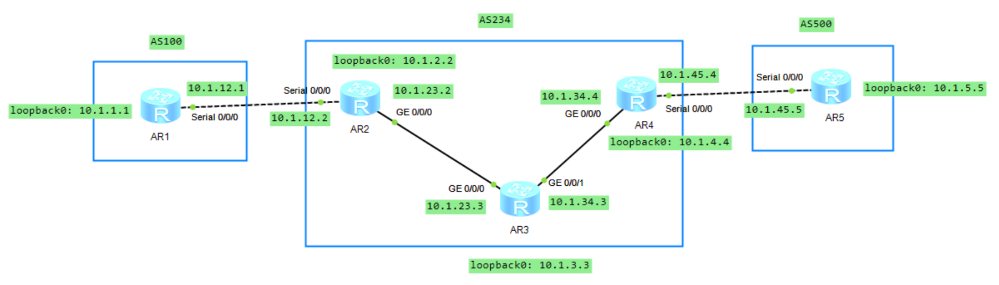

# BGP 属性

## 1.Origin 属性

该属性为公认必遵属性，用来代表 BGP 路由的起源，还用来标记一条路由是如何进入 BGP 中，有以下 3 种类型：

- IGP：通过内部网关协议学习的路由，通过 Network 的方式注入到 BGP 中的路由或者聚合路由，它们的起源属性的数值为 IGP；
- EGP：通过 EGP 学习到的路由，其 origin 属性为 EGP；
- incomplete：表明路径不完整，未知源，一般通过引入（import）路由表里路由的方式到 BGP 的路由或者聚合路由，它们的起源属性为 incomplete。

聚合路由的起源属性可以是 IGP，也可能是 incomplete，这依赖于聚合路由的成员路由的起源属性。如果成员路由的 origin 属性都是 IGP，则聚合路由的起源属性为 IGP；如果成员路由的 origin 属性是 incomplete，则聚合路由的起源属性为 incomplete；而如果有些成员路由是 IGP，而有些成员路由的属性是 incomplete，则生成的聚合路由的起源属性是 incomplete。

origin 类型的 3 个数值之间有优先顺序，**`IGP>EGP>incomplete`**，也就是说从 IGP 学习到的路由优于从 EGP 学到的路由，优于路由引入进 BGP 的路由。我们使用如下的网络拓扑来进行验证：

<div align="center">
    
</div>

我们在 AR2 上进行如下配置：

```java{.line-numbers}
bgp 234
 router-id 2.2.2.2
 peer 10.1.1.1 as-number 100 
 peer 10.1.1.1 ebgp-max-hop 255 
 peer 10.1.1.1 connect-interface LoopBack0
 peer 10.1.3.3 as-number 234 
 peer 10.1.3.3 connect-interface LoopBack0
 peer 10.1.4.4 as-number 234 
 peer 10.1.4.4 connect-interface LoopBack0
 #
 ipv4-family unicast
  undo synchronization
  aggregate 172.16.0.0 255.255.0.0 detail-suppressed 
  aggregate 172.17.0.0 255.255.0.0 detail-suppressed 
  aggregate 172.18.0.0 255.255.0.0 detail-suppressed 
  network 10.1.2.2 255.255.255.255 
  network 172.16.1.0 255.255.255.0 
  network 172.16.2.0 255.255.255.0 
  network 172.18.1.0 255.255.255.0 
  import-route static route-policy STATIC-TO-BGP
  peer 10.1.1.1 enable
  peer 10.1.3.3 enable
  peer 10.1.3.3 next-hop-local 
  peer 10.1.4.4 enable
  peer 10.1.4.4 next-hop-local 
#
ospf 1 router-id 2.2.2.2 
 area 0.0.0.0 
  network 10.1.2.2 0.0.0.0 
  network 10.1.23.0 0.0.0.255 
#
route-policy STATIC-TO-BGP permit node 10 
 if-match ip-prefix INCOMPLETE-MEMBERS 
#
route-policy STATIC-TO-BGP permit node 20 
 if-match ip-prefix MIXED-INCOMPLETE 
#
route-policy STATIC-TO-BGP permit node 30 
 if-match ip-prefix STATIC-PREFIXES 
#
ip ip-prefix STATIC-PREFIXES index 10 permit 192.0.2.0 24
ip ip-prefix INCOMPLETE-MEMBERS index 10 permit 172.17.1.0 24
ip ip-prefix INCOMPLETE-MEMBERS index 20 permit 172.17.2.0 24
ip ip-prefix MIXED-INCOMPLETE index 10 permit 172.18.2.0 24
#
ip route-static 10.1.1.1 255.255.255.255 10.1.12.1
ip route-static 172.16.1.0 255.255.255.0 NULL0
ip route-static 172.16.2.0 255.255.255.0 NULL0
ip route-static 172.17.1.0 255.255.255.0 NULL0
ip route-static 172.17.2.0 255.255.255.0 NULL0
ip route-static 172.18.1.0 255.255.255.0 NULL0
ip route-static 172.18.2.0 255.255.255.0 NULL0
ip route-static 192.0.2.0 255.255.255.0 NULL0
```

AR2 上的 BGP 路由表如下所示：

```java{.line-numbers}
[AR2]display bgp routing-table 
 BGP Local router ID is 2.2.2.2 
 Status codes: * - valid, > - best, d - damped,
               h - history,  i - internal, s - suppressed, S - Stale
               Origin : i - IGP, e - EGP, ? - incomplete
 Total Number of Routes: 11
      Network            NextHop        MED        LocPrf    PrefVal Path/Ogn
 *>   10.1.2.2/32        0.0.0.0         0                     0      i
 *>   172.16.0.0         127.0.0.1                             0      i
 s>   172.16.1.0/24      0.0.0.0         0                     0      i
 s>   172.16.2.0/24      0.0.0.0         0                     0      i
 *>   172.17.0.0         127.0.0.1                             0      ?
 s>   172.17.1.0/24      0.0.0.0         0                     0      ?
 s>   172.17.2.0/24      0.0.0.0         0                     0      ?
 *>   172.18.0.0         127.0.0.1                             0      ?
 s>   172.18.1.0/24      0.0.0.0         0                     0      i
 s>   172.18.2.0/24      0.0.0.0         0                     0      ?
 *>   192.0.2.0          0.0.0.0         0                     0      ?
```

>i 表示由 IGP 学到的路由。e 表示该标识只能手工地调整。由于 EGP 协议几乎没有使用，因此很难看到该标识。? 表示由外部引入到 BGP 的路由。

首先，AR2 使用：

```java{.line-numbers}
network 10.1.2.2 255.255.255.255
```

将本地 Loopback0 的 **`10.1.2.2/32`** 注入 BGP。该路由在 BGP 路由表中显示为 i，即 **`ORIGIN=IGP`**。这是因为通过 BGP network 命令注入的路由，默认 Origin 属性为 IGP。随后，AR2 通过以下配置，将符合路由策略 **`STATIC-TO-BGP`** 的静态路由引入 BGP：

```java{.line-numbers}
import-route static route-policy STATIC-TO-BGP
```

其中，**`192.0.2.0/24`** 匹配 **`STATIC-PREFIXES`**，因此被引入 BGP。该路由在 BGP 表中显示为 ?，即 **`ORIGIN=INCOMPLETE`**。这是因为它并非通过 network 命令产生，而是由 **`import-route static`** 从静态路由表引入 BGP。

对于 **`172.16.0.0/16`** 的聚合实验，AR2 使用如下配置，将 **`172.16.1.0/24`** 和 **`172.16.2.0/24`** 作为成员路由注入 BGP。两条成员路由的 Origin 均为 IGP，因此生成的聚合路由 **`172.16.0.0/16`** 的 Origin 也为 IGP。BGP 表中，成员路由显示为 **`s>`**，表示它们仍是有效的最佳 BGP 路由，但由于配置了 **`detail-suppressed`**，不会向邻居发布，对外发布的是聚合路由 **`172.16.0.0/16`**。

```java{.line-numbers}
network 172.16.1.0 255.255.255.0
network 172.16.2.0 255.255.255.0
aggregate 172.16.0.0 255.255.0.0 detail-suppressed
```

对于 **`172.17.0.0/16`** 的聚合实验，**`172.17.1.0/24`** 和 **`172.17.2.0/24`** 均为静态路由，且分别匹配 **`INCOMPLETE-MEMBERS`** 前缀列表。它们通过 **`import-route static route-policy STATIC-TO-BGP`** 被引入 BGP，因此两条成员路由的 Origin 均为 Incomplete。由于所有成员路由均为 Incomplete，聚合生成的 **`172.17.0.0/16`** 也显示为 ?，即 **`ORIGIN=INCOMPLETE`**。

最后，**`172.18.0.0/16`** 用于验证 IGP 与 Incomplete 成员混合时的聚合结果。其中：

```java{.line-numbers}
network 172.18.1.0 255.255.255.0
```

将 **`172.18.1.0/24`** 注入 BGP，因此它的 Origin 为 IGP；而 **`172.18.2.0/24`** 匹配 **`MIXED-INCOMPLETE`** 前缀列表，通过 **`import-route static route-policy MIXED-TO-BGP`** 引入 BGP，因此它的 Origin 为 Incomplete。因此，聚合路由 **`172.18.0.0/16`** 在 BGP 表中显示为 ?。

## 2.AS_PATH 属性

