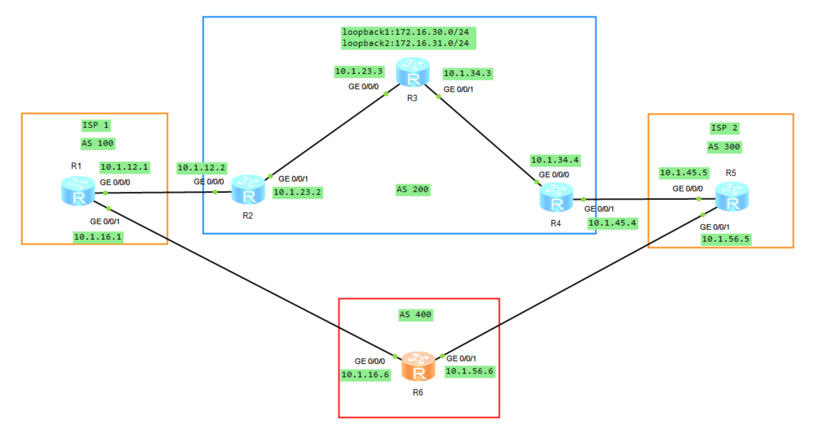

# BGP 属性

## 1.案例 1 使用策略工具调整 **`Local_Pref`** 属性

### 1.1 实验拓扑

如下图所示，AS 300 和 AS 400 分别通告了一条路由 **`100.1.1.0/24`**，该路由传递到 AS 100，由于从两条路径都能收到该路由，在未更改其他属性的情况下，因为 **`AS_PATH`** 长短问题，AS 100 的路由器访问 **`100.1.1.0`** 时会全部经过 AS 400 到达。现要求通过调整 BGP 路径属性来控制 R1、R2、R3 的选路。

<div align="center">
    
</div>

在上述拓扑图中，R1、R2、R3、R4 的 BGP 路由表中关于 **`100.1.1.0`/24** 的路由信息如下：

```java{.line-numbers}
<R1>display bgp routing-table 100.1.1.0
 BGP local router ID : 1.1.1.1
 Local AS number : 100
 Paths:   1 available, 1 best, 1 select
 BGP routing table entry information of 100.1.1.0/24:
 RR-client route.
 From: 10.1.13.3 (3.3.3.3)
 Route Duration: 00h03m41s  
 Relay IP Nexthop: 0.0.0.0
 Relay IP Out-Interface: GigabitEthernet0/0/1
 Original nexthop: 10.1.13.3
 Qos information : 0x0
 AS-path 400, origin igp, MED 0, localpref 100, pref-val 0, valid, internal, best, select, active, pre 255
 Advertised to such 2 peers:
    10.1.12.2
    10.1.13.3

<R2>display bgp routing-table 100.1.1.0
 BGP local router ID : 2.2.2.2
 Local AS number : 100
 Paths:   2 available, 1 best, 1 select
 BGP routing table entry information of 100.1.1.0/24:
 From: 10.1.12.1 (1.1.1.1)
 Route Duration: 01h12m06s  
 Relay IP Nexthop: 10.1.12.1
 Relay IP Out-Interface: GigabitEthernet0/0/0
 Original nexthop: 10.1.13.3
 Qos information : 0x0
 AS-path 400, origin igp, MED 0, localpref 100, pref-val 0, valid, internal, best, select, active, pre 255, IGP cost 2
 Originator:  3.3.3.3
 Cluster list: 0.0.0.100
 Advertised to such 1 peers:
    10.1.24.4
 BGP routing table entry information of 100.1.1.0/24:
 From: 10.1.24.4 (10.1.24.4)
 Route Duration: 01h01m11s  
 Direct Out-interface: GigabitEthernet0/0/1
 Original nexthop: 10.1.24.4
 Qos information : 0x0
 AS-path 200 300, origin igp, pref-val 0, valid, external, pre 255, not preferred for AS-Path
 Not advertised to any peer yet

<R3>display bgp routing-table 100.1.1.0
 BGP local router ID : 3.3.3.3
 Local AS number : 100
 Paths:   1 available, 1 best, 1 select
 BGP routing table entry information of 100.1.1.0/24:
 From: 10.1.36.6 (10.1.36.6)
 Route Duration: 01h28m47s  
 Direct Out-interface: GigabitEthernet0/0/1
 Original nexthop: 10.1.36.6
 Qos information : 0x0
 AS-path 400, origin igp, MED 0, pref-val 0, valid, external, best, select, active, pre 255
 Advertised to such 1 peers:
    10.1.13.1

<R4>display bgp routing-table 100.1.1.0

 BGP local router ID : 10.1.24.4
 Local AS number : 200
 Paths:   2 available, 1 best, 1 select
 BGP routing table entry information of 100.1.1.0/24:
 From: 10.1.45.5 (100.1.1.1)
 Route Duration: 01h01m59s  
 Direct Out-interface: GigabitEthernet0/0/1
 Original nexthop: 10.1.45.5
 Qos information : 0x0
 AS-path 300, origin igp, MED 0, pref-val 0, valid, external, best, select, active, pre 255
 Advertised to such 2 peers:
    10.1.24.2
    10.1.45.5
 BGP routing table entry information of 100.1.1.0/24:
 From: 10.1.24.2 (2.2.2.2)
 Route Duration: 01h13m14s  
 Direct Out-interface: GigabitEthernet0/0/0
 Original nexthop: 10.1.24.2
 Qos information : 0x0
 AS-path 100 400, origin igp, pref-val 0, valid, external, pre 255, not preferred for AS-Path
 Not advertised to any peer yet
```

R1、R2、R3 同属 AS100，其中 R1 为 Route Reflector，R2、R3 均为 RR Client。R3 从 R6（AS400）通过 EBGP 学到 **`100.1.1.0/24`** 后，将该最佳路由通过 IBGP 通告给 R1。R1 再将其反射给另一个 Client R2，但是不再反射给 R3（即发起此路由的客户机）。RR 反射路由时不会修改 **`AS_PATH`**，因此 R2 看到的 **`AS_PATH`** 仍为 400。同时，R1 会加入：

```java{.line-numbers}
Originator_ID : 3.3.3.3
Cluster_List  : 0.0.0.100
```

其中 **`Originator_ID 3.3.3.3`** 表示该 IBGP 路由在 AS100 内最初由 R3 通告；**`Cluster_List 0.0.0.100`** 表示该路由已经经过 Cluster-ID 为 100 的 RR Cluster。**`Originator_ID`** 和 **`Cluster_List`** 均用于防止路由反射环路。因此，对于同一个 **`100.1.1.0/24`**，R2 最终存在两条有效候选路由：

```java{.line-numbers}
经 R1 反射而来：AS_PATH = 400       （IBGP）
经 R4 学到：    AS_PATH = 200 300   （EBGP）
```

在其他更高优先级属性相同的情况下，BGP 先比较 **`AS_PATH`** 长度，之后才比较 EBGP/IBGP 类型。因此 400 的 **`AS_PATH`** 长度为 1，而 200 300 的长度为 2，**`AS_PATH`** 已经决出胜负。R2 选中从 R1 反射来的 IBGP 路由后，不会再把这条路由通告回 R1：**<font color="red">普通 IBGP 路由不能再次通告给其他 IBGP Peer（包括 R1）</font>**，并且默认情况下 BGP 只通告自己的最佳路由。因此，最终稳态下 R1 对 **`100.1.1.0/24`** 只有来自 R3 的这一条最佳路由。

但是，R2 可以把这条 IBGP 学到的最佳路由通告给自己的 EBGP 邻居 R4。R2 向 R4 通告时会在 **`AS_PATH`** 左侧加入本地 AS100，因此 R4 从 R2 收到的路径为：

```java{.line-numbers}
R2 -> R4：AS_PATH = 100 400
R5 -> R4：AS_PATH = 300
```

于是 R4 的 BGP 路由表中存在两条 **`100.1.1.0/24`** 候选路由。由于 300 的 **`AS_PATH`** 长度为 1，而 100 400 的长度为 2，因此 R4 最终选择 经 R5（AS300） 的路由作为最佳路由。

对于 R3 而言，**`100.1.1.0/24`** 是直接从 R6（AS400）通过 EBGP 学到的，因此其路由信息表现为：

```java{.line-numbers}
AS-path          : 400
Original nexthop : 10.1.36.6
Route type       : external, best
```

在本实验最终状态下，R3 没有其他更优候选，因此该 EBGP 路由自然成为最佳路由，并由 R3 通过 IBGP 通告给 RR R1。

### 1.2 需求

现在需求如下所示：

- 只在 R1 上配置；
- 要求 R2 经过 AS 200 到达 **`100.1.1.0`**；
- 要求 R1 和 R3 都经过 AS 400 到达该网段。

修改 **`Local_Pref`** 属性来实现，将 R2 发布给 R1 的路由在入方向调用 route-policy 策略工具，将其发布过来的 **`100.1.1.0`** 路由的 **`Local_Pref`** 值改为 80，将 R3 发布给 R1 的路由在入方向使用同样的方法将 **`Local_Pref`** 值改为 90。具体的配置如下所示：

```java{.line-numbers}
[R1-bgp]display route-policy 
Route-policy : 2TO1
  permit : 10 (matched counts: 2)
    Match clauses : 
      if-match ip-prefix LP
    Apply clauses : 
      apply local-preference 80
  permit : 20 (matched counts: 0)
Route-policy : 3TO1
  permit : 10 (matched counts: 1)
    Match clauses : 
      if-match ip-prefix LP
    Apply clauses : 
      apply local-preference 90
  permit : 20 (matched counts: 0)
```

修改之后，R1-R3 的 BGP 路由表中关于 **`100.1.1.0`/24** 的路由信息如下：

```java{.line-numbers}
<R1>display bgp routing-table 100.1.1.0
    BGP local router ID : 1.1.1.1
    Local AS number : 100
    Paths:   2 available, 1 best, 1 select
    BGP routing table entry information of 100.1.1.0/24:
    RR-client route.
    From: 10.1.13.3 (3.3.3.3)
    Route Duration: 00h57m01s  
    Relay IP Nexthop: 0.0.0.0
    Relay IP Out-Interface: GigabitEthernet0/0/1
    Original nexthop: 10.1.13.3
    Qos information : 0x0
    AS-path 400, origin igp, MED 0, localpref 90, pref-val 0, valid, internal, best, select, active, pre 255
    Advertised to such 2 peers:
      10.1.12.2
      10.1.13.3
    BGP routing table entry information of 100.1.1.0/24:
    RR-client route.
    From: 10.1.12.2 (2.2.2.2)
    Route Duration: 00h31m57s  
    Relay IP Nexthop: 0.0.0.0
    Relay IP Out-Interface: GigabitEthernet0/0/0
    Original nexthop: 10.1.12.2
    Qos information : 0x0
    AS-path 200 300, origin igp, localpref 80, pref-val 0, valid, internal, pre 255, not preferred for Local_Pref
    Not advertised to any peer yet

<R2>display bgp routing-table 100.1.1.0
    BGP local router ID : 2.2.2.2
    Local AS number : 100
    Paths:   2 available, 1 best, 1 select
    BGP routing table entry information of 100.1.1.0/24:
    From: 10.1.24.4 (10.1.24.4)
    Route Duration: 01h03m12s  
    Direct Out-interface: GigabitEthernet0/0/1
    Original nexthop: 10.1.24.4
    Qos information : 0x0
    AS-path 200 300, origin igp, pref-val 0, valid, external, best, select, active, pre 255
    Advertised to such 1 peers:
      10.1.12.1
    BGP routing table entry information of 100.1.1.0/24:
    From: 10.1.12.1 (1.1.1.1)
    Route Duration: 00h57m23s  
    Relay IP Nexthop: 10.1.12.1
    Relay IP Out-Interface: GigabitEthernet0/0/0
    Original nexthop: 10.1.13.3
    Qos information : 0x0
    AS-path 400, origin igp, MED 0, localpref 90, pref-val 0, valid, internal, pre 255, IGP cost 2, not preferred for Local_Pref
    Originator:  3.3.3.3
    Cluster list: 0.0.0.100
    Not advertised to any peer yet

<R3>display bgp routing-table 100.1.1.0
    BGP local router ID : 3.3.3.3
    Local AS number : 100
    Paths:   1 available, 1 best, 1 select
    BGP routing table entry information of 100.1.1.0/24:
    From: 10.1.36.6 (10.1.36.6)
    Route Duration: 01h03m31s  
    Direct Out-interface: GigabitEthernet0/0/1
    Original nexthop: 10.1.36.6
    Qos information : 0x0
    AS-path 400, origin igp, MED 0, pref-val 0, valid, external, best, select, acti
    ve, pre 255
    Advertised to such 1 peers:
      10.1.13.1
```

拓扑中，R1、R2、R3 属于 AS100，R1 为 RR，R2、R3 为 RR Client。**`100.1.1.0/24`** 同时由 AS300 的 R5 和 AS400 的 R6 发布，R1 在两个 IBGP Client 的入方向配置 Route-Policy。这里需要注意的是，**`Local_Pref`** 80、90 是 R1 接收后重写出来的，不是 R2、R3 原始发送的 **`Local_Pref`** 值。

R1 最终参与比较的是：

```java{.line-numbers}
来自 R3：
AS_PATH = 400
Local_Pref = 90 
来自 R2：
AS_PATH = 200 300
Local_Pref = 80
```

BGP 比较 **`Local_Pref`** 早于 AS_PATH，并且数值越大越优，所以 R1 因为 90 > 80 直接选择 R3，最终转发方向为：**`R1->R3->R6->AS400`**。R1 将来自 R3 的路径选为 Best 后，作为 RR 会把它反射给 Client R2。由于属于 AS100 内部的 iBGP/RR 传播，R1 不会把 AS100 加入 AS_PATH，因此 R2 收到的仍是 **`AS_PATH=400、Local_Pref=90`**。

R2 一方面直接从 R4 通过 eBGP 收到 **`AS_PATH=200 300`** 的路由，另一方面从 R1 收到反射路由 **`AS_PATH=400 Local_Pref=90`**。R4 发给 R2 的 eBGP UPDATE 不会携带 **`Local_Pref`** 属性，对于没有显式 **`Local_Pref`** 的 eBGP 路由，R2 本地按照默认值 100 参与选路。因此实际比较是：

```java{.line-numbers}
R4方向：Local_Pref=100，AS_PATH=200 300
R1方向：Local_Pref=90， AS_PATH=400
```

由于 100 > 90，R2 在 **`Local_Pref`** 阶段就选择 R4，形成 **`R2->R4->R5->AS300`** 的路径。

R3 本身直接从 R6 学到 AS400 路径，并按默认 **`Local_Pref`** 100 选择它。R1 即使将该路由反射回来，由于反射路由的 **`Originator_ID`** 就是 R3 自己的 Router-ID，R3 会将其识别为自己的反射路由并丢弃，因此不会形成环路或重新参与选路。

把整个过程连起来看，这个实验真正构造的是一个非常关键的 **`Local_Pref`** 大小关系：R1 从 R2 方向最终使用的 **`Local_Pref`** 为 80，从 R3 方向最终使用的 **`Local_Pref`** 为 90，而外部 eBGP 路由在本地没有被策略修改时按照默认 **`Local_Pref`** 100 处理，即形成 80 < 90 < 100。这三个值分别承担不同作用：90 > 80 保证 R1 在 R2 和 R3 两个 Client 的路径之间选择 R3，从而使 R1 走 AS400。而 100 > 90 又保证 R2 在 R1 反射过来的 AS400 路径和自己直接从 R4 学到的 **`AS200->AS300`** 路径之间选择 R4，从而使 R2 走 **`AS200->AS300`**。R3 则直接保持 AS400 路径。

## 2.调整 prefVal 首选权重值

<div align="center">
    
</div>

场景如下，现要求通过调整 BGP 路径属性来控制 R1、R2、R3 的选路。需求如下：

- 只在 R2 上配置。
- 要求 R2 经过 AS 200 到达 **`100.1.1.0`**。
- 要求 R1 和 R3 都经过 AS 400 到达该网段。

解决方法就是在 R2 上将 R4 通告过来的路由 **`100.1.1.0`** 匹配到后使用 route-policy 工具将 **`PrefVal`** 值修改为 200，修改以后来分析一下 AS 100 中各路由器的选路。R2 上的具体配置如下所示：

```java{.line-numbers}
[R2-bgp]display route-policy 
Route-policy : PrefVal
  permit : 10 (matched counts: 1)
    Match clauses : 
      if-match ip-prefix PrefVal
    Apply clauses : 
      apply preferred-value 200 
  permit : 20 (matched counts: 0)
```

配置完成之后，R1、R2 的 BGP 路由表中关于 **`100.1.1.0`/24** 的路由信息如下：

```java{.line-numbers}
<R1>display bgp routing-table 100.1.1.0
    BGP local router ID : 1.1.1.1
    Local AS number : 100
    Paths:   2 available, 1 best, 1 select
    BGP routing table entry information of 100.1.1.0/24:
    RR-client route.
    From: 10.1.13.3 (3.3.3.3)
    Route Duration: 00h05m34s  
    Relay IP Nexthop: 0.0.0.0
    Relay IP Out-Interface: GigabitEthernet0/0/1
    Original nexthop: 10.1.13.3
    Qos information : 0x0
    AS-path 400, origin igp, MED 0, localpref 100, pref-val 0, valid, internal, best, select, active, pre 255
    Advertised to such 2 peers:
      10.1.13.3
      10.1.12.2
    BGP routing table entry information of 100.1.1.0/24:
    RR-client route.
    From: 10.1.12.2 (2.2.2.2)
    Route Duration: 00h01m01s  
    Relay IP Nexthop: 0.0.0.0
    Relay IP Out-Interface: GigabitEthernet0/0/0
    Original nexthop: 10.1.12.2
    Qos information : 0x0
    AS-path 200 300, origin igp, localpref 100, pref-val 0, valid, internal, pre 255, not preferred for AS-Path
    Not advertised to any peer yet

[R2-bgp]display bgp routing-table 100.1.1.0
    BGP local router ID : 2.2.2.2
    Local AS number : 100
    Paths:   2 available, 1 best, 1 select
    BGP routing table entry information of 100.1.1.0/24:
    From: 10.1.24.4 (10.1.24.4)
    Route Duration: 00h00m31s  
    Direct Out-interface: GigabitEthernet0/0/1
    Original nexthop: 10.1.24.4
    Qos information : 0x0
    AS-path 200 300, origin igp, pref-val 200, valid, external, best, select, active, pre 255
    Advertised to such 1 peers:
      10.1.12.1
    BGP routing table entry information of 100.1.1.0/24:
    From: 10.1.12.1 (1.1.1.1)
    Route Duration: 00h04m49s  
    Relay IP Nexthop: 10.1.12.1
    Relay IP Out-Interface: GigabitEthernet0/0/0
    Original nexthop: 10.1.13.3
    Qos information : 0x0
    AS-path 400, origin igp, MED 0, localpref 100, pref-val 0, valid, internal, pre 255, IGP cost 2, not preferred for PreVal
    Originator:  3.3.3.3
    Cluster list: 0.0.0.100
    Not advertised to any peer yet
```

未修改之前 R1 默认选 R3 作为下一跳，而 R2 修改了 **`PrefVal`** 值并不会影响 R1 的选路，因此 R1 不受影响，依然会选择 R3 作为下一跳。在未修改属性之前，R2 经由 R1 去往目标网络，但是在 R2 上将 R4 通告来的路由改大了 **`PrefVal`** 值，该值在选路规则中位列第一位，最优先比较，因此 R2 将会选择 R4 作为下一跳。R2 修改的 **`PrefVal`** 值也不会影响 R3 的 BGP 选路，因此无需做任何修改，R3 同样会选择 R6 作为下一跳。

## 3.通过策略调整 MED 属性

在下图拓扑中，AS 100 为 ISP1，AS 300 为 ISP2，AS 200 和 AS 400 为某企业通过 BGP 接入到 ISP。AS 200 有两个网段，分别为 **`172.16.30.0/24`** 和 **`172.16.31.0/24`**，通过调整 BGP 路径属性来实现选路。

<div align="center">
    
</div>

由于 R6 从 AS 100 和 AS 300 都能收到两条路由，在属性未做修改的情况下，R6 将选择 R1 作为到达目标网络的下一跳，根据选路规则中的 **`Router_ID`** 属性来决定出是在（R1 优于 R5）。

```java{.line-numbers}
<R6>display bgp routing-table 
 BGP Local router ID is 10.1.16.6 
 Total Number of Routes: 4
      Network            NextHop        MED        LocPrf    PrefVal Path/Ogn
 *>   172.16.30.0/24     10.1.16.1                             0      100 200i
 *                       10.1.56.5                             0      300 200i
 *>   172.16.31.0/24     10.1.16.1                             0      100 200i
 *                       10.1.56.5                             0      300 200i
<R6>display bgp routing-table 172.16.30.0
  BGP local router ID : 10.1.16.6
  Local AS number : 400
  Paths:   2 available, 1 best, 1 select
  BGP routing table entry information of 172.16.30.0/24:
  From: 10.1.16.1 (10.1.12.1)
  Route Duration: 00h08m07s  
  Direct Out-interface: GigabitEthernet0/0/0
  Original nexthop: 10.1.16.1
  Qos information : 0x0
  AS-path 100 200, origin igp, pref-val 0, valid, external, best, select, active, pre 255
  Advertised to such 2 peers:
  10.1.16.1
  10.1.56.5
  BGP routing table entry information of 172.16.30.0/24:
  From: 10.1.56.5 (10.1.45.5)
  Route Duration: 00h08m02s  
  Direct Out-interface: GigabitEthernet0/0/1
  Original nexthop: 10.1.56.5
  Qos information : 0x0
  AS-path 300 200, origin igp, pref-val 0, valid, external, pre 255, not preferred for router ID
  Not advertised to any peer yet
```

现在要实现的需求如下：

- 使用 MED 属性。
- 要求 R6 通过 ISP1 访问 **`172.16.30.0`** 网段。
- 要求 R6 通过 ISP2 访问 **`172.16.31.0`** 网段。

为了影响 R6 的出业务流量，可以在 R6 的入方向或者 R1 和 R5 的出方向来调整路径属性，但是需求中要求只能修改 MED 值来实现，可以通过以下方法来解决。在 R1 向 R6 发布路由时，将 **`172.16.31.0`** 网段匹配到，且在出方向调用 route-policy 策略来修改 MED 值为 100，而 **`172.16.30.0`** 网段采用默认的 MED 值 0。在 R5 向 R6 发布路由的出方向调用 route-policy 策略，将 **`172.16.30.0`** 网段匹配到，且将 MED 值改为 100，而 **`172.16.31.0`** 网段采用默认的 MED 值 0。通过以上方式使得 R6 在访问 **`172.16.30.0`** 网段比较 MED 时，R1 要优于 R5，而访问 **`172.16.31.0`** 网段时，R5 要优于 R1。

在 R1 和 R5 的出方向修改 MED 属性，具体的配置如下所示：

```java{.line-numbers}
[R1-bgp]display route-policy 
Route-policy : SMED
  permit : 10 (matched counts: 1)
    Match clauses : 
      if-match ip-prefix LP2
    Apply clauses : 
      apply cost 100 
  permit : 20 (matched counts: 1)
[R1]ip ip-prefix LP2 index 10 permit 172.16.31.0 24
[R5]display route-policy 
Route-policy : SMED
  permit : 10 (matched counts: 0)
    Match clauses : 
      if-match ip-prefix LP1
    Apply clauses : 
      apply cost 100 
  permit : 20 (matched counts: 0)
[R5]ip ip-prefix LP1 index 10 permit 172.16.30.0 24
```

配置完成之后，R6 的 BGP 路由表如下所示，可以看到，分别将 R1 传递过来的 **`172.16.31.0`** 路由的 MED 值修改成了 100，而将 R5 传递过来的 **`172.16.30.0`** 路由 MED 值改为了 100，但是 R6 仍然选择了 R1 到达网段 **`172.16.31.0`**，MED 值的比较并没有生效。

```java{.line-numbers}
<R6>display bgp routing-table 
 BGP Local router ID is 10.1.16.6 
 Total Number of Routes: 4
      Network            NextHop        MED        LocPrf    PrefVal Path/Ogn
 *>   172.16.30.0/24     10.1.16.1                             0      100 200i
 *                       10.1.56.5       100                   0      300 200i
 *>   172.16.31.0/24     10.1.16.1       100                   0      100 200i
 *                       10.1.56.5                             0      300 200i
```

关于 MED 值属性，**<font color="red">默认情况下路由器只会比较同一个 AS 来的路由条目，不会比较来自不同 AS 的路由</font>**。R6 分别从 AS 100 和 AS 300 接收路由，由于位于不同的 AS，因此是不会参与比较的。需要使用命令 **`compare-different-as-med`** 来比较不同 AS 间的 MED 属性。在 R6 上配置好 **`compare-different-as-med`** 命令，再查看 BGP 路由表，已经选择了正确的路径。

```java{.line-numbers}
[R6-bgp]compare-different-as-med 
[R6-bgp]display bgp routing-table 
 BGP Local router ID is 10.1.16.6 
 Total Number of Routes: 4
      Network            NextHop        MED        LocPrf    PrefVal Path/Ogn
 *>   172.16.30.0/24     10.1.16.1                             0      100 200i
 *                       10.1.56.5       100                   0      300 200i
 *>   172.16.31.0/24     10.1.56.5                             0      300 200i
 *                       10.1.16.1       100                   0      100 200i
```

## 4.通过策略调整 **`AS_PATH`** 属性

<div align="center">
    
</div>

如上图所示，AS 300 和 AS 400 分别通告了一条路由 **`100.1.1.0/24`**，该路由传递到 AS 100，由于从两条路径都能收到该路由，在未更改其他属性的情况下，因为 **`AS_PATH`** 长短问题，AS 100 的路由器访问 **`100.1.1.0`** 时会全部经过 AS 400 到达。现要求通过调整 BGP 路径属性来控制 R1、R2、R3 的选路，需求如下：

- 只能在 R3 上配置。
- 要求 R1 和 R2 经过 AS 200 到达 **`100.1.1.0`** 网络。
- R3 经过 AS 400 到达目标。

在 R3 的入方向应用策略修改 **`AS_PATH`** 属性，将 **`AS_PATH`** 的长度增加一个 AS 号，为了确保 AS 100 中所有路由器到达 **`100.1.1.0`** 网段，AS 号长度相等，那么 R2 将会选择 AS 200 访问。因为 **`AS_PATH`** 长度一致后，将会比较第 7 步，由于是来自 eBGP 的路由，将优于 iBGP。R1 会收到两条路由，下一跳分别为 R2 和 R3，R1 将会选择 R2 访问，在路径比较的时候将会比较到最后一步，选择 **`Router_ID`** 最小的值，因此下一跳会选择 R2。而 R3 也是从 eBGP 收到的路由，因此会选择 AS 400 到达。

