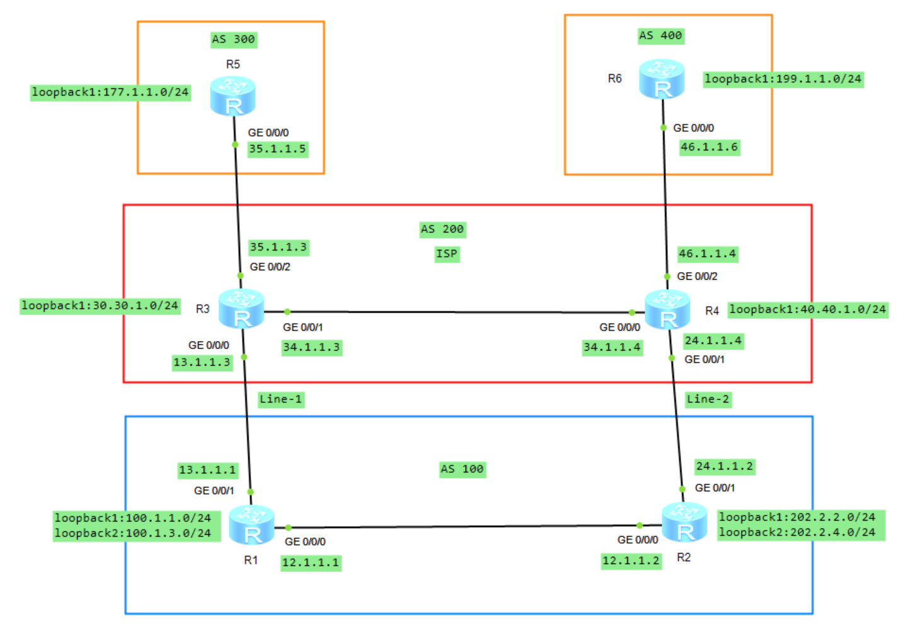
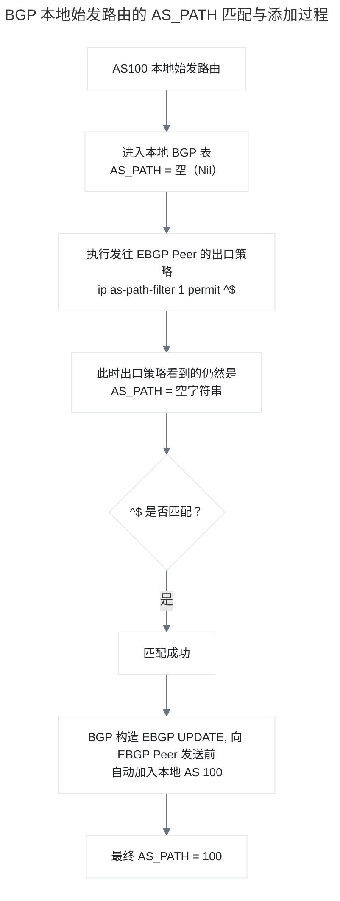
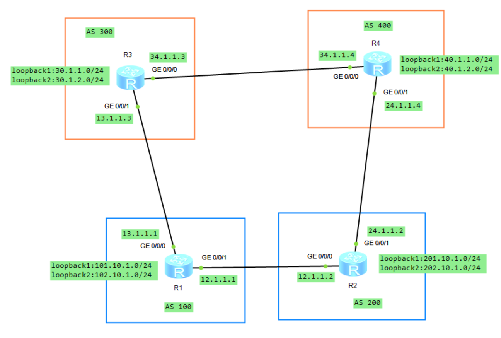

# BGP 属性

## 1.案例 1 使用策略工具调整 **`Local_Pref`** 属性

### 1.1 实验拓扑

如下图所示，AS 300 和 AS 400 分别通告了一条路由 **`100.1.1.0/24`**，该路由传递到 AS 100，由于从两条路径都能收到该路由，在未更改其他属性的情况下，因为 **`AS_PATH`** 长短问题，AS 100 的路由器访问 **`100.1.1.0`** 时会全部经过 AS 400 到达。现要求通过调整 BGP 路径属性来控制 R1、R2、R3 的选路。

<div align="center">
    
</div>

在上述拓扑图中，R1、R2、R3、R4 的 BGP 路由表中关于 **`100.1.1.0`/24** 的路由信息如下：

```java{.line-numbers}
<R1>display bgp routing-table 100.1.1.0
 BGP local router ID : 1.1.1.1
 Local AS number : 100
 Paths:   1 available, 1 best, 1 select
 BGP routing table entry information of 100.1.1.0/24:
 RR-client route.
 From: 10.1.13.3 (3.3.3.3)
 Route Duration: 00h03m41s  
 Relay IP Nexthop: 0.0.0.0
 Relay IP Out-Interface: GigabitEthernet0/0/1
 Original nexthop: 10.1.13.3
 Qos information : 0x0
 AS-path 400, origin igp, MED 0, localpref 100, pref-val 0, valid, internal, best, select, active, pre 255
 Advertised to such 2 peers:
    10.1.12.2
    10.1.13.3

<R2>display bgp routing-table 100.1.1.0
 BGP local router ID : 2.2.2.2
 Local AS number : 100
 Paths:   2 available, 1 best, 1 select
 BGP routing table entry information of 100.1.1.0/24:
 From: 10.1.12.1 (1.1.1.1)
 Route Duration: 01h12m06s  
 Relay IP Nexthop: 10.1.12.1
 Relay IP Out-Interface: GigabitEthernet0/0/0
 Original nexthop: 10.1.13.3
 Qos information : 0x0
 AS-path 400, origin igp, MED 0, localpref 100, pref-val 0, valid, internal, best, select, active, pre 255, IGP cost 2
 Originator:  3.3.3.3
 Cluster list: 0.0.0.100
 Advertised to such 1 peers:
    10.1.24.4
 BGP routing table entry information of 100.1.1.0/24:
 From: 10.1.24.4 (10.1.24.4)
 Route Duration: 01h01m11s  
 Direct Out-interface: GigabitEthernet0/0/1
 Original nexthop: 10.1.24.4
 Qos information : 0x0
 AS-path 200 300, origin igp, pref-val 0, valid, external, pre 255, not preferred for AS-Path
 Not advertised to any peer yet

<R3>display bgp routing-table 100.1.1.0
 BGP local router ID : 3.3.3.3
 Local AS number : 100
 Paths:   1 available, 1 best, 1 select
 BGP routing table entry information of 100.1.1.0/24:
 From: 10.1.36.6 (10.1.36.6)
 Route Duration: 01h28m47s  
 Direct Out-interface: GigabitEthernet0/0/1
 Original nexthop: 10.1.36.6
 Qos information : 0x0
 AS-path 400, origin igp, MED 0, pref-val 0, valid, external, best, select, active, pre 255
 Advertised to such 1 peers:
    10.1.13.1

<R4>display bgp routing-table 100.1.1.0

 BGP local router ID : 10.1.24.4
 Local AS number : 200
 Paths:   2 available, 1 best, 1 select
 BGP routing table entry information of 100.1.1.0/24:
 From: 10.1.45.5 (100.1.1.1)
 Route Duration: 01h01m59s  
 Direct Out-interface: GigabitEthernet0/0/1
 Original nexthop: 10.1.45.5
 Qos information : 0x0
 AS-path 300, origin igp, MED 0, pref-val 0, valid, external, best, select, active, pre 255
 Advertised to such 2 peers:
    10.1.24.2
    10.1.45.5
 BGP routing table entry information of 100.1.1.0/24:
 From: 10.1.24.2 (2.2.2.2)
 Route Duration: 01h13m14s  
 Direct Out-interface: GigabitEthernet0/0/0
 Original nexthop: 10.1.24.2
 Qos information : 0x0
 AS-path 100 400, origin igp, pref-val 0, valid, external, pre 255, not preferred for AS-Path
 Not advertised to any peer yet
```

R1、R2、R3 同属 AS100，其中 R1 为 Route Reflector，R2、R3 均为 RR Client。R3 从 R6（AS400）通过 EBGP 学到 **`100.1.1.0/24`** 后，将该最佳路由通过 IBGP 通告给 R1。R1 再将其反射给另一个 Client R2，但是不再反射给 R3（即发起此路由的客户机）。RR 反射路由时不会修改 **`AS_PATH`**，因此 R2 看到的 **`AS_PATH`** 仍为 400。同时，R1 会加入：

```java{.line-numbers}
Originator_ID : 3.3.3.3
Cluster_List  : 0.0.0.100
```

其中 **`Originator_ID 3.3.3.3`** 表示该 IBGP 路由在 AS100 内最初由 R3 通告；**`Cluster_List 0.0.0.100`** 表示该路由已经经过 Cluster-ID 为 100 的 RR Cluster。**`Originator_ID`** 和 **`Cluster_List`** 均用于防止路由反射环路。因此，对于同一个 **`100.1.1.0/24`**，R2 最终存在两条有效候选路由：

```java{.line-numbers}
经 R1 反射而来：AS_PATH = 400       （IBGP）
经 R4 学到：    AS_PATH = 200 300   （EBGP）
```

在其他更高优先级属性相同的情况下，BGP 先比较 **`AS_PATH`** 长度，之后才比较 EBGP/IBGP 类型。因此 400 的 **`AS_PATH`** 长度为 1，而 200 300 的长度为 2，**`AS_PATH`** 已经决出胜负。R2 选中从 R1 反射来的 IBGP 路由后，不会再把这条路由通告回 R1：**<font color="red">普通 IBGP 路由不能再次通告给其他 IBGP Peer（包括 R1）</font>**，并且默认情况下 BGP 只通告自己的最佳路由。因此，最终稳态下 R1 对 **`100.1.1.0/24`** 只有来自 R3 的这一条最佳路由。

但是，R2 可以把这条 IBGP 学到的最佳路由通告给自己的 EBGP 邻居 R4。R2 向 R4 通告时会在 **`AS_PATH`** 左侧加入本地 AS100，因此 R4 从 R2 收到的路径为：

```java{.line-numbers}
R2 -> R4：AS_PATH = 100 400
R5 -> R4：AS_PATH = 300
```

于是 R4 的 BGP 路由表中存在两条 **`100.1.1.0/24`** 候选路由。由于 300 的 **`AS_PATH`** 长度为 1，而 100 400 的长度为 2，因此 R4 最终选择 经 R5（AS300） 的路由作为最佳路由。

对于 R3 而言，**`100.1.1.0/24`** 是直接从 R6（AS400）通过 EBGP 学到的，因此其路由信息表现为：

```java{.line-numbers}
AS-path          : 400
Original nexthop : 10.1.36.6
Route type       : external, best
```

在本实验最终状态下，R3 没有其他更优候选，因此该 EBGP 路由自然成为最佳路由，并由 R3 通过 IBGP 通告给 RR R1。

### 1.2 需求

现在需求如下所示：

- 只在 R1 上配置；
- 要求 R2 经过 AS 200 到达 **`100.1.1.0`**；
- 要求 R1 和 R3 都经过 AS 400 到达该网段。

修改 **`Local_Pref`** 属性来实现，将 R2 发布给 R1 的路由在入方向调用 route-policy 策略工具，将其发布过来的 **`100.1.1.0`** 路由的 **`Local_Pref`** 值改为 80，将 R3 发布给 R1 的路由在入方向使用同样的方法将 **`Local_Pref`** 值改为 90。具体的配置如下所示：

```java{.line-numbers}
[R1-bgp]display route-policy 
Route-policy : 2TO1
  permit : 10 (matched counts: 2)
    Match clauses : 
      if-match ip-prefix LP
    Apply clauses : 
      apply local-preference 80
  permit : 20 (matched counts: 0)
Route-policy : 3TO1
  permit : 10 (matched counts: 1)
    Match clauses : 
      if-match ip-prefix LP
    Apply clauses : 
      apply local-preference 90
  permit : 20 (matched counts: 0)
```

修改之后，R1-R3 的 BGP 路由表中关于 **`100.1.1.0`/24** 的路由信息如下：

```java{.line-numbers}
<R1>display bgp routing-table 100.1.1.0
    BGP local router ID : 1.1.1.1
    Local AS number : 100
    Paths:   2 available, 1 best, 1 select
    BGP routing table entry information of 100.1.1.0/24:
    RR-client route.
    From: 10.1.13.3 (3.3.3.3)
    Route Duration: 00h57m01s  
    Relay IP Nexthop: 0.0.0.0
    Relay IP Out-Interface: GigabitEthernet0/0/1
    Original nexthop: 10.1.13.3
    Qos information : 0x0
    AS-path 400, origin igp, MED 0, localpref 90, pref-val 0, valid, internal, best, select, active, pre 255
    Advertised to such 2 peers:
      10.1.12.2
      10.1.13.3
    BGP routing table entry information of 100.1.1.0/24:
    RR-client route.
    From: 10.1.12.2 (2.2.2.2)
    Route Duration: 00h31m57s  
    Relay IP Nexthop: 0.0.0.0
    Relay IP Out-Interface: GigabitEthernet0/0/0
    Original nexthop: 10.1.12.2
    Qos information : 0x0
    AS-path 200 300, origin igp, localpref 80, pref-val 0, valid, internal, pre 255, not preferred for Local_Pref
    Not advertised to any peer yet

<R2>display bgp routing-table 100.1.1.0
    BGP local router ID : 2.2.2.2
    Local AS number : 100
    Paths:   2 available, 1 best, 1 select
    BGP routing table entry information of 100.1.1.0/24:
    From: 10.1.24.4 (10.1.24.4)
    Route Duration: 01h03m12s  
    Direct Out-interface: GigabitEthernet0/0/1
    Original nexthop: 10.1.24.4
    Qos information : 0x0
    AS-path 200 300, origin igp, pref-val 0, valid, external, best, select, active, pre 255
    Advertised to such 1 peers:
      10.1.12.1
    BGP routing table entry information of 100.1.1.0/24:
    From: 10.1.12.1 (1.1.1.1)
    Route Duration: 00h57m23s  
    Relay IP Nexthop: 10.1.12.1
    Relay IP Out-Interface: GigabitEthernet0/0/0
    Original nexthop: 10.1.13.3
    Qos information : 0x0
    AS-path 400, origin igp, MED 0, localpref 90, pref-val 0, valid, internal, pre 255, IGP cost 2, not preferred for Local_Pref
    Originator:  3.3.3.3
    Cluster list: 0.0.0.100
    Not advertised to any peer yet

<R3>display bgp routing-table 100.1.1.0
    BGP local router ID : 3.3.3.3
    Local AS number : 100
    Paths:   1 available, 1 best, 1 select
    BGP routing table entry information of 100.1.1.0/24:
    From: 10.1.36.6 (10.1.36.6)
    Route Duration: 01h03m31s  
    Direct Out-interface: GigabitEthernet0/0/1
    Original nexthop: 10.1.36.6
    Qos information : 0x0
    AS-path 400, origin igp, MED 0, pref-val 0, valid, external, best, select, acti
    ve, pre 255
    Advertised to such 1 peers:
      10.1.13.1
```

拓扑中，R1、R2、R3 属于 AS100，R1 为 RR，R2、R3 为 RR Client。**`100.1.1.0/24`** 同时由 AS300 的 R5 和 AS400 的 R6 发布，R1 在两个 IBGP Client 的入方向配置 Route-Policy。这里需要注意的是，**`Local_Pref`** 80、90 是 R1 接收后重写出来的，不是 R2、R3 原始发送的 **`Local_Pref`** 值。

R1 最终参与比较的是：

```java{.line-numbers}
来自 R3：
AS_PATH = 400
Local_Pref = 90 
来自 R2：
AS_PATH = 200 300
Local_Pref = 80
```

BGP 比较 **`Local_Pref`** 早于 AS_PATH，并且数值越大越优，所以 R1 因为 90 > 80 直接选择 R3，最终转发方向为：**`R1->R3->R6->AS400`**。R1 将来自 R3 的路径选为 Best 后，作为 RR 会把它反射给 Client R2。由于属于 AS100 内部的 iBGP/RR 传播，R1 不会把 AS100 加入 AS_PATH，因此 R2 收到的仍是 **`AS_PATH=400、Local_Pref=90`**。

R2 一方面直接从 R4 通过 eBGP 收到 **`AS_PATH=200 300`** 的路由，另一方面从 R1 收到反射路由 **`AS_PATH=400 Local_Pref=90`**。R4 发给 R2 的 eBGP UPDATE 不会携带 **`Local_Pref`** 属性，对于没有显式 **`Local_Pref`** 的 eBGP 路由，R2 本地按照默认值 100 参与选路。因此实际比较是：

```java{.line-numbers}
R4方向：Local_Pref=100，AS_PATH=200 300
R1方向：Local_Pref=90， AS_PATH=400
```

由于 100 > 90，R2 在 **`Local_Pref`** 阶段就选择 R4，形成 **`R2->R4->R5->AS300`** 的路径。

R3 本身直接从 R6 学到 AS400 路径，并按默认 **`Local_Pref`** 100 选择它。R1 即使将该路由反射回来，由于反射路由的 **`Originator_ID`** 就是 R3 自己的 Router-ID，R3 会将其识别为自己的反射路由并丢弃，因此不会形成环路或重新参与选路。

把整个过程连起来看，这个实验真正构造的是一个非常关键的 **`Local_Pref`** 大小关系：R1 从 R2 方向最终使用的 **`Local_Pref`** 为 80，从 R3 方向最终使用的 **`Local_Pref`** 为 90，而外部 eBGP 路由在本地没有被策略修改时按照默认 **`Local_Pref`** 100 处理，即形成 80 < 90 < 100。这三个值分别承担不同作用：90 > 80 保证 R1 在 R2 和 R3 两个 Client 的路径之间选择 R3，从而使 R1 走 AS400。而 100 > 90 又保证 R2 在 R1 反射过来的 AS400 路径和自己直接从 R4 学到的 **`AS200->AS300`** 路径之间选择 R4，从而使 R2 走 **`AS200->AS300`**。R3 则直接保持 AS400 路径。

## 2.案例 2 调整 prefVal 首选权重值

<div align="center">
    
</div>

场景如下，现要求通过调整 BGP 路径属性来控制 R1、R2、R3 的选路。需求如下：

- 只在 R2 上配置。
- 要求 R2 经过 AS 200 到达 **`100.1.1.0`**。
- 要求 R1 和 R3 都经过 AS 400 到达该网段。

解决方法就是在 R2 上将 R4 通告过来的路由 **`100.1.1.0`** 匹配到后使用 route-policy 工具将 **`PrefVal`** 值修改为 200，修改以后来分析一下 AS 100 中各路由器的选路。R2 上的具体配置如下所示：

```java{.line-numbers}
[R2-bgp]display route-policy 
Route-policy : PrefVal
  permit : 10 (matched counts: 1)
    Match clauses : 
      if-match ip-prefix PrefVal
    Apply clauses : 
      apply preferred-value 200 
  permit : 20 (matched counts: 0)
```

配置完成之后，R1、R2 的 BGP 路由表中关于 **`100.1.1.0`/24** 的路由信息如下：

```java{.line-numbers}
<R1>display bgp routing-table 100.1.1.0
    BGP local router ID : 1.1.1.1
    Local AS number : 100
    Paths:   2 available, 1 best, 1 select
    BGP routing table entry information of 100.1.1.0/24:
    RR-client route.
    From: 10.1.13.3 (3.3.3.3)
    Route Duration: 00h05m34s  
    Relay IP Nexthop: 0.0.0.0
    Relay IP Out-Interface: GigabitEthernet0/0/1
    Original nexthop: 10.1.13.3
    Qos information : 0x0
    AS-path 400, origin igp, MED 0, localpref 100, pref-val 0, valid, internal, best, select, active, pre 255
    Advertised to such 2 peers:
      10.1.13.3
      10.1.12.2
    BGP routing table entry information of 100.1.1.0/24:
    RR-client route.
    From: 10.1.12.2 (2.2.2.2)
    Route Duration: 00h01m01s  
    Relay IP Nexthop: 0.0.0.0
    Relay IP Out-Interface: GigabitEthernet0/0/0
    Original nexthop: 10.1.12.2
    Qos information : 0x0
    AS-path 200 300, origin igp, localpref 100, pref-val 0, valid, internal, pre 255, not preferred for AS-Path
    Not advertised to any peer yet

[R2-bgp]display bgp routing-table 100.1.1.0
    BGP local router ID : 2.2.2.2
    Local AS number : 100
    Paths:   2 available, 1 best, 1 select
    BGP routing table entry information of 100.1.1.0/24:
    From: 10.1.24.4 (10.1.24.4)
    Route Duration: 00h00m31s  
    Direct Out-interface: GigabitEthernet0/0/1
    Original nexthop: 10.1.24.4
    Qos information : 0x0
    AS-path 200 300, origin igp, pref-val 200, valid, external, best, select, active, pre 255
    Advertised to such 1 peers:
      10.1.12.1
    BGP routing table entry information of 100.1.1.0/24:
    From: 10.1.12.1 (1.1.1.1)
    Route Duration: 00h04m49s  
    Relay IP Nexthop: 10.1.12.1
    Relay IP Out-Interface: GigabitEthernet0/0/0
    Original nexthop: 10.1.13.3
    Qos information : 0x0
    AS-path 400, origin igp, MED 0, localpref 100, pref-val 0, valid, internal, pre 255, IGP cost 2, not preferred for PreVal
    Originator:  3.3.3.3
    Cluster list: 0.0.0.100
    Not advertised to any peer yet
```

未修改之前 R1 默认选 R3 作为下一跳，而 R2 修改了 **`PrefVal`** 值并不会影响 R1 的选路，因此 R1 不受影响，依然会选择 R3 作为下一跳。在未修改属性之前，R2 经由 R1 去往目标网络，但是在 R2 上将 R4 通告来的路由改大了 **`PrefVal`** 值，该值在选路规则中位列第一位，最优先比较，因此 R2 将会选择 R4 作为下一跳。R2 修改的 **`PrefVal`** 值也不会影响 R3 的 BGP 选路，因此无需做任何修改，R3 同样会选择 R6 作为下一跳。

## 3.案例 3 通过策略调整 MED 属性

在下图拓扑中，AS 100 为 ISP1，AS 300 为 ISP2，AS 200 和 AS 400 为某企业通过 BGP 接入到 ISP。AS 200 有两个网段，分别为 **`172.16.30.0/24`** 和 **`172.16.31.0/24`**，通过调整 BGP 路径属性来实现选路。

<div align="center">
    
</div>

由于 R6 从 AS 100 和 AS 300 都能收到两条路由，在属性未做修改的情况下，R6 将选择 R1 作为到达目标网络的下一跳，根据选路规则中的 **`Router_ID`** 属性来决定出是在（R1 优于 R5）。

```java{.line-numbers}
<R6>display bgp routing-table 
 BGP Local router ID is 10.1.16.6 
 Total Number of Routes: 4
      Network            NextHop        MED        LocPrf    PrefVal Path/Ogn
 *>   172.16.30.0/24     10.1.16.1                             0      100 200i
 *                       10.1.56.5                             0      300 200i
 *>   172.16.31.0/24     10.1.16.1                             0      100 200i
 *                       10.1.56.5                             0      300 200i
<R6>display bgp routing-table 172.16.30.0
  BGP local router ID : 10.1.16.6
  Local AS number : 400
  Paths:   2 available, 1 best, 1 select
  BGP routing table entry information of 172.16.30.0/24:
  From: 10.1.16.1 (10.1.12.1)
  Route Duration: 00h08m07s  
  Direct Out-interface: GigabitEthernet0/0/0
  Original nexthop: 10.1.16.1
  Qos information : 0x0
  AS-path 100 200, origin igp, pref-val 0, valid, external, best, select, active, pre 255
  Advertised to such 2 peers:
  10.1.16.1
  10.1.56.5
  BGP routing table entry information of 172.16.30.0/24:
  From: 10.1.56.5 (10.1.45.5)
  Route Duration: 00h08m02s  
  Direct Out-interface: GigabitEthernet0/0/1
  Original nexthop: 10.1.56.5
  Qos information : 0x0
  AS-path 300 200, origin igp, pref-val 0, valid, external, pre 255, not preferred for router ID
  Not advertised to any peer yet
```

现在要实现的需求如下：

- 使用 MED 属性。
- 要求 R6 通过 ISP1 访问 **`172.16.30.0`** 网段。
- 要求 R6 通过 ISP2 访问 **`172.16.31.0`** 网段。

为了影响 R6 的出业务流量，可以在 R6 的入方向或者 R1 和 R5 的出方向来调整路径属性，但是需求中要求只能修改 MED 值来实现，可以通过以下方法来解决。在 R1 向 R6 发布路由时，将 **`172.16.31.0`** 网段匹配到，且在出方向调用 route-policy 策略来修改 MED 值为 100，而 **`172.16.30.0`** 网段采用默认的 MED 值 0。在 R5 向 R6 发布路由的出方向调用 route-policy 策略，将 **`172.16.30.0`** 网段匹配到，且将 MED 值改为 100，而 **`172.16.31.0`** 网段采用默认的 MED 值 0。通过以上方式使得 R6 在访问 **`172.16.30.0`** 网段比较 MED 时，R1 要优于 R5，而访问 **`172.16.31.0`** 网段时，R5 要优于 R1。

在 R1 和 R5 的出方向修改 MED 属性，具体的配置如下所示：

```java{.line-numbers}
[R1-bgp]display route-policy 
Route-policy : SMED
  permit : 10 (matched counts: 1)
    Match clauses : 
      if-match ip-prefix LP2
    Apply clauses : 
      apply cost 100 
  permit : 20 (matched counts: 1)
[R1]ip ip-prefix LP2 index 10 permit 172.16.31.0 24
[R5]display route-policy 
Route-policy : SMED
  permit : 10 (matched counts: 0)
    Match clauses : 
      if-match ip-prefix LP1
    Apply clauses : 
      apply cost 100 
  permit : 20 (matched counts: 0)
[R5]ip ip-prefix LP1 index 10 permit 172.16.30.0 24
```

配置完成之后，R6 的 BGP 路由表如下所示，可以看到，分别将 R1 传递过来的 **`172.16.31.0`** 路由的 MED 值修改成了 100，而将 R5 传递过来的 **`172.16.30.0`** 路由 MED 值改为了 100，但是 R6 仍然选择了 R1 到达网段 **`172.16.31.0`**，MED 值的比较并没有生效。

```java{.line-numbers}
<R6>display bgp routing-table 
 BGP Local router ID is 10.1.16.6 
 Total Number of Routes: 4
      Network            NextHop        MED        LocPrf    PrefVal Path/Ogn
 *>   172.16.30.0/24     10.1.16.1                             0      100 200i
 *                       10.1.56.5       100                   0      300 200i
 *>   172.16.31.0/24     10.1.16.1       100                   0      100 200i
 *                       10.1.56.5                             0      300 200i
```

关于 MED 值属性，**<font color="red">默认情况下路由器只会比较同一个 AS 来的路由条目，不会比较来自不同 AS 的路由</font>**。R6 分别从 AS 100 和 AS 300 接收路由，由于位于不同的 AS，因此是不会参与比较的。需要使用命令 **`compare-different-as-med`** 来比较不同 AS 间的 MED 属性。在 R6 上配置好 **`compare-different-as-med`** 命令，再查看 BGP 路由表，已经选择了正确的路径。

```java{.line-numbers}
[R6-bgp]compare-different-as-med 
[R6-bgp]display bgp routing-table 
 BGP Local router ID is 10.1.16.6 
 Total Number of Routes: 4
      Network            NextHop        MED        LocPrf    PrefVal Path/Ogn
 *>   172.16.30.0/24     10.1.16.1                             0      100 200i
 *                       10.1.56.5       100                   0      300 200i
 *>   172.16.31.0/24     10.1.56.5                             0      300 200i
 *                       10.1.16.1       100                   0      100 200i
```

## 4.案例 4通过策略调整 **`AS_PATH`** 属性

<div align="center">
    
</div>

如上图所示，AS 300 和 AS 400 分别通告了一条路由 **`100.1.1.0/24`**，该路由传递到 AS 100，由于从两条路径都能收到该路由，在未更改其他属性的情况下，因为 **`AS_PATH`** 长短问题，AS 100 的路由器访问 **`100.1.1.0`** 时会全部经过 AS 400 到达。现要求通过调整 BGP 路径属性来控制 R1、R2、R3 的选路，需求如下：

- 只能在 R3 上配置。
- 要求 R1 和 R2 经过 AS 200 到达 **`100.1.1.0`** 网络。
- R3 经过 AS 400 到达目标。

在 R3 的入方向应用策略修改 **`AS_PATH`** 属性，将 **`AS_PATH`** 的长度增加一个 AS 号。具体的配置如下所示：

```java{.line-numbers}
[R3-bgp]display route-policy 
Route-policy : AP
  permit : 10 (matched counts: 1)
    Match clauses : 
      if-match ip-prefix LP
    Apply clauses : 
      apply as-path 500 additive
  permit : 20 (matched counts: 0)
[R3]display this 
#
ip ip-prefix LP index 10 permit 100.1.1.0 24
```

配置完成之后，R1、R2、R3 的 BGP 路由表中关于 **`100.1.1.0/24`** 的路由信息如下：

```java{.line-numbers}
<R1>display bgp routing-table 100.1.1.0
    BGP local router ID : 1.1.1.1
    Local AS number : 100
    Paths:   2 available, 1 best, 1 select
    BGP routing table entry information of 100.1.1.0/24:
    RR-client route.
    From: 10.1.12.2 (2.2.2.2)
    Route Duration: 00h00m23s  
    Relay IP Nexthop: 0.0.0.0
    Relay IP Out-Interface: GigabitEthernet0/0/0
    Original nexthop: 10.1.12.2
    Qos information : 0x0
    AS-path 200 300, origin igp, localpref 100, pref-val 0, valid, internal, best, select, active, pre 255
    Advertised to such 2 peers:
      10.1.12.2
      10.1.13.3
    BGP routing table entry information of 100.1.1.0/24:
    RR-client route.
    From: 10.1.13.3 (3.3.3.3)
    Route Duration: 00h00m23s  
    Relay IP Nexthop: 0.0.0.0
    Relay IP Out-Interface: GigabitEthernet0/0/1
    Original nexthop: 10.1.13.3
    Qos information : 0x0
    AS-path 500 400, origin igp, MED 0, localpref 100, pref-val 0, valid, internal, pre 255, not preferred for router ID
    Not advertised to any peer yet
<R2>display bgp routing-table 100.1.1.0
    BGP local router ID : 2.2.2.2
    Local AS number : 100
    Paths:   1 available, 1 best, 1 select
    BGP routing table entry information of 100.1.1.0/24:
    From: 10.1.24.4 (10.1.24.4)
    Route Duration: 00h07m21s  
    Direct Out-interface: GigabitEthernet0/0/1
    Original nexthop: 10.1.24.4
    Qos information : 0x0
    AS-path 200 300, origin igp, pref-val 0, valid, external, best, select, active, pre 255
    Advertised to such 1 peers:
      10.1.12.1
[R3]display bgp routing-table 100.1.1.0
    BGP local router ID : 3.3.3.3
    Local AS number : 100
    Paths:   2 available, 1 best, 1 select
    BGP routing table entry information of 100.1.1.0/24:
    From: 10.1.36.6 (10.1.36.6)
    Route Duration: 00h05m22s  
    Direct Out-interface: GigabitEthernet0/0/1
    Original nexthop: 10.1.36.6
    Qos information : 0x0
    AS-path 500 400, origin igp, MED 0, pref-val 0, valid, external, best, select, active, pre 255
    Advertised to such 1 peers:
      10.1.13.1
    BGP routing table entry information of 100.1.1.0/24:
    From: 10.1.13.1 (1.1.1.1)
    Route Duration: 00h05m10s  
    Relay IP Nexthop: 10.1.13.1
    Relay IP Out-Interface: GigabitEthernet0/0/0
    Original nexthop: 10.1.12.2
    Qos information : 0x0
    AS-path 200 300, origin igp, localpref 100, pref-val 0, valid, internal, pre 255, IGP cost 2, not preferred for peer type
    Originator:  2.2.2.2
    Cluster list: 0.0.0.100
    Not advertised to any peer yet
```

配置完成后，R1 同时从两个 RR Client 收到 **`100.1.1.0/24`**。在 R1 上，两条路由的 **`PrefVal`**、**`Local_Pref`** 均相同，**`AS_PATH`** 长度也都是 2，Origin 均为 IGP，两条路由又都是 IBGP 路由，因此继续比较后续 Router ID 属性，因此直接比较 R2、R3 的 **`Router ID：2.2.2.2 < 3.3.3.3`**，最终选择来自 R2 的路径，输出中的 **`not preferred for router ID`** 也证明了这一点。

R1 将 Best 路由向 R2 和 R3 通告。在本实验所使用的 VRP 实现中（如下所示），R1 的确把源自 R2 的 Best 路由反射回了 R2。

```java{.line-numbers}
<R1>display bgp routing-table peer 10.1.12.2 advertised-routes 100.1.1.0 24

 BGP local router ID : 1.1.1.1
 Local AS number : 100
 BGP routing table entry information of 100.1.1.0/24:
 RR-client route.
 From: 10.1.12.2 (2.2.2.2)
 Route Duration: 00h53m35s  
 Relay IP Nexthop: 0.0.0.0
 Relay IP Out-Interface: GigabitEthernet0/0/0
 Original nexthop: 10.1.12.2
 Advertised nexthop: 10.1.12.2
 Qos information : 0x0
 AS-path 200 300, origin igp, localpref 100
 Originator:  2.2.2.2
 Cluster list: 0.0.0.100
```

在 R2 上开启 **`debug bgp all`** 后，可以进一步确认 R2 确实收到了来自 R1 的 UPDATE 报文，报文中携带 **`ORIGINATOR_ID=2.2.2.2`** 和 **`CLUSTER_LIST=0.0.0.100`**。R2 收到该反射路由后，发现 **`ORIGINATOR_ID`** 与自己的 **`BGP Router ID 2.2.2.2`** 完全相同，因此触发 RR 的簇内防环机制，该路由被忽略。从 Debug 中也可以看到设备将该 UPDATE 中对应的 NLRI 按 Withdraw/不可用的方式处理。因此，R2 没有在 BGP 路由表中看到来自 R1 的这条反射路由，并不等于 R2 没有收到 UPDATE。所以 R2 最终仍然只有直接从 R4 学到的 eBGP 路由。

```java{.line-numbers}
<R2> terminal monitor
<R2> terminal debugging
<R2>debugging bgp 10.1.12.1 all
Sep 14 2026 23:22:06.130.2-08:00
R2 RM/6/RMDEBUG:BGP: peer 10.1.12.1 (SockID 7) reads 72 bytes on socket 7.

Sep 14 2026 23:22:06.130.3-08:00
R2 RM/6/RMDEBUG: BGP: Received from 10.1.12.1 (AS Number: 100) (Displaying bytes from 1 to 72)
FF FF FF FF FF FF FF FF FF FF FF FF FF FF FF FF
00 48 02 00 00 00 2D
40 01 01 00
40 02 0A 02 02 00 00 00 C8 00 00 01 2C
40 03 04 0A 01 0C 02
40 05 04 00 00 00 64
80 09 04 02 02 02 02
80 0A 04 00 00 00 64
18 64 01 01

Sep 14 2026 23:22:06.130.4-08:00
R2 RM/6/RMDEBUG: BGP.Public: Error identified while receiving UPDATE message from the peer 10.1.12.1 and ignored. Reason:(ORIGINATORID equal to RouterID).

Sep 14 2026 23:22:06.130.5-08:00
R2 RM/6/RMDEBUG:
BGP: routes in update message need to be processed as withdrawn message due to reason mentioned above.

Sep 14 2026 23:22:06.130.6-08:00 R2 RM/6/RMDEBUG: BGP.Public:
Recv UPDATE from 10.1.12.1 with following destinations:
    Update message length : 72
    MP_reach              : AFI/SAFI 1/1
    Origin                : IGP
    AS Path               : 200 300
    Next Hop              : 0.0.0.0
    Local Pref            : 100
BGP.Public: Recv UPDATE(Withdraw) MSG from 10.1.12.1 for destinations: 100.1.1.0/24
```

另外，根据 RFC 4456，**`ORIGINATOR_ID`** is a new optional, non-transitive BGP attribute of Type code 9. This attribute is 4 bytes long and it will be created by an RR in reflecting a route. This attribute will carry the BGP Identifier of the originator of the route in the local AS. 也就是说，在本实验中，R1 最初从 R2、R3 收到的两条候选路由只是 **`Client->RR`** 的普通 IBGP UPDATE：一条来自 R2，其 Router ID 为 **`2.2.2.2`**；另一条来自 R3，其 Router ID 为 **`3.3.3.3`**。它们此时尚未经历 R1 的反射，因此 R1 本地保存的这两条原始候选路径中没有 **`ORIGINATOR_ID`**。只有当 R1 将所选 Best 路由反射出去时，才会创建 **`ORIGINATOR_ID=2.2.2.2`**。

R3 有 2 条候选路由，两条路由的 **`AS_PATH`** 长度均为 2，Origin 均为 IGP。随后比较 Peer Type，因此 R3 选择从 **`10.1.36.6`** 直接学习到的 eBGP 路由。

修改 **`AS_PATH`** 属性时可以携带两个参数。

- Additive 用于添加 AS 号，可添加多个 AS 号，比如原 AS 号为 **`（200 300）`**，配置 **`apply as-path 500 600 additive`** 命令，则在原 **`AS_PATH`** 添加 AS 两个号，修改后路径为 **`（500, 600, 200, 300）`**。
- Overwrite 用于覆盖前面的 AS 号，比如原 AS 号为 400，而配置 **`apply as-path 500 overwrite`** 命令，则 as-path 列表更改为 **`（500）`**。

## 5.案例 5 客户多归属同一运营商 BGP 部署

如下图所示，某企业两条链路连接同一运营商，其中，R1 和 R2 属于客户 AS 100，R3 与 R4 属于 ISP 为 AS 200，R5 和 R6 分别在 AS 300 和 AS 400 中。Line-1 为 R1 与 R3 的链路（主链路），Line-2 为 R2 与 R4 的链路（备份链路）。

<div align="center">
    
</div>

此时 R1 和 R2 的 BGP 路由表如下所示：

```java{.line-numbers}
<R1>display bgp routing-table
 BGP Local router ID is 1.1.1.1 
 Total Number of Routes: 12
      Network            NextHop        MED        LocPrf    PrefVal Path/Ogn
 *>   30.30.1.0/24       13.1.1.3        0                     0      200i
 * i                     12.1.1.2                   100        0      200i
 *>   40.40.1.0/24       13.1.1.3                              0      200i
 * i                     12.1.1.2        0          100        0      200i
 *>   100.1.1.0/24       0.0.0.0         0                     0      i
 *>   100.1.3.0/24       0.0.0.0         0                     0      i
 *>   177.1.1.0/24       13.1.1.3                              0      200 300i
 * i                     12.1.1.2                   100        0      200 300i
 *>   199.1.1.0          13.1.1.3                              0      200 400i
 * i                     12.1.1.2                   100        0      200 400i
 *>i  202.2.2.0          12.1.1.2        0          100        0      i
 *>i  202.2.4.0          12.1.1.2        0          100        0      i
<R2>display bgp routing-table 
 BGP Local router ID is 2.2.2.2 
 Total Number of Routes: 12
      Network            NextHop        MED        LocPrf    PrefVal Path/Ogn
 *>   30.30.1.0/24       24.1.1.4                              0      200i
 * i                     12.1.1.1        0          100        0      200i
 *>   40.40.1.0/24       24.1.1.4        0                     0      200i
 * i                     12.1.1.1                   100        0      200i
 *>i  100.1.1.0/24       12.1.1.1        0          100        0      i
 *>i  100.1.3.0/24       12.1.1.1        0          100        0      i
 *>   177.1.1.0/24       24.1.1.4                              0      200 300i
 * i                     12.1.1.1                   100        0      200 300i
 *>   199.1.1.0          24.1.1.4                              0      200 400i
 * i                     12.1.1.1                   100        0      200 400i
 *>   202.2.2.0          0.0.0.0         0                     0      i
 *>   202.2.4.0          0.0.0.0         0                     0      i
```

现在需要实现的需求如下：

- 对于所有到达 AS 200 和 AS 300 的出业务流量，AS 100 应该选择 Line-1 链路，如该链路发生故障，应该切换到 Line-2 链路；而到达 AS 400 应该选择 Line-2 链路。
- 进入到 AS 100 的流量应该遵循最优原则，访问 R1 所属的网段应该从 Line-1 进入，访问 R2 所属的网段应该从 Line-2 链路进入。
- 不允许客户的 AS 作为穿越 AS。

对于需求 1，本质上需要影响 AS100 的出业务流量方向，所以可以使用 **`local_pref`** 属性来进行控制。来自 AS 200 和 AS 300 的业务流量，在 AS 100 中看到的 AS-PATH 分别为 **`200`** 和 **`200 300`**。所以 R1 可以从 R3 接收路由的入方向分别使用 **`as-path-filter ^200$`** 和 **`as-path-filter _300$`** 来匹配。对于这些匹配到的来自 AS 200 和 AS 300 的路由，R1 在入方向将其 **`local_pref`** 属性值设置为 200，而来自 AS 400 的路由的 **`local_pref`** 属性值默认为 100。来自 AS 400 的业务流量的 AS-PATH 为 **`200 400`**，所以 R2 可以从 R4 接收路由的入方向使用 **`as-path-filter _400$`** 来匹配，R2 在入方向将其 **`local_pref`** 属性值设置为 200。

对于需求 2，本质上需要影响 AS100 的入业务流量放行，所以可以使用 MED 属性来进行控制。MED 用于向相邻 AS 表达进入本 AS 时优先选择哪个入口，在其他条件相同的情况下，MED 值越小的路径越优。在 R1 的出方向上，可以使用路由策略在 R1 向 R3 通告路由的出方向上，将 R1 **`100.1.1.0/24`** 和 **`100.1.3.0/24`** 网段的 MED 属性值修改为 50，将 R2 **`202.2.2.0/24`** 和 **`202.2.4.0/24`** 网段的 MED 属性值修改为 100。对于 R2 则相反。

对于需求 3，为了防止该现象的发生，在 R1 和 R2 上分别针对 R3 和 R4 的出方向应用 **`as-path-filter`**，该 AS 过滤器通过 **`^$`** 来匹配空 **`AS-PATH`** 号（因为 AS 100 向外通告路由时不会将自己的 AS 号加入进 **`AS_PATH`** 列表中）。此做法用来将仅仅始发于 AS 100 的路由通告给 R3 和 R4，而来自其他 AS 的路由如 **`AS 200`**、**`AS 300`**、**`AS 400`**，在 **`AS_PATH`** 列表中必然会有 AS 号，因此都被拒绝。R3 和 R4 也不会从 R1 和 R2 收到来自 AS 300 或者 AS 400 的路由，即使 ISP 之间链路失效了，AS 100 不会成为穿越 AS。

另外需要注意的是，**`^$ `** 做出方向匹配时，匹配的是路由当前已有的 **`AS_PATH`**，而 eBGP 自动添加本地 AS，是在这条路由通过出口策略、真正生成对外 UPDATE 时发生的。根据华为的文档，**`^$`** 匹配空字符串，即 **`AS_Path`** 为空，通常用来匹配本地始发路由。The apply as-path command takes effect before the local AS number is added when EBGP is used and an export policy is applied. 具体的流程图如下所示：



R1 上的配置如下所示：

```java{.line-numbers}
[R1]display this 
#
ip as-path-filter 1 permit ^$
ip as-path-filter 3 permit ^200$
ip as-path-filter 3 permit _300$
[R1]display acl all
 Total nonempty ACL number is 2 
Basic ACL 2000, 1 rule
 rule 10 permit source 100.1.1.0 0.0.2.0 (4 times matched)
Basic ACL 2001, 1 rule
 rule 10 permit source 202.2.0.0 0.0.6.0 (4 times matched)
[R1]display route-policy 
Route-policy : N1
  permit : 10 (matched counts: 3)
    Match clauses : 
      if-match as-path-filter 3
    Apply clauses : 
      apply local-preference 200
  permit : 20 (matched counts: 1)
Route-policy : N2
  permit : 10 (matched counts: 2)
    Match clauses : 
      if-match acl 2000
    Apply clauses : 
      apply cost 50 
  permit : 20 (matched counts: 2)
    Match clauses : 
      if-match acl 2001
    Apply clauses : 
      apply cost 100 
[R1-bgp]display this 
#
bgp 100
 router-id 1.1.1.1
 peer 12.1.1.2 as-number 100
 peer 13.1.1.3 as-number 200
 #
 ipv4-family unicast
  undo synchronization
  network 100.1.1.0 255.255.255.0
  network 100.1.3.0 255.255.255.0
  peer 12.1.1.2 next-hop-local
  peer 13.1.1.3 as-path-filter 1 export
  peer 13.1.1.3 route-policy N1 import
  peer 13.1.1.3 route-policy N2 export
```

R2 上的配置如下所示：

```java{.line-numbers}
[R2]display this 
#
ip as-path-filter 1 permit ^$
ip as-path-filter 4 permit _400$
[R2]display acl all
 Total nonempty ACL number is 2 
Basic ACL 2000, 1 rule
 rule 10 permit source 202.2.0.0 0.0.6.0 (4 times matched)
Basic ACL 2001, 1 rule
 rule 10 permit source 100.1.1.0 0.0.2.0 (4 times matched)
[R2]display route-policy 
Route-policy : N1
  permit : 10 (matched counts: 1)
    Match clauses : 
      if-match as-path-filter 4
    Apply clauses : 
      apply local-preference 200
  permit : 20 (matched counts: 3)
Route-policy : N2
  permit : 10 (matched counts: 2)
    Match clauses : 
      if-match acl 2000
    Apply clauses : 
      apply cost 50 
  permit : 20 (matched counts: 2)
    Match clauses : 
      if-match acl 2001
    Apply clauses : 
      apply cost 100 
[R2-bgp]display this 
#
bgp 100
 router-id 2.2.2.2
 peer 12.1.1.1 as-number 100
 peer 24.1.1.4 as-number 200
 #
 ipv4-family unicast
  undo synchronization
  network 202.2.2.0
  network 202.2.4.0
  peer 12.1.1.1 next-hop-local
  peer 24.1.1.4 as-path-filter 1 export
  peer 24.1.1.4 route-policy N1 import
  peer 24.1.1.4 route-policy N2 export
```

R1 和 R2 的 BGP 路由表如下所示，可以看出 R1 到达 AS 200 和 AS 300 都选择通过 R3 转发，且本地优先级都被修改为 200，而 R2 也将选择 R1 去往 AS 200 和 AS 300，因为 Line-1 为主链路。但去往 AS 400 中的路由，R1 和 R2 都选择 了 Line-2 链路。

```java{.line-numbers}
<R1>display bgp routing-table 
 BGP Local router ID is 1.1.1.1 
 Total Number of Routes: 9
      Network            NextHop        MED        LocPrf    PrefVal Path/Ogn
 *>   30.30.1.0/24       13.1.1.3        0          200        0      200i
 *>   40.40.1.0/24       13.1.1.3                   200        0      200i
 *>   100.1.1.0/24       0.0.0.0         0                     0      i
 *>   100.1.3.0/24       0.0.0.0         0                     0      i
 *>   177.1.1.0/24       13.1.1.3                   200        0      200 300i
 *>i  199.1.1.0          12.1.1.2                   200        0      200 400i
 *                       13.1.1.3                              0      200 400i
 *>i  202.2.2.0          12.1.1.2        0          100        0      i
 *>i  202.2.4.0          12.1.1.2        0          100        0      i
[R2-bgp]display bgp routing-table 
 BGP Local router ID is 2.2.2.2 
 Total Number of Routes: 11
      Network            NextHop        MED        LocPrf    PrefVal Path/Ogn
 *>i  30.30.1.0/24       12.1.1.1        0          200        0      200i
 *                       24.1.1.4                              0      200i
 *>i  40.40.1.0/24       12.1.1.1                   200        0      200i
 *                       24.1.1.4        0                     0      200i
 *>i  100.1.1.0/24       12.1.1.1        0          100        0      i
 *>i  100.1.3.0/24       12.1.1.1        0          100        0      i
 *>i  177.1.1.0/24       12.1.1.1                   200        0      200 300i
 *                       24.1.1.4                              0      200 300i
 *>   199.1.1.0          24.1.1.4                   200        0      200 400i
 *>   202.2.2.0          0.0.0.0         0                     0      i
 *>   202.2.4.0          0.0.0.0         0                     0      i
```

R3 和 R4 的 BGP 路由表如下所示，R3 的 BGP 表中可以看到去往 R1 上的路由从 Line-1 链路进入，且 MED 值修改为 50，去往 R2 上的路由经过 Line-2 链路进入，R4 去往 R1 上的路由从 Line-1 链路进入，去往 R2 从 Line-2 链路进入。

```java{.line-numbers}
<R3>display bgp routing-table 
 BGP Local router ID is 3.3.3.3 
 Total Number of Routes: 10
      Network            NextHop        MED        LocPrf    PrefVal Path/Ogn
 *>   30.30.1.0/24       0.0.0.0         0                     0      i
 *>i  40.40.1.0/24       34.1.1.4        0          100        0      i
 *>   100.1.1.0/24       13.1.1.1        50                    0      100i
 *>   100.1.3.0/24       13.1.1.1        50                    0      100i
 *>   177.1.1.0/24       35.1.1.5        0                     0      300i
 *>i  199.1.1.0          34.1.1.4        0          100        0      400i
 *>i  202.2.2.0          34.1.1.4        50         100        0      100i
 *                       13.1.1.1        100                   0      100i
 *>i  202.2.4.0          34.1.1.4        50         100        0      100i
 *                       13.1.1.1        100                   0      100i
<R4>display bgp routing-table 
 BGP Local router ID is 4.4.4.4 
 Total Number of Routes: 10
      Network            NextHop        MED        LocPrf    PrefVal Path/Ogn
 *>i  30.30.1.0/24       34.1.1.3        0          100        0      i
 *>   40.40.1.0/24       0.0.0.0         0                     0      i
 *>i  100.1.1.0/24       34.1.1.3        50         100        0      100i
 *                       24.1.1.2        100                   0      100i
 *>i  100.1.3.0/24       34.1.1.3        50         100        0      100i
 *                       24.1.1.2        100                   0      100i
 *>i  177.1.1.0/24       34.1.1.3        0          100        0      300i
 *>   199.1.1.0          46.1.1.6        0                     0      400i
 *>   202.2.2.0          24.1.1.2        50                    0      100i
 *>   202.2.4.0          24.1.1.2        50                    0      100i
```

## 6.案例 6 不同运营商的客户间互为主备

如下图所示，分别隶属于 AS100 和 AS200 的两家客户设备 R1 和 R2 分别连接着不同运营商设备 R3 和 R4。

<div align="center">
    
</div>

现在需要实现的需求如下所示：

- 对于客户的出业务流量：客户 AS（AS100 和 AS200）访问运营商时，AS100 选择从 ISP1 访问，AS200 选择从 ISP2 访问。但是当 Line-1 和 Line-2 链路发生故障时，客户 AS 之间能够互为备份。
- 对于客户的入业务流量：ISP1 选择经过 Line-1 链路进入到 AS100，而 ISP2 选择经过 Line-2 链路进入到 AS200。ISP1 访问 AS200 需要经过 ISP2，而不能将 AS100 作为穿越的 AS。同理，ISP2 访问 AS100 需要经过 ISP1 访问。
- 如果 ISP1 与 ISP2 之间的链路出现故障，客户的 AS 能够互为备份，以实现冗余。

R1 上的配置如下所示：

```java{.line-numbers}
#
bgp 100
 router-id 1.1.1.1
 peer 12.1.1.2 as-number 200 
 peer 13.1.1.3 as-number 300 
 #
 ipv4-family unicast
  undo synchronization
  network 101.10.1.0 255.255.255.0 
  network 102.10.1.0 255.255.255.0 
  peer 12.1.1.2 enable
  peer 13.1.1.3 enable
  peer 13.1.1.3 as-path-filter 1 export 
  peer 13.1.1.3 route-policy SET_PrefVal import
  peer 13.1.1.3 route-policy SET_COM export
  peer 13.1.1.3 advertise-community
#
route-policy SET_COM permit node 10 
 if-match as-path-filter 2 
 apply community 200:200 
#
route-policy SET_COM permit node 20 
#
route-policy SET_PrefVal permit node 20 
 if-match as-path-filter 3 
 apply preferred-value 150
#
route-policy SET_PrefVal permit node 30 
#
ip as-path-filter 1 permit ^$
ip as-path-filter 1 permit ^200$
ip as-path-filter 2 permit ^200$
ip as-path-filter 3 permit _400$
```

R2 上的配置如下所示：

```java{.line-numbers}
#
bgp 200
 router-id 2.2.2.2
 peer 12.1.1.1 as-number 100 
 peer 24.1.1.4 as-number 400 
 #
 ipv4-family unicast
  undo synchronization
  network 201.10.1.0 
  network 202.10.1.0 
  peer 12.1.1.1 enable
  peer 24.1.1.4 enable
  peer 24.1.1.4 as-path-filter 1 export 
  peer 24.1.1.4 route-policy SET_PrefVal import
  peer 24.1.1.4 route-policy SET_COM export
  peer 24.1.1.4 advertise-community
#
route-policy SET_COM permit node 10 
 if-match as-path-filter 2 
 apply community 100:100 
#
route-policy SET_COM permit node 20 
#
route-policy SET_PrefVal permit node 10 
 if-match as-path-filter 3 
 apply preferred-value 150
#
route-policy SET_PrefVal permit node 20 
#
ip as-path-filter 1 permit ^$
ip as-path-filter 1 permit ^100$
ip as-path-filter 2 permit ^100$
ip as-path-filter 3 permit _300$
```

R3 上的配置如下所示：

```java{.line-numbers}
#
bgp 300
 router-id 3.3.3.3
 peer 13.1.1.1 as-number 100 
 peer 34.1.1.4 as-number 400 
 #
 ipv4-family unicast
  undo synchronization
  network 30.1.1.0 255.255.255.0 
  network 30.1.2.0 255.255.255.0 
  peer 13.1.1.1 enable
  peer 13.1.1.1 route-policy SET_LP import
  peer 34.1.1.4 enable
#
route-policy SET_LP permit node 10 
 if-match community-filter 1 
 apply local-preference 50 
#
route-policy SET_LP permit node 20 
#
ip community-filter 1 permit 200:200
```

R4 上的配置如下所示：

```java{.line-numbers}
#
bgp 400
 router-id 4.4.4.4
 peer 24.1.1.2 as-number 200 
 peer 34.1.1.3 as-number 300 
 #
 ipv4-family unicast
  undo synchronization
  network 40.1.1.0 255.255.255.0 
  network 40.1.2.0 255.255.255.0 
  peer 24.1.1.2 enable
  peer 24.1.1.2 route-policy SET_LP import
  peer 34.1.1.3 enable
#
route-policy SET_LP permit node 19 
 if-match community-filter 1 
 apply local-preference 50 
#
route-policy SET_LP permit node 20 
#
ip community-filter 1 permit 100:100
```

针对出业务流量，在 R1 上使用路由策略 **`SET_PrefVal`** 来调整首选权值，在 node10 中匹配了 **`as-path-filter3`**，**<font color="red">该路径过滤器匹配到了源自 AS400 的流量</font>**，将其首选权值调整为 150，node20 放行其他路由。由于从 R2 也可以访问到 AS400，为了防止从客户之间穿越，优先选择从 AS300 去往 AS400，修改后的首选权值相比默认的要更大，因此 R1 将会选择从 AS300 转发数据流到 AS400。

**<font color="red">R2 同样也使用了路由策略 **`SET_PrefVal`** 策略调整源自 AS300 的路由</font>**，使其优先选择经过 AS400 去往 AS300。当 **`Line-1`** 和 **`Line-2`** 链路出现故障能够满足冗余时，R1 和 R2 之间的链路可以作为备份链路。R1 和 R2 的路由表如下所示，R1 到达 AS400 的网段 **`40.1.1.0/24`**、**`40.1.2.0/24`** 首选权值设置为 150，优先选择从 ISP1 转发。R2 到达 AS300 的网段 **`30.1.1.0/24`**、**`30.1.2.0/24`** 首选权值设置为 150，优先选择从 ISP2 转发。并且 R1 和 R2 到达 AS300 和 AS400 始终有 2 条候选路径，当 Line-1 或者 Line-2 链路出现故障时，客户的 AS 能够互为备份。

```java{.line-numbers}
[R1]display bgp routing-table 
 BGP Local router ID is 1.1.1.1 
 Total Number of Routes: 14
      Network            NextHop        MED        LocPrf    PrefVal Path/Ogn
 *>   30.1.1.0/24        13.1.1.3        0                     0      300i
 *                       12.1.1.2                              0      200 400 300i
 *>   30.1.2.0/24        13.1.1.3        0                     0      300i
 *                       12.1.1.2                              0      200 400 300i
 *>   40.1.1.0/24        13.1.1.3                              150    300 400i
 *                       12.1.1.2                              0      200 400i
 *>   40.1.2.0/24        13.1.1.3                              150    300 400i
 *                       12.1.1.2                              0      200 400i
 *>   101.10.1.0/24      0.0.0.0         0                     0      i
 *>   102.10.1.0/24      0.0.0.0         0                     0      i
 *>   201.10.1.0         12.1.1.2        0                     0      200i
 *                       13.1.1.3                              0      300 400 200i
 *>   202.10.1.0         12.1.1.2        0                     0      200i
 *                       13.1.1.3                              0      300 400 200i
<R2>display bgp routing-table 
 BGP Local router ID is 2.2.2.2 
 Total Number of Routes: 14
      Network            NextHop        MED        LocPrf    PrefVal Path/Ogn
 *>   30.1.1.0/24        24.1.1.4                              150    400 300i
 *                       12.1.1.1                              0      100 300i
 *>   30.1.2.0/24        24.1.1.4                              150    400 300i
 *                       12.1.1.1                              0      100 300i
 *>   40.1.1.0/24        24.1.1.4        0                     0      400i
 *                       12.1.1.1                              0      100 300 400i
 *>   40.1.2.0/24        24.1.1.4        0                     0      400i
 *                       12.1.1.1                              0      100 300 400i
 *>   101.10.1.0/24      12.1.1.1        0                     0      100i
 *                       24.1.1.4                              0      400 300 100i
 *>   102.10.1.0/24      12.1.1.1        0                     0      100i
 *                       24.1.1.4                              0      400 300 100i
 *>   201.10.1.0         0.0.0.0         0                     0      i
 *>   202.10.1.0         0.0.0.0         0                     0      i
```

针对入业务流量，ISP1 需要经过 Line-1 链路访问 AS100，ISP2 需要经过 Line-2 链路访问 AS200。在 R1 上使用路由策略 **`SET_COMMUNITY`** 修改团体属性，在 node10 中匹配了 **`as-path-filter2`**，该路径过滤器匹配到了源自 AS200 的路由，将其团体属性设置为 **`200:200`**，node20 放行其他路由，不做任何设置。在 R2 上同样使用路由策略 **`SET_COMMUNITY`** 修改团体属性，将源自 AS100 路由的团体属性设置为 **`100:100`**。此做法目的是为了能够让 ISP1 和 ISP2 收到路由后根据所设置的团体属性来调整路由。

为了保证 ISP 之间不能选择客户的 AS 作为穿越 AS，分别在 R1 和 R2 上使用路径过滤器 **`as-path-filter1`**，该路径过滤器仅允许了 AS100，AS200 的路由通告给 ISP，而不能将 ISP 的流量穿过客户的 AS 再次通告给对方 ISP。例如，ISP1 访问 ISP2 不能选择经过 AS100、AS200 去访问。

在 R3 上通过路由策略 **`SET_LP`** 匹配到 **`community-filter1`**，在该团体属性过滤列表中匹配到团体属性为 **`200:200`**，也就是匹配了所有 AS200 的路由。通过路由策略 **`node10`** 中，将本地优先级调整为 50，node20 放行其他路由，不做任何设置。**<font color="red">由于 R3 分别可以从 R1 和 R4 去访问 AS200，但是从 R1 来的关于 AS200 的路由被调整了本地优先级为 50，而 R3 从 R4 收到的路由本地优先级未做修改，默认为 100，因此 R3 将会优先选择 AS400 去访问 AS200</font>**。针对其他的路由，比如 AS100 的路由仍然选择 R1 访问，由于 **`AS_PATH`** 路径长度的问题。在 R4 上同样通过路由策略 **`SET_LP`**，将 R2 传递给 R4 的关于 AS100 的路由本地优先级修改为 50，那么 R4 将会优先选择 R3 去访问 AS100，而访问 AS200 直接通过 R2 访问。

R3 和 R4 的 BGP 路由表如下所示，R3 到达 AS200 的路由优先选择从 ISP2 转发，并且到达 AS200 有 2 条候选路径，而访问 AS100 优先选择从 ISP1 转发。R4 到达 AS100 的路由优先选择从 ISP1 转发，并且到达 AS100 有 2 条候选路径，而访问 AS200 的路由优先选择从 ISP2 转发。所以当 ISP1 与 ISP2 之间的链路出现故障，客户的 AS 能够互为备份，以实现冗余。

```java{.line-numbers}
<R3>display bgp routing-table 
 BGP Local router ID is 3.3.3.3 
 Total Number of Routes: 10
      Network            NextHop        MED        LocPrf    PrefVal Path/Ogn
 *>   30.1.1.0/24        0.0.0.0         0                     0      i
 *>   30.1.2.0/24        0.0.0.0         0                     0      i
 *>   40.1.1.0/24        34.1.1.4        0                     0      400i
 *>   40.1.2.0/24        34.1.1.4        0                     0      400i
 *>   101.10.1.0/24      13.1.1.1        0                     0      100i
 *>   102.10.1.0/24      13.1.1.1        0                     0      100i
 *>   201.10.1.0         34.1.1.4                              0      400 200i
 *                       13.1.1.1                   50         0      100 200i
 *>   202.10.1.0         34.1.1.4                              0      400 200i
 *                       13.1.1.1                   50         0      100 200i
<R4>display bgp routing-table 
 BGP Local router ID is 4.4.4.4 
 Total Number of Routes: 10
      Network            NextHop        MED        LocPrf    PrefVal Path/Ogn
 *>   30.1.1.0/24        34.1.1.3        0                     0      300i
 *>   30.1.2.0/24        34.1.1.3        0                     0      300i
 *>   40.1.1.0/24        0.0.0.0         0                     0      i
 *>   40.1.2.0/24        0.0.0.0         0                     0      i
 *>   101.10.1.0/24      34.1.1.3                              0      300 100i
 *                       24.1.1.2                   50         0      200 100i
 *>   102.10.1.0/24      34.1.1.3                              0      300 100i
 *                       24.1.1.2                   50         0      200 100i
 *>   201.10.1.0         24.1.1.2        0                     0      200i
 *>   202.10.1.0         24.1.1.2        0                     0      200i
```