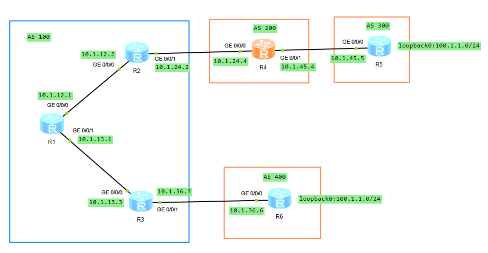

# BGP 属性

## 1.案例 1 使用策略工具调整 **`Local_Pref`** 属性

### 1.1 实验拓扑

如下图所示，AS 300 和 AS 400 分别通告了一条路由 **`100.1.1.0/24`**，该路由传递到 AS 100，由于从两条路径都能收到该路由，在未更改其他属性的情况下，因为 **`AS_PATH`** 长短问题，AS 100 的路由器访问 **`100.1.1.0`** 时会全部经过 AS 400 到达。现要求通过调整 BGP 路径属性来控制 R1、R2、R3 的选路。

<div align="center">
    
</div>

在上述拓扑图中，R1、R2、R3、R4 的 BGP 路由表中关于 **`100.1.1.0`/24** 的路由信息如下：

```java{.line-numbers}
<R1>display bgp routing-table 100.1.1.0
 BGP local router ID : 1.1.1.1
 Local AS number : 100
 Paths:   1 available, 1 best, 1 select
 BGP routing table entry information of 100.1.1.0/24:
 RR-client route.
 From: 10.1.13.3 (3.3.3.3)
 Route Duration: 00h03m41s  
 Relay IP Nexthop: 0.0.0.0
 Relay IP Out-Interface: GigabitEthernet0/0/1
 Original nexthop: 10.1.13.3
 Qos information : 0x0
 AS-path 400, origin igp, MED 0, localpref 100, pref-val 0, valid, internal, best, select, active, pre 255
 Advertised to such 2 peers:
    10.1.12.2
    10.1.13.3

<R2>display bgp routing-table 100.1.1.0
 BGP local router ID : 2.2.2.2
 Local AS number : 100
 Paths:   2 available, 1 best, 1 select
 BGP routing table entry information of 100.1.1.0/24:
 From: 10.1.12.1 (1.1.1.1)
 Route Duration: 01h12m06s  
 Relay IP Nexthop: 10.1.12.1
 Relay IP Out-Interface: GigabitEthernet0/0/0
 Original nexthop: 10.1.13.3
 Qos information : 0x0
 AS-path 400, origin igp, MED 0, localpref 100, pref-val 0, valid, internal, best, select, active, pre 255, IGP cost 2
 Originator:  3.3.3.3
 Cluster list: 0.0.0.100
 Advertised to such 1 peers:
    10.1.24.4
 BGP routing table entry information of 100.1.1.0/24:
 From: 10.1.24.4 (10.1.24.4)
 Route Duration: 01h01m11s  
 Direct Out-interface: GigabitEthernet0/0/1
 Original nexthop: 10.1.24.4
 Qos information : 0x0
 AS-path 200 300, origin igp, pref-val 0, valid, external, pre 255, not preferred for AS-Path
 Not advertised to any peer yet

<R3>display bgp routing-table 100.1.1.0
 BGP local router ID : 3.3.3.3
 Local AS number : 100
 Paths:   1 available, 1 best, 1 select
 BGP routing table entry information of 100.1.1.0/24:
 From: 10.1.36.6 (10.1.36.6)
 Route Duration: 01h28m47s  
 Direct Out-interface: GigabitEthernet0/0/1
 Original nexthop: 10.1.36.6
 Qos information : 0x0
 AS-path 400, origin igp, MED 0, pref-val 0, valid, external, best, select, active, pre 255
 Advertised to such 1 peers:
    10.1.13.1

<R4>display bgp routing-table 100.1.1.0

 BGP local router ID : 10.1.24.4
 Local AS number : 200
 Paths:   2 available, 1 best, 1 select
 BGP routing table entry information of 100.1.1.0/24:
 From: 10.1.45.5 (100.1.1.1)
 Route Duration: 01h01m59s  
 Direct Out-interface: GigabitEthernet0/0/1
 Original nexthop: 10.1.45.5
 Qos information : 0x0
 AS-path 300, origin igp, MED 0, pref-val 0, valid, external, best, select, active, pre 255
 Advertised to such 2 peers:
    10.1.24.2
    10.1.45.5
 BGP routing table entry information of 100.1.1.0/24:
 From: 10.1.24.2 (2.2.2.2)
 Route Duration: 01h13m14s  
 Direct Out-interface: GigabitEthernet0/0/0
 Original nexthop: 10.1.24.2
 Qos information : 0x0
 AS-path 100 400, origin igp, pref-val 0, valid, external, pre 255, not preferred for AS-Path
 Not advertised to any peer yet
```

R1、R2、R3 同属 AS100，其中 R1 为 Route Reflector，R2、R3 均为 RR Client。R3 从 R6（AS400）通过 EBGP 学到 **`100.1.1.0/24`** 后，将该最佳路由通过 IBGP 通告给 R1。R1 再将其反射给另一个 Client R2，但是不再反射给 R3（即发起此路由的客户机）。RR 反射路由时不会修改 **`AS_PATH`**，因此 R2 看到的 **`AS_PATH`** 仍为 400。同时，R1 会加入：

```java{.line-numbers}
Originator_ID : 3.3.3.3
Cluster_List  : 0.0.0.100
```

其中 **`Originator_ID 3.3.3.3`** 表示该 IBGP 路由在 AS100 内最初由 R3 通告；**`Cluster_List 0.0.0.100`** 表示该路由已经经过 Cluster-ID 为 100 的 RR Cluster。**`Originator_ID`** 和 **`Cluster_List`** 均用于防止路由反射环路。因此，对于同一个 **`100.1.1.0/24`**，R2 最终存在两条有效候选路由：

```java{.line-numbers}
经 R1 反射而来：AS_PATH = 400       （IBGP）
经 R4 学到：    AS_PATH = 200 300   （EBGP）
```

在其他更高优先级属性相同的情况下，BGP 先比较 **`AS_PATH`** 长度，之后才比较 EBGP/IBGP 类型。因此 400 的 **`AS_PATH`** 长度为 1，而 200 300 的长度为 2，**`AS_PATH`** 已经决出胜负。R2 选中从 R1 反射来的 IBGP 路由后，不会再把这条路由通告回 R1：**<font color="red">普通 IBGP 路由不能再次通告给其他 IBGP Peer（包括 R1）</font>**，并且默认情况下 BGP 只通告自己的最佳路由。因此，最终稳态下 R1 对 **`100.1.1.0/24`** 只有来自 R3 的这一条最佳路由。

但是，R2 可以把这条 IBGP 学到的最佳路由通告给自己的 EBGP 邻居 R4。R2 向 R4 通告时会在 **`AS_PATH`** 左侧加入本地 AS100，因此 R4 从 R2 收到的路径为：

```java{.line-numbers}
R2 -> R4：AS_PATH = 100 400
R5 -> R4：AS_PATH = 300
```

于是 R4 的 BGP 路由表中存在两条 **`100.1.1.0/24`** 候选路由。由于 300 的 **`AS_PATH`** 长度为 1，而 100 400 的长度为 2，因此 R4 最终选择 经 R5（AS300） 的路由作为最佳路由。

对于 R3 而言，**`100.1.1.0/24`** 是直接从 R6（AS400）通过 EBGP 学到的，因此其路由信息表现为：

```java{.line-numbers}
AS-path          : 400
Original nexthop : 10.1.36.6
Route type       : external, best
```

在本实验最终状态下，R3 没有其他更优候选，因此该 EBGP 路由自然成为最佳路由，并由 R3 通过 IBGP 通告给 RR R1。

### 1.2 需求

