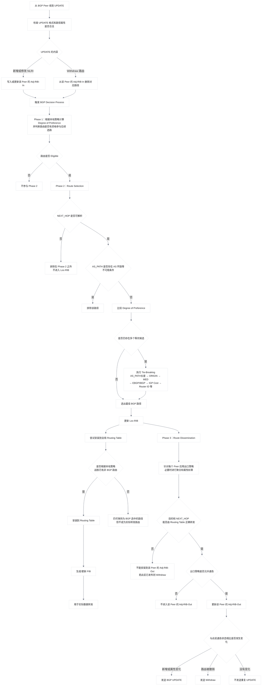

# BGP 属性

## 1.BGP 工作原理

路由信息在 BGP 对等体间相互交换更新消息，BGP 对更新消息进行路由实施策略的修改或者过滤。在接收或者发送更新消息时都能操作，**<font color="red">如果 BGP 路由表中存在多条到达相同目的的路由，那么 BGP 不会将所有的条目全部传递出去，而是选择其中最优的一条发送</font>**。BGP 协议维护着邻居表、BGP 路由表，邻居表是通过发送 Open 消息来建立的，维护着所有对等体的邻居。BGP 路由表是通过 BGP 协议学习的全部路由（包含到达同一目的多条路由），而在全局有一张 IP 路由表是存放所有协议学习到的最佳路由，包括 BGP 协议。而从 BGP 协议学习的路由若想进入到 IP 路由表需要经过一系列的决策，将选择决策胜利的路由放进 IP 路由表中。

### 1.1 BGP 路由信息库和转发表

BGP 仅在 Established 状态接收 UPDATE。设备会先检查 UPDATE 的格式和路径属性是否合法；随后，按发送该 UPDATE 的 Peer 更新对应的 **`Adj-RIB-In`**。

- 收到新的 NLRI：将新路径加入该 Peer 的 **`Adj-RIB-In`**；
- 收到相同 NLRI 但属性不同的路径：以新路径替换旧路径，旧路径被隐式撤销；
- 收到 Withdraw：从该 Peer 的 **`Adj-RIB-In`** 中删除对应路径；
- 更新 **`Adj-RIB-In`** 后：运行 BGP Decision Process。

一个 BGP Speaker 内部的路由信息库（RIB）由三个不同部分组成：

#### 1.1.1 Adj-RIBs-In

**`Adj-RIBs-In`** 用于保存从其他 BGP Speaker 接收到的 UPDATE 消息中学习到的路由信息。其中保存的路由，可以作为 Decision Process 的输入。

从逻辑上说，每个 Peer 都有自己的 **`Adj-RIB-In`**。例如同一个前缀可能同时收到三条路径：

```java{.line-numbers}
Adj-RIB-In from Peer A：10.1.5.0/24，AS_PATH 500
Adj-RIB-In from Peer B：10.1.5.0/24，AS_PATH 600 500
Adj-RIB-In from Peer C：10.1.5.0/24，AS_PATH 700 500
```

这些都是候选路径，后续需要交给 BGP 决策过程。

注意，根据 RFC 7854，**`Adj-RIB-In`**: As defined in RFC4271, "The Adj-RIBs-In contains unprocessed routing information that has been advertised to the local BGP speaker by its peers."  This is also referred to as the pre-policy **`Adj-RIB-In`** in this document. **`Post-Policy Adj-RIB-In`**: The result of applying inbound policy to an **`Adj-RIB-In`**, but prior to the application of route selection to form the Loc-RIB. 也就是 RFC 4271 中不带任何修饰词的 **`Adj-RIB-In=Pre-Policy Adj-RIB-In`**，即 Peer 通告给我的、尚未经过本地 import/inbound policy 的路由信息。通过 import policy 后但尚未进行选路的路由，可以称为 **`Post-Policy Adj-RIB-In`**。

#### 1.1.2 Loc-RIB

**`Loc-RIB`** 保存本地 BGP Speaker 根据本地策略，从 **`Adj-RIBs-In`** 中选择出的路由信息。这些路由是本地 BGP Speaker 将使用的路由。**`Loc-RIB`** 中每条路由的下一跳，都必须能够通过本地 BGP Speaker 的 Routing Table 解析。

即 **`Loc-RIB`** 保存由本地 BGP Speaker 的决策过程选出的路由，需要注意，**`Loc-RIB`** 是 BGP 协议内部的最佳路径集合，不完全等同于设备的全局 IP 路由表。例如，某个前缀的 BGP 路径已经被 BGP 选为最佳，但设备同时存在一条优先级更高的 OSPF 路由，那么全局 IP 路由表最终使用 OSPF 路径。

#### 1.1.3 Adj-RIBs-Out

**`Adj-RIBs-Out`** 保存本地 BGP Speaker 选定、准备通告给 BGP 邻居的路由信息。保存在 **`Adj-RIBs-Out`** 中的路由，将被封装到本地 BGP Speaker 发送的 UPDATE 消息中，并通告给相应的邻居。**<font color="red">对于不同邻居可能应用不同的出方向策略，因此同一台设备面向不同 Peer 的 **`Adj-RIB-Out`** 可能不同</font>**。

例如，**`Loc-RIB`** 中有：

```java{.line-numbers}
10.1.5.0/24
10.1.6.0/24
10.1.7.0/24
```

面向 Peer A 的出口策略允许全部路由：

```java{.line-numbers}
Adj-RIB-Out to A：
10.1.5.0/24
10.1.6.0/24
10.1.7.0/24
```

面向 Peer B 的出口策略只允许 **`10.1.5.0/24`**：

```java{.line-numbers}
Adj-RIB-Out to B：
10.1.5.0/24
```

总的来说：

- **`Adj-RIBs-In`** 保存邻居通告给本地 BGP Speaker、但尚未完成本地选路处理的路由信息；
- **`Loc-RIB`** 保存本地 Decision Process 选出的路由；
- **`Adj-RIBs-Out`** 按照具体邻居组织准备通告的路由，并通过本地 Speaker 发送的 UPDATE 消息发布出去。
- Routing Table 用于转发数据包的路由信息，包含到直连网络的路由、静态路由、从 IGP 学到的路由、从 BGP 学到的路由等。

某一条具体的 BGP 路由是否应该安装到 Routing Table 中，以及该 BGP 路由是否应该覆盖其他路由协议已经安装到同一目的地的路由，都属于本地策略决定的事项。**<font color="red">除了用于实际数据包转发之外，Routing Table 还用于解析 BGP UPDATE 消息中指定的下一跳地址</font>**。

Decision Process 从本地 **`Adj-RIBs-In`** 中保存的路由开始，按照本地 Policy Information Base，即 PIB 中配置的策略，选择后续需要发布的路由。Decision Process 的输出，是准备向 BGP 邻居发布的路由集合。根据出口策略，这些选出的路由将被保存到本地 Speaker 的 **`Adj-RIBs-Out`** 中。Decision Process 分为三个阶段 Phase1、Phase2、Phase3。

### 1.2 Phase 1 偏好度计算

每当本地 BGP Speaker 从某个邻居收到一条 UPDATE 消息，而该消息通告了新路由、替代路由或撤销路由时，都会调用阶段 1 的决策函数。对于每一条新收到的、或作为替代而收到的可行路由，本地 BGP Speaker 均会确定其偏好程度（Degree of Preference），也就是这条路径在本地的优先程度。

### 1.3 Phase 2 路由选择

Phase 2 决策函数在 Phase 1 完成后启动，负责从 **`Adj-RIBs-In`** 中符合条件的候选路径里，为每个目的前缀选出最佳 BGP 路由。。**<font color="red">如果某条 BGP 路由的 **`NEXT_HOP`** 属性所表示的地址无法解析或者某条 BGP 路由的 **`AS_PATH`** 属性中存在 AS 环路，那么这条 BGP 路由必须排除在 Phase 2 决策之外</font>**。AS 环路检测通过扫描完整的 **`AS_PATH`** 来完成，检查本地系统的 AS 号是否出现在该路径中。

对于 Adj-RIBs-In 中每个存在可行路径的目的地，本地 BGP Speaker 会选择以下三类路由之一：

- 到达该目的地的候选路径中，偏好度最高的路由；
- 到达该目的地的唯一可行路由；
- 多条路径偏好度相同时，按照后续的决胜规则（tie-breaking rules）选出的路由。

随后，本地 BGP Speaker 必须将选中的路由安装到 **`Loc-RIB`**，并替换 **`Loc-RIB`** 中原有的、到达同一目的地的路由。至于这条 BGP 最佳路径能否进一步替换 全局 IP 路由表中已有的非 BGP 路由，则由设备配置的本地策略决定。

对于选中的路由，BGP Speaker 还必须根据其 **`NEXT_HOP`** 属性确定实际用于转发的直接下一跳，也就是说，**`NEXT_HOP`** 往往只是逻辑上的 BGP 下一跳。设备需要通过直连、静态路由或 IGP 路由递归解析，得到实际出接口和直接相邻设备的地址。

在真正通过该 BGP 路由转发数据包之前，设备必须确保 **`NEXT_HOP`** 已经成功解析为一个直接可达的下一跳，并使用这个直接下一跳完成实际转发。无法解析的 BGP 路由必须从 **`Loc-RIB`** 和 Routing Table 中移除。**<font color="red">不过，这些路由应当继续保留在 **`Adj-RIBs-In`** 中，这样，当将来 **`NEXT_HOP`** 恢复可达时，它们仍可重新参与 Phase 2 的选路过程</font>**。

例如：

```java{.line-numbers}
BGP 路由：10.1.5.0/24 → NEXT_HOP 10.1.4.4
OSPF 路由：10.1.4.4/32 → 10.1.23.3，GE0/0/0
```

那么 BGP 下一跳 **`10.1.4.4`** 可以递归为：逻辑 BGP 下一跳 **`10.1.4.4`**、实际直接下一跳 **`10.1.23.3`**、实际出接口 **`GE0/0/0`**。

### 1.4 Phase 3 路由通告

Phase 3 决策函数通常在 Phase 2 完成后运行。此时，Loc-RIB 中的所有路由会按照已配置的出口策略，分别处理并写入对应邻居的 **`Adj-RIBs-Out`**。根据这些策略，某条存在于 Loc-RIB 中的路由，可能不会被加入某个特定邻居的 **`Adj-RIB-Out`**。

当 **`Adj-RIBs-Out`** 和 **`Routing Table`** 都更新完成后，本地 BGP Speaker 将运行 Update-Send 过程。Update-Send 过程负责向符合通告条件的邻居发送 UPDATE 消息。例如，它会将 Decision Process 选出的路由通告给其他 BGP Speaker；这些 Speaker 既可能位于同一个 AS 内，也可能位于相邻的 AS 中。

当 BGP Speaker 从某个内部邻居收到 UPDATE 消息后，除非自身充当 BGP Route Reflector，否则不得将该 UPDATE 中的路由信息再次发布给其他内部邻居。这就是 IBGP 的水平分割规则。

作为 Phase 3 的一部分，BGP Speaker 会先完成 **`Adj-RIBs-Out`** 的更新。随后，所有新加入 **`Adj-RIBs-Out`** 的路由，以及所有刚刚变为不可用且不存在替代路径的路由，都必须通过 UPDATE 消息通告给相应邻居。

- 对于新加入的路由，发送携带该路由的 UPDATE；
- 对于失效且没有替代路径的路由，发送 Withdraw；
- 如果原路径失效，但存在替代路径，则直接发送替代路由的 UPDATE。

如果从 **`Adj-RIBs-Out`** 通告某条可行 BGP 路由时，生成的 UPDATE 与此前已经通告过的路由完全相同，BGP Speaker 则不应重复发送该 UPDATE。

### 1.5 总结

上述过程的流程图如下所示：



## 2.BGP 选路原则

