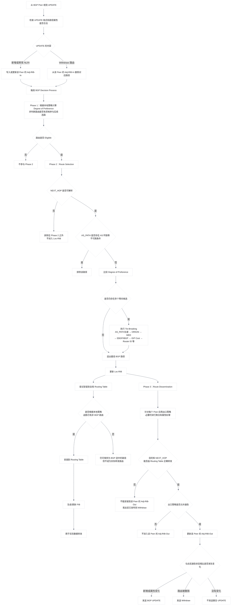
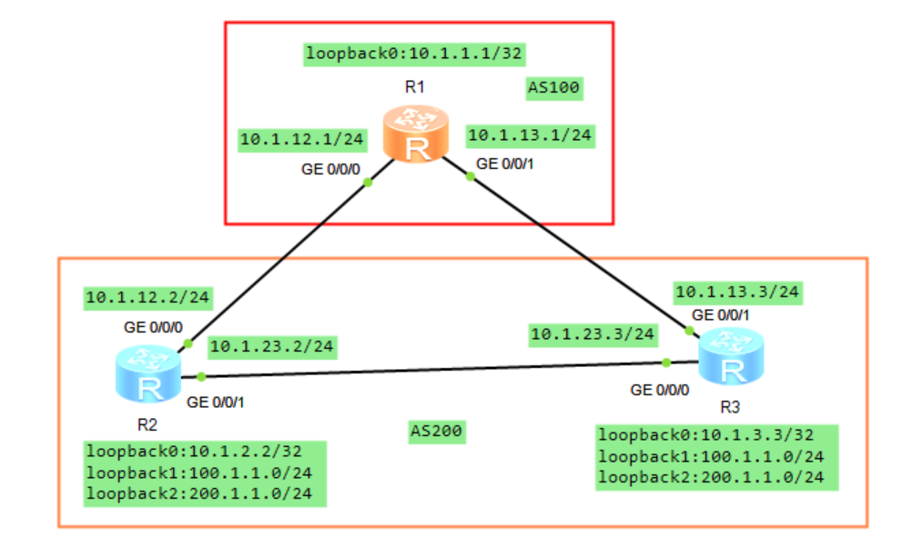
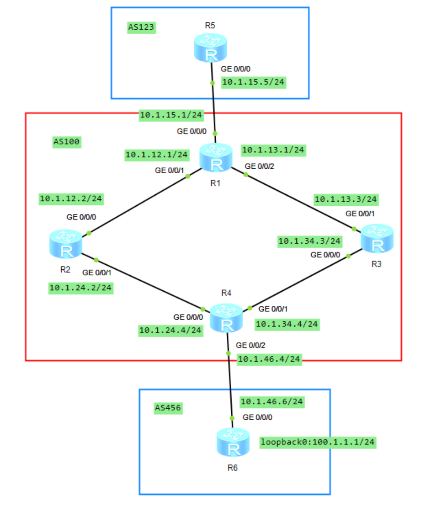

# BGP 属性

## 1.BGP 工作原理

路由信息在 BGP 对等体间相互交换更新消息，BGP 对更新消息进行路由实施策略的修改或者过滤。在接收或者发送更新消息时都能操作，**<font color="red">如果 BGP 路由表中存在多条到达相同目的的路由，那么 BGP 不会将所有的条目全部传递出去，而是选择其中最优的一条发送</font>**。BGP 协议维护着邻居表、BGP 路由表，邻居表是通过发送 Open 消息来建立的，维护着所有对等体的邻居。BGP 路由表是通过 BGP 协议学习的全部路由（包含到达同一目的多条路由），而在全局有一张 IP 路由表是存放所有协议学习到的最佳路由，包括 BGP 协议。而从 BGP 协议学习的路由若想进入到 IP 路由表需要经过一系列的决策，将选择决策胜利的路由放进 IP 路由表中。

### 1.1 BGP 路由信息库和转发表

BGP 仅在 Established 状态接收 UPDATE。设备会先检查 UPDATE 的格式和路径属性是否合法；随后，按发送该 UPDATE 的 Peer 更新对应的 **`Adj-RIB-In`**。

- 收到新的 NLRI：将新路径加入该 Peer 的 **`Adj-RIB-In`**；
- 收到相同 NLRI 但属性不同的路径：以新路径替换旧路径，旧路径被隐式撤销；
- 收到 Withdraw：从该 Peer 的 **`Adj-RIB-In`** 中删除对应路径；
- 更新 **`Adj-RIB-In`** 后：运行 BGP Decision Process。

一个 BGP Speaker 内部的路由信息库（RIB）由三个不同部分组成：

#### 1.1.1 Adj-RIBs-In

**`Adj-RIBs-In`** 用于保存从其他 BGP Speaker 接收到的 UPDATE 消息中学习到的路由信息。其中保存的路由，可以作为 Decision Process 的输入。

从逻辑上说，每个 Peer 都有自己的 **`Adj-RIB-In`**。例如同一个前缀可能同时收到三条路径：

```java{.line-numbers}
Adj-RIB-In from Peer A：10.1.5.0/24，AS_PATH 500
Adj-RIB-In from Peer B：10.1.5.0/24，AS_PATH 600 500
Adj-RIB-In from Peer C：10.1.5.0/24，AS_PATH 700 500
```

这些都是候选路径，后续需要交给 BGP 决策过程。

注意，根据 RFC 7854，**`Adj-RIB-In`**: As defined in RFC4271, "The Adj-RIBs-In contains unprocessed routing information that has been advertised to the local BGP speaker by its peers."  This is also referred to as the pre-policy **`Adj-RIB-In`** in this document. **`Post-Policy Adj-RIB-In`**: The result of applying inbound policy to an **`Adj-RIB-In`**, but prior to the application of route selection to form the Loc-RIB. 也就是 RFC 4271 中不带任何修饰词的 **`Adj-RIB-In=Pre-Policy Adj-RIB-In`**，即 Peer 通告给我的、尚未经过本地 import/inbound policy 的路由信息。通过 import policy 后但尚未进行选路的路由，可以称为 **`Post-Policy Adj-RIB-In`**。

#### 1.1.2 Loc-RIB

**`Loc-RIB`** 保存本地 BGP Speaker 根据本地策略，从 **`Adj-RIBs-In`** 中选择出的路由信息。这些路由是本地 BGP Speaker 将使用的路由。**`Loc-RIB`** 中每条路由的下一跳，都必须能够通过本地 BGP Speaker 的 Routing Table 解析。

即 **`Loc-RIB`** 保存由本地 BGP Speaker 的决策过程选出的路由，需要注意，**`Loc-RIB`** 是 BGP 协议内部的最佳路径集合，不完全等同于设备的全局 IP 路由表。例如，某个前缀的 BGP 路径已经被 BGP 选为最佳，但设备同时存在一条优先级更高的 OSPF 路由，那么全局 IP 路由表最终使用 OSPF 路径。

#### 1.1.3 Adj-RIBs-Out

**`Adj-RIBs-Out`** 保存本地 BGP Speaker 选定、准备通告给 BGP 邻居的路由信息。保存在 **`Adj-RIBs-Out`** 中的路由，将被封装到本地 BGP Speaker 发送的 UPDATE 消息中，并通告给相应的邻居。**<font color="red">对于不同邻居可能应用不同的出方向策略，因此同一台设备面向不同 Peer 的 **`Adj-RIB-Out`** 可能不同</font>**。

例如，**`Loc-RIB`** 中有：

```java{.line-numbers}
10.1.5.0/24
10.1.6.0/24
10.1.7.0/24
```

面向 Peer A 的出口策略允许全部路由：

```java{.line-numbers}
Adj-RIB-Out to A：
10.1.5.0/24
10.1.6.0/24
10.1.7.0/24
```

面向 Peer B 的出口策略只允许 **`10.1.5.0/24`**：

```java{.line-numbers}
Adj-RIB-Out to B：
10.1.5.0/24
```

总的来说：

- **`Adj-RIBs-In`** 保存邻居通告给本地 BGP Speaker、但尚未完成本地选路处理的路由信息；
- **`Loc-RIB`** 保存本地 Decision Process 选出的路由；
- **`Adj-RIBs-Out`** 按照具体邻居组织准备通告的路由，并通过本地 Speaker 发送的 UPDATE 消息发布出去。
- Routing Table 用于转发数据包的路由信息，包含到直连网络的路由、静态路由、从 IGP 学到的路由、从 BGP 学到的路由等。

某一条具体的 BGP 路由是否应该安装到 Routing Table 中，以及该 BGP 路由是否应该覆盖其他路由协议已经安装到同一目的地的路由，都属于本地策略决定的事项。**<font color="red">除了用于实际数据包转发之外，Routing Table 还用于解析 BGP UPDATE 消息中指定的下一跳地址</font>**。

Decision Process 从本地 **`Adj-RIBs-In`** 中保存的路由开始，按照本地 Policy Information Base，即 PIB 中配置的策略，选择后续需要发布的路由。Decision Process 的输出，是准备向 BGP 邻居发布的路由集合。根据出口策略，这些选出的路由将被保存到本地 Speaker 的 **`Adj-RIBs-Out`** 中。Decision Process 分为三个阶段 Phase1、Phase2、Phase3。

### 1.2 Phase 1 偏好度计算

每当本地 BGP Speaker 从某个邻居收到一条 UPDATE 消息，而该消息通告了新路由、替代路由或撤销路由时，都会调用阶段 1 的决策函数。对于每一条新收到的、或作为替代而收到的可行路由，本地 BGP Speaker 均会确定其偏好程度（Degree of Preference），也就是这条路径在本地的优先程度。

### 1.3 Phase 2 路由选择

Phase 2 决策函数在 Phase 1 完成后启动，负责从 **`Adj-RIBs-In`** 中符合条件的候选路径里，为每个目的前缀选出最佳 BGP 路由。。**<font color="red">如果某条 BGP 路由的 **`NEXT_HOP`** 属性所表示的地址无法解析或者某条 BGP 路由的 **`AS_PATH`** 属性中存在 AS 环路，那么这条 BGP 路由必须排除在 Phase 2 决策之外</font>**。AS 环路检测通过扫描完整的 **`AS_PATH`** 来完成，检查本地系统的 AS 号是否出现在该路径中。

对于 Adj-RIBs-In 中每个存在可行路径的目的地，本地 BGP Speaker 会选择以下三类路由之一：

- 到达该目的地的候选路径中，偏好度最高的路由；
- 到达该目的地的唯一可行路由；
- 多条路径偏好度相同时，按照后续的决胜规则（tie-breaking rules）选出的路由。

随后，本地 BGP Speaker 必须将选中的路由安装到 **`Loc-RIB`**，并替换 **`Loc-RIB`** 中原有的、到达同一目的地的路由。至于这条 BGP 最佳路径能否进一步替换 全局 IP 路由表中已有的非 BGP 路由，则由设备配置的本地策略决定。

对于选中的路由，BGP Speaker 还必须根据其 **`NEXT_HOP`** 属性确定实际用于转发的直接下一跳，也就是说，**`NEXT_HOP`** 往往只是逻辑上的 BGP 下一跳。设备需要通过直连、静态路由或 IGP 路由递归解析，得到实际出接口和直接相邻设备的地址。

在真正通过该 BGP 路由转发数据包之前，设备必须确保 **`NEXT_HOP`** 已经成功解析为一个直接可达的下一跳，并使用这个直接下一跳完成实际转发。无法解析的 BGP 路由必须从 **`Loc-RIB`** 和 Routing Table 中移除。**<font color="red">不过，这些路由应当继续保留在 **`Adj-RIBs-In`** 中，这样，当将来 **`NEXT_HOP`** 恢复可达时，它们仍可重新参与 Phase 2 的选路过程</font>**。

例如：

```java{.line-numbers}
BGP 路由：10.1.5.0/24 → NEXT_HOP 10.1.4.4
OSPF 路由：10.1.4.4/32 → 10.1.23.3，GE0/0/0
```

那么 BGP 下一跳 **`10.1.4.4`** 可以递归为：逻辑 BGP 下一跳 **`10.1.4.4`**、实际直接下一跳 **`10.1.23.3`**、实际出接口 **`GE0/0/0`**。

### 1.4 Phase 3 路由通告

Phase 3 决策函数通常在 Phase 2 完成后运行。此时，Loc-RIB 中的所有路由会按照已配置的出口策略，分别处理并写入对应邻居的 **`Adj-RIBs-Out`**。根据这些策略，某条存在于 Loc-RIB 中的路由，可能不会被加入某个特定邻居的 **`Adj-RIB-Out`**。

当 **`Adj-RIBs-Out`** 和 **`Routing Table`** 都更新完成后，本地 BGP Speaker 将运行 Update-Send 过程。Update-Send 过程负责向符合通告条件的邻居发送 UPDATE 消息。例如，它会将 Decision Process 选出的路由通告给其他 BGP Speaker；这些 Speaker 既可能位于同一个 AS 内，也可能位于相邻的 AS 中。

当 BGP Speaker 从某个内部邻居收到 UPDATE 消息后，除非自身充当 BGP Route Reflector，否则不得将该 UPDATE 中的路由信息再次发布给其他内部邻居。这就是 IBGP 的水平分割规则。

作为 Phase 3 的一部分，BGP Speaker 会先完成 **`Adj-RIBs-Out`** 的更新。随后，所有新加入 **`Adj-RIBs-Out`** 的路由，以及所有刚刚变为不可用且不存在替代路径的路由，都必须通过 UPDATE 消息通告给相应邻居。

- 对于新加入的路由，发送携带该路由的 UPDATE；
- 对于失效且没有替代路径的路由，发送 Withdraw；
- 如果原路径失效，但存在替代路径，则直接发送替代路由的 UPDATE。

如果从 **`Adj-RIBs-Out`** 通告某条可行 BGP 路由时，生成的 UPDATE 与此前已经通告过的路由完全相同，BGP Speaker 则不应重复发送该 UPDATE。

### 1.5 总结

上述过程的流程图如下所示：



## 2.BGP 选路原则

BGP 选路的 11 条规则如下。

### 2.1 优选协议首选值 PrefVal

协议首选值（PrefVal）是华为设备的特有属性，也在选路规则中位列第一位，因此最优先比较，**<font color="red">该属性仅针对本路由器有意义，不会传递给其他设备</font>**。协议首选值越大越好，默认首选值为 0。

### 2.2 优选本地优先级 **`Local_Pref`**

**<font color="red">本地优先级属性在整个 AS 内传递，但不会传递到 AS 之外，值越大越优先</font>**，一般用作 AS 内路由器选择一个最优出口去往外部。如果路由没有设置本地优先级，BGP 选路时将该路由按缺省的本地优先级 100 来处理。

### 2.3 本地起源优先级

顺序依次为：手动聚合路由 > 自动聚合路由 > network 命令通告的路由 > import-route 命令引入的路由 > 从对等体学习的路由。

规则 3 指的是当前路由器产生的 BGP 路由中，**本地产生的路由要优于邻居学来的路由，本地产生的路由分本地生成的聚合路由和 IP 路由注入的路由**。其中，聚合路由要优于不聚合的路由，而聚合可以分为手动聚合和自动聚合，且前者要优于后者；通过 network 命令通告进 BGP 的路由要优于通过 import 方式引入进 BGP 的路由；其次是从邻居学习到的路由。

### 2.4 优选 **`AS_PATH`** 最短的路由

**`AS_PATH`** 属性是记录达到目标网络的 AS 路径列表，**`AS_PATH`** 长度短的路由优先。

### 2.5 Origin 类型优先级

origin 为 BGP 的起源属性，指的是 BGP 路由的起源，成为 BGP 路由都会携带一个 origin 属性。如该路由是通过 network 的方式产生的路由，那么 origin 类型为 IGP（标识为 i），如果是通过 EGP 协议学习到路由，origin 类型为 EGP（标识为 e），如果将外部路由引入进 BGP 的路由，origin 类型为 incomplete（标识为 ?）。优先级顺序为 **`i>e>?`**。

**BGP 的路由生成方式和 ORIGIN 属性是两个独立的概念**。例如 **`R1—R2—R3`** 中，R1 使用 **`network 10.1.1.0 255.255.255.0`** 将本地路由注入 BGP 时，在 **R1 本机**看来，该路由的生成方式是 **`network（N）`**，同时 BGP 会把它的 **ORIGIN 属性设置为 IGP（i）**。当 R1 将这条路由通告给 R2 后，从 **R2 本机**的角度看，它是从 BGP 对等体学习到的，因此在路由生成方式比较中属于 **`peer learned (L)`**。

但是 **ORIGIN 是 BGP 的路径属性，会随 BGP UPDATE 一起传播**，所以 R2 仍然看到 **`ORIGIN=i`**。RFC 4271 规定，ORIGIN is a well-known mandatory attribute. The ORIGIN attribute is generated by the speaker that originates the associated routing information. Its value SHOULD NOT be changed by any other speaker. 因此，同一条路由完全可以在 R1 上表现为 **`N + i`**，传到 R2 后变为 **`L + i`**：其中 **`N/L`** 描述的是 **当前路由器是如何获得这条 BGP 路由的**，只具有当前设备的选路意义；而 **`i/e/?`** 描述的是 **该 BGP 路由携带的 ORIGIN 属性是什么**，可以随路由继续传播。

### 2.6 优选 MED 值最低的路由

MED 默认比较来自相同邻居的路由的 MED 值，数值越小的路由越优先。**<font color="red">如果是来自不同邻居 AS 的路由，MED 不参与比较，除非开启 `compare-different-as-med` 命令</font>**，才可以在来自不同邻居 AS 的路由间比较 MED。

### 2.7 依次优选 eBGP 路由、iBGP 路由

如果路由分别通过 eBGP 和 iBGP 同时学习，在其他规则都一样的情况下，会优先选择 eBGP 对等体。理由很简单，eBGP 连接外部 AS，而 iBGP 连接内部的 AS。路由器认为既然通过 eBGP 学到该路由必然是来自外部的 AS，因此直接选择 eBGP 对等体到达外部比穿越整个 AS 再到达外部要更加优先。

### 2.8 优选到 BGP 下一跳 IGP 度量值最小的路由

BGP 的路由下一跳地址是通过 IGP 协议学习到的，根据路由表，计算到下一跳的度量值，越小的越优先。

### 2.9 优选 **`Cluster_List`** 最短的路由

**`Cluster_List`** 为路由反射器中的属性，是由路由反射器来添加的，将 **`Cluster_ID`** 添加到 **`Cluster_List`** 中，用于记录被反射的 BGP 路由在 AS 内经过的 Cluster 路径。**`Cluster_List`** 越短的路由越优先。如果参与比较的路由没有 **`Cluster_List`**，则越过规则 9，直接比较后面的规则。如果某条路由没有 **`Cluster_List`**，而其他路由有 **`Cluster_List`**，则没有 **`Cluster_List`** 属性的路由优先。

### 2.10 优选 **`Router_ID`** 最小的设备发布的路由

**`Router_ID`** 最小的邻居通告的路由最优先。

- 如果路由携带 **`Originator_ID`** 属性，则选路过程中将比较 **`Originator_ID`** 的大小，不再比较 **`Router_ID`**。其中，**`Originator_ID`** 最小的路由最优。
- 如果参与比较的路由 **`Originator_ID`** 一样，也不再比较 **`Router_ID`**，直接开始规则 11。

### 2.11 优选从具有最小 IP Address 的对等体学来的路由

## 3.BGP 负载分担

在大型网路中，到达同一目的地的通路上会存在多条有效路由，但是 BGP 只将最优路由发布给对等体，这一特点往往会造成很多流量负载不均衡的情况。**<font color="red">一般情况下，只有 BGP 选择路由的策略所描述的前 8 个属性完全相同，且 **`AS_PATH`** 属性也相同时（经过的 AS 号相同），BGP 路由之间才能相互等价，实现 BGP 的负载分担</font>**。但路由负载分担的规则也可以通过配置来改变，如忽略路由 **`AS_PATH`** 属性的比较，但这些配置需要确保不会引起路由环路。

### 3.1 BGP 路由的负载分担

BGP 默认仅下发一条最好的 BGP 路由到 IP 路由表。但这种行为可以通过 **`maximum load-balancing [eBGP|iBGP] number`** 命令来配置 BGP 负载分担的最大等价路由条数。BGP 可以把选路规则中，前 8 条规则都一样的多条路由同时下发到 IP 路由表中。负载分担的条件是 BGP 选择路由的策略的第 1 至 8 条规则中，需要比较的属性要完全相同。满足这个条件的多条路由，在 **`maximum load-balancing`** 开启后，可下发多条路由到路由表。缺省情况下，BGP 负载分担的最大等价路由条数为 1，即不进行负载分担。

如果满足负载分担条件的 BGP 路由数大于定义的 BGP 负载分担规格时，按如下顺序优选。

- 优选 **`Cluster_List`** 最短的。
- 优选 **`Router_ID`** 最小的路由器发布的，如果路由携带 **`Originator_ID`** 属性，选路过程中将比较 **`Originator_ID`** 的大小（不再比较 **`Router_ID`**），并优选 **`Originator_ID`** 最小的路由。
- 比较对等体的 IP 地址，优选从具有较小 IP 地址的对等体学来的路由。

若最优路由为 iBGP 路由，则只是 iBGP 路由形成负载分担，若最优路由为 eBGP 路由，则只是 eBGP 路由形成负载分担。**<font color="red">即公网中到达同一目的地的 iBGP 路由和 eBGP 路由不能形成负载分担</font>**。负载分担只对本设备有效，**但是本设备还是会根据选路原则选出最优路由发给其他对等体**，但在路由表里是显示负载分担的。

缺省情况下，路由在形成负载分担时会比较路由的 **`AS_PATH`** 属性，而 BGP 只对 **`AS_PATH`** 属性完全相同的路由进行负载分担，BGP 负载分担特性同样适用于联盟内部的自治系统之间。**<font color="red">配置路由在形成负载分担时不比较路由的 **`AS_PATH`** 属性，可以通过命令 **`load-balancing as-path-ignore`** 来实现</font>**。

如下图所示，AS 254 通告了两条 BGP 路由 **`100.1.1.0/24`**、**`200.1.1.0/24`**，由 **`R5/R6`** 通告进 AS 100，R1 到 AS 200 有 2 条 eBGP 路由，通过 R5 和 R6 都可以到达。

<div align="center">
    
</div>

此时，R1 上的路由表如下所示，这两条 BGP 路由默认仅一条路由进入 R1 的 IP 路由表。

```java{.line-numbers}
[R1]display ip routing-table 
Route Flags: R - relay, D - download to fib
------------------------------------------------------------------------------
Routing Tables: Public Destinations : 9        Routes : 9        
Destination/Mask    Proto   Pre  Cost      Flags NextHop         Interface
      100.1.1.0/24  EBGP    255  0           D   10.1.12.2       GigabitEthernet0/0/0
      200.1.1.0/24  EBGP    255  0           D   10.1.12.2       GigabitEthernet0/0/0
[R1]display bgp routing-table 
 BGP Local router ID is 10.1.1.1 
 Total Number of Routes: 4
      Network            NextHop        MED        LocPrf    PrefVal Path/Ogn
 *>   100.1.1.0/24       10.1.12.2       0                     0      200i
 *                       10.1.13.3       0                     0      200i
 *>   200.1.1.0/24       10.1.12.2       0                     0      200i
 *                       10.1.13.3       0                     0      200i
```

接下来，在 R1 的 BGP 进程中负载分担命令 **`maximum load-balancing eBGP 2`**，允许最多两条等价路由进入 IP 路由表。**再次查看 IP 路由表，到达 AS 254 的两条路由各自有两个下一跳，同时进入到 IP 路由表**。因此，Huawei BGP 的负载分担并不是把两条路径都标成 **`best (>)`**。BGP 仍然只有一条 best 路径，但可以把多条满足负载均衡条件的路径同时 select 到 IP 路由表/FIB 中用于转发。在 R1 的 **`100.1.1.0/24`** 明细路由中可以看到，**`2 available, 1 best, 2 select`**，也就是说，有两条可用路径，1 条最佳路径，2 条被选中进入 IP 路由表。

```java{.line-numbers}
[R1-bgp]maximum load-balancing ebgp 2
[R1-bgp]display ip routing-table 
Route Flags: R - relay, D - download to fib
------------------------------------------------------------------------------
Routing Tables: Public
         Destinations : 9        Routes : 11       
Destination/Mask    Proto   Pre  Cost      Flags NextHop         Interface
      100.1.1.0/24  EBGP    255  0           D   10.1.12.2       GigabitEthernet0/0/0
                    EBGP    255  0           D   10.1.13.3       GigabitEthernet0/0/1
      200.1.1.0/24  EBGP    255  0           D   10.1.12.2       GigabitEthernet0/0/0
                    EBGP    255  0           D   10.1.13.3       GigabitEthernet0/0/1
[R1-bgp]display bgp routing-table 
 BGP Local router ID is 10.1.1.1 
 Total Number of Routes: 4
      Network            NextHop        MED        LocPrf    PrefVal Path/Ogn
 *>   100.1.1.0/24       10.1.12.2       0                     0      200i
 *                       10.1.13.3       0                     0      200i
 *>   200.1.1.0/24       10.1.12.2       0                     0      200i
 *                       10.1.13.3       0                     0      200i
[R1-bgp]display bgp routing-table 100.1.1.0
 BGP local router ID : 10.1.1.1
 Local AS number : 100
 Paths:   2 available, 1 best, 2 select
 BGP routing table entry information of 100.1.1.0/24:
 From: 10.1.12.2 (2.2.2.2)
 Route Duration: 00h18m16s  
 Direct Out-interface: GigabitEthernet0/0/0
 Original nexthop: 10.1.12.2
 Qos information : 0x0
 AS-path 200, origin igp, MED 0, pref-val 0, valid, external, best, select, acti
ve, pre 255
 Advertised to such 2 peers:
    10.1.12.2
    10.1.13.3
 BGP routing table entry information of 100.1.1.0/24:
 From: 10.1.13.3 (3.3.3.3)
 Route Duration: 00h18m06s  
 Direct Out-interface: GigabitEthernet0/0/1
 Original nexthop: 10.1.13.3
 Qos information : 0x0
 AS-path 200, origin igp, MED 0, pref-val 0, valid, external, select, active, pr
e 255, not preferred for router ID
 Not advertised to any peer yet
```

### 3.2 下一跳路由的负载分担

BGP 区别于 IGP 协议的一点是其下一跳地址可以是非直连的路由器的接口 IP。BGP 在 AS 内的 iBGP 邻居间通告路由时，下一跳保持不变，因此 IBGP 路由器收到路由后，需要保证该 BGP NEXT_HOP 可达。当 NEXT_HOP 不是直连地址时，设备根据本地路由表对 NEXT_HOP 进行递归解析，得到实际的出接口和直接下一跳，并据此转发数据。

**<font color="red">所以如果下一跳地址所对应路由在 IP 路由表中是负载分担的，则此处同样算得上 BGP 的负载分担</font>**。这种负载分担的实现其实和 BGP 没有直接的关系，完全得益于 IGP 协议路由中 ECMP（Equal Cost Multiple Path）。IGP 根据本身的路由算法计算路由的度量值（Metric），在度量值相等的路由间进行负载分担，实际是 IGP 的负载分担。

一条 BGP 路由从哪里学来，指的是哪个 BGP Peer 通过 UPDATE 报文把这条路由通告给本机，这是控制平面的路由传播关系。而该路由携带的 **`NEXT_HOP`** 属性则表示到达这个目的网络时应当解析的 BGP 下一跳，它并不一定就是通告该路由的 Peer。当真正转发数据包时，路由器先根据目的地址匹配到这条 BGP 路由，再使用本地路由表对其 **`NEXT_HOP`** 进行递归查找，最终解析出可直接到达的 **`immediate next hop`** 和实际出接口，并据此完成数据转发。

<div align="center">
    
</div>

如上图所示，R6 通告了一条 BGP 路由 **`100.1.1.0/24`**，R5 访问该网段，数据流经过 R1 时会进行负载分担，由于 R1 与 R4 建立 iBGP 邻居，而 R1 的 BGP 表中到达 **`100.1.1.0/24`** 网段的下一跳为 R4 的 **`10.1.4.4`**（loopback0），而 AS 100 内部运行的是 OSPF 协议，R1 到达目标网段将会迭代到 R4 的 **`10.1.4.4`**，而到达 R4 则有两条等价路径。

```java{.line-numbers}
<R1>display bgp routing-table 100.1.1.0
 BGP local router ID : 1.1.1.1
 Local AS number : 100
 Paths:   1 available, 1 best, 1 select
 BGP routing table entry information of 100.1.1.0/24:
 From: 10.1.4.4 (4.4.4.4)
 Route Duration: 00h05m44s  
 Relay IP Nexthop: 10.1.13.3
 Relay IP Out-Interface: GigabitEthernet0/0/2
 Original nexthop: 10.1.4.4
 Qos information : 0x0
 AS-path 456, origin igp, MED 0, localpref 100, pref-val 0, valid, internal, bes
t, select, active, pre 255, IGP cost 2
 Advertised to such 1 peers:
    10.1.15.5
<R1>display bgp routing-table 
 BGP Local router ID is 1.1.1.1 
 Total Number of Routes: 1
      Network            NextHop        MED        LocPrf    PrefVal Path/Ogn
 *>i  100.1.1.0/24       10.1.4.4        0          100        0      456i
```

由于 R1 的全局 IP 路由表中到达 **`10.1.4.4`** 的下一跳有两条等价路径，因此该 BGP 路由也会有 2 个下一跳。

```java{.line-numbers}
<R1>display ip routing-table 
Route Flags: R - relay, D - download to fib
------------------------------------------------------------------------------
Routing Tables: Public
         Destinations : 13       Routes : 14       
Destination/Mask    Proto   Pre  Cost      Flags NextHop         Interface
      100.1.1.0/24  IBGP    255  0          RD   10.1.4.4        GigabitEthernet0/0/2
                    IBGP    255  0          RD   10.1.4.4        GigabitEthernet0/0/1
```

