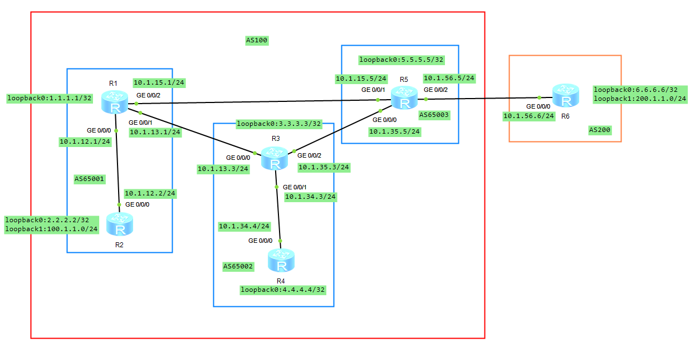
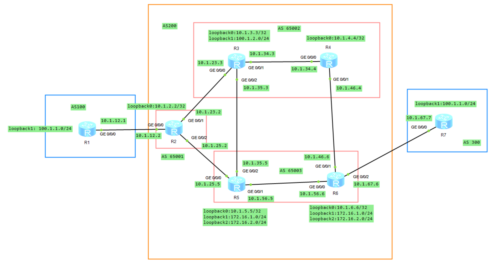

# BGP 联盟

## 1.联盟的基本概念

在一个 AS 中，如果 iBGP 的会话数量较多，管理起来将会显得麻烦，尤其是受 iBGP 水平分割的影响，为了解决该问题，除了使用路由反射器之外，还可以使用 BGP 的联盟（Confederation）。**<font color="red">联盟的概念就是将一个 AS 划分为若干个子 AS。每个子 AS 内部建立 iBGP 全连接关系（联盟 iBGP 邻居），子 AS 之间建立 eBGP 连接关系（联盟 eBGP 邻居），但联盟外部 AS 仍认为联盟是一个 AS</font>**。

## 2.联盟的特点

配置联盟后，原 AS 号将作为每个路由器的联盟 ID。在联盟内部具有以下特点：

1. 在联盟内部将会保留联盟外部的 **`next_hop`** 属性；
2. 通告给联盟内的路由的 MED 属性在整个联盟范围内保留；
3. Local Preference 属性在整个联盟范围内保留，而不只是在通告的成员 AS 内；
4. 在联盟内将成员的 AS 号加入 **`AS_PATH`** 中，但不会将联盟内的 AS 号通告到联盟之外。在联盟中，**`AS_PATH`** 属性又添加了两种类型 **`AS-CONFED-SEQUENCE`**、**`AS-CONFED-SET`**，默认联盟将成员的 AS 号以 **`AS-CONFED-SEQUENCE`** 的形式在 **`AS_PATH`** 当中列出，如果在联盟内配置了聚合，AS 号将以 **`AS-CONFED-SET`** 形式列出；
5. **`AS_PATH`** 中的联盟 AS 号用于避免环路，但是在联盟选择最短的 **`AS_PATH`** 路径时不会比较联盟 AS 号；
6. 联盟内相关的属性传出联盟时将会被自动删除，无需过滤子 AS 号等信息操作。

我们以如下的拓扑图来对上述特性进行验证，AS 100 被分为三个子 AS（65001、65002、65003），使用 AS 100 作为联盟 ID，此时不需要采用 iBGP 的全互联，连接数从 10 条减少到了 5 条。如果没有配置联盟，AS 100 内部都是 iBGP 邻居，配置联盟以后形成了联盟的 eBGP 和联盟的 iBGP 邻居，在联盟成员 AS 内部可以使用全互联或 RR，而在联盟成员 AS 间使用联盟 **`AS_PATH`** 来避免环路。

>R1-R5 之间的连接是为了验证 **`AS_PATH`** 中的联盟 AS 号用来避免环路，以及在联盟选择最短的 **`AS_PATH`** 路径时不会比较联盟 AS 号。如果不考虑实验用途，可以不增加。

<div align="center">
    
</div>

### 2.1 验证 AS_CONFED_SEQUENCE 和联盟成员 AS 对外隐藏

从下面的结果中可以看到，R3 没有把 **`100.1.1.0/24`** 继续通告给 R5，直接原因是这条 BGP 路由的 **`NEXT_HOP`** 字段（**`10.1.12.2`**）R3 无法解析，R3 的 IP 全局路由表中没有 **`10.1.12.2`** 的路由条目，该路径被判定为无效路径，不具备参与最优路径选择的资格，因此无法成为 best/select/active 路由，也就不会作为最优 BGP 路由继续向 R5 通告。

```java{.line-numbers}
<R1>display bgp routing-table 100.1.1.0

 BGP local router ID : 1.1.1.1
 Local AS number : 65001
 Paths:   1 available, 1 best, 1 select
 BGP routing table entry information of 100.1.1.0/24:
 From: 10.1.12.2 (2.2.2.2)
 Route Duration: 01h08m13s  
 Relay IP Nexthop: 0.0.0.0
 Relay IP Out-Interface: GigabitEthernet0/0/0
 Original nexthop: 10.1.12.2
 Qos information : 0x0
 AS-path Nil, origin igp, MED 0, localpref 100, pref-val 0, valid, internal-conf
ed, best, select, active, pre 255
 Advertised to such 1 peers:
    10.1.13.3
<R3>display bgp routing-table 100.1.1.0

 BGP local router ID : 3.3.3.3
 Local AS number : 65002
 Paths:   1 available, 0 best, 0 select
 BGP routing table entry information of 100.1.1.0/24:
 From: 10.1.13.1 (1.1.1.1)
 Route Duration: 01h05m59s  
 Relay IP Nexthop: 0.0.0.0
 Relay IP Out-Interface: 
 Original nexthop: 10.1.12.2
 Qos information : 0x0
 AS-path (65001), origin igp, MED 0, localpref 100, pref-val 0, external-confed,
 pre 255
 Not advertised to any peer yet
<R5>display bgp routing-table 100.1.1.0
Info: The network does not exist.

<R3>display ip routing-table 
Route Flags: R - relay, D - download to fib
------------------------------------------------------------------------------
Routing Tables: Public
         Destinations : 10       Routes : 10       
Destination/Mask    Proto   Pre  Cost      Flags NextHop         Interface
        3.3.3.3/32  Direct  0    0           D   127.0.0.1       LoopBack0
      10.1.13.0/24  Direct  0    0           D   10.1.13.3       GigabitEthernet0/0/0
      10.1.13.3/32  Direct  0    0           D   127.0.0.1       GigabitEthernet0/0/0
      10.1.34.0/24  Direct  0    0           D   10.1.34.3       GigabitEthernet0/0/1
      10.1.34.3/32  Direct  0    0           D   127.0.0.1       GigabitEthernet0/0/1
      10.1.35.0/24  Direct  0    0           D   10.1.35.3       GigabitEthernet0/0/2
      10.1.35.3/32  Direct  0    0           D   127.0.0.1       GigabitEthernet0/0/2
```

这是因为根据 RFC 5065，It is reasonable for Member Autonomous Systems of a confederation to share a common administration and Interior Gateway Protocol (IGP) information for the entire confederation.**<font color="red">It is also reasonable for each Member-AS to run an independent IGP. In the latter case, the NEXT_HOP may need to be set using policy (i.e., by default it is unchanged)</font>**. 也就是如果各 Member-AS 使用独立的 IGP，那么原始 **`NEXT_HOP`** 可能在另一个 Member-AS 内不可达（使用的 IGP 协议互相独立，不共享路由信息），此时就需要通过路由策略修改 **`NEXT_HOP`**，或者让底层 IGP 能够到达这个地址。

所以我们在 R3 和 R5 上进行如下配置：

```java{.line-numbers}
[R3]ip route-static 10.1.12.0 24 10.1.13.1
[R5]ip route-static 10.1.12.0 24 10.1.35.3
```

配置完成之后，R3、R5、R6 上的 **`100.1.1.0`** 路由相关的信息如下所示。在 R1 上 AS-PATH 是 Nil，因为 R1、R2 都在 Member-AS 65001，同一个 Member-AS 内通过 iBGP 传播时不修改 **`AS_PATH`**。该路由传递到 R3 之后，AS-PATH 属性变为 **`(65001)`**，到了 R5 之后变为 **`(65002 65001)`**，但是到了联盟之外的 R6 之后变为 100。

```java{.line-numbers}
[R3]display bgp routing-table 100.1.1.0

 BGP local router ID : 3.3.3.3
 Local AS number : 65002
 Paths:   1 available, 1 best, 1 select
 BGP routing table entry information of 100.1.1.0/24:
 From: 10.1.13.1 (1.1.1.1)
 Route Duration: 01h44m38s  
 Relay IP Nexthop: 10.1.13.1
 Relay IP Out-Interface: GigabitEthernet0/0/0
 Original nexthop: 10.1.12.2                                      // BGP NEXT_HOP 属性本身仍然是 10.1.12.2，没有被 R1/R3 改写；静态路由只是让本地设备能够递归解析这个 NEXT_HOP，对于下面的 R5 同理
 Qos information : 0x0
 AS-path (65001), origin igp, MED 0, localpref 100, pref-val 0, valid, external-
confed, best, select, active, pre 255
 Advertised to such 3 peers:
    10.1.13.1
    10.1.35.5
    10.1.34.4
[R5]display bgp routing-table 100.1.1.0

 BGP local router ID : 5.5.5.5
 Local AS number : 65003
 Paths:   1 available, 1 best, 1 select
 BGP routing table entry information of 100.1.1.0/24:
 From: 10.1.35.3 (3.3.3.3)
 Route Duration: 00h03m24s  
 Relay IP Nexthop: 10.1.35.3
 Relay IP Out-Interface: GigabitEthernet0/0/0
 Original nexthop: 10.1.12.2
 Qos information : 0x0
 AS-path (65002 65001), origin igp, MED 0, localpref 100, pref-val 0, valid, ext
ernal-confed, best, select, active, pre 255
 Advertised to such 2 peers:
    10.1.15.1
    10.1.56.6
<R6>display bgp routing-table 100.1.1.0

 BGP local router ID : 6.6.6.6
 Local AS number : 200
 Paths:   1 available, 1 best, 1 select
 BGP routing table entry information of 100.1.1.0/24:
 From: 10.1.56.5 (5.5.5.5)
 Route Duration: 00h02m59s  
 Direct Out-interface: GigabitEthernet0/0/0
 Original nexthop: 10.1.56.5
 Qos information : 0x0
 AS-path 100, origin igp, pref-val 0, valid, external, best, select, active, pre
 255
 Not advertised to any peer yet
```

这也就验证了在联盟内将成员的 AS 号加入 **`AS_PATH`** 中，但不会将联盟内的 AS 号通告到联盟之外，并且默认联盟将成员的 AS 号以 **`AS-CONFED-SEQUENCE`** 的形式在 **`AS_PATH`** 当中列出。

根据华为文档，**`AS_CONFED_SEQUENCE`** 在 CLI 中使用圆括号 **`()`** 表示，根据 RFC 5065, 当 BGP 路由从一个 Member-AS 通告给同一 Confederation 中的另一个 Member-AS 时，发送方必须在 **`AS_PATH`** 中记录自身的 Member-AS Number，具体通过 **`AS_CONFED_SEQUENCE`** 实现。

- 如果 **`AS_PATH`** 的首个 Path Segment 已经是 **`AS_CONFED_SEQUENCE`**，发送方直接将自己的 Member-AS Number 添加到到该 Sequence 中。例如，Member-AS 65002 收到 **`(65001) 64512`** 后再通告给 Member-AS 65003，路径将变为 **`(65002 65001) 64512`**。
- 如果首个 Segment 不是 **`AS_CONFED_SEQUENCE`**，发送方则新建一个 **`AS_CONFED_SEQUENCE`**，并将自己的 Member-AS Number 放入其中，例如 **`64512 64496`** 经 Member-AS 65001 向其他 Member-AS 通告后变为 **`(65001) 64512 64496`**。
- 如果原 **`AS_PATH`** 为空，发送方同样需要创建一个新的 **`AS_CONFED_SEQUENCE`**，并写入自身的 Member-AS Number。例如 Member-AS 65001 将本地产生的路由通告给 Member-AS 65002 时，**`AS_PATH`** 将由空变为 **`(65001)`**。

### 2.2 验证外部 NEXT_HOP 在整个 Confederation 内保留

为了验证 BGP Confederation 中 Member-AS 之间传播路由时对 **`NEXT_HOP`** 属性的处理方式，首先删除 R1、R3 和 R5 上相关 Confederation Peer 的 **`peer next-hop-local`** 配置，使路由按照默认行为传播，得到的结果如下所示。

R5 从外部 AS200 的 R6 学习到 **`200.1.1.0/24`** 时，该路由的 **`NEXT_HOP`** 为 R6 与 R5 之间的接口地址 **`10.1.56.6`**。随后，R5 将该路由通告给位于 Member-AS 65002 的 R3。可以看到，R3 接收到的路由仍然保持 **`Original nexthop: 10.1.56.6`**，而 **`AS_PATH`** 已由 200 变为 **`(65003) 200`**。说明 R5 在向相邻 Member-AS 传播该路由时，按照 Confederation 的 **`AS_PATH`** 规则加入了本地 Member-AS 65003，但没有将 **`NEXT_HOP`** 修改为 R5 自身的 **`10.1.35.5`**。

```java{.line-numbers}
[R5-bgp]display bgp routing-table 200.1.1.0

 BGP local router ID : 5.5.5.5
 Local AS number : 65003
 Paths:   1 available, 1 best, 1 select
 BGP routing table entry information of 200.1.1.0/24:
 From: 10.1.56.6 (6.6.6.6)
 Route Duration: 00h29m23s  
 Direct Out-interface: GigabitEthernet0/0/2
 Original nexthop: 10.1.56.6
 Qos information : 0x0
 AS-path 200, origin igp, MED 0, pref-val 0, valid, external, best, select, acti
ve, pre 255
 Advertised to such 1 peers:
    10.1.35.3
[R3-bgp]display bgp routing-table 200.1.1.0

 BGP local router ID : 3.3.3.3
 Local AS number : 65002
 Paths:   1 available, 0 best, 0 select
 BGP routing table entry information of 200.1.1.0/24:
 From: 10.1.35.5 (5.5.5.5)
 Route Duration: 00h00m35s  
 Relay IP Nexthop: 0.0.0.0
 Relay IP Out-Interface: 
 Original nexthop: 10.1.56.6
 Qos information : 0x0
 AS-path (65003) 200, origin igp, MED 0, localpref 100, pref-val 0, external-con
fed, pre 255
 Not advertised to any peer yet
```

需要注意的是，此时 R3 并没有到 **`10.1.56.6`** 的可达路由，该 BGP Path 无法通过 **`NEXT_HOP`** 可达性检查（无法递归解析），不能成为有效的 Best Route，因此也不会继续向 R1 通告。接下来，我们在 R3 上配置如下静态路由，让 R3 能够解析 **`10.1.56.6`**。配置后，R3 能够将 **`10.1.56.6`** 解析到 R5，并将 **`200.1.1.0/24`** 继续通告给 R1。

最后 R1 上的 **`200.1.1.0`** 前缀路由相关信息如下所示，可以看到 **`Original nexthop: 10.1.56.6`**，该路由先后跨越 **`Member-AS 65003->65002->65001`** 时，**`AS_CONFED_SEQUENCE`** 按照 Member-AS 的传播路径逐步增加，而原始 **`NEXT_HOP 10.1.56.6`** 始终保持不变。这也就验证了外部 **`NEXT_HOP`** 端到端穿越多个 Member-AS 仍保持不变。

```java{.line-numbers}
[R3]ip route-static 10.1.56.6 24 10.1.35.5
[R1-bgp]display bgp routing-table 200.1.1.0

 BGP local router ID : 1.1.1.1
 Local AS number : 65001
 Paths:   1 available, 0 best, 0 select
 BGP routing table entry information of 200.1.1.0/24:
 From: 10.1.13.3 (3.3.3.3)
 Route Duration: 00h00m25s  
 Relay IP Nexthop: 0.0.0.0
 Relay IP Out-Interface: 
 Original nexthop: 10.1.56.6
 Qos information : 0x0
 AS-path (65002 65003) 200, origin igp, MED 0, localpref 100, pref-val 0, extern
al-confed, pre 255
 Not advertised to any peer yet
```

接下来我们在 R1、R3 和 R5 上恢复完整的 **`next-hop-local`** 配置。

```java{.line-numbers}
[R1-bgp]peer 10.1.13.3 next-hop-local
[R3-bgp]peer 10.1.35.5 next-hop-local
[R3-bgp]peer 10.1.13.1 next-hop-local
[R5-bgp]peer 10.1.35.3 next-hop-local
```

配置完成后，R5 从 R6 学到的 **`200.1.1.0/24`** 仍然携带 **`Original nexthop: 10.1.56.6`** 和 **`AS-path 200`**，但是 R5 将该路由通告给 R3 时，R3 接收到的 **`NEXT_HOP`** 已变为 **`Original nexthop: 10.1.35.5`**，同时 **`AS_PATH`** 为 (65003) 200，因此可以确认，在当前实验环境中，R5 上针对 R3 配置的 **`next-hop-local`** 改变了默认的 **`NEXT_HOP`** 保留行为，将原来的外部 **`NEXT_HOP 10.1.56.6`** 修改为 R5 与 R3 之间的接口地址 **`10.1.35.5`**。

这一变化也解决了 R3 上的 **`NEXT_HOP`** 可达性问题。由于 **`10.1.35.5`** 与 R3 直接相连，R3 能够完成下一跳解析，因此该路由成为 **`valid, external-confed, best, select, active`**。并可以继续向其他 BGP Peer 发布。Huawei 官方对 **`peer next-hop-local`** 的说明指出，该命令用于在向相应 BGP Peer 发布路由时，将本设备地址设置为路由的下一跳。其典型应用是在 ASBR 将从 EBGP 邻居学习到的路由向内部 BGP Peer 发布时，避免外部 **`NEXT_HOP`** 在内部不可达。

值得注意的是，R3 向 Member-AS 65001 中的 R1 继续传播该路由时，虽然针对 R1 也配置了 **`peer 10.1.13.1 next-hop-local`**，R1 最终接收到的路由仍然显示 **`Original nexthop: 10.1.35.5`**，而没有变成 R3 与 R1 之间的接口地址 **`10.1.13.3`**。

```java{.line-numbers}
[R5-bgp]display bgp routing-table 200.1.1.0

 BGP local router ID : 5.5.5.5
 Local AS number : 65003
 Paths:   1 available, 1 best, 1 select
 BGP routing table entry information of 200.1.1.0/24:
 From: 10.1.56.6 (6.6.6.6)
 Route Duration: 00h39m46s  
 Direct Out-interface: GigabitEthernet0/0/2
 Original nexthop: 10.1.56.6
 Qos information : 0x0
 AS-path 200, origin igp, MED 0, pref-val 0, valid, external, best, select, acti
ve, pre 255
 Advertised to such 1 peers:
    10.1.35.3
[R3-bgp]display bgp routing-table 200.1.1.0

 BGP local router ID : 3.3.3.3
 Local AS number : 65002
 Paths:   1 available, 1 best, 1 select
 BGP routing table entry information of 200.1.1.0/24:
 From: 10.1.35.5 (5.5.5.5)
 Route Duration: 00h02m54s  
 Relay IP Nexthop: 0.0.0.0
 Relay IP Out-Interface: GigabitEthernet0/0/2
 Original nexthop: 10.1.35.5
 Qos information : 0x0
 AS-path (65003) 200, origin igp, MED 0, localpref 100, pref-val 0, valid, exter
nal-confed, best, select, active, pre 255
 Advertised to such 3 peers:
    10.1.34.4
    10.1.35.5
    10.1.13.1
[R1-bgp]display bgp routing-table 200.1.1.0

 BGP local router ID : 1.1.1.1
 Local AS number : 65001
 Paths:   1 available, 0 best, 0 select
 BGP routing table entry information of 200.1.1.0/24:
 From: 10.1.13.3 (3.3.3.3)
 Route Duration: 00h02m45s  
 Relay IP Nexthop: 0.0.0.0
 Relay IP Out-Interface: 
 Original nexthop: 10.1.35.5
 Qos information : 0x0
 AS-path (65002 65003) 200, origin igp, MED 0, localpref 100, pref-val 0, extern
al-confed, pre 255
 Not advertised to any peer yet
```

### 2.3 验证 MED 跨 Member-AS 保留

在 R6 给 **`200.1.1.0/24`** 前缀路由设置 MED 50，如下所示：

```java{.line-numbers}
[R6]display route-policy 
Route-policy : SET_MED
  permit : 10 (matched counts: 1)
    Match clauses : 
      if-match ip-prefix P200
    Apply clauses : 
      apply cost 50 
  permit : 100 (matched counts: 0)
[R6] bgp 200
[R6-bgp] peer 10.1.56.5 route-policy SET_MED export
```

从下面的结果可以看出，MED 50 属性在 R1（AS 65001）、R3（AS 65002）、R5（65003）之间传递时保持不变。

```java{.line-numbers}
[R5]display bgp routing-table 200.1.1.0

 BGP local router ID : 5.5.5.5
 Local AS number : 65003
 Paths:   1 available, 1 best, 1 select
 BGP routing table entry information of 200.1.1.0/24:
 From: 10.1.56.6 (6.6.6.6)
 Route Duration: 00h06m57s  
 Direct Out-interface: GigabitEthernet0/0/2
 Original nexthop: 10.1.56.6
 Qos information : 0x0
 AS-path 200, origin igp, MED 50, pref-val 0, valid, external, best, select, act
ive, pre 255
 Advertised to such 1 peers:
    10.1.35.3
[R3-bgp]display bgp routing-table 200.1.1.0

 BGP local router ID : 3.3.3.3
 Local AS number : 65002
 Paths:   1 available, 1 best, 1 select
 BGP routing table entry information of 200.1.1.0/24:
 From: 10.1.35.5 (5.5.5.5)
 Route Duration: 00h04m51s  
 Relay IP Nexthop: 0.0.0.0
 Relay IP Out-Interface: GigabitEthernet0/0/2
 Original nexthop: 10.1.35.5
 Qos information : 0x0
 AS-path (65003) 200, origin igp, MED 50, localpref 100, pref-val 0, valid, exte
rnal-confed, best, select, active, pre 255
 Advertised to such 3 peers:
    10.1.34.4
    10.1.13.1
    10.1.35.5
[R1-bgp]display bgp routing-table 200.1.1.0

 BGP local router ID : 1.1.1.1
 Local AS number : 65001
 Paths:   1 available, 0 best, 0 select
 BGP routing table entry information of 200.1.1.0/24:
 From: 10.1.13.3 (3.3.3.3)
 Route Duration: 00h04m36s  
 Relay IP Nexthop: 0.0.0.0
 Relay IP Out-Interface: 
 Original nexthop: 10.1.35.5
 Qos information : 0x0
 AS-path (65002 65003) 200, origin igp, MED 50, localpref 100, pref-val 0, exter
nal-confed, pre 255
 Not advertised to any peer yet
```

在普通 BGP 中，MED 是 Optional Non-Transitive 属性。从某个相邻 AS 通过 eBGP 学到的 MED 可以在本 AS 内通过 iBGP 传播，但按照 RFC 4271 If received over EBGP, the **`MULTI_EXIT_DISC`** attribute MAY be propagated over IBGP to other BGP speakers within the same AS. The **`MULTI_EXIT_DISC`** attribute received from a neighboring AS MUST NOT be propagated to other neighboring ASes. **<font color="red">即不得将该 MED 继续传播给其他相邻 AS</font>**。

BGP Confederation 对此进行了特殊处理，根据 RFC 5065 It SHALL be legal for a BGP speaker to advertise an unchanged **`NEXT_HOP`** and **`MULTI_EXIT_DISC`** (MED) attribute to peers in a neighboring Member-AS of the local confederation. 也就是明确允许 BGP Speaker 向同一 Confederation 中相邻 Member-AS 的 Peer 通告保持不变的 MED，因此 MED 可以跨越 Confederation 内部的 Member-AS 边界继续传播。

### 2.4 验证 local_pref 在整个 Confederation 内保留

在 R5 接收 R6 的 UPDATE 报文前做如下配置：

```java{.line-numbers}
[R5] route-policy SET_LP permit node 10
[R5-route-policy] if-match ip-prefix P200
[R5-route-policy] apply local-preference 200
[R5] route-policy SET_LP permit node 100
[R5] bgp 65003
[R5-bgp] peer 10.1.56.6 route-policy SET_LP import
```

从下面的结果可以看出，**`Local_Pref = 200`** 属性在 R1（AS 65001）、R3（AS 65002）、R5（65003）之间传递时保持不变。

```java{.line-numbers}
[R5-bgp]display bgp routing-table 200.1.1.0
 BGP local router ID : 5.5.5.5
 Local AS number : 65003
 Paths:   1 available, 1 best, 1 select
 BGP routing table entry information of 200.1.1.0/24:
 From: 10.1.56.6 (6.6.6.6)
 AS-path 200, origin igp, MED 0, localpref 200, pref-val 0, valid, external, best, select, active, pre 255
 Advertised to such 1 peers:
    10.1.35.3
<R3>display bgp routing-table 200.1.1.0
 BGP local router ID : 3.3.3.3
 Local AS number : 65002
 Paths:   1 available, 1 best, 1 select
 BGP routing table entry information of 200.1.1.0/24:
 From: 10.1.35.5 (5.5.5.5)
 AS-path (65003) 200, origin igp, MED 0, localpref 200, pref-val 0, valid, external-confed, best, select, active, pre 255
 Advertised to such 3 peers:
    10.1.34.4
    10.1.13.1
    10.1.35.5
<R1>display bgp routing-table 200.1.1.0
 BGP local router ID : 1.1.1.1
 Local AS number : 65001
 Paths:   1 available, 0 best, 0 select
 BGP routing table entry information of 200.1.1.0/24:
 From: 10.1.13.3 (3.3.3.3)
 AS-path (65002 65003) 200, origin igp, MED 0, localpref 200, pref-val 0, external-confed, pre 255
 Not advertised to any peer yet
```

在普通 BGP 中，**`LOCAL_PREF`** 的作用域通常限制在本 AS 内部。RFC 4271 明确规定 A BGP speaker MUST NOT include this attribute(**`LOCAL_PREF`**) in UPDATE messages it sends to external peers, except in the case of BGP Confederations. If it is contained in an UPDATE message that is received from an external peer, then this attribute MUST be ignored by the receiving speaker, except in the case of BGP Confederations. **`LOCAL_PREF`** is a well-known attribute that SHALL be included in all UPDATE messages that a given BGP speaker sends to other internal peers. **<font color="red">BGP Speaker 不得在发送给 External Peer 的 UPDATE 中携带 **`LOCAL_PREF`**，如果从 External Peer 接收到该属性，则应忽略</font>**。

不过 RFC 4271 同时明确将 BGP Confederation 列为例外。RFC 5065 进一步规定，**<font color="red">同一 Confederation 内相邻 Member-AS 之间禁止传播 **`LOCAL_PREF`** 的限制被取消</font>**，因此 **`LOCAL_PREF`** 可以跨越 Member-AS 边界继续传播。

### 2.5 验证 Member-AS 用于防止联盟内部环路

现在恢复 R1 与 R5 之间的 Confederation eBGP 邻居关系，同时通过路由策略禁止 **`R1->R5`** 直接通告 **`100.1.1.0/24`** 路由。这样做的目的是控制实验变量，避免 R5 直接从 R1 学到该路由，并强制 **`100.1.1.0/24`** 按照 **`R2->R1->R3->R5->R1`** 的路径重新返回 Member-AS 65001，从而验证 **`AS_CONFED_SEQUENCE`** 的联盟内部环路检测机制。

RFC 5065 明确规定，如果 BGP Speaker 接收到的 **`AS_PATH`** 中包含 **`AS_CONFED_SEQUENCE`** 或 **`AS_CONFED_SET`**，并且其中存在本地的 Member-AS Number，则必须按照普通 **`AS_PATH`** 中包含自身 AS Number 的方式处理该路径。换句话说，当 Confederation 路径重新进入已经经过的 Member-AS 时，可以利用其中记录的 Member-AS Number 识别并阻止 AS 环路。

```java{.line-numbers}
[R1]display route-policy 
Route-policy : BLOCK_P100_TO_R5
  deny : 20 (matched counts: 2)
    Match clauses : 
      if-match ip-prefix P100
  permit : 100 (matched counts: 0)
[R1-bgp] peer 10.1.15.5 route-policy BLOCK_P100_TO_R5 export
<R1>display bgp routing-table peer 10.1.13.3 advertised-routes 100.1.1.0
 BGP local router ID : 1.1.1.1
 Local AS number : 65001
 BGP routing table entry information of 100.1.1.0/24:
 From: 10.1.12.2 (2.2.2.2)
 Route Duration: 05h18m14s  
 Relay IP Nexthop: 0.0.0.0
 Relay IP Out-Interface: GigabitEthernet0/0/0
 Original nexthop: 10.1.12.2
 Advertised nexthop: 10.1.12.2
 Qos information : 0x0
 AS-path (65001), origin igp, MED 0, localpref 100
<R1>display bgp routing-table peer 10.1.15.5 advertised-routes 100.1.1.0
<R1>
```

从上述结果可以看到，R1 正常向 R3 通告 **`100.1.1.0/24`**，但没有直接向 R5 通告该路由，说明出口路由策略已经生效。

R1 属于 Member-AS 65001。当 R1 将该路由通告给 Member-AS 65002 中的 R3 时，R1 的 Member-AS Number 65001 被加入 **`AS_CONFED_SEQUENCE`**，因此 R3 上的 AS_PATH 为 **`(65001)`**。随后，R3 将路由继续通告给 Member-AS 65003 中的 R5，R3 再将自身的 Member-AS Number 65002 加入已有的 **`AS_CONFED_SEQUENCE`**，因此 R5 上的 AS_PATH 变为 **`(65002 65001)`**。

```java{.line-numbers}
<R3>display bgp routing-table 100.1.1.0

 BGP local router ID : 3.3.3.3
 Local AS number : 65002
 Paths:   1 available, 1 best, 1 select
 BGP routing table entry information of 100.1.1.0/24:
 From: 10.1.13.1 (1.1.1.1)
 Route Duration: 03h44m43s  
 Relay IP Nexthop: 10.1.13.1
 Relay IP Out-Interface: GigabitEthernet0/0/0
 Original nexthop: 10.1.12.2
 Qos information : 0x0
 AS-path (65001), origin igp, MED 0, localpref 100, pref-val 0, valid, external-
confed, best, select, active, pre 255
 Advertised to such 3 peers:
    10.1.34.4
    10.1.13.1
    10.1.35.5
<R5>display bgp routing-table 100.1.1.0

 BGP local router ID : 5.5.5.5
 Local AS number : 65003
 Paths:   1 available, 1 best, 1 select
 BGP routing table entry information of 100.1.1.0/24:
 From: 10.1.35.3 (3.3.3.3)
 Route Duration: 03h45m35s  
 Relay IP Nexthop: 10.1.35.3
 Relay IP Out-Interface: GigabitEthernet0/0/0
 Original nexthop: 10.1.12.2
 Qos information : 0x0
 AS-path (65002 65001), origin igp, MED 0, localpref 100, pref-val 0, valid, ext
ernal-confed, best, select, active, pre 255
 Advertised to such 3 peers:
    10.1.56.6
    10.1.35.3
    10.1.15.1
```

此时 R5 已经从 R3 学到 **`100.1.1.0/24`**，其 **`AS_PATH`** 为 **`(65002 65001)`**。当 R5 再向 Member-AS 65001 中的 R1 通告该路由时，R5 会将自身的 Member-AS Number 65003 加入已有的 **`AS_CONFED_SEQUENCE`**，因此发送给 R1 的路径变为 **`(65003 65002 65001)`**。

```java{.line-numbers}
<R5>display bgp routing-table peer 10.1.15.1 advertised-routes 100.1.1.0

 BGP local router ID : 5.5.5.5
 Local AS number : 65003
 BGP routing table entry information of 100.1.1.0/24:
 From: 10.1.35.3 (3.3.3.3)
 Route Duration: 03h48m30s  
 Relay IP Nexthop: 10.1.35.3
 Relay IP Out-Interface: GigabitEthernet0/0/0
 Original nexthop: 10.1.12.2
 Advertised nexthop: 10.1.12.2
 Qos information : 0x0
 AS-path (65003 65002 65001), origin igp, MED 0, localpref 100
[R1]display bgp routing-table 
 BGP Local router ID is 1.1.1.1 
 Total Number of Routes: 3
      Network            NextHop        MED        LocPrf    PrefVal Path/Ogn

 *>i  100.1.1.0/24       10.1.12.2       0          100        0      i
 *>i  200.1.1.0          10.1.15.5       0          200        0      (65003) 200i
   i                     10.1.35.5       0          200        0      (65002 65003) 200i
```

可以看到，R5 向 R1 通告 **`100.1.1.0/24`**，并且出方向的 **`AS_CONFED_SEQUENCE`** 已经变为 **`(65003 65002 65001)`**。R1 收到该 UPDATE 后发现本地 Member-AS Number 65001 已经存在于 **`AS_CONFED_SEQUENCE`** 中，因此将该路径视为包含自身 AS Number 的 AS Loop 路径，直接拒收。最终，在 R1 的 BGP 路由表中，**`100.1.1.0/24`** 仍然只有原先从 R2 通过 iBGP 学到的路径，没有出现来自 R5 且 AS_PATH 为 **`(65003 65002 65001)`** 的路径。

### 2.6 验证 AS_PATH Length 不计算 Confederation Member-AS

当前在 R5 上针对直接向 R1 通告的 P200 配置了出方向路由策略，将 **`200.1.1.0/24`** 路由的 Origin 属性修改为 Incomplete。

```java{.line-numbers}
[R5]display route-policy 
Route-policy : ORIGIN_TEST_TO_R1
  permit : 10 (matched counts: 0)
    Match clauses : 
      if-match ip-prefix P200
    Apply clauses : 
      apply origin incomplete 
  permit : 100 (matched counts: 0)
[R5-bgp]peer 10.1.15.1 route-policy ORIGIN_TEST_TO_R1 export 
```

此时，在 R1 上可以看到两条到达 **`200.1.1.0/24`** 的 BGP 路径：

```java{.line-numbers}
[R1]display bgp routing-table 200.1.1.0

 BGP local router ID : 1.1.1.1
 Local AS number : 65001
 Paths:   2 available, 1 best, 1 select
 BGP routing table entry information of 200.1.1.0/24:
 From: 10.1.13.3 (3.3.3.3)
 Route Duration: 03h35m40s  
 Relay IP Nexthop: 10.1.13.3
 Relay IP Out-Interface: GigabitEthernet0/0/1
 Original nexthop: 10.1.35.5
 Qos information : 0x0
 AS-path (65002 65003) 200, origin igp, MED 0, localpref 200, pref-val 0, valid,
 external-confed, best, select, active, pre 255
 Advertised to such 2 peers:
    10.1.12.2
    10.1.15.5
 BGP routing table entry information of 200.1.1.0/24:
 From: 10.1.15.5 (5.5.5.5)
 Route Duration: 00h00m27s  
 Relay IP Nexthop: 0.0.0.0
 Relay IP Out-Interface: GigabitEthernet0/0/2
 Original nexthop: 10.1.15.5
 Qos information : 0x0
 AS-path (65003) 200, origin incomplete, MED 0, localpref 200, pref-val 0, valid
, external-confed, pre 255, not preferred for Origin
 Not advertised to any peer yet
```

在前序选路属性均相同的情况下，Huawei BGP 会先比较 **`AS_PATH`** 长度，优选 **`AS_PATH`** 更短的路径；如果 **`AS_PATH`** 长度相同，则继续比较 Origin 属性，优先级为 **`IGP > EGP > Incomplete`**。从表面上看，经 R3 学到的路径为 **`(65002 65003) 200`**，而直接从 R5 学到的路径为 **`(65003) 200`**。如果将括号中的 Member-AS Number 也计入 **`AS_PATH`** 长度，那么两条路径的长度似乎分别为 3 和 2，R1 应当在 AS_PATH Length 阶段直接优选从 R5 学到的路径。

但是根据 RFC 5065，When comparing routes using AS_PATH length, CONFED_SEQUENCE and CONFED_SETs SHOULD NOT be counted. 因此括号中的 65002、65003 均属于 **`AS_CONFED_SEQUENCE`**，在 **`AS_PATH`** Length 比较阶段不计入路径长度。两条路由真正用于 **`AS_PATH`** Length 比较的部分都只有外部 AS 200，**`AS_PATH`** Length 均为 1。

随后 BGP 继续比较 Origin 属性，由于 IGP 优于 Incomplete，R1 最终选择了经 R3 学到的路径作为 Best Route。

## 3.BGP 联盟案例研究

我们以如下的案例对 BGP 联盟进行研究，如下图所示，AS 200 使用联盟来部署。内部划分 3 个子 AS，AS 号码分别为 65001、65002、65003。

<div align="center">
    
</div>

R1 和 R2、R6 和 R7 为 eBGP 邻居关系。R2、R3、R5 之间分别建立联盟 eBGP 邻居，R4 与 R6 为联盟 eBGP 邻居，R3 与 R4、R5 与 R6 分别为联盟 iBGP 邻居。在 AS 100 和 AS 300 中分别通告 **`100.1.1.0/24`** 网段。在联盟 **`AS 65002`** 中通告 **`100.1.2.0/24`** 网段。在联盟 **`AS 65003`** 中通告 **`172.16.1.0/24`**、**`172.16.2.0/24`** 网段。现在需要实现如下需求：

- AS 65003 希望 AS 65002 访问 **`172.16.1.0/24`** 网络时优选 R5 进入，次选 R6 进入。访问 **`172.16.2.0/24`** 优选经 R6 进入。
- 分别在 R4 和 R5 做路由聚合，观察一下该聚合路由在联盟中的路径，观察 R6 到聚合路由的选路。
- 分析 R5 到达 **`100.1.1.0/24`** 网段选择哪条路径到达。

### 3.1 需求 1 实现

在 AS 65003 和 AS 65002 间使用 MED 来影响 AS 65002 的选路。希望通过 MED 策略实现 R3 优先通过 R5 访问 **`172.16.1.0/24`**，R4 优先通过 R6 访问 **`172.16.2.0/24`** 网络。

通过之前的例子可以知道 MED 可以由 R5 设置，经过多个子 AS 传递，不修改。而且在子 AS 之间传递时，路由下一跳（如 **`10.1.5.5`**）也不会修改，所以联盟 eBGP 不同于联盟外的 eBGP 邻居关系，联盟 eBGP 上特性和 iBGP 相似，除了 **`AS_PATH`** 外。

MED 在联盟内的应用的原则如下所示：

- 如果路由源自联盟内部，则邻居子 AS 号一致，可以比较 MED；如果邻居子 AS 号不一致，则不比较 MED。
- 如果路由源自联盟外部，其外部邻居 AS 一致的路由可以比较 MED 值；如果路由既有外部 AS 号，又有联盟子 AS 号，这样的路由仅考虑其外部 AS 来判定是否来自同一邻居。"()" 中部分在比较 MED 时，忽略不考虑。
- 如果一定要在联盟内部子 AS 间选路（即使邻居子 AS 号不一致），希望使用 MED 比较时，可使用如下办法：**<font color="red">配置 **`bestroute med-confederation`** 命令，这样 BGP 在联盟内选择最优路由时就能够比较 MED 值</font>**。

示例 1 如下所示，下述结果中，虽邻居子 AS 不同，但 BGP 默认忽略子 AS 号，所以两条路由可以比较 MED，优选路径 1。

```java{.line-numbers}
路径 1：100（65001） MED=10 IGP-COST 2
路径 2：100（65002） MED=20 IGP-COST 1
```

示例 2 如下所示，默认情况下，MED 不比较，使用 IGP-COST 小的路由，所以优选路径 2。如果在 BGP 进程下，添加命令 **`bestpath med-confederation`** 后，则选路结果发生变化，MED 可以比较，所以当前最好的路由是路径 1。因此添加该命令后，MED 可以参与比较，但并不关心 "()" 里联盟子 AS 号是什么。

```java{.line-numbers}
路径 1：（65001 65002） MED=10 IGP-COST 2
路径 2：（65001 65003） MED=20 IGP-COST 1
```

为了实现需求 1，R5 上配置的路由策略如下所示：

```java{.line-numbers}
[R5]display route-policy 
Route-policy : med
  permit : 10 (matched counts: 0)
    Match clauses : 
      if-match ip-prefix R172-1
    Apply clauses : 
      apply cost 10 
  permit : 20 (matched counts: 0)
    Match clauses : 
      if-match ip-prefix R172-2
    Apply clauses : 
      apply cost 20 
  permit : 30 (matched counts: 0)
Route-policy : R2-med
  permit : 10 (matched counts: 0)
    Match clauses : 
      if-match ip-prefix R172-1
    Apply clauses : 
      apply cost 15 
  permit : 20 (matched counts: 0)
    Match clauses : 
      if-match ip-prefix R172-2
    Apply clauses : 
      apply cost 15 
  permit : 30 (matched counts: 0)
[R5]display this 
#
sysname R5
#
ip ip-prefix R172-1 index 10 permit 172.16.1.0 24
ip ip-prefix R172-2 index 10 permit 172.16.2.0 24
[R5-bgp]display this 
#
bgp 65003
 router-id 10.1.5.5
  peer 10.1.2.2 route-policy R2-med export
  peer 10.1.3.3 route-policy med export
```

R6 上配置的策略如下所示：

```java{.line-numbers}
[R6]display route-policy 
Route-policy : med
  permit : 10 (matched counts: 1)
    Match clauses : 
      if-match ip-prefix R172-1
    Apply clauses : 
      apply cost 20 
  permit : 20 (matched counts: 1)
    Match clauses : 
      if-match ip-prefix R172-2
    Apply clauses : 
      apply cost 10 
  permit : 30 (matched counts: 1)
[R6]display this 
#
sysname R6
#
ip ip-prefix R172-1 index 10 permit 172.16.1.0 24
ip ip-prefix R172-2 index 10 permit 172.16.2.0 24
[R6-bgp]display this 
#
bgp 65003
 router-id 10.1.6.6
  peer 10.1.4.4 route-policy med export
```

R3 针对 **`172.16.1.0/24`** 共收到 3 条 BGP 路由，分别经 **`R5->R2->R3、R5->R3、R6->R4->R3`** 到达，对应的 AS_PATH 为 **`(65001 65003)`**、**`(65003)`**、**`(65003)`**，MED 分别为 15、10、20。由于联盟内部传递路由时本实验中 **`NEXT_HOP`** 保持不变，因此前两条路径的 **`Original nexthop`** 均为 R5 的 **`10.1.5.5`**，第三条为 R6 的 **`10.1.6.6`**。其中 **`From`** 表示该路由从哪个 BGP 邻居学习，而 **`Original nexthop`** 表示路由携带的原始 BGP 下一跳，两者并不一定相同。

R3 还需要通过 IGP 对 **`Original nexthop`** 进行递归解析。**`10.1.5.5/32`** 经 OSPF 解析到 **`10.1.35.5`**，IGP Cost 为 1，因此从 R2 和 R5 学到的两条路由均显示 **`Relay IP Nexthop: 10.1.35.5`**。**`10.1.6.6/32`** 的 IGP Cost 为 2，经 OSPF 解析到 **`Relay IP Nexthop: 10.1.34.4`**。这里的 **`Relay IP Nexthop`** 只是本地递归解析后的实际转发下一跳，并不代表 BGP 的 **`NEXT_HOP`** 属性被修改。

在缺省 MED 选路阶段，来自 R5 和 R4 的两条候选路由的 AS_PATH 均为 **`(65003)`**：一条由 R5 直接通告给 R3，另一条最初由 R6 通告给 R4，再由 R4 通过 AS65002 内部 iBGP 传递给 R3。根据前面规则，如果路由源自联盟内部，则邻居子 AS 号一致，可以比较 MED，因此 R5 路径的 MED 为 10，而经 R4 学到的路径 MED 为 20，**`10 < 20`**，R5 路径更优。因此第三条路径的详细信息中明确显示 **`not preferred for MED`**。

接下来比较经 R2 和直接经 R5 学到的两条路径。它们的 AS_PATH 分别为 **`(65001 65003)`** 和 **`(65003)`**，**<font color="red">缺省这两条纯联盟内部路径不会直接使用 MED 15 和 MED 10 进行横向比较</font>**。MED 无法决胜后，BGP 继续比较后续属性。两条路由的原始 **`NEXT_HOP`** 都是 **`10.1.5.5`**，因此递归后的下一跳均为 **`10.1.35.5`**，IGP Cost 也同为 1，最终继续比较 BGP Router ID。R2 的 Router ID 为 **`10.1.2.2`**，R5 的 Router ID 为 **`10.1.5.5`**，由于 **`10.1.2.2 < 10.1.5.5`**，经 R2 学到的路径最终被 R3 选为最优路由，而直接从 R5 学到的路径则显示 **`not preferred for router ID`**。

因此，在**尚未配置 `bestroute med-confederation`** 时，R3 最终选择的是经 **R2** 学到的 **`172.16.1.0/24`** 路由，其 AS_PATH 为 **`(65001 65003)`**、MED 为 15。

```java{.line-numbers}
<R3>display bgp routing-table 

 BGP Local router ID is 10.1.3.3 
 Status codes: * - valid, > - best, d - damped,
               h - history,  i - internal, s - suppressed, S - Stale
               Origin : i - IGP, e - EGP, ? - incomplete

 Total Number of Routes: 10
      Network            NextHop        MED        LocPrf    PrefVal Path/Ogn

 *>i  100.1.1.0/24       10.1.67.7       0          100        0      (65003) 300i
 * i                     10.1.67.7       0          100        0      (65003) 300i
   i                     10.1.12.1       0          100        0      (65001) 100i
 *>   100.1.2.0/24       0.0.0.0         0                     0      i
 *>i  172.16.1.0/24      10.1.5.5        15         100        0      (65001 65003)i
 * i                     10.1.5.5        10         100        0      (65003)i
 * i                     10.1.6.6        20         100        0      (65003)i
 *>i  172.16.2.0/24      10.1.5.5        15         100        0      (65001 65003)i
 * i                     10.1.6.6        10         100        0      (65003)i
 * i                     10.1.5.5        20         100        0      (65003)i
<R3>display bgp routing-table 172.16.1.0

 BGP local router ID : 10.1.3.3
 Local AS number : 65002
 Paths:   3 available, 1 best, 1 select

 BGP routing table entry information of 172.16.1.0/24:
 From: 10.1.2.2 (10.1.2.2)
 Route Duration: 00h42m45s  
 Relay IP Nexthop: 10.1.35.5
 Relay IP Out-Interface: GigabitEthernet0/0/2
 Original nexthop: 10.1.5.5
 Qos information : 0x0
 AS-path (65001 65003), origin igp, MED 15, localpref 100, pref-val 0, valid, external-confed, best, select, active, pre 255, IGP cost 1
 Advertised to such 3 peers:
    10.1.2.2
    10.1.5.5
    10.1.4.4

 BGP routing table entry information of 172.16.1.0/24:
 From: 10.1.5.5 (10.1.5.5)
 Route Duration: 00h42m29s  
 Relay IP Nexthop: 10.1.35.5
 Relay IP Out-Interface: GigabitEthernet0/0/2
 Original nexthop: 10.1.5.5
 Qos information : 0x0
 AS-path (65003), origin igp, MED 10, localpref 100, pref-val 0, valid, external-confed, pre 255, IGP cost 1, not preferred for router ID
 Not advertised to any peer yet

 BGP routing table entry information of 172.16.1.0/24:
 From: 10.1.4.4 (10.1.4.4)
 Route Duration: 00h41m55s  
 Relay IP Nexthop: 10.1.34.4
 Relay IP Out-Interface: GigabitEthernet0/0/1
 Original nexthop: 10.1.6.6
 Qos information : 0x0
 AS-path (65003), origin igp, MED 20, localpref 100, pref-val 0, valid, internal-confed, pre 255, IGP cost 2, not preferred for MED
 Not advertised to any peer yet
<R3>display ip routing-table 10.1.5.5
Route Flags: R - relay, D - download to fib
Routing Table : Public
Summary Count : 1
Destination/Mask    Proto   Pre  Cost      Flags NextHop         Interface
       10.1.5.5/32  OSPF    10   1           D   10.1.35.5       GigabitEthernet0/0/2
<R3>display ip routing-table 10.1.6.6
Route Flags: R - relay, D - download to fib
Routing Table : Public
Summary Count : 2
Destination/Mask    Proto   Pre  Cost      Flags NextHop         Interface
       10.1.6.6/32  OSPF    10   2           D   10.1.34.4       GigabitEthernet0/0/1
                    OSPF    10   2           D   10.1.35.5       GigabitEthernet0/0/2
```

在 R3 上配置 **`bestroute med-confederation`** 命令后：

```java{.line-numbers}
[R4-bgp]display bgp routing-table 172.16.1.0

 BGP local router ID : 10.1.4.4
 Local AS number : 65002
 Paths:   2 available, 1 best, 1 select
 BGP routing table entry information of 172.16.1.0/24:
 From: 10.1.6.6 (10.1.6.6)
 Route Duration: 00h00m23s  
 Relay IP Nexthop: 10.1.46.6
 Relay IP Out-Interface: GigabitEthernet0/0/1
 Original nexthop: 10.1.6.6
 Qos information : 0x0
 AS-path (65003), origin igp, MED 20, localpref 100, pref-val 0, valid, external
-confed, best, select, active, pre 255, IGP cost 1
 Advertised to such 1 peers:
    10.1.3.3
 BGP routing table entry information of 172.16.1.0/24:
 From: 10.1.3.3 (10.1.3.3)
 Route Duration: 00h01m41s  
 Relay IP Nexthop: 10.1.46.6
 Relay IP Out-Interface: GigabitEthernet0/0/1
 Original nexthop: 10.1.5.5
 Qos information : 0x0
 AS-path (65001 65003), origin igp, MED 15, localpref 100, pref-val 0, valid, in
ternal-confed, pre 255, IGP cost 2, not preferred for IGP cost
 Not advertised to any peer yet
<R2>display bgp routing-table 172.16.1.0

 BGP local router ID : 10.1.2.2
 Local AS number : 65001
 Paths:   1 available, 1 best, 1 select
 BGP routing table entry information of 172.16.1.0/24:
 From: 10.1.5.5 (10.1.5.5)
 Route Duration: 00h02m59s  
 Relay IP Nexthop: 10.1.25.5
 Relay IP Out-Interface: GigabitEthernet0/0/2
 Original nexthop: 10.1.5.5
 Qos information : 0x0
 AS-path (65003), origin igp, MED 15, localpref 100, pref-val 0, valid, external
-confed, best, select, active, pre 255, IGP cost 1
 Advertised to such 3 peers:
    10.1.12.1
    10.1.3.3
    10.1.5.5
```