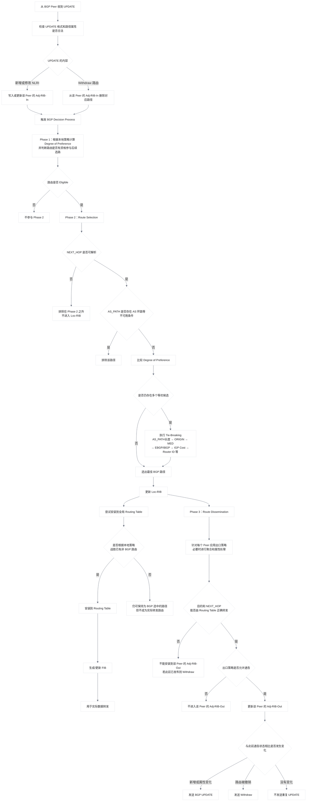
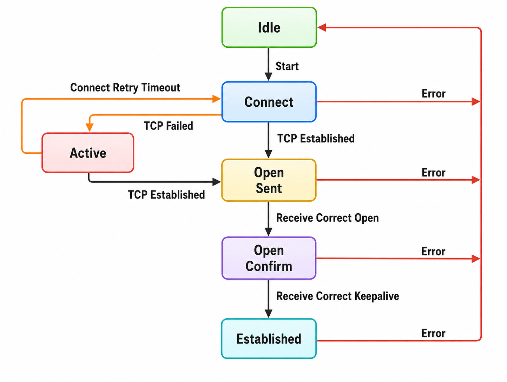
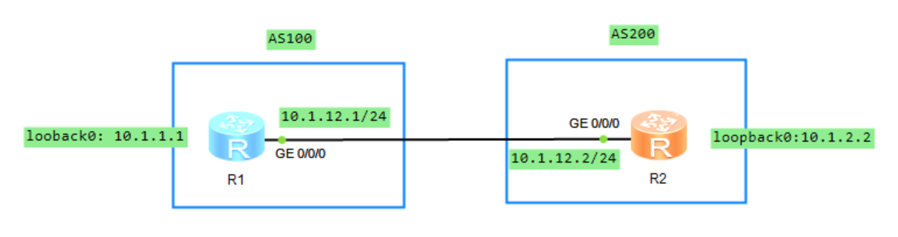

# BGP 邻居

## 1.RFC 4271

### 1.1 BGP 路由信息库和转发表

BGP 仅在 Established 状态接收 UPDATE。设备会先检查 UPDATE 的格式和路径属性是否合法；随后，按发送该 UPDATE 的 Peer 更新对应的 **`Adj-RIB-In`**。

- 收到新的 NLRI：将新路径加入该 Peer 的 **`Adj-RIB-In`**；
- 收到相同 NLRI 但属性不同的路径：以新路径替换旧路径，旧路径被隐式撤销；
- 收到 Withdraw：从该 Peer 的 **`Adj-RIB-In`** 中删除对应路径；
- 更新 **`Adj-RIB-In`** 后：运行 BGP Decision Process。

一个 BGP Speaker 内部的路由信息库（RIB）由三个不同部分组成：

#### 1.1.1 Adj-RIBs-In

**`Adj-RIBs-In`** 用于保存从其他 BGP Speaker 接收到的 UPDATE 消息中学习到的路由信息。其中保存的路由，可以作为 Decision Process 的输入。

从逻辑上说，每个 Peer 都有自己的 **`Adj-RIB-In`**。例如同一个前缀可能同时收到三条路径：

```java{.line-numbers}
Adj-RIB-In from Peer A：10.1.5.0/24，AS_PATH 500
Adj-RIB-In from Peer B：10.1.5.0/24，AS_PATH 600 500
Adj-RIB-In from Peer C：10.1.5.0/24，AS_PATH 700 500
```

这些都是候选路径，后续需要交给 BGP 决策过程。

#### 1.1.2 Loc-RIB

**`Loc-RIB`** 保存本地 BGP Speaker 根据本地策略，从 **`Adj-RIBs-In`** 中选择出的路由信息。这些路由是本地 BGP Speaker 将使用的路由。**`Loc-RIB`** 中每条路由的下一跳，都必须能够通过本地 BGP Speaker 的 Routing Table 解析。

即 **`Loc-RIB`** 保存由本地 BGP Speaker 的决策过程选出的路由，需要注意，**`Loc-RIB`** 是 BGP 协议内部的最佳路径集合，不完全等同于设备的全局 IP 路由表。例如，某个前缀的 BGP 路径已经被 BGP 选为最佳，但设备同时存在一条优先级更高的 OSPF 路由，那么全局 IP 路由表最终使用 OSPF 路径。

#### 1.1.3 Adj-RIBs-Out

**`Adj-RIBs-Out`** 保存本地 BGP Speaker 选定、准备通告给 BGP 邻居的路由信息。保存在 **`Adj-RIBs-Out`** 中的路由，将被封装到本地 BGP Speaker 发送的 UPDATE 消息中，并通告给相应的邻居。**<font color="red">对于不同邻居可能应用不同的出方向策略，因此同一台设备面向不同 Peer 的 **`Adj-RIB-Out`** 可能不同</font>**。

例如，**`Loc-RIB`** 中有：

```java{.line-numbers}
10.1.5.0/24
10.1.6.0/24
10.1.7.0/24
```

面向 Peer A 的出口策略允许全部路由：

```java{.line-numbers}
Adj-RIB-Out to A：
10.1.5.0/24
10.1.6.0/24
10.1.7.0/24
```

面向 Peer B 的出口策略只允许 **`10.1.5.0/24`**：

```java{.line-numbers}
Adj-RIB-Out to B：
10.1.5.0/24
```

总的来说：

- **`Adj-RIBs-In`** 保存邻居通告给本地 BGP Speaker、但尚未完成本地选路处理的路由信息；
- **`Loc-RIB`** 保存本地 Decision Process 选出的路由；
- **`Adj-RIBs-Out`** 按照具体邻居组织准备通告的路由，并通过本地 Speaker 发送的 UPDATE 消息发布出去。
- Routing Table 用于转发数据包的路由信息，包含到直连网络的路由、静态路由、从 IGP 学到的路由、从 BGP 学到的路由等。

某一条具体的 BGP 路由是否应该安装到 Routing Table 中，以及该 BGP 路由是否应该覆盖其他路由协议已经安装到同一目的地的路由，都属于本地策略决定的事项。**<font color="red">除了用于实际数据包转发之外，Routing Table 还用于解析 BGP UPDATE 消息中指定的下一跳地址</font>**。

Decision Process 从本地 **`Adj-RIBs-In`** 中保存的路由开始，按照本地 Policy Information Base，即 PIB 中配置的策略，选择后续需要发布的路由。Decision Process 的输出，是准备向 BGP 邻居发布的路由集合。根据出口策略，这些选出的路由将被保存到本地 Speaker 的 **`Adj-RIBs-Out`** 中。Decision Process 分为三个阶段 Phase1、Phase2、Phase3。

### 1.2 Phase 1 偏好度计算

每当本地 BGP Speaker 从某个邻居收到一条 UPDATE 消息，而该消息通告了新路由、替代路由或撤销路由时，都会调用阶段 1 的决策函数。对于每一条新收到的、或作为替代而收到的可行路由，本地 BGP Speaker 均会确定其偏好程度（Degree of Preference），也就是这条路径在本地的优先程度。

### 1.3 Phase 2 路由选择

Phase 2 决策函数在 Phase 1 完成后启动，负责从 **`Adj-RIBs-In`** 中符合条件的候选路径里，为每个目的前缀选出最佳 BGP 路由。。**<font color="red">如果某条 BGP 路由的 **`NEXT_HOP`** 属性所表示的地址无法解析或者某条 BGP 路由的 **`AS_PATH`** 属性中存在 AS 环路，那么这条 BGP 路由必须排除在 Phase 2 决策之外</font>**。AS 环路检测通过扫描完整的 **`AS_PATH`** 来完成，检查本地系统的 AS 号是否出现在该路径中。

对于 Adj-RIBs-In 中每个存在可行路径的目的地，本地 BGP Speaker 会选择以下三类路由之一：

- 到达该目的地的候选路径中，偏好度最高的路由；
- 到达该目的地的唯一可行路由；
- 多条路径偏好度相同时，按照后续的决胜规则（tie-breaking rules）选出的路由。

随后，本地 BGP Speaker 必须将选中的路由安装到 **`Loc-RIB`**，并替换 **`Loc-RIB`** 中原有的、到达同一目的地的路由。至于这条 BGP 最佳路径能否进一步替换 全局 IP 路由表中已有的非 BGP 路由，则由设备配置的本地策略决定。

对于选中的路由，BGP Speaker 还必须根据其 **`NEXT_HOP`** 属性确定实际用于转发的直接下一跳，也就是说，**`NEXT_HOP`** 往往只是逻辑上的 BGP 下一跳。设备需要通过直连、静态路由或 IGP 路由递归解析，得到实际出接口和直接相邻设备的地址。

在真正通过该 BGP 路由转发数据包之前，设备必须确保 **`NEXT_HOP`** 已经成功解析为一个直接可达的下一跳，并使用这个直接下一跳完成实际转发。无法解析的 BGP 路由必须从 **`Loc-RIB`** 和 Routing Table 中移除。**<font color="red">不过，这些路由应当继续保留在 **`Adj-RIBs-In`** 中，这样，当将来 **`NEXT_HOP`** 恢复可达时，它们仍可重新参与 Phase 2 的选路过程</font>**。

例如：

```java{.line-numbers}
BGP 路由：10.1.5.0/24 → NEXT_HOP 10.1.4.4
OSPF 路由：10.1.4.4/32 → 10.1.23.3，GE0/0/0
```

那么 BGP 下一跳 **`10.1.4.4`** 可以递归为：逻辑 BGP 下一跳 **`10.1.4.4`**、实际直接下一跳 **`10.1.23.3`**、实际出接口 **`GE0/0/0`**。

### 1.4 Phase 3 路由通告

Phase 3 决策函数通常在 Phase 2 完成后运行。此时，Loc-RIB 中的所有路由会按照已配置的出口策略，分别处理并写入对应邻居的 **`Adj-RIBs-Out`**。根据这些策略，某条存在于 Loc-RIB 中的路由，可能不会被加入某个特定邻居的 **`Adj-RIB-Out`**。

当 **`Adj-RIBs-Out`** 和 **`Routing Table`** 都更新完成后，本地 BGP Speaker 将运行 Update-Send 过程。Update-Send 过程负责向符合通告条件的邻居发送 UPDATE 消息。例如，它会将 Decision Process 选出的路由通告给其他 BGP Speaker；这些 Speaker 既可能位于同一个 AS 内，也可能位于相邻的 AS 中。

当 BGP Speaker 从某个内部邻居收到 UPDATE 消息后，除非自身充当 BGP Route Reflector，否则不得将该 UPDATE 中的路由信息再次发布给其他内部邻居。这就是 IBGP 的水平分割规则。

作为 Phase 3 的一部分，BGP Speaker 会先完成 **`Adj-RIBs-Out`** 的更新。随后，所有新加入 **`Adj-RIBs-Out`** 的路由，以及所有刚刚变为不可用且不存在替代路径的路由，都必须通过 UPDATE 消息通告给相应邻居。

- 对于新加入的路由，发送携带该路由的 UPDATE；
- 对于失效且没有替代路径的路由，发送 Withdraw；
- 如果原路径失效，但存在替代路径，则直接发送替代路由的 UPDATE。

如果从 **`Adj-RIBs-Out`** 通告某条可行 BGP 路由时，生成的 UPDATE 与此前已经通告过的路由完全相同，BGP Speaker 则不应重复发送该 UPDATE。

### 1.5 总结

上述过程的流程图如下所示：



## 2.iBGP 和 eBGP 邻接关系

BGP 按照运行方式分为 eBGP（External BGP）和 iBGP（Internal BGP）邻居关系：

- eBGP：运行于不同 AS 之间的 BGP 称为 eBGP。为了防止 AS 间产生环路，当 BGP 设备接收 eBGP 对等体发送的路由时，会将带有本地 AS 号的路由丢弃。
- iBGP：运行在相同的 AS 之内的 BGP 称为 iBGP。为了防止 AS 内产生环路，在 AS 内需要保持全连接的 iBGP 邻居。

### 2.1.iBGP 直连建立邻居

iBGP 直连建立邻居，通常是指两台位于同一 AS 内的路由器存在三层直连链路，并直接使用该链路两端的物理接口 IP 地址作为 BGP Peer 地址。例如 AR1 的接口地址为 **`10.1.12.1/24`**，AR2 为 **`10.1.12.2/24`**，双方分别配置对方的接口地址作为 Peer：

```java{.line-numbers}
              AS 100
AR1 ---------------------- AR2
10.1.12.1/24          10.1.12.2/24
AR1:
    peer 10.1.12.2 as-number 100
AR2:
    peer 10.1.12.1 as-number 100
```

由于双方 Peer 地址本身属于直连网段，因此设备依靠直连路由即可建立 TCP/BGP 会话，一般不需要额外通过 OSPF、IS-IS 或静态路由学习对端 Peer 地址。缺省情况下，BGP 使用通往 Peer 的出接口作为 BGP 报文的源接口。这种方式配置简单，但缺点是 BGP 会话端点与具体物理接口和链路绑定得比较紧。如果该接口或链路发生故障，原来以 **`10.1.12.1 <->10.1.12.2`** 为端点建立的 TCP/BGP 会话通常也会中断。因此为了使物理接口在出现问题时，设备仍能发送 BGP 报文，可将发送 BGP 报文的源接口配置成 Loopback 接口。

>当使用 Loopback 接口建立 BGP 连接时，建议对等体两端同时配置命令 **`peer connect-interface`**，以保证两端连接的正确性。如果仅有一端配置命令，可能会导致 BGP 连接建立失败。

### 2.2 iBGP 非直连建立邻居

iBGP 非直连建立邻居，是指双方配置的 BGP Peer 地址并非三层直连地址，需要依靠 IGP 或静态路由才能到达。实际网络中最典型的方式，就是使用两台路由器的 Loopback 地址建立 iBGP。

>配置 BGP 对等体时，如果指定对等体所属的 AS 编号与本地 AS 编号相同，表示配置 IBGP 对等体。如果指定对等体所属的 AS 编号与本地 AS 编号不同，表示配置 EBGP 对等体。为了增强 BGP 连接的稳定性，推荐使用路由可达的 Loopback 接口地址建立 BGP 连接。

```java{.line-numbers}
                AS 100
AR1 ------------ AR2 ------------ AR3
Lo0                                Lo0
1.1.1.1                           3.3.3.3
       1.1.1.1 <- iBGP -> 3.3.3.3
```

虽然 AR1 和 AR3 的 iBGP 会话端点是 **`1.1.1.1 <-> 3.3.3.3`**，但实际 TCP/BGP 报文可能经过 **`AR1->AR2->AR3`**，因此，在建立 BGP 邻居之前，必须首先通过 OSPF、IS-IS 或静态路由等方式保证 AR1 和 AR3 的 Loopback 地址在网络中是可达的。

使用 Loopback 地址作为 Peer 时，仅配置 **`peer 3.3.3.3 as-number 100`** 只是告诉 AR1 对端 BGP Peer 是 **`3.3.3.3`**，但它并没有指定 AR1 建立 TCP 连接时一定使用自己的 **`1.1.1.1`** 作为源地址。**<font color="red">根据华为的官方文档，缺省情况下 BGP 报文使用出接口作为 BGP 报文的源接口</font>**，**`peer <对端Loopback地址> connect-interface`** 命令的作用就是显式指定与该 Peer 建立 BGP TCP 连接时使用的本地源接口和源地址。

因此使用双方 Loopback 建邻时通常配置：

```java{.line-numbers}
AR1:
    peer 3.3.3.3 as-number 100
    peer 3.3.3.3 connect-interface LoopBack0
AR3:
    peer 1.1.1.1 as-number 100
    peer 1.1.1.1 connect-interface LoopBack0
```

### 2.3 eBGP 直连建立邻居

假设 AR2 属于 AS 234，AR3 属于 AS 432。双方以直连接口地址 10.1.23.2 和 10.1.23.3 互为 Peer，且对端 AS 号与本地 AS 号不同，因此建立的是 eBGP 邻居关系。

```java{.line-numbers}
             EBGP
AR2 --------------------- AR3
AS 234                    AS 432
10.1.23.2                 10.1.23.3
```

由于 Peer 地址位于同一条直连链路上，路由表中已有直连路由，设备可以直接发起 TCP 179 连接，无须额外依赖 OSPF、IS-IS 或静态路由来解析对端 Peer 地址。具体配置如下所示：

```java{.line-numbers}
AR2
    bgp 234
        router-id 2.2.2.2
        peer 10.1.23.3 as-number 432
AR3
    bgp 432
        router-id 3.3.3.3
        peer 10.1.23.2 as-number 234
```

**<font color="red">根据华为文档，缺省情况下，eBGP 连接允许的最大跳数为 1，即只能在物理直连链路上建立 eBGP 连接</font>**。因此这种直接使用物理接口地址建立邻居的场景，对端就是一跳可达，报文能够直接到达对端，因此可以正常建立 TCP 179/BGP 会话，一般不需要配置 **`peer ebgp-max-hop`**。

### 2.4 eBGP 非直连建立邻居

若 AR2 使用 Loopback0 地址 **`10.1.2.2`**，AR4 使用 Loopback0 地址 **`10.1.4.4`** 建立 eBGP 邻居，首先需要通过 IGP 或静态路由保证双方 Loopback 地址具备双向 IP 可达性。同时，应在会话两端配置 **`peer <对端Loopback地址> connect-interface LoopBack0`**，明确指定本地 Loopback0 作为建立 BGP TCP 连接时使用的源接口和源地址。不过除此之外，当双方使用 Loopback 地址建邻时，如果 BGP 报文需要跨越多个 IP 跳数，默认的单跳限制将无法满足会话建立要求。因此，在此类非直连（Multi-hop）eBGP 场景中，还需要在双方配置 **`peer <对端地址> ebgp-max-hop <跳数>`**，适当增大 eBGP 允许的最大跳数。

```java{.line-numbers}
AR2:
    peer 10.1.4.4 ebgp-max-hop 255
AR4:
    peer 10.1.2.2 ebgp-max-hop 255
```

<div align="center">
    
</div>

比如，在上面的 iBGP 全互联拓扑图中，在 AR1 和 AR5 之间建立 eBGP 非直连邻居关系，配置如下：

```java{.line-numbers}
[AR1]bgp 100
[AR1-bgp]peer 10.1.5.5 as-number 500
[AR1-bgp]peer 10.1.5.5 connect-interface LoopBack0
[AR5]bgp 500
[AR5-bgp]peer 10.1.1.1 as-number 100
[AR5-bgp]peer 10.1.1.1 connect-interface LoopBack0
```

配置完成之后，AR1 和 AR5 之间的邻居关系如下所示，AR1 和 AR5 之间的 eBGP 邻居关系处于 Connect 状态，说明双方尚未建立 TCP/BGP 会话。

```java{.line-numbers}
[AR1-bgp]display bgp peer
 BGP local router ID : 1.1.1.1
 Local AS number : 100
 Total number of peers : 2		  Peers in established state : 1
  Peer            V          AS  MsgRcvd  MsgSent  OutQ  Up/Down       State Pre fRcv
  10.1.5.5        4         500        0        0     0 00:00:36     Connect      0
  10.1.12.2       4         234        3        4     0 00:00:51 Established      1
```

在 AR1 和 AR5 上同时配置 **`peer <对端地址> ebgp-max-hop 255`**。

```java{.line-numbers}
[AR1-bgp]peer 10.1.5.5 ebgp-max-hop 255
[AR5-bgp]peer 10.1.1.1 ebgp-max-hop 255
```

配置完成之后，AR1 和 AR5 之间的邻居关系如下所示，AR1 和 AR5 之间的 eBGP 邻居关系处于 Established 状态。

```java{.line-numbers}
[AR1-bgp]display bgp peer

 BGP local router ID : 1.1.1.1
 Local AS number : 100
 Total number of peers : 2		  Peers in established state : 2
  Peer            V          AS  MsgRcvd  MsgSent  OutQ  Up/Down       State Pre  fRcv
  10.1.5.5        4         500        4        5     0 00:00:03 Established       1
  10.1.12.2       4         234       20       22     0 00:17:34 Established       1
```

注意，最开始的时候，只在 AR1 上配置了 **`peer 10.1.5.5 as-number 500`** 和 **`peer 10.1.5.5 ebgp-max-hop 255`**，AR5 上也同理。但是 AR1 和 AR5 之间的 eBGP 邻居关系始终处于 Connect 状态。这是因为未配置 **`connect-interface`** 时，AR1 虽然将 **`10.1.5.5`** 配置为 BGP 邻居，但设备默认使用 BGP 报文的出接口作为 TCP 源接口，因此 AR1 会使用 **`10.1.12.1`** 作为源地址，同理，AR5 可能使用 **`10.1.45.5`** 作为源地址。

这样，AR5 收到的 BGP 报文源地址是 **`10.1.12.1`**，但它配置的邻居是 **`10.1.1.1`**，因此虽然 TCP 报文能够到达对端，但无法识别，因此无法正常交换 BGP OPEN 报文，状态就会停留在 Connect 并不断重试。

在 AR1 和 AR5 上配置 **`connect-interface LoopBack0`** 后，AR1 和 AR5 分别使用自己的 Loopback 地址作为 TCP 源地址：

```java{.line-numbers}
AR1：10.1.1.1 -> 10.1.5.5
AR5：10.1.5.5 -> 10.1.1.1
```

此时，TCP 源地址与对端配置的 BGP 邻居地址完全一致，BGP 会话最终进入 Established 状态。

## 3.BGP 邻居建立

### 3.1 BGP 的路由器标识

BGP 的 **`Router_ID`** 是一个用于标识 BGP 设备的 32 位的值，通常是 IPv4 地址的形式，在 BGP 会话建立时发送的 Open 报文中携带。**<font color="red">对等体之间建立 BGP 会话时，每个 BGP 设备都必须有唯一的 `Router_ID`，否则对等体之间不能建立 BGP 连接</font>**。

BGP 的 **`Router_ID`** 在 BGP 网络中必须是唯一的，可以采用手动配置，也可以让 BGP 自己在设备上选取。缺省情况下，BGP 选择设备上的 Loopback 接口的 IPv4 地址作为 BGP 的 **`Router_ID`**。如果设备上没有配置 Loopback 接口，系统会选择接口中最大的 IPv4 地址作为 BGP 的 **`Router_ID`**。一旦选出 **`Router_ID`**，除非发生进程重启或接口地址删除等事件，否则即使配置了更大的地址，也保持原来的 **`Router_ID`**。

### 3.2 BGP 有限状态机

BGP 的有限状态机描述了 BGP 的邻居的建立和维护过程，状态机共分为 6 种，分别是 Idle、Connect、Active、OpenSent、OpenConfirm 和 Established。具体如下图所示：

<div align="center">
    
</div>

#### 3.2.1 Idle 状态

BGP 空闲状态，在 Idle 状态下 BGP 拒绝邻居发送的连接请求，此时在等待由 BGP 系统发出的 Start 事件。Start 事件发生后，BGP 会对自己的资源进行初始化、重置连接计时器（Connect Retry 缺省为 32s），发起 TCP 连接请求，并且开始侦听远端对等体发起连接的端口，并转至 Connect 状态。**Start 事件是由一个操作者配置一个 BGP 过程，或者重置一个已经存在的过程，或者路由器软件重置 BGP 过程引起的**。

任何状态中收到 Notification 报文或 TCP 拆除链路通知等 Error 事件后，BGP 都会转至 Idle 状态。

#### 3.2.2 Connect 状态

在 Connect 状态下，BGP 启动连接重传定时器，等待 TCP 完成连接。

- 如果 TCP 连接成功，那么 BGP 向对等体发送 BGP Open 报文，并转至 OpenSent 状态。
- 如果 TCP 连接失败，那么 BGP 转至 Active 状态。
- 如果连接重传定时器超时，BGP 仍没有收到 BGP 对等体的响应，那么 BGP 继续尝试和其他 BGP 对等体进行 TCP 连接，停留在 Connect 状态。
- 如果发生其他事件（如 BGP 系统或者操作人员启动的），则退回到 Idle 状态。

#### 3.2.3 Active 状态

在 Active 状态下，此时 BGP 已经意识到上一次 TCP 建立明确失败了，BGP 总是在试图建立 TCP 连接。

- 如果 TCP 连接成功，那么 BGP 向对等体发送 Open 报文，关闭连接重传定时器，并转至 OpenSent 状态。
- 如果 TCP 连接失败，那么 BGP 停留在 Active 状态。
- 如果连接重传定时器超时，仍没有收到 BGP 对等体的响应，那么 BGP 转至 Connect 状态。
- 如果发生其他事件（如 BGP 系统或操作人员停止连接），则退回到 Idle 状态。

Connect 表示 BGP 正在等待一次 TCP 连接建立完成，或者刚刚发起了一次新的 TCP 连接尝试。此时如果 TCP 三次握手成功，BGP 会立即发送 OPEN 报文，并进入 OpenSent。如果这次 TCP 建立失败，BGP 会转入 Active，等待下一轮重试。Active 表示之前的一次 TCP 建连尝试已经明确失败。设备仍会监听并尝试与同一个配置的邻居建立 TCP 连接。如果继续失败，就仍停留在 Active，当 **`ConnectRetryTimer`** 超时后，BGP 再次发起一轮 TCP 连接，并切回 Connect 状态。

#### 3.2.4 OpenSent 状态

在 OpenSent 状态下，BGP 等待对等体的 Open 报文，并对收到的 Open 报文中的 AS 号、版本号、认证码等进行检查。如果收到的 Open 报文正确，那么 BGP 发送 Keepalive 报文，且重置 Keepalive 定时器，并转至 OpenConfirm 状态。

#### 3.2.5 OpenConfirm 状态

在 OpenConfirm 状态下，BGP 等待 Keepalive 报文。如果收到 Keepalive 报文，则转至 Established 状态。

#### 3.2.6 Established 状态

在 Established 状态下，BGP 可以和对等体交换 Update、Keepalive、Route-refresh 报文和 Notification 报文。

- 如果收到正确的 Update 或 Keepalive 报文，那么 BGP 就认为对端处于正常运行状态，将保持 BGP 连接。
- 如果收到错误的 Update 或 Keepalive 报文，那么 BGP 发送 Notification 报文通知对端，并转至 Idle 状态。
- Route-refresh 报文不会改变 BGP 状态。
- 如果收到 Notification 报文，那么 BGP 转至 Idle 状态。
- 如果收到 TCP 拆除链接通知，那么 BGP 将断开连接，转至 Idle 状态。

## 4.BGP 邻居建立过程实例

### 4.1 eBGP 配置

<div align="center">
    
</div>

如上图所示，R1 与 R2 建立 eBGP 的邻居关系，通过 debugging 信息来查看 BGP 邻居建立的全过程以及状态的变化，具体配置如下所示。

```java{.line-numbers}
#
sysname AR1
#
interface GigabitEthernet0/0/0
 ip address 10.1.12.1 255.255.255.0 
#
interface LoopBack0
 ip address 10.1.1.1 255.255.255.0 
#
bgp 100
 router-id 1.1.1.1
 peer 10.1.2.2 as-number 200 
 peer 10.1.2.2 ebgp-max-hop 255 
 peer 10.1.2.2 connect-interface LoopBack0
 #
 ipv4-family unicast
  undo synchronization
  network 10.1.1.0 255.255.255.0 
  peer 10.1.2.2 enable
#
ip route-static 10.1.2.2 255.255.255.255 10.1.12.2
#
sysname AR2
#
interface GigabitEthernet0/0/0
 ip address 10.1.12.2 255.255.255.0 
#
interface LoopBack0
 ip address 10.1.2.2 255.255.255.0 
#
bgp 200
 router-id 2.2.2.2
 peer 10.1.1.1 as-number 100 
 peer 10.1.1.1 ebgp-max-hop 255 
 peer 10.1.1.1 connect-interface LoopBack0
 #
 ipv4-family unicast
  undo synchronization
  network 10.1.2.0 255.255.255.0 
  peer 10.1.1.1 enable
#
ip route-static 10.1.1.1 255.255.255.255 10.1.12.1
```

在上述配置过程中，使用 AR1 和 AR2 上的 Loopback 接口的 IP 地址建立 EBGP 连接时，需要满足以下 3 个条件，AR1 和 AR2 之间的 eBGP 邻居关系才能建立成功：

- 对端 Loopback 地址可达；
- 配置 **`connect-interface LoopBack0`** 命令；
- 配置 **`ebgp-max-hop n（n>=2）`** 命令；

#### 4.1.1 对端 Loopback 地址必须可达

为增强 BGP 连接的稳定性，建议使用可达的 Loopback 接口地址建立 BGP 连接。这是因为 BGP 是基于 TCP 建立会话，如果 AR1 没有到 AR2 Loopback 地址的路由，AR1 就无法向该地址发起 TCP/179 连接，因此源和目的地址为 Loopback 的 TCP 连接也建立不起来。实际配置中，通常通过静态路由或 IGP 保证双向可达。所以在 AR1 和 AR2 上分别配置静态路由，保证双方 Loopback 地址可达。

```java{.line-numbers}
[AR1] ip route-static 10.1.2.2 255.255.255.255 10.1.12.2
[AR2] ip route-static 10.1.1.1 255.255.255.255 10.1.12.1
```

注意，如果只在 AR1 和 AR2 上分别配置 **`network 10.1.1.1 24`** 和 **`network 10.1.2.2 24`**，不配置静态路由，会成功将各自本地存在的直连 Loopback 网段引入本机 BGP 表，但是由于 AR1 和 AR2 之间的 ebgp 邻居关系尚未建立，因此双方无法交换 BGP UPDATE 报文，将各自的 Loopback 网段发送给对方。

#### 4.1.2 配置 **`connect-interface`**

当 AR1、AR2 使用 Loopback 地址建立 eBGP 邻居时，配置中的邻居地址分别是 **`10.1.2.2`** 和 **`10.1.1.1`**。因此，双方都期望收到一个源地址为对端 Loopback 地址的 TCP/179 连接。如果不配置 **`connect-interface LoopBack0`**，华为设备默认使用实际出接口作为 BGP TCP 报文的源接口。由于 AR1 是直连接到 AR2 的 Loopback 地址，AR1 发起 TCP 连接时，源地址通常会是 **`10.1.12.1`**：

```java{.line-numbers}
AR1 实际发起：10.1.12.1 -> 10.1.2.2:179
AR2 实际发起：10.1.12.2 -> 10.1.1.1:179
```

但 AR2 配置的 BGP 邻居是 **`10.1.1.1`**，AR2 接收发现 TCP 连接的源地址（**`10.1.12.1`**）与已配置的 Peer 地址不匹配，便无法识别这个 BGP 邻居会话。配置 **`connect-interface LoopBack0`** 后，设备会强制使用 Loopback0 作为 BGP TCP 连接的源接口：

```java{.line-numbers}
AR1：10.1.1.1 -> 10.1.2.2:179
AR2：10.1.2.2 -> 10.1.1.1:179
```

这样，TCP 连接的源地址与对端配置的 BGP Peer 地址一致，双方才能正确识别彼此、交换 OPEN 报文。

#### 4.1.3 配置 **`ebgp-max-hop`**

当使用 Loopback 接口地址建立 eBGP 连接时，必须执行 **`peer ebgp-max-hop n（n>=2）`** 命令，并将跳数配置为大于或等于 2，否则，eBGP 连接无法建立。即使 eBGP 对等体通过直连链路相连、但使用 Loopback 接口建立邻居关系，则跳数必须不小于 2。

### 4.2 eBGP 邻居建立日志

第 1 步：在 Idle 状态下等待 start 事件发生，发起 TCP 会话连接请求。当前 start 事件已经产生，等待建立 TCP 连接，并将状态切换到 connect 状态。

```java{.line-numbers}
Aug 19 2026 20:54:38.440.1-08:00 AR1 RM/6/RMDEBUG:
 BGP_TIMER: CR Timer Expired for Peer 10.1.2.2 

Aug 19 2026 20:54:38.440.2-08:00 AR1 RM/6/RMDEBUG:
 BGP.public: 10.1.2.2 Current event is CRTimerExpired.

Aug 19 2026 20:54:38.440.3-08:00 AR1 RM/6/RMDEBUG:
 BGP.public: 10.1.2.2 Current event is Start.
```

第 2 步：由 Idle 状态切换到 Connect 状态，等待 TCP 的会话建立。当前已由 Idle 状态切换到 Connect 状态，收到对方地址 **`10.1.2.2`** 的响应报文。TCP 会话建立成功，接下来需要互相发送 Open 报文来建立 BGP 邻居关系。

```java{.line-numbers}
Aug 19 2026 21:23:48.750.4-08:00 AR1 RM/6/RMDEBUG:
 BGP.Public: 10.1.2.2 State is changed from IDLE to CONNECT.

Aug 19 2026 21:23:48.780.1-08:00 AR1 RM/6/RMDEBUG:
 BGP.Public: Connect callback recv for peer 10.1.2.2 on socket 12.

Aug 19 2026 21:23:48.780.2-08:00 AR1 RM/6/RMDEBUG:
 BGP.Public: Connected to peer 10.1.2.2 on socket 12.
```

第 3 步：发送 Open 报文协商相应参数。发送 Open 报文到目标地址 **`10.1.2.2`**，且报文中的本地 AS 为 100，最大保持时间为 180s，本地的 **`Router_ID`** 为 **`1.1.1.1`**，且携带了需要协商的能力参数。状态由 Connect 切换到 OpenSent 状态。

```java{.line-numbers}
Aug 19 2026 21:23:48.780.3-08:00 AR1 RM/6/RMDEBUG:
	BGP.Public: Send OPEN MSG to peer 10.1.2.2, Version: 4
	Local AS: 100, HoldTime: 180, Router ID: 1.1.1.1

Aug 19 2026 21:23:48.780.4-08:00 AR1 RM/6/RMDEBUG:
	OPT Type:   2 (Capability)    
	CAP Type:   1 (Multiprotocol)  CAP Len:  4   
		                       IPv4-UNC (1/1)
	CAP Type:   2 (RouteRefresh)   CAP Len:  0                      // 支持 Route Refresh，建立后可以请求对端重新发送路由，而不必重建 BGP 邻居
	CAP Type:  65 (4-byte-as)      CAP Len:  4   AS number: 100     // 支持 4 字节 AS 号

	Total CAPB Len    : 14
	Total OPT Len     : 16 
	Total Message Len : 45 

Aug 19 2026 21:23:48.780.5-08:00 AR1 RM/6/RMDEBUG:
	BGP: Sent to 10.1.2.2 (AS Number: 200)
	
	(Displaying bytes from 1 to 45)
	FF FF FF FF FF FF FF FF FF FF FF FF FF FF FF FF 
	00 2D 01 04 00 64 00 B4 01 01 01 01 10 02 0E 01 
	04 00 01 00 01 02 00 41 04 00 00 00 64 
	
Aug 19 2026 21:23:48.780.6-08:00 AR1 RM/6/RMDEBUG:
 BGP.Public: Send OPEN MSG to peer 10.1.2.2 (SockID 12) on socket 12.

Aug 19 2026 21:23:48.780.7-08:00 AR1 RM/6/RMDEBUG:
 BGP.Public: 10.1.2.2 State is changed from CONNECT to OPENSENT.
```

第 4 步：协商对方的 Open 报文。从 **`10.1.2.2`** 收到了 Open 报文，其本地 AS 号为 200，最大保持时间为 180s，**`Router_ID`** 为 **`2.2.2.2`**，协商双方的 Open 报文，如果协商成功，由 OpenSent 切换到 OpenConfirm 状态。

```java{.line-numbers}
Aug 19 2026 21:23:48.800.1-08:00 AR1 RM/6/RMDEBUG:
 BGP: peer 10.1.2.2 (SockID 12) reads 45 bytes on socket 12.

Aug 19 2026 21:23:48.800.2-08:00 AR1 RM/6/RMDEBUG:
	BGP: Received from 10.1.2.2 (AS Number: 200)
	
	(Displaying bytes from 1 to 45)
	FF FF FF FF FF FF FF FF FF FF FF FF FF FF FF FF 
	00 2D 01 04 00 C8 00 B4 02 02 02 02 10 02 0E 01 
	04 00 01 00 01 02 00 41 04 00 00 00 C8 
	
Aug 19 2026 21:23:48.800.3-08:00 AR1 RM/6/RMDEBUG:
	BGP.Public: Recv OPEN MSG from peer 10.1.2.2 Length: 45
	Version: 4, Remote AS: 200, HoldTime : 180,
	Router ID: 2.2.2.2, TotOptLen: 16 

	OPT Type:   2 (Capability)     OPT Len: 14
	CAP Type:   1 (Multiprotocol)  CAP Len:  4   
		                       IPv4-UNC (1/1)
	CAP Type:   2 (RouteRefresh)   CAP Len:  0   
	CAP Type:  65 (4-byte-as)      CAP Len:  4   AS number: 200

Aug 19 2026 21:23:48.800.4-08:00 AR1 RM/6/RMDEBUG:
 BGP.public: 10.1.2.2 Current event is ReceiveOpenMessage.

Aug 19 2026 21:23:48.800.5-08:00 AR1 RM/6/RMDEBUG:
	BGP.Public: Send KEEPALIVE MSG to peer 10.1.2.2
	Length 19 
Aug 19 2026 21:23:48.800.6-08:00 AR1 RM/6/RMDEBUG:
	BGP: Sent to 10.1.2.2 (AS Number: 200)
	
	(Displaying bytes from 1 to 19)
	FF FF FF FF FF FF FF FF FF FF FF FF FF FF FF FF 
	00 13 04 
	
Aug 19 2026 21:23:48.800.7-08:00 AR1 RM/6/RMDEBUG:
 BGP.Public: 10.1.2.2 State is changed from OPENSENT to OPENCONFIRM.
```

第 5 步：等待接收 Keepalive 报文。当收到 keepalive 报文后，由 OpenConfirm 切换到 Established 状态。

```java{.line-numbers}
Aug 19 2026 21:23:48.800.8-08:00 AR1 RM/6/RMDEBUG:
 BGP peer 10.1.2.2 socket reading paused and wait for call
Aug 19 2026 21:23:48.800.9-08:00 AR1 RM/6/RMDEBUG:
 BGP: peer 10.1.2.2 (SockID 12) socket gets resume call to continue reading 
 to parsing
Aug 19 2026 21:23:48.800.10-08:00 AR1 RM/6/RMDEBUG:
 BGP peer: 10.1.2.2, SockID: 12, Read Sock API: Socket is in progress

Aug 19 2026 21:23:48.830.1-08:00 AR1 RM/6/RMDEBUG:
 BGP: peer 10.1.2.2 (SockID 12) reads 19 bytes on socket 12.

Aug 19 2026 21:23:48.830.2-08:00 AR1 RM/6/RMDEBUG:
	BGP: Received from 10.1.2.2 (AS Number: 200)
	
	(Displaying bytes from 1 to 19)
	FF FF FF FF FF FF FF FF FF FF FF FF FF FF FF FF 
	00 13 04 
	
Aug 19 2026 21:23:48.830.3-08:00 AR1 RM/6/RMDEBUG:
	BGP.Public: Recv KEEPALIVE MSG from peer 10.1.2.2
	Length: 19  
Aug 19 2026 21:23:48.830.4-08:00 AR1 RM/6/RMDEBUG:
 BGP.public: 10.1.2.2 Current event is RecvKeepAliveMessage.

Aug 19 2026 21:23:48.830.5-08:00 AR1 RM/6/RMDEBUG:
 BGP.Public: 10.1.2.2 State is changed from OPENCONFIRM to ESTABLISHED.

Aug 19 2026 21:23:48.830.6-08:00 AR1 RM/6/RMDEBUG:
 BGP_GR: Session Up Count INCR : 1 
```

BGP 依靠 TCP 来传输，**<font color="red">底层的 TCP 会话建立成功才能够建立 BGP 邻居关系</font>**，任何错误事件都将导致邻居状态回到 Idle，重新尝试建立 TCP 会话。BGP 对等体之间无法建立邻居主要体现在邻居状态无法进入到 Established 状态，有可能处于 Idle、Connect、Active 状态，如果处于这三种状态，说明 BGP 会话没有建立成功，如果处于 OpenSent、OpenConfirm 则说明邻居协商出现问题。以下总结了邻居无法建立的一些因素：

- 两边 BGP peer 地址不可达，一般是底层原因或者缺少可达的路由；
- 对等体 AS 配置错误；
- eBGP 的跳数问题；
- BGP 的认证错误；
- Open 报文协商失败，Open 报文需要协商 BGP 版本、Holdtime、**`Router_ID`** 以及可选项参数（包括各种能力参数）等；
- BGP 的 Router ID 冲突；
- 联盟与非联盟之间的 BGP 连接配置错误；

BGP 设备将最优路由加入 BGP 路由表，形成 BGP 路由。BGP 设备与对等体建立邻居关系后，采取以下交互原则：

- **<font color="red">从 iBGP 对等体收到的路由，BGP 设备只发布给它的 eBGP 对等体（水平分割）</font>**。
- **<font color="red">从 eBGP 对等体收到的路由，BGP 设备发布给它所有 eBGP 和 iBGP 对等体</font>**。
- BGP 设备只将最优路由发布给对等体。
- 路由更新时，BGP 设备只发送更新的 BGP 路由。
- 所有对等体发送的路由，BGP 设备都会接收。