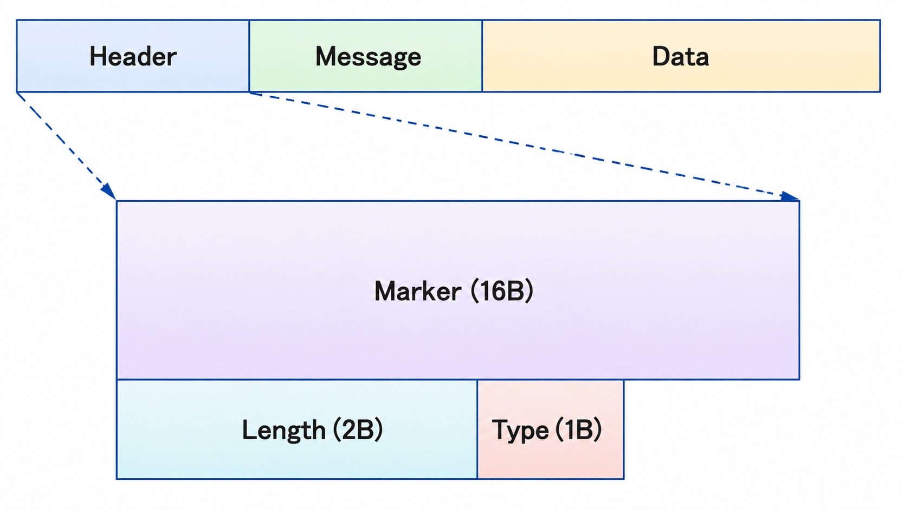
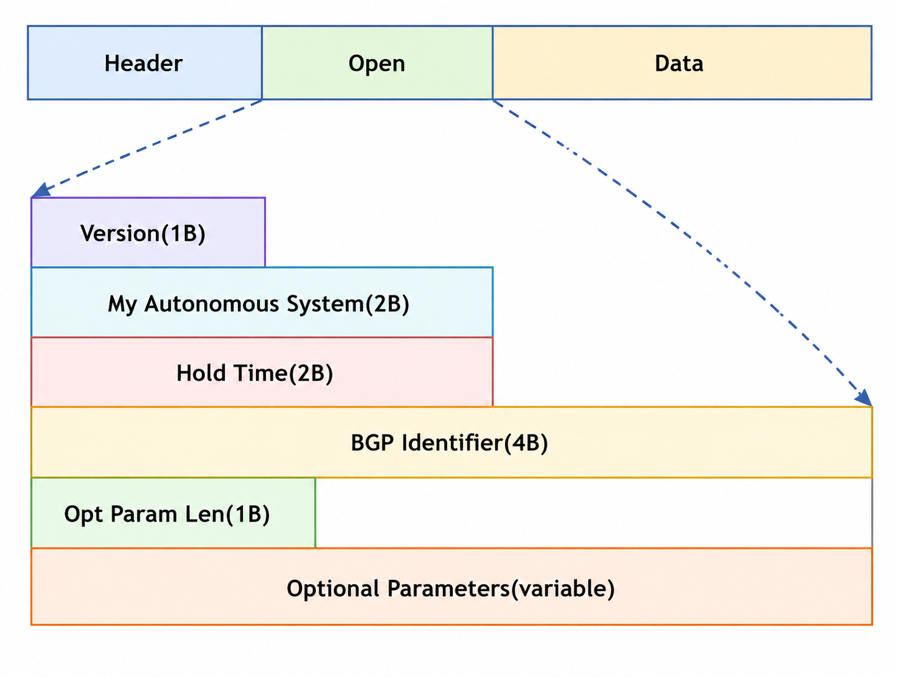
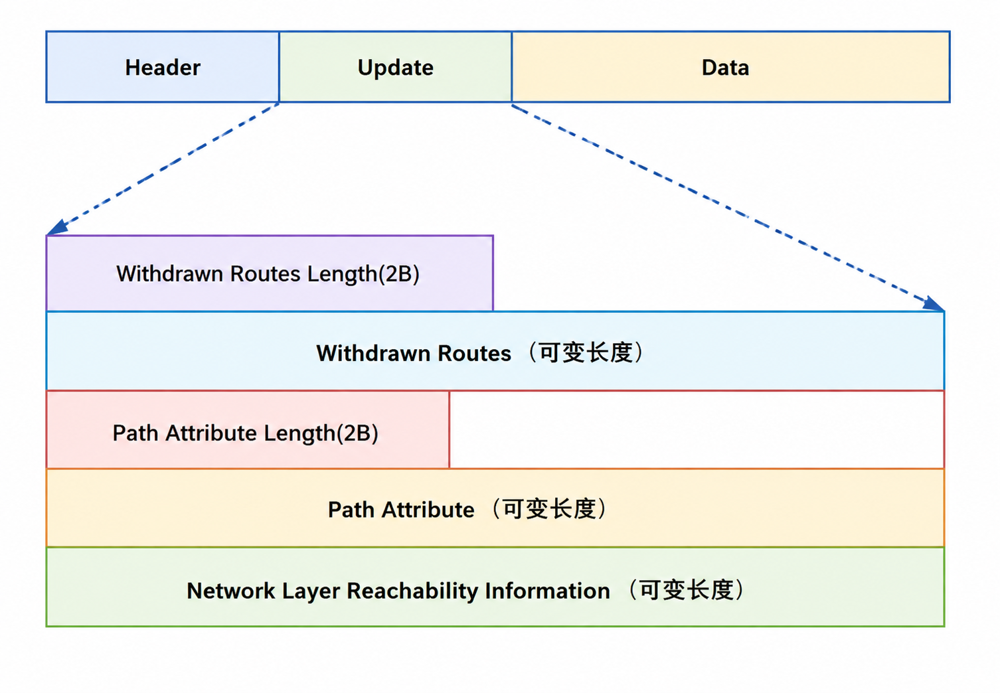
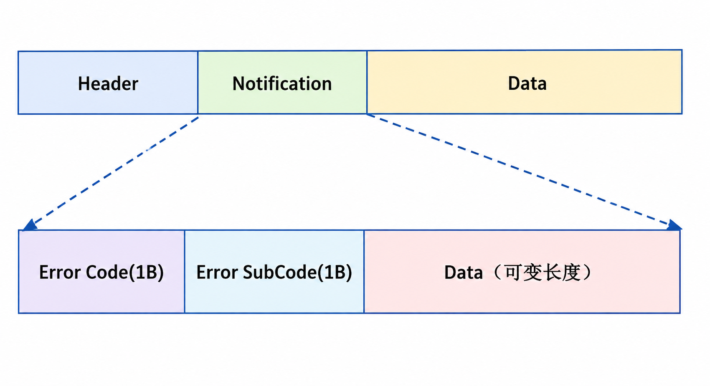
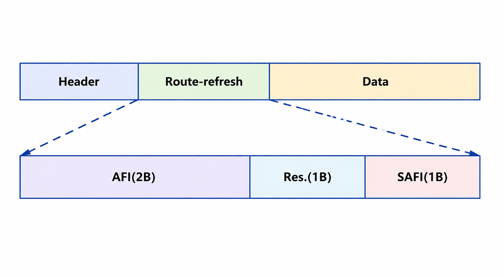

# BGP 邻居

## 5.BGP 报文结构

由于 BGP 是承载在 TCP 之上的协议，**<font color="red">在建立一个 BGP 对等体之前必须建立标准的 TCP 三次握手，并且在目标端打开一个到端口为 179 的连接</font>**，TCP 能够提供可靠的传输方式，可以进行重传、确认及排序功能。BGP 不需要开发确认报文，因为所有的确认都由 TCP 层来提供，从而可以减少 BGP 的报文数量，**<font color="red">BGP 所有报文均采用单播的方式来发送</font>**，因此不能够自动地发现邻居。

BGP 具有五种报文类型：

- Open
- Keepalive
- Update
- Notification
- Route-refresh

## 6.Open 报文

TCP 会话建立起来以后，两个邻居都要发送一个 Open 报文，每个邻居都使用该报文来标识自己，并且规定自己运行 BGP 的参数，Open 报文是由报文头部加上报文主体部分，报文头结构如下图所示。

<div align="center">
    <div align="center" style="color: #F14; font-size:13px; font-weight:bold">Open 报文头格式</div>
    
</div>

下面是实际的 Open 报文数据：

```java{.line-numbers}
Aug 19 2026 21:23:48.780.3-08:00 AR1 RM/6/RMDEBUG:
	BGP.Public: Send OPEN MSG to peer 10.1.2.2, Version: 4
	Local AS: 100, HoldTime: 180, Router ID: 1.1.1.1

Aug 19 2026 21:23:48.780.4-08:00 AR1 RM/6/RMDEBUG:
	OPT Type:   2 (Capability)    
	CAP Type:   1 (Multiprotocol)  CAP Len:  4   
		                       IPv4-UNC (1/1)
	CAP Type:   2 (RouteRefresh)   CAP Len:  0                      // 支持 Route Refresh，建立后可以请求对端重新发送路由，而不必重建 BGP 邻居
	CAP Type:  65 (4-byte-as)      CAP Len:  4   AS number: 100     // 支持 4 字节 AS 号

	Total CAPB Len    : 14
	Total OPT Len     : 16 
	Total Message Len : 45 

Aug 19 2026 21:23:48.780.5-08:00 AR1 RM/6/RMDEBUG:
	BGP: Sent to 10.1.2.2 (AS Number: 200)
	
	(Displaying bytes from 1 to 45)
	FF FF FF FF FF FF FF FF FF FF FF FF FF FF FF FF                  // Marker 标记 16 字节
	00 2D 01 04 00 64 00 B4 01 01 01 01 10 02 0E 01                  // Length: 45，Type：1（Open 报文），BGP-4 版本，AR1 的本地 AS 号为 100，holdtime 为 180
	04 00 01 00 01 02 00 41 04 00 00 00 64                           // AR1 的 router-id 为 1.1.1.1 
	
Aug 19 2026 21:23:48.780.6-08:00 AR1 RM/6/RMDEBUG:
 BGP.Public: Send OPEN MSG to peer 10.1.2.2 (SockID 12) on socket 12.

Aug 19 2026 21:23:48.780.7-08:00 AR1 RM/6/RMDEBUG:
 BGP.Public: 10.1.2.2 State is changed from CONNECT to OPENSENT.
```

Marker（标记）：16Byte，该标记字段用于检测 BGP 对等体之间的同步丢失情况。并且在支持验证功能的情况下进行消息验证，但是在最新的 RFC4271 文档中，该功能已经废弃。在现行 RFC 4271 中，16 字节的 Marker 字段必须全部为 1，它现在主要是为了兼容早期 BGP 设计而保留。**<font color="red">接收端如果发现 Marker 不是预期的全 1，就认为 BGP 报文头的同步出现异常，并报告 `Connection Not Synchronized`</font>**。

Length（长度）：2Byte 无符号整数，指定了消息的全长，包括头部，BGP 报文总长度在 **`19～4096Byte`** 之间。在上面的示例中，Length 字段的值为 **`00 2D`**，也就是 Open 报文的总长度为 45 字节。

Type（类型）：1Byte，标识 BGP 的报文类型，有以下几种消息类型。

- Type 1：OPEN 报文，建立 BGP 邻居时交换版本、AS 号、Hold Time、Router ID 和能力参数；
- Type 2：UPDATE，发布新路由、修改已发布路由的属性，或撤销路由；
- Type 3：NOTIFICATION，报告协议错误；发送后通常关闭 BGP 会话；
- Type 4：KEEPALIVE，确认 OPEN 协商成功，并在会话建立后维持邻居存活；

<div align="center">
    <div align="center" style="color: #F14; font-size:13px; font-weight:bold">Open 报文格式</div>
    
</div>

BGP 版本号：1Byte，标识 BGP 的对等体在使用的版本，缺省版本都为 BGP-4，如果邻居运行的是较早的版本，那么它将会拒绝 Version 4 的消息。

My AS（自身 AS 号）：2Byte，BGP 路由器的 AS 号，它用来决定该 BGP 会话是 eBGP 还是 iBGP（**<font color="red">具有相同的 AS 号的邻居为 iBGP 邻居，不同则为 eBGP 邻居</font>**），范围从 **`1～65535`**（目前也有 4Byte 的 AS 号，范围从 **`1～4294967295`**）。

Hold time（保持时间）：2Byte，对等体之间相互协商的最大保持时间，一般为 Keepalive 时间的 3 倍，缺省情况下保持时间为 180s。**<font color="red">保持时间是一个计数器，从 0 一直增加到该值，等待接收 Keepalive（每隔 60s 发送一次）或者 Update 报文，收到后将保持时间清零，如在保持时间内没有收到报文则认为邻居失效</font>**。如果 BGP 对等体之间协商的保持时间不一致，将会采用较短的时间作为保持时间。最小可以为 0，这种情况下 BGP 连接被认为永远是 UP，对等体之间不会发送 Keepalive 报文来检测邻居是否失效。

BGP identifier：4Byte，用来标识 BGP 对等体的 **`Router_ID`**，也可以手工强制指定。

Opt Param Len：1Byte，指示接下来可选参数字段的整体长度，用 Byte 来表示，如果这个字段为 0，那么该消息中没有包含的可选参数字段。

Optional parameters：可变长的字段，用于 BGP 邻居会话协商过程中所使用的可选参数列表。每一个参数为一个（参数类型、参数长度、参数值）三元组，这个字段用于公布一些可选功能的支持，如多协议扩展能力、路由刷新能力、四字节 AS 号等能力。

>如果 BGP 路由器支持能力协商，在向对等体发送 Open 消息的时候，**在消息当中可以包括可选能力参数，BGP 将会检查其中的信息，以确保对等体所支持的能力，如果对等体支持，那么就可以使用该能力**。如果对等体发送 Notification 消息，且错误子码中被设置为"不可支持的可选参数"，则说明对等体不支持该能力，此时 BGP 将尝试重建邻居，且不再发送能力参数。

## 7.Keepalive 报文

Keepalive 消息以保持时间（holdtime）的 1/3 的时间间隔进行交互，用于检测 TCP 连接是否正常，但是不能够低于 1s，**<font color="red">如果保持时间协商为 0，那么不会发送 Keepalive 消息</font>**。Keepalive 消息只包含 BGP 消息头部，在发送消息的时间间隔内，如果 BGP 发送过 Update 消息，就会抑制 Keepalive 消息的发送。

## 8.Update 报文

Update 消息用来通告可达路由和不可达路由，消息主要包含以下内容。

<div align="center">
    <div align="center" style="color: #F14; font-size:13px; font-weight:bold">Update 报文格式</div>
    
</div>

NLRI（网络层可达信息）：可变长字段，包括一个字节组（长度、前缀）列表，长度部分用比特来表示下面的前缀长度，前缀是 NLRI 的 IP 地址前缀。例如 **`<24, 192.168.10.0>`** 表示前缀为 **`192.168.10.0`**、掩码为 **`255.255.255.0`** 的网络，如果长度为 0 则表示该前缀与所有的 IP 地址匹配。

**`Path attributes`**（路径属性）：可变长字段，列出与下面 NLRL 相关的属性，每个路径属性都由可变长的三元组（属性类型、属性长度、属性值）组成，为 BGP 提供选择最短路径、检查路由环路以及决定路由策略的信息。属性类型是一个 2Byte 的字段，包含 1Byte 的属性标记、1Byte 的属性类型代码字段。

```java{.line-numbers}
               0                   1
               0 1 2 3 4 5 6 7 8 9 0 1 2 3 4 5
               +-+-+-+-+-+-+-+-+-+-+-+-+-+-+-+-+
               |  Attr. Flags  |Attr. Type Code|
               +-+-+-+-+-+-+-+-+-+-+-+-+-+-+-+-+
```

从该字段的格式前两位标记字段来看，可以将属性分为四种组合，即公认必遵、公认任意、可选过渡、可选非过渡。

**（1）属性的第 0 位**

属性的第 0 位表示属性是公认的还是可选的（0：公认，1：可选）。公认属性（Well-known）是协议标准强制要求所有厂商的 BGP 实现都必须识别并理解的属性。任何一台符合标准的 BGP 路由器遇到这类属性，都能正确读取其含义。可选属性（Optional）是属于协议的扩展功能，不要求所有 BGP 路由器都识别。

**（2）属性的第 1 位**

属性的第 1 位表示属性是过渡还是非过渡（0：非过渡，1：过渡）。过渡属性（Transitive）是如果 BGP 路由器无法识别该属性，它依然必须保留该属性，并在将路由转发给其他对等体时继续传递下去。非过渡属性（Non-transitive）是如果 BGP 路由器无法识别该属性，它会自动将该属性悄悄丢弃/忽略，转发路由时不会将其带给下一个对等体。公认属性总是可过渡的。

上述四种组合的属性类型如下：

- 公认必遵（Well-known Mandatory）：所有 BGP 设备必须识别此类属性，且在发出的 **`UPDATE`** 报文中必须包含。因为所有符合标准的设备都强制要求能够识别，所以不存在"无法识别"的处理机制。典型的公认必遵属性包括 **`ORIGIN`**、**`AS_PATH`** 和 **`NEXT_HOP`**。
- 公认自选（Well-known Discretionary）：所有 BGP 设备必须识别此类属性，**<font color="red">但在发出的 **`UPDATE`** 报文中可以根据需要选择性包含</font>**。因为所有符合标准的设备都强制要求能够识别，所以同样不存在"无法识别"的处理机制。典型的公认自选属性包括 **`LOCAL_PREF`** 和 **`ATOMIC_AGGREGATE`**。
- 可选过渡（Optional Transitive）：BGP 设备不一定需要识别此类属性，在 **`UPDATE`** 报文中属于可选包含。如果设备无法识别该属性，其处理机制是保留该属性并继续转发传递给其他对等体。典型的可选过渡属性包括 **`COMMUNITY`** 和 **`AGGREGATOR`**。
- 可选非过渡（Optional Non-transitive）：BGP 设备不一定需要识别此类属性，在 **`UPDATE`** 报文中属于可选包含。如果设备无法识别该属性，其处理机制是直接丢弃该属性，不再继续向后传递。典型的可选非过渡属性包括 **`MED`**、**`ORIGINATOR_ID`** 和 **`CLUSTER_LIST`**。

**（3）属性的第 2 位**

属性的第 2 位表示可选过渡属性中的信息是完全的还是部分的（0：完全，1：部分）。完全（0/Complete）表示该属性从发送源头一路传递到当前路由器的整条路径上，所有途经的 BGP 路由器都能正确识别并处理该属性。属性所承载的策略信息在传输链条中是完好无缺、未被忽视的。部分的（1/Partial）表示该属性在沿途传输时，至少经过了一台"无法识别/不支持该属性"的 BGP 路由器。虽然属性被透传了下来，但中间节点并未对其进行策略解析或处理。

**（4）属性的第 3 位**

属性的第 3 位表示属性的长度（0：一个字节，1：两个字节）。属性标志中的 Extended Length 位并不表示属性值的具体长度，而是用于指示紧随其后的 **<font color="red">属性长度</font>** 字段应占 1 字节还是 2 字节：该位为 0 时，属性长度字段占 1 字节；该位为 1 时，属性长度字段占 2 字节。属性长度字段中记录的数值，才表示后续属性值（Attribute Value）的实际字节数。第 4 到第 7 位未被使用，总是为 0。第 8 到第 15 位是属性类型的代码。

Withdrawn Routes(撤销路由): 撤销路由，与 NLRI 格式相同，同样以 **`<length, prefix>`** 的格式来表示，例如 **`<19, 198.18.160.0>`** 表示将一个 **`198.18.160.0 255.255.224.0`** 的网络撤销掉。

Withdrawn Routes Length(撤销路由长度): (2Byte 无符号整数) 不可达路由长度，表示 Withdrawn Routes 字段的数据长度。如果 Withdrawn Routes Length 字段数值为 0，则表示 Withdrawn Routes 字段没有任何数据，在 Update 消息中不会被显示。

## 9.Notification 报文

<div align="center">
    <div align="center" style="color: #F14; font-size:13px; font-weight:bold">Notification 报文格式</div>
    
</div>

当检测到差错的时候就会发送 Notification 消息，并且会导致 BGP 连接终止，例如对等体之间的 AS 号不对称、邻居地址不可达等原因造成的邻居终止，都会由一个差错列表标识。Notification 消息由错误代码、错误子代码以及数据字段构成。

Errorcode：错误码。1Byte 长的字段，表示错误通告的类型，每个不同的错误都使用唯一的代码表示，而每一个错误码都可以拥有一个或多个错误子码，但如果某些错误码并不存在错误子码的话，则该错误子码字段以全 0 表示。

## 10.Route-refresh 报文

<div align="center">
    
</div>

通过 Open 消息告知 BGP 对等体本地支持路由刷新能力（Route-refresh capability）。在所有 BGP 路由器使能 Route-refresh 能力的情况下，如果 BGP 的入口路由策略发生了变化，本地 BGP 路由器可以通过手动触发，向对等体发布 Route-refresh 消息，收到此消息的对等体会将其路由信息重新发给本地 BGP 路由器。这样，可以在不中断 BGP 连接的情况下，对 BGP 路由表进行动态刷新，并应用新的路由策略。

BGP 首次建立邻居后，会先进行一次初始路由交换；邻居建立完成后，通常只在路由发生变化时发送增量 UPDATE，并不会周期性地把全部路由重新发送一遍。