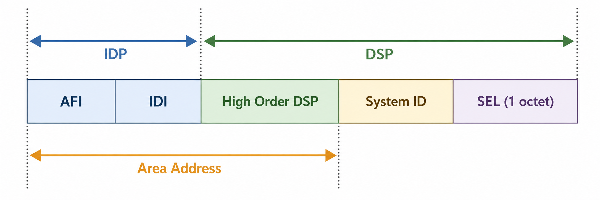
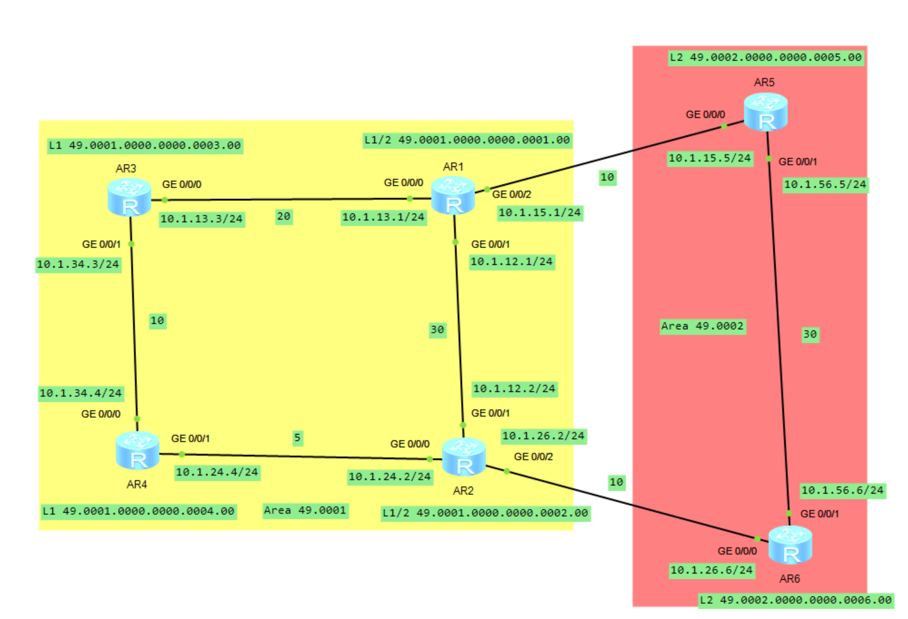
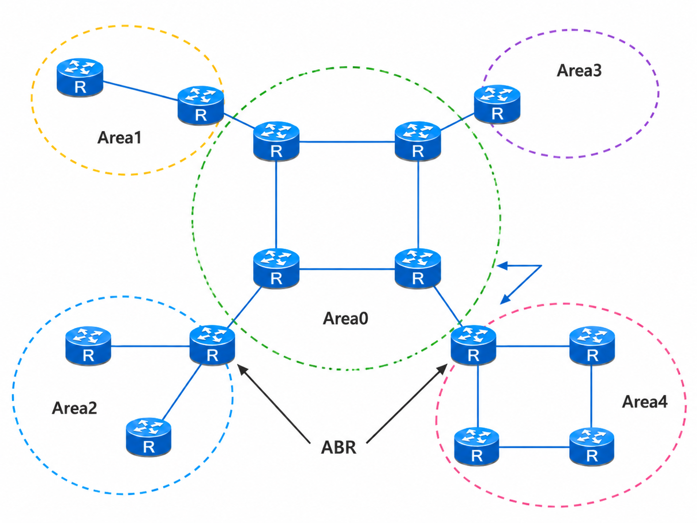
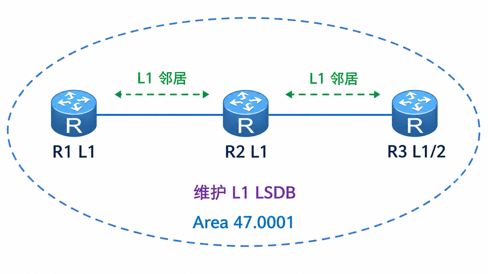
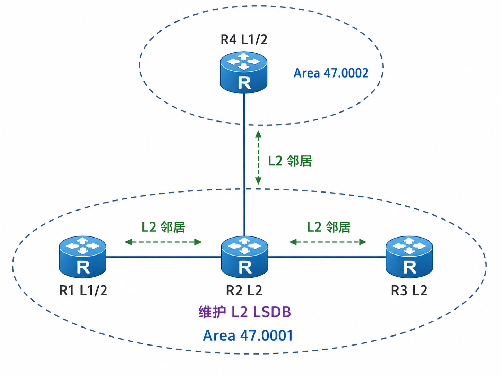
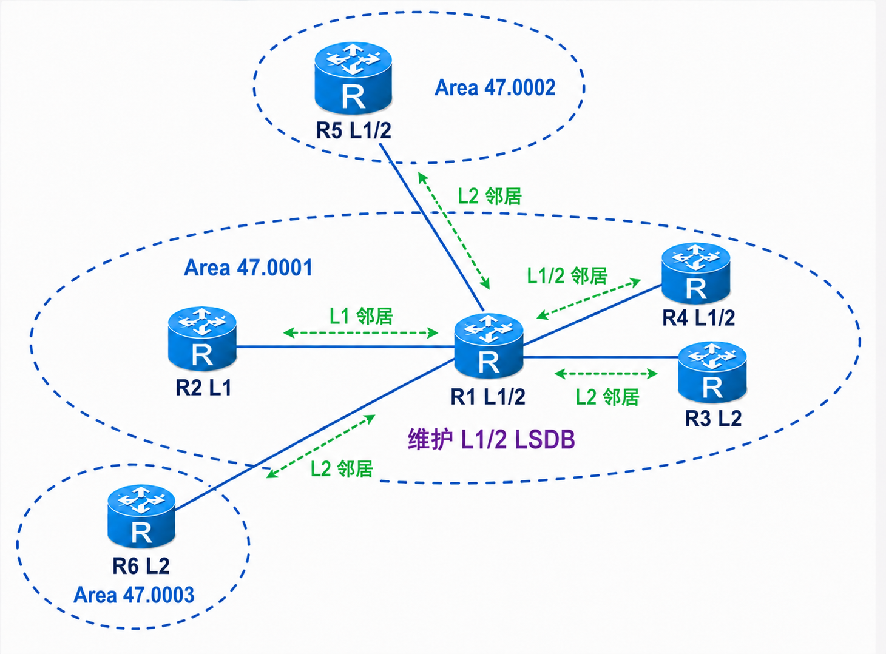
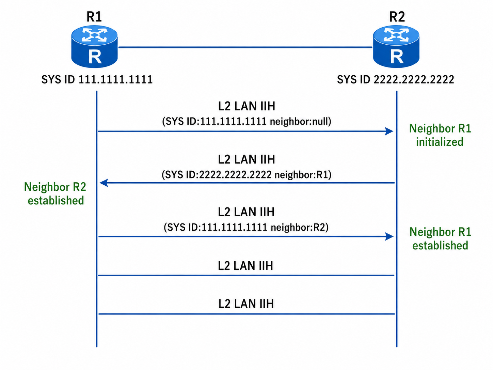
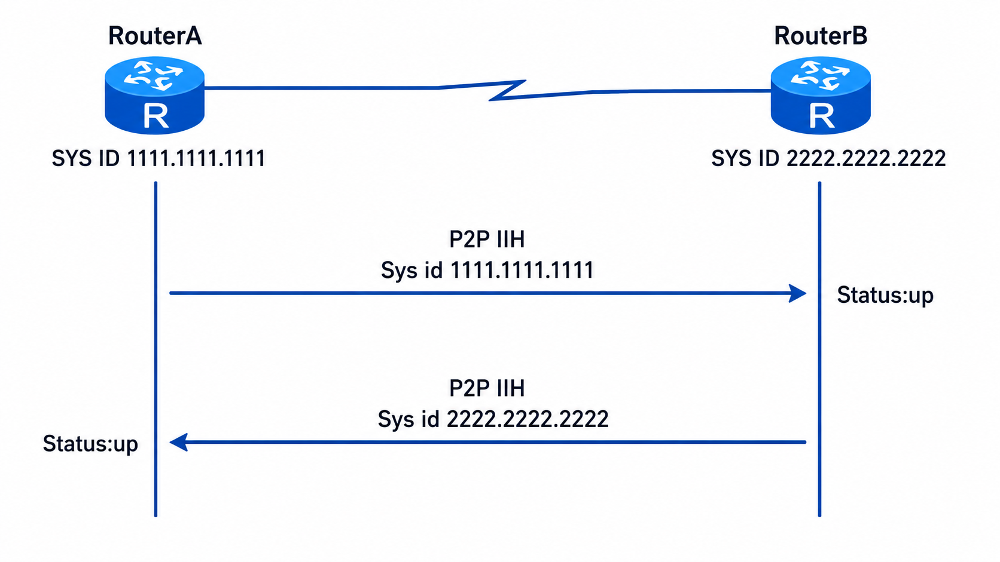
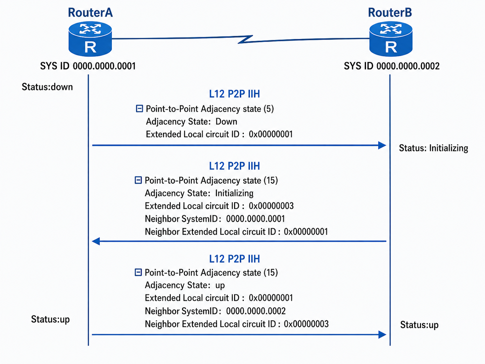
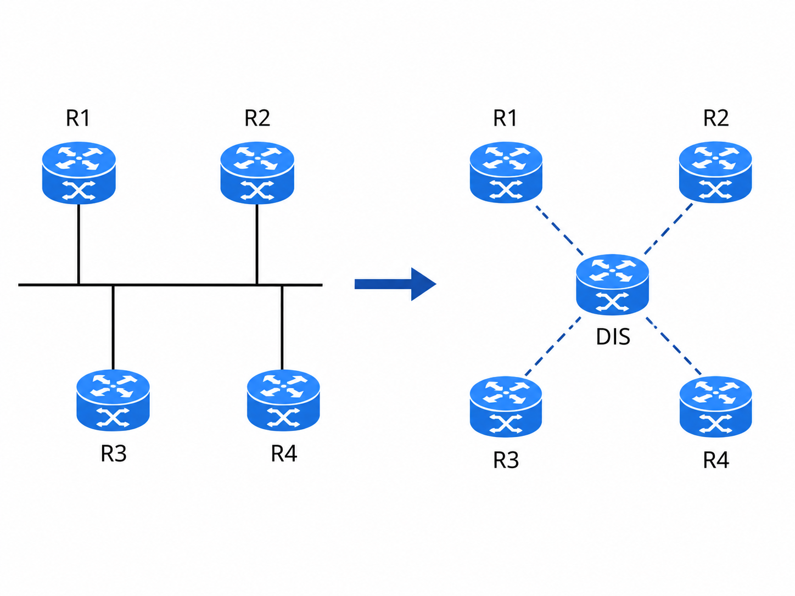

# IS-IS 基本概念及邻接关系

## 1.IS-IS 简介

IS-IS 最初起源于 DEC 公司的 PhaseV 网络协议，后来 ITU 将其标准化为 OSI 协议栈中的路由协议，命名为 **`Intermediate System-to-Intermediate System`**。由于 IS-IS 源自仅工作在数据链路层的 DEC PhaseV 协议，因此 IS-IS 最初被设计为仅工作在 OSI 协议栈的数据链路层，而无法直接工作于 IP 协议栈。

由于 IP 协议栈的广泛使用，IETF 开始开发可为 IP 工作的 IS-IS，**<font color="red">RFC1195 对 IS-IS 进行了扩充和修改，使它能够同时应用在 TCP/IP 和 OSI 环境中，称为集成 IS-IS</font>**。IETF 工作组定义了大量 TLV 结构，使其可以携带 IP 路由信息，但协议的本身仍是 OSI 协议。所以，运行集成 IS-IS 的路由器必是双栈，既含有 OSI 协议栈，又含有 IP 协议栈的设备。由于集成 IS-IS 稳定，收敛快，支持大量路由设备的能力，因此 ISP 都相继选用 IS-IS 作为内部骨干 IGP 协议。

### 1.1 IS-IS 的地址

网络服务访问点 NSAP（Network Service Access Point）是 OSI 协议中用于定位资源的地址。如下图所示，它由 IDP（Initial Domain PRt）和 DSP（Domain Specific PRt）组成。IDP 和 DSP 的长度都是可变的，NSAP 总长最多是 20 个 Byte，最少是 8 个 Byte。

<div align="center">
    
</div>

IDP 相当于 IP 地址中的主网络号。它是由 ISO 规定，并由 AFI（Authority and Format Identifier）与 IDI（Initial Domain Identifier）两部分组成的。AFI 表示地址分配机构和地址格式，IDI 用来标识域。

DSP 相当于 IP 地址中的子网号和主机地址。它由 High Order DSP、System ID 和 SEL 3 个部分组成。**<font color="red">High Order DSP 用来分割区域，相当于子网号。而 System ID 用来在区域中唯一区分主机，在一个区域中，不存在一致的 System ID 的主机。SEL（NSAP Selector）用来代表每个主机上的特定服务类型，相当于协议号</font>**。

所以访问某个目标主机上的特定服务，先根据 Area 路由到相应区域边界，由区域边界路由器再根据主机路由表，定位到特定 SysID 的主机。

#### 1.1.1 区域地址

IDP 和 DSP 中的 High Order DSP 组合在一起，作为节点所在区域的标识。既能够标识路由域，也能够标识路由域中的区域，因此，它们一起被称为区域地址（Area Address），相当于 OSPF 中的区域编号。**同一 Level-1 区域内的所有路由器必须具有相同的区域地址，Level-2 区域内的路由器可以具有不同的区域地址**。

>假设某个路由器的 NSAP 是 **`49.0001.0000.0000.0001.00`**，那么它的 Area Address 就是 **`49.0001`**。其中 AFI 为 49（local format），根据 ISO/IEC 8348，在 Local IDI Format 中，IDI is null，所以 IDI 为空/0。High Order DSP 是 0001，System ID 是 **`0000.0000.0001`**（固定 6 字节），SEL 是 00。

Level-2 区域不是一个像 OSPF Area 0 骨干区域那样必须共享同一个区域号的区域。IS-IS 的 Level-2 更准确地说是由所有连续的 L2/L1-2 路由器组成的骨干拓扑。所以，L2 路由器可以带着各自不同的 Area Address 来建立 L2 邻接。

```java{.line-numbers}
R1 NET: 49.0001.0000.0000.0001.00
R2 NET: 49.0002.0000.0000.0002.00
```

L1 的邻接要求 Area Address 相同，因为 L1 的意义就是同一个区域内部大家交换完整的区域内拓扑。但 L2/L1-2 的职责恰恰是把不同区域连接起来。如果 L2 邻接也强制要求 Area Address 一样，那它就只能连接同一区域内的路由器，区域间路由就失去意义了。

根据 RFC 1195 的规定，A level 1 router will have the area portion of its address manually configured. **_It will refuse to become a neighbor with a node whose area addresses do not overlap its area addresses_**. However, if level 1 router has area addresses A,  B, and C, and a neighbor has area addresses B and D, then the level 1 router will accept the other node as a neighbor. A level 2 router will accept another level 2 router as a neighbor, regardless of area address. However, if the area addresses do not overlap, the link would be considered by both routers to be "level 2 only", and only level 2 LSPs would flow on the link. External links (to other routing domains) must be from level 2 routers.

也就是说 L1 路由器会拒绝和 area address 不重叠的节点成为邻居，但 L2 路由器会接受另一个 L2 路由器作为邻居，不管 area address 是否相同。如果两台 IS-IS 路由器的 Area Address 没有交集，它们之间不能形成 L1 邻接。但只要双方都是 L2-capable，就仍然可以形成 L2 邻接。于是这条链路在 IS-IS 眼里只属于 L2 拓扑，不属于任何 L1 区域拓扑。

>所谓 area address overlap，就是双方 Area Address 列表有没有交集。例如：
**`R1 Area Addresses: 49.0001, 49.0002`**
**`R2 Area Addresses: 49.0002, 49.0003`**
它们有共同的 **`49.0002`**，所以 Area Address 重叠。
**`R1 Area Addresses: 49.0001`**  
**`R2 Area Addresses: 49.0002`**
以上 R1 和 R2 没有共同 Area Address，所以 Area Address 不重叠。

假设有两个区域：

```java{.line-numbers}
Area 49.0001                         Area 49.0002
R1 -------- R2 ===================== R3 -------- R4
L1          L1/L2       L2邻接       L1/L2       L1
```

NET 分别是：

```java{.line-numbers}
R1: 49.0001.0000.0000.0001.00
R2: 49.0001.0000.0000.0002.00

R3: 49.0002.0000.0000.0003.00
R4: 49.0002.0000.0000.0004.00
```

R2 和 R3 的 Area Address 不同，**`R2 Area Address = 49.0001`** 而 **`R3 Area Address = 49.0002`**，但 R2 和 R3 都是 L1/L2 路由器，并且互联接口跑 L2，L2 邻接成立。因为这条链路的作用不是让 R2 和 R3 成为同一个 L1 区域里的成员，而是让两个区域通过 Level-2 骨干互通。

一般情况下，一个路由器只需要配置一个区域地址，且同一区域中所有节点的区域地址都要相同。为了支持区域的平滑合并、分割及转换，在设备的实现中，一个 IS-IS 进程下最多可配置 3 个区域地址。

#### 1.1.2 System ID 

System ID 用来在一个区域内唯一标识一台主机或路由器。**<font color="red">在华为的实现中，它的长度固定为 6Byte</font>**。不同于 IP 网络中协议地址的定义，IS-IS 并没有为每个接口定义地址，即每一个接口是没有地址的，全局一个 SysID。

在实际应用中，一般使用 Router ID 与 System ID 进行对应。假设一台路由器使用接口 Loopback0 的 IP 地址 **`168.10.1.1`** 作为 Router ID，则它在 IS-IS 中使用的 System ID 可通过如下方法转换得到。

将 IP 地址 **`168.10.1.1`** 的每个十进制数都扩展为 3 位，不足 3 位的在前面补 0，得到 **`168.010.001.001`**。将扩展后的地址分为 3 部分，每部分由 4 位数字组成，得到 **`1680.1000.1001`**。重新组合的 **`1680.1000.1001`** 就是 System ID。

实际 System ID 的指定可以有不同的方法，但要保证能够唯一标识主机或路由器。

#### 1.1.3. SEL

SEL 的作用类似 IP 中的协议标识符，不同的传输协议对应不同的 SEL。**<font color="red">在 IP 上 SEL 均为 00</font>**。通常，在一个区域中的所有节点必须要有一样的区域号，不过，有时一个 Area 可能会有多个区域地址。

### 1.2 IS-IS 报文结构

IS-IS 报文是直接基于数据链路层协议封装的，每个报文由报头和 TLV 字段组成，其中报头又分为通用报头和专用报头，每种报文的通用报头（前 8Byte）是一样的，但是专用报头根据报文的不同而不同，并且每种报文所支持的 TLV 不同。IS-IS 报文结构如下所示。

<div align="center">
    
</div>

IS-IS 的 hello 包格式如下：

```java{.line-numbers}
IEEE802.3 Ethernet
Logical-Link Control
ISO10589 ISIS InTRA Domain Routeing Information Exchange Protocol
    // ISIS Header
    Intra Domain Routing Protocol Discriminator: ISIS (0x83)
    PDU Header Length: 27
    Version (==1): 1
    System ID Length: 6
    PDU Type : L1 HELLO (R:000) ISIS Header
    Version2 (==1): 1
    Reserved (==0): 0
    Max. AREAS: (0==3): 3

    // ISIS Hello header
    Circuit type : Level1 only, reserved(0x00 == 0)
    System-ID {Sender of PDU} : 0000.0000.0001
    Holding timer: 30 Hello Header
    PDU length: 1497
    Priority : 64, reserved(0x00 == 0)
    System-ID {Designated IS} : 0000.0000.0002.01

    // ISIS TLV
    Area address(es) (2)
    IS Neighbor(s) (6)
        IS Neighbor: HuaweiTe_c3:78:57
    IP Interface address(es) (4)
        IPv4 interface address: 10.1.1.1 (10.1.1.1)
    Protocols Supported (1) TLV
        NLPID(s): IP (0xcc)
    Restart Signaling (3)
    Multi Topology (2)
        IPv4 unicast Topology (0x000), no sub-TLVs present
    Padding (255)
    Padding (255)
    Padding (255)
    Padding (255)
    Padding (255)
    Padding (153)
```

其中对通用报头中主要字段的解释如下：

- 域内路由协议鉴别符：IS-IS 的网络层标识，值为 **`0x83`**。
- 头长度：数据包报头的字节数。
- 版本或协议号扩展名：当前设置为 1。
- System-ID 长度：标识源路由器的 System-ID 长度，值为 0 表示长度为 6Byte，值为 255 表示长度为 0Byte。**<font color="red">System-ID 长度的范围为 `1~8Byte`，华为的 VRP 系统使用 6Byte</font>**。

>ISIS 协议里有一个历史兼容写法，ID Length 字段值为 0 时表示 SysID 长度为 6 字节，而 ID Length 字段值为 6 也表示 ID 长度为 6 字节。根据 RFC 1142 的原文：This field shall take on one of the following values: An integer between 1 and 8, inclusive, indicating an ID field of the corresponding length. The value zero, which indicates a 6 octet ID field length. The value 255, whhich means a null ID field (i.e. zero length). All other values are illegal and shall not be used.

- PDU 类型：表示 IS-IS 报文类型，**<font color="red">IS-IS 有 3 种数据包：Hello、LSP（链路状态数据包）、SNP（序列号报文）</font>**，其中，SNP 包括 PSNP（部分序列号报文）和 CSNP（完全序列号报文）。
- 版本：当前值为 1。
- 预留位：没有使用的比特位，值为 0。
- 最多区域地址数：支持的最多区域地址数量，值为 0 表示最多支持的区域地址数量为 3。

## 2.IS-IS 路由器区域和角色

为支持大规模网络，IS-IS 跟 OSPF 一样，可以将网络分层。IS-IS 也支持 2 层的分层体系（Level-1，Level-2），Level-1 为普通区域（L1），Level-2 为骨干区域（L2），**<font color="red">Level 区域由 L1 或 L1/2 路由器构成，Level-2 区域由所有的 L2 或 L1/2 路由器构成</font>**，我们以下面的拓扑图为例进行讲解，下述的拓扑图显示了一个运行 IS-IS 的网络结构。

<div align="center">
    
</div>

在上图中，Area **`49.0002`** 中所有 L2 路由器及普通区域 **`49.0001`** 的 L1/2 路由器（AR1 和 AR2）一起组成了 Level-2 区域。与 Level-2 区域相连的 Area **`49.0001`** 是 Level-1 区域，**Level-1 区域内包含了 L1 路由器和 L1/2 路由器（区域边界）**，网络整体结构上是以骨干区域为中心的，其他普通区域都是以骨干区域为核心来建设的星型结构。

由上面的拓扑图还可以看出，IS-IS 的区域层次结构虽然和 OSPF 是一样的，但是它们定义区域的边界的方法是不同的，**<font color="red">OSPF 区域的边界是通过路由器来划分的，一台路由器的所有接口可以划分到不同的区域（比如 ABR）</font>**，如下图所示；然而，根据上面的 ISIS 网络拓扑可知，**<font color="blue">一台 IS-IS 路由器的所有接口都属于同一个区域，导致区域的边界是在链路上，而不是在路由器上</font>**。IS-IS 的骨干区域根据逻辑上的范围来定界（所有具备 Level-2 数据库的路由器），而 OSPF 的骨干区域可根据物理范围定界。

<div align="center">
    
</div>

IS-IS 路由器有 L1、L2 和 L1/2 三种角色，华为路由器默认情况下是 L1/2。三种路由器的特点如下。

### 2.1 L1 路由器的特点

- 只有本区域（L1 区域）的链路状态信息。
- **默认情况下，只能通过离自己最近的 L1/2 路由器访问其他区域**。
- 通过接收到带有 ATT 位的 LSP 来生成一条指向离自己最近的 L1/2 路由器的默认路由，用于访问其他区域。

### 2.2 L2 路由器的特点

- 拥有骨干区域（L2 区域）的链路状态数据库信息。
- 跟其他 L2 或 L1/2 路由器一起构成骨干区域。
- 拥有整个路由域的路由信息。

根据 RFC 1195 的定义，OSI IS-IS routing makes use of two-level hierarchical routing. A routing domain is partitioned into areas. Level 1 routers know the topology in their area, including all routers and end systems in their area. However, level 1 routers do not know the identity of routers or destinations outside of their area. Level 1 routers forward all traffic for destinations outside of their area to a level 2 router in their area. Similarly, level 2 routers know the level 2 topology, and know which addresses are reachable via each level 2 router. However, level 2 routers do not need to know the topology within any level 1 area, except to the extent that a level 2 router may also be a level 1 router within a single area. Only level 2 routers can exchange data packets or routing information directly with external routers located outside of the routing domains.

所谓 L2 路由器拥有整个路由域的路由信息，并不是指 L2 路由器掌握了所有 L1 区域内部的完整链路状态拓扑，而是指 L2 路由器知道 L2 拓扑和经各个 L2 路由器可达的地址。它不需要知道任何 L1 区域内部拓扑，除非它自己同时也是某个区域里的 L1 路由器。**<font color="red">默认情况下，Level-1 区域的 IS-IS 路由信息（缺省路由信息除外）全部渗透到 Level-2 区域</font>**。

在上面的拓扑图中，AR5 的路由拓扑如下所示，可以看到 AR5 有 Area **`49.0002/49.0001`** 中的所有路由信息，当然 AR5 并不知道 Area **`49.0001`** 内部的链路状态拓扑信息。

```java{.line-numbers}
<AR5>display isis  route 
                         Route information for ISIS(1)
                        ISIS(1) Level-2 Forwarding Table

IPV4 Destination     IntCost    ExtCost ExitInterface   NextHop         Flags
-------------------------------------------------------------------------------
10.1.5.0/24          0          NULL    Loop0           Direct          D/-/L/-
10.1.24.0/24         45         NULL    GE0/0/0         10.1.15.1       A/-/-/-
10.1.4.0/24          40         NULL    GE0/0/0         10.1.15.1       A/-/-/-
10.1.13.0/24         20         NULL    GE0/0/0         10.1.15.1       A/-/-/-
10.1.3.0/24          30         NULL    GE0/0/0         10.1.15.1       A/-/-/-
10.1.56.0/24         30         NULL    GE0/0/1         Direct          D/-/L/-
10.1.12.0/24         40         NULL    GE0/0/0         10.1.15.1       A/-/-/-
10.1.2.0/24          40         NULL    GE0/0/0         10.1.15.1       A/-/-/-
                                        GE0/0/1         10.1.56.6      
10.1.26.0/24         40         NULL    GE0/0/1         10.1.56.6       A/-/-/-
10.1.6.0/24          30         NULL    GE0/0/1         10.1.56.6       A/-/-/-
10.1.1.0/24          10         NULL    GE0/0/0         10.1.15.1       A/-/-/-
10.1.15.0/24         10         NULL    GE0/0/0         Direct          D/-/L/-
10.1.34.0/24         40         NULL    GE0/0/0         10.1.15.1       A/-/-/-
     Flags: D-Direct, A-Added to URT, L-Advertised in LSPs, S-IGP Shortcut,
                               U-Up/Down Bit Set
```

### 2.3 L1/2 路由器的特点

- 连接了骨干区域和普通区域，相当于 OSPF 的 ABR，必须维护两张链路状态数据库（L1 和 L2）。
- 与其他的 L2 或 L1/2 路由器构成骨干区域。
- 会在自己生成的 L1 的 LSP 中设置 ATT 位。
- 拥有整个路由域的路由信息。

L1 路由器可以和同一区域的其他 L1、L1/2 路由器建立 L1 的邻接关系，所有的 L1 邻接关系构成了一个 L1 区域，如下图所示，在 Area **`47.0001`** 中，R2 与同区域中的 R1（L1 路由器）和 R3（L1/2 路由器）形成了 L1 邻接关系。

<div align="center">
    
</div>

**<font color="red">L2 路由器可以跟同区域的 L2 和 L1/2 路由器建立 L2 邻接关系</font>**，也可以和其他区域的 L1/2 路由器建立 L2 邻接关系，如下图所示，在 Area **`47.0001`** 中，R2 分别与 R1（L1/2 路由器）和 R3（L2 路由器）形成了 L2 邻接关系。并且，R2 跟 Area **`47.0002`** 的 R4（L1/2 路由器）也形成了 L2 的邻居关系。

<div align="center">
    
</div>

由前面的内容可知，L1 或 L2 路由器都只能建立相应层级的邻接关系，只维护一张链路状态数据库。**<font color="red">而作为 L1/2 路由器，需要维护两张数据库（L1 和 L2），也就是说它既要建立 L1 邻接关系，也要建立 L2 邻接关系</font>**。所以，L1/2 路由器虽然位于 L1 区域内，但它能建立两种邻接关系。由最前面的拓扑图，AR1 具有 Level-1 和 Level-2 两个 lsdb 数据库：

```java{.line-numbers}
<AR1>display isis lsdb 
                        Database information for ISIS(1)
                          Level-1 Link State Database

LSPID                 Seq Num      Checksum      Holdtime      Length  ATT/P/OL
-------------------------------------------------------------------------------
0000.0000.0001.00-00* 0x0000000e   0x9dce        1068          117     1/0/0   
0000.0000.0002.00-00  0x0000000c   0xa0c3        1063          117     1/0/0   
0000.0000.0003.00-00  0x0000000b   0x2e5a        1161          113     0/0/0   
0000.0000.0004.00-00  0x0000000a   0x3c4f        1112          113     0/0/0   
Total LSP(s): 4
    *(In TLV)-Leaking Route, *(By LSPID)-Self LSP, +-Self LSP(Extended), 
           ATT-Attached, P-Partition, OL-Overload

                          Level-2 Link State Database
LSPID                 Seq Num      Checksum      Holdtime      Length  ATT/P/OL
-------------------------------------------------------------------------------
0000.0000.0001.00-00* 0x0000000f   0x3bc8        1068          189     0/0/0   
0000.0000.0002.00-00  0x00000010   0x9672        1063          189     0/0/0   
0000.0000.0005.00-00  0x0000000b   0x3bf7        958           113     0/0/0   
0000.0000.0006.00-00  0x00000009   0x118         1179          113     0/0/0   
Total LSP(s): 4
    *(In TLV)-Leaking Route, *(By LSPID)-Self LSP, +-Self LSP(Extended), 
           ATT-Attached, P-Partition, OL-Overload
```

在同一区域内，L1/2 路由器既能跟 L1 路由器建立 L1 邻接关系，也能和 L2 或 L1/2 路由器建立 L2 邻接关系；在不同区域间，L1/2 路由器可跟其他区域的 L2 建立 L2 邻接关系。L1/2 共维护了两张链路状态数据库，用于在不同区域间交换路由信息，如下图所示，在 Area **`47.0001`** 中，R1 与 R2（L1 路由器）形成了 L1 的邻接关系，与 R3（L2 路由器）形成了 L2 的邻接关系，值得注意的是，R1 与 R4 形成了 L1/L2 邻居关系。不同区域之间，R1 分别与 Area **`47.0002`** 的 R5（L1/2 路由器）和 Area **`47.0003`** 的 R6（L2 路由器）形成了 L2 邻接关系。

<div align="center">
    
</div>

注意，R1 与 Area  **`47.0002`** 的 R5 之间形成的是 L2 邻接，不是 L1/2 邻接。因为只有同一区域的 IS-IS 路由器，才可能形成 L1 邻接，不同区域之间不能形成 L1 邻接。

## 3.IS-IS 网络类型

相比于 OSPF 支持的四种网络类型，IS-IS 仅支持两种网络类型：

- 广播网络；
- P2P 网络；

默认情况下，**<font color="red">物理介质如果是以太网链路，对应的 IS-IS 网络类型为广播网络；物理介质如果是串行链路（比如 PPP、HDLC），对应的 IS-IS 网络类型为 P2P 网络</font>**。IS-IS 协议在这两种网络下的工作机制不一样，例如：广播网络中有选举 DIS，而 P2P 网络中不用选举。

## 4.IS-IS 邻接关系

### 4.1 握手报文

路由器的接口一旦启动 IS-IS 进程，就会发出 Hello 报文，用以发现邻居并形成邻接关系。Hello 报文除了包含发送路由器的 System-ID 之外，还包含了发送端全局和接口的一系列参数，这些参数如果被邻居路由器接受了，那么就能形成邻接关系，否则不建立邻接关系。

在 LAN（广播网络）和 P2P（点对点网络）中形成邻接关系的过程稍有不同，使用的 Hello 报文有些区别，下面是三种 IIH：

- 点到点 IIH：用于点对点网络；
- **`L1 LAN IIH`**：用于广播网络 Level1 邻接；
- **`L2 LAN IIH`**：用于广播网络 Level2 邻接。

我们以下面的拓扑图为例来讲解 P2P 的 Hello 报文以及 L2 LAN 类型的 Hello 报文。在 Area **`49.0001`** 中路由器之间全部都是 P2P 类型的连接，但是在  Area **`49.0002`** 中，AR5、AR6 和 AR8 之间的连接类型是广播网络。

<div align="center">
    
</div>

#### 4.1.1 L2 LAN IIH 报文

从 AR8 的 **`G0/0/0`** 口抓取的 Hello 数据报文如下所示：

```java{.line-numbers}
Frame 1: 1514 bytes on wire (12112 bits), 1514 bytes captured (12112 bits) on interface -, id 0
IEEE 802.3 Ethernet 
Logical-Link Control
ISO 10589 ISIS InTRA Domain Routeing Information Exchange Protocol
    Intradomain Routing Protocol Discriminator: ISIS (0x83)
    Length Indicator: 27
    Version/Protocol ID Extension: 1
    ID Length: 6
    000. .... = Reserved: 0x0
    ...1 0000 = PDU Type: L2 HELLO (16)
    Version: 1
    Reserved: 0
    Maximum Area Addresses: 3
ISIS HELLO
    .... ..10 = Circuit type: Level 2 only (0x2)
    0000 00.. = Reserved: 0x00
    SystemID {Sender of PDU}: 0000.0000.0008
    Holding timer: 30
    PDU length: 1497
    .100 0000 = Priority: 64
    0... .... = Reserved: 0
    SystemID {Designated IS}: 0000.0000.0006.01
    Area address(es) (t=1, l=4)
        Type: 1
        Length: 4
        Area address (3): 49.0002
    IS Neighbor(s) (t=6, l=12)
        Type: 6
        Length: 12
        IS Neighbor: HuaweiTe_14:70:c2 (00:e0:fc:14:70:c2)
        IS Neighbor: HuaweiTe_cc:14:1b (00:e0:fc:cc:14:1b)
    IP Interface address(es) (t=132, l=4)
        Type: 132
        Length: 4
        IPv4 interface address: 10.1.158.8
    Protocols Supported (t=129, l=1)
        Type: 129
        Length: 1
        NLPID: IP (0xcc)
    Restart Signaling (t=211, l=3)
    Multi Topology (t=229, l=2)
        Type: 229
        Length: 2
        IPv4 Unicast Topology (0x000)
    Padding (t=8, l=255)
    Padding (t=8, l=255)
    Padding (t=8, l=255)
    Padding (t=8, l=255)
    Padding (t=8, l=255)
    Padding (t=8, l=145)
```

和所有的 IS-IS 报文一样，Hello 报文由报头和 TLV 构成，LAN Hello 和 P2P Hello 携带的信息及 TLV 略有不同，上面为 LAN 中 Hello 报文格式。LAN Hello 报文各字段解释如下。

- Circuit Type（接口类型）：标识发送端接口的层次。
- System-ID（系统 ID）：标识发送端路由器的系统 ID。
- Holding Timer（保持计时器）：表示发送端路由器宣告邻接关系失效的超时时间，默认是发送 Hello 间隔时间的 3 倍。

发送该 Hello 报文的路由器实际上是在告知邻居：当你收到这份 Hello 报文后，如果在指定的 Holding Timer 时间内没有再收到我后续发送的 Hello 报文，就可以认为我已经不可达，并将与我的邻接关系置为 Down。

根据 RFC 1142 原文，The IS shall keep a holding time (adjacency holding Timer) for the point-to-point adjacency. The value of the holding Timer shall be set to the Holding Time as reported in the Holding Timer field of the Pt-Pt IIH PDU. **_<font color="red">If a neighbour is not heard from in that time, the IS shall purge it from the database; and generate an adjacencyStateChange (Down) notification</font>_**.

- PDU Length（报文长度）：表示整个 IS-IS 报文的长度。
- Priotity（优先级）：表示发送端接口的优先级，用来在 LAN 中选举 DIS，默认值=64。
- System-ID {DIS}：**<font color="red">标识了发送端接口对应的链路上的 DIS 的系统 ID</font>**。
- Area Address（区域地址）：标识了发送端路由器的区域，使用类型 1 的 TLV。发送路由器 AR8 在 **`49.0002`** 区域。
- IS Neighbor（邻居列表）：标识了发送端路由器的邻居，使用类型 6 的 TLV。发送路由器 AR8 有 2 个邻居 AR5 和 AR6。
- IP Interface Address（es）（接口 IP 地址）：标识了发送端路由器所有已经启动了 IS-IS 进程的接口 IP 地址，使用类型为 132 的 TLV。
- Protocols Supported（支持的协议）：表示发送端路由器所支持的网络层协议，使用类型 129 的 TLV。
- Restart Signaling（重启信令）：表示发送端路由器是否支持 GR。
- Multi Topology（多拓扑）：表示发送端路由器是否支持多拓扑。
- Padding（填充）：填充字段，用于将 Hello 包填充至 MTU 大小，使用类型 8 的 TLV。

#### 4.1.2 P2P IIH 报文

从 AR1 的 **`G0/0/0`** 口抓取的 Hello 数据报文如下所示：

```java{.line-numbers}
Frame 2: 78 bytes on wire (624 bits), 78 bytes captured (624 bits) on interface -, id 0
IEEE 802.3 Ethernet 
Logical-Link Control
ISO 10589 ISIS InTRA Domain Routeing Information Exchange Protocol
    Intradomain Routing Protocol Discriminator: ISIS (0x83)
    Length Indicator: 20
    Version/Protocol ID Extension: 1
    ID Length: 6
    1.   .... = Reserved: 0x0
    ...1 0001 = PDU Type: P2P HELLO (17)
    Version: 1
    Reserved: 0
    Maximum Area Addresses: 3
ISIS HELLO
    .... ..01 = Circuit type: Level 1 only (0x1)
    0000 00.. = Reserved: 0x00
    SystemID {Sender of PDU}: 0000.0000.0001
    Holding timer: 30
    PDU length: 61
    Local circuit ID: 1
    Area address(es) (t=1, l=4)
        Type: 1
        Length: 4
        Area address (3): 49.0001
    IP Interface address(es) (t=132, l=4)
        Type: 132
        Length: 4
        IPv4 interface address: 10.1.13.1
    Protocols Supported (t=129, l=1)
        Type: 129
        Length: 1
        NLPID: IP (0xcc)
    Restart Signaling (t=211, l=3)
        Type: 211
        Length: 3
        Restart Signaling Flags: 0x00
    Point-to-point Adjacency State (t=240, l=15)
        Type: 240
        Length: 15
        Adjacency State: Up (0)
        Extended Local circuit ID: 0x00000001
        Neighbor SystemID: 0000.0000.0003
        Neighbor Extended Local circuit ID: 0x00000001
    Multi Topology (t=229, l=2)
```

通过对比 LAN 和 P2P 网络的 Hello 报文，可以发现，P2P Hello 报头中没有 Priority 和 System-ID {DIS} 这两个字段，原因是 P2P 网络中不需要 DIS；同时 P2P Hello 报头中新增了一个 Local Circuit ID（本地电路 ID）字段，用来标识发送端接口。此外，在 TLV 字段中，P2P Hello 携带了一个点对点邻接状态：**`Point-to-point Adjacency State`**，这个字段携带了发送端路由器所有邻居 System-ID 及其邻接状态，使用类型 240 的 TLV 来承载信息。

假设有两台路由器通过点到点链路相连：

```java{.line-numbers}
R1 ---------------- R3
R1 System-ID = 0000.0000.0001
R1 本地 Extended Local Circuit ID = 0x00000002
R3 System-ID = 0000.0000.0003
R3 本地 Extended Local Circuit ID = 0x00000002
```

R3 发给 R1 的 P2P Hello 里可能携带：

```java{.line-numbers}
Point-to-Point Adjacency State
  Adjacency State: Up
  Extended Local Circuit ID: 0x00000002
  // 发送者认为自己当前邻接的对端路由器的 System-ID
  Neighbor SystemID: 0000.0000.0001    
  // 发送者记录到的邻居那一端的 Extended Local Circuit ID。  
  Neighbor Extended Local Circuit ID: 0x00000002
```

R1 收到该报文后，会首先检查其中的 **`Neighbor SystemID`** 是否与自身的 System-ID 一致；确认一致后，再进一步检查 **`Neighbor Extended Local Circuit ID`** 是否与 R1 本地链路的 **`Extended Local Circuit ID`** 相同。由于两者的值均为 **`0x00000002`**，因此 R1 可以明确判断：R3 确实是在与本设备的该接口建立邻接关系。

不管在哪一种网络中，Hello 报文都是周期性发送的，用于维持邻接关系。如果等待时间到达时还没收到邻居的 Hello，就宣告邻接关系失效。默认发送 Hello 的时间间隔为 10s，邻接关系的超时时间（Hold-timer）是 Hello 间隔的 3 倍。但是在广播链路上，DIS 发送 Hello 的频率是普通路由器的 1/3 倍（每 3.3333 秒发送一次 Hello）。接口下可以修改 Hello 间隔时间及超时时间。

### 4.2 邻接关系的建立

IS-IS 协议作为一种链路状态路由协议，每台路由器都会生成 LSP，然后将其泛洪到网络中，所有路由器都会将 LSP（本地和其他路由器通告的）存放至 LSDB，再基于 LSDB 利用 SPF 算法计算出最优路由。**<font color="red">泛洪 LSP 之前需要跟相邻路由器形成邻接关系。只有邻接关系形成后，LSP 才能在相邻路由器之间互相交换</font>**，进而更新自己的 LSDB。

对于 L1 和 L2 的路由器，IS-IS 协议可以形成不同层次的邻接关系，这里只需要注意，一台 L1 路由器是不能和 L2 路由器建立邻接关系的。影响两台 IS-IS 路由器建立邻接关系的因素有两方面。

一方面是从路由器层次和区域 ID 上考虑，要建立邻接关系必须满足以下条件：

- 两台 L1 路由器必须在同一区域才能建立邻接关系。
- **两台 L2 路由器建立 L2 邻接关系不要求在同一区域**。
- **一台 L1 路由器和一台 L1/2 路由器在相同区域时才能形成 L1 邻接关系**。
- 一台 L2 路由器和一台 L1/2 路由器不管是同区域还是不同区域，都能形成 L2 邻接关系。
- 两台 L1/2 路由器，同区域内可形成 L1 和 L2 邻接关系，不同区域只能形成 L2 邻接关系。

从其他因素考虑，有以下条件需要满足：

- 链路两端的 IS-IS 接口的网络类型必须一样，必须都是 LAN/Broadcast 或者 P2P 类型。
- 华为还要求链路两端的 IP 地址位于同一个子网。
- IS-IS 要求整个域内路由器使用的 System-Id 长度必须一致，**<font color="red">在华为的实现中，System-Id 长度固定使用 6Byte</font>**。该规则则用于 P2P 邻接。
- 两台路由器使用的最大区域地址数要相同，华为默认支持最大区域地址数是 3。该规则则用于 P2P 邻接。
- 如果配置了认证，要求两台路由器的认证信息要一致（认证类型和密钥信息）。
- 要求链路两端的接口 MTU 值要一致；在华为的实现中，不管是 P2P 链路还是广播链路，发送的 Hello 都是填充至接口 MTU 大小，用以检查链路两端的接口 MTU。

#### 4.2.1 广播网络的邻接关系建立

在广播网络中，IS-IS 使用 LAN IIH 来建立邻接关系，L1 的 LAN IIH 发送到组播地址：**`01-80-c2-00-00-14`**，L2 的 LAN IIH 发送到组播地址：**`01-80-c2-00-00-15`**。当路由器发送 Hello 报文时，它会根据接口的层级决定发送出的是 L1 的 Hello 还是 L2 的 Hello。接口的层级可以在接口下配置，跟全局的层级是没关系的，接口默认的层级是 L1/2。

当路由器收到 Hello 报文后，检查跟发送 Hello 报文的路由器的邻接情况，**如果已经建立好邻接关系，则在邻居表中重置和此邻居关联的保持定时器（根据发送过来的 Hello 报文中的 Holding Timer）**；如果邻接关系没有建立，则通过发送过来的 Hello 报文中的参数决定是否建立新的邻接关系。下图就是在广播链路上邻接关系的建立过程。

<div align="center">
    
</div>

具体过程如下所示：

- 第 1 步：R1 的接口启动 IS-IS 进程后，发出 L2 LAN IIH，报文中携带了自己的 System-Id，IS Neighbor 列表中没有任何邻居标识。
- 第 2 步：R2 接收到 Hello 报文后，将自己和 R1 的邻接状态设置为初始化状态，然后向 R1 回复自己的 Hello 报文，报文中携带了自己的 System-ID，**同时在 IS Neighbor 列表中携带了 R1 MAC 地址**。
- 第 3 步： R1 接收到 R2 的 Hello 报文后，**<font color="red">由于在这份 Hello 报文的邻居列表中看到了自己的 MAC 地址，R1 将 R2 的邻接关系状态设置为 UP</font>**。然后在向 R2 发送的 Hello 报文中，也会将 R2 的 MAC 地址放到 IS Neighbor 邻居列表中。
- 第 4 步：同第 3 步，R2 接收到 Hello 报文后，也将自己与 R1 的邻接关系状态设置为 UP。至此，两台路由器的邻接关系建立完成。

为保证邻接关系建立的可靠性，广播网络中的 Hello 中使用了 IS Neighbor 这个 TLV（类型 6），路由器如果在接收到的 Hello 报文中看到了自己的 MAC 地址，那么就宣告邻接关系建立起来了，这也叫三次握手机制。因为是广播网络，所以还得选举 DIS。在邻接关系建立后，路由器再等待 2 个 Hello 报文的时间，才开始选举 DIS。下面的输出内容显示了在广播网络中一台 IS-IS 路由器 AR8 的邻居表。

```java{.line-numbers}
<AR8>display isis peer 
                          Peer information for ISIS(1)
  System Id     Interface          Circuit Id       State HoldTime Type     PRI
-------------------------------------------------------------------------------
0000.0000.0006  GE0/0/0            0000.0000.0006.01 Up   8s       L2       64 
0000.0000.0005  GE0/0/0            0000.0000.0006.01 Up   26s      L2       64 
Total Peer(s): 2
```

表中第一列显示了邻居路由器的 System-ID。第二列表示本地到邻居路由器的接口（本路由器的接口）。第三列标识了邻居路由器的电路 ID，电路 ID 用于唯一标识一个 IS-IS 接口，如果该接口是和一个广播网络相连的，那么这个电路 ID 是该广播网络上的 DIS 设置的，**`0000.0000.0006`** 是 DIS 的 System-ID，01 表示伪节点 ID，这时电路 ID 也称作 LAN ID。这说明这个广播网段的 DIS 是 System-ID 为 **`0000.0000.0006`** 的路由器，也就是 AR6。**`.01`** 是 AR6 为该广播 LAN 创建的非 0 伪节点 ID。

第四列表示邻接关系状态，正常状态为 UP。第五列表示对邻居的保持时间，如果该邻居是 DIS，那么保持时间为 10 秒。第六列表示邻接类型。最后一列表示邻居接口的 DIS 优先级。

为什么要引入伪节点，在 IS-IS 广播网络中，如果没有伪节点机制，LSDB 在描述该 LAN 拓扑时，就需要把同一广播网段上的各台路由器之间的连接关系逐一描述出来。假设一个 LAN 上有 n 台 IS-IS 路由器，那么每台路由器都可能需要在自己的 LSP 中声明它与其他 n-1 台路由器之间的连接关系。这样一来，随着路由器数量增加，LSDB 中的链路描述数量会按近似平方级增长。

根据 RFC 1159，Special treatment is necessary for broadcast subnetworks, such as LANs. This solves two sets of issues: (i) In the absence of special treatment, each router on the subnetwork would announce a link to every other router on the subnetwork, resulting in n-squared links reported; (ii) Again, in the absence of special treatment, each router on the LAN would report the same identical list of end systems on the LAN, resulting in substantial duplication.

These problems are avoided by use of a "pseudonode", which represents the LAN. Each router on the LAN reports that it has a link to the pseudonode (rather than reporting a link to every other router on the LAN). One of the routers on the LAN is elected "designated router". The designated router then sends out an LSP on behalf of the pseudonode, reporting links to all of the routers on the LAN. This reduces the potential n-squared links to n links. In addition, only the pseudonode LSP includes the list of end systems on the LAN, thereby eliminating the potential duplication.

因此，引入伪节点后，IS-IS 不再把该 LAN 上的每两台路由器都建模成一条独立链路，而是把整个广播网段抽象成一个虚拟节点，也就是 Pseudonode。**<font color="red">每台接入该 LAN 的 IS-IS 路由器，只需要在自己的 LSP 中声明我连接到了这个伪节点；同时，由 DIS 代表这个伪节点生成一份伪节点 LSP，在其中声明这个伪节点连接了哪些路由器</font>**。

AR5 上的 level-2 lsdb 如下所示，可以看出 AR5，AR6，AR8 都连接到了同一个广播 LAN 伪节点 **`0000.0000.0006.01`**，而伪节点 **`0000.0000.0006.01`** 连接了 **`AR6 0000.0000.0006.00`**、**`AR8 0000.0000.0008.00`**、**`AR5 0000.0000.0005.00`** 这 3 台路由器。

```java{.line-numbers}
<AR5>display isis lsdb level-2 verbose 
                        Database information for ISIS(1)
                        --------------------------------
                          Level-2 Link State Database
LSPID                 Seq Num      Checksum      Holdtime      Length  ATT/P/OL
-------------------------------------------------------------------------------
0000.0000.0005.00-00* 0x0000000b   0x6140        631           140     0/0/0   
 SOURCE       0000.0000.0005.00
 NLPID        IPV4
 NBR  ID      0000.0000.0006.00  COST: 30        
 NBR  ID      0000.0000.0001.00  COST: 10                       
 NBR  ID      0000.0000.0006.01  COST: 10             // 连接到伪节点

0000.0000.0006.00-00  0x0000000d   0x582a        611           140     0/0/0   
 SOURCE       0000.0000.0006.00
 NBR  ID      0000.0000.0002.00  COST: 10        
 NBR  ID      0000.0000.0005.00  COST: 30        
 NBR  ID      0000.0000.0006.01  COST: 10             // 连接到伪节点  

0000.0000.0006.01-00  0x00000006   0xb92b        610           66      0/0/0   
 SOURCE       0000.0000.0006.01
 NLPID        IPV4
 NBR  ID      0000.0000.0006.00  COST: 0         // 伪节点
 NBR  ID      0000.0000.0008.00  COST: 0         
 NBR  ID      0000.0000.0005.00  COST: 0         

0000.0000.0008.00-00  0x00000008   0xac01        526           70      0/0/0   
 SOURCE       0000.0000.0008.00
 NLPID        IPV4
 AREA ADDR    49.0002 
 INTF ADDR    10.1.158.8
 NBR  ID      0000.0000.0006.01  COST: 10            // 连接到伪节点
 IP-Internal  10.1.158.0      255.255.255.0    COST: 10        

Total LSP(s): 6
    *(In TLV)-Leaking Route, *(By LSPID)-Self LSP, +-Self LSP(Extended), ATT-Attached, P-Partition, OL-Overload
```

#### 4.2.2 P2P 网络邻接关系的建立

由于当初在设计 IS-IS 的时候，根据 ISO10589 的定义，点对点 Hello 报文不包括 IS Neighbor TLV（类型 6），因此，在 P2P 网络中无法像广播网络那样使用三次握手机制来建立邻接关系，而只能使用两次握手机制。直到在后来的集成 IS-IS 协议中才支持通过三次握手机制建立邻接关系。

P2P 网络中两次握手建立邻接关系的过程如下所示：

<div align="center">
    
</div>

它们之间建立邻接关系的过程如下。

- RouterA 接口启动 IS-IS 后，首先向 RouterB 发送一份 P2P IIH，报文中携带了自己的 System-Id 和其他信息，但报文并没有 IS Neighbor 邻居列表。
- RouterB 接收到 Hello 报文后，直接将 RouterA 的邻接状态设置为 UP。
- 同第 2 步，RouterA 也在收到 RouterB 的 Hello 报文后将邻接状态直接设置为 UP。

两次握手机制当单向链路故障时，可能出现邻接状态判断不一致。为支持在 P2P 网络中使用三次握手机制建立邻接关系，集成 IS-IS 协议的 Hello 报文增加了一个新字段，叫 P2P 邻接状态（也就是类型 240 的 TLV），使用该 TLV 携带邻居的信息。上述拓扑 AR1 的类型 240 的 TLV 包含的内容：

```java{.line-numbers}
Point-to-point Adjacency State (t=240, l=15)
    Type: 240
    Length: 15
    Adjacency State: Up (0)
    Extended Local circuit ID: 0x00000001
    Neighbor SystemID: 0000.0000.0001
    Neighbor Extended Local circuit ID: 0x00000001
```

从上面可以看出：

- 类型：0xF0；
- 长度：5~17Byte；
- 值：1Byte，表示邻接状态，一共有 3 种状态，**`UP（=0）`**，**`Initializing（=1）`**，**`Down（=2）`**；
- 扩展的本地电路 ID：4Byte，本端对点对点网络接口的标识；
- 邻居 System-ID：邻居系统 ID；
- 邻居扩展的本地电路 ID：0 或 4Byte，邻居端对点对点网络接口的标识。

有了类型 240 的 TLV 后，**<font color="red">路由器在接收到的 Hello 报文中，通过确认 Neighbor SystemID 字段是否包含自己的 System-ID，从而实现三次握手机制</font>**。同时，本地的邻接状态基于当前状态和收到的类型 240 TLV 中显示的邻接状态值进行设置。

下面显示了 P2P 网络建立邻居的详细过程：

<div align="center">
    
</div>

- RouterA 接口启动 IS-IS 后，首先发出邻接状态为 Down 的 P2P IIH。
- RouterB 接收到 Hello 后，根据里面邻接状态字段将 RouterA 邻接状态设置为 Initializing，并在回复给 RouterA 的 Hello 报文中将邻接状态字段设置成 Initializing。
- RouterA 从 RouterB 接收到的邻接状态为 Initializing，并且 Neighbor SystemID 中包含了自己，立刻将 RouterB 的邻接状态设置为 UP 状态；并且在发给 RouterB 的下一 Hello 报文中，将邻接状态字段设置为 UP。
- RouterB 接收到 RouterA 的邻接状态为 UP 的 Hello 报文后，立刻将 RouterA 的邻接状态设置为 UP。至此，RouterA 和 RouterB 的邻接关系建立完成。

### 4.3 DIS

**<font color="red">IS-IS 路由器通过 Hello 报文建立邻接关系。两台路由器建立完邻接关系之后，就开始交换链路状态的状态信息（也就是 LSDB 的同步），交换过程是通过泛洪 LSP 来实现的</font>**。为保障 LSP 泛洪的准确性和及时性，要求在拓扑发生变化时，立即泛洪新的 LSP，在网络稳定时也要周期性泛洪 LSP，这就提高了带宽和处理资源开销。

在广播型多路访问网络中，IS-IS 协议需要在所有路由器之间建立邻接关系，IS-IS 协议将整个多路访问网络本身看作一台路由器或一个伪节点，如下所示。有了 DIS 后，多路访问网络中的邻居间泛洪 LSP 后，通过 DIS 的 SNP（序列号报文）来确保 LSP 泛洪的可靠。

<div align="center">
    
</div>

在广播网络中，必须有一台路由器被推举为 DIS，而 IS-IS 协议选举 DIS 的过程非常简单。在 IS-IS 路由器的接口有 L1 和 L2 两个层级，每一层都有一个优先级——L1 优先级和 L2 优先级，**网络中需要为 L1 和 L2 分别选举对应的 DIS，L1 和 L2 这两种邻接关系下的 LSDB 同步（泛洪 LSP）过程是相互独立的，所以必须要有相应层级的 DIS**。选举过程如下所示：

- 选举基于接口优先级，优先级最高的当选 DIS。
- 如果所有接口的优先级一样，具有最大的 Subnetwork Point of Attachment（SNPA）的路由器将当选 DIS，在 LAN 中，SNPA 指的是 MAC 地址；
- 如果 SNPA 是一样的，具有最大的 System-ID 的路由器将当选 DIS。

华为路由器接口的优先级的范围是 **`0~127`**，默认的接口的优先级是 64。与 OSPF 选举 DR 过程不同的是，优先级为 0 的 IS-IS 接口也可以参与选举 DIS，在 OSPF 中就不行。另外，不论是 L1 还是 L2，DIS 在 LSP 泛洪过程中都很重要，但是都没有选举备份 DIS。

对于 IS-IS 协议来说，**<font color="red">如果一台优先级高或 Mac 地址高的路由器加入到现有网络中，那么这台新路由器会抢占现有 DIS 而成为新的 DIS</font>**，这一点也与 OSPF 的 DR 不同。在 OSPF 中，DR 和 BDR 都是不允许被抢占的。

```java{.line-numbers}
<AR6>display isis  interface 
                       Interface information for ISIS(1)
 Interface       Id      IPV4.State          IPV6.State      MTU  Type  DIS   
 GE0/0/0         001         Up                 Down         1497 L2    -- 
 GE0/0/1         002         Up                 Down         1497 L2    -- 
 GE0/0/2         001         Up                 Down         1497 L2    Yes
 Loop0           003         Up                 Down         1500 L1/L2 -- 
<AR5>display isis interface 
                       Interface information for ISIS(1)
 Interface       Id      IPV4.State          IPV6.State      MTU  Type  DIS   
 GE0/0/0         001         Up                 Down         1497 L2    -- 
 GE0/0/1         002         Up                 Down         1497 L2    -- 
 GE0/0/2         001         Up                 Down         1497 L2    No 
 Loop0           003         Up                 Down         1500 L1/L2 -- 
```

上面的输出内容显示了 2 台 IS-IS 路由器 AR5 和 AR6 的接口信息，最后一列标识该接口是否为直连广播网络中的 DIS。路由器 AR6 的 **`GE0/0/2`** 接口在 L2 上是 DIS。

```java{.line-numbers}
<AR5>display isis  peer 
                          Peer information for ISIS(1)
  System Id     Interface          Circuit Id       State HoldTime Type     PRI
-------------------------------------------------------------------------------
0000.0000.0001  GE0/0/0            0000000003        Up   22s      L2       -- 
0000.0000.0006  GE0/0/1            0000000002        Up   20s      L2       -- 
0000.0000.0006  GE0/0/2            0000.0000.0006.01 Up   8s       L2       64 
0000.0000.0008  GE0/0/2            0000.0000.0006.01 Up   29s      L2       64 
Total Peer(s): 4
```

由上面的输出内容可看到，AR5 与 AR1 通过 **`GE0/0/0`** 口建立了 P2P 邻接关系，与 AR6 通过 **`GE0/0/1`** 口建立了 P2P 邻接关系，与 AR6 和 AR8 通过 **`GE0/0/2`** 口建立了广播网络的邻接关系。第 3 列标识了该网络中伪节点的电路 ID，也叫 LAN ID。其中 **`0000.0000.0006`** 是该广播网段 L2 DIS，也就是 AR6 的 System-ID；**`.01`** 是 AR6 为这个 LAN 分配的非 0 伪节点编号。