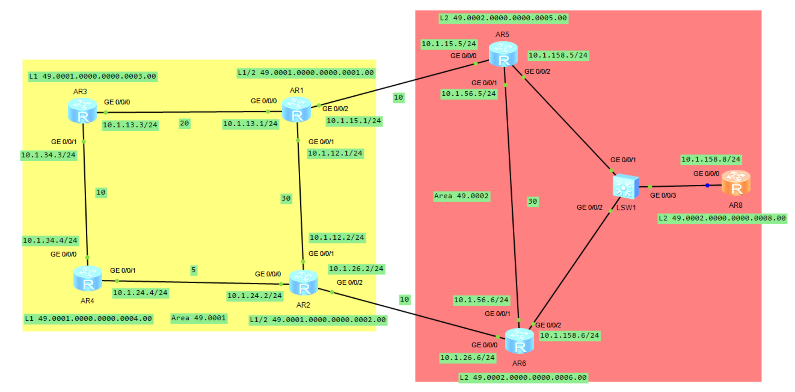

# IS-IS 实验案例

## 1.路由泄露

IS-IS 支持多区域分层设计的网络结构——L1 区域和 L2 区域，其中，L2 区域作为骨干区域，多个 L1 区域通过 L2 区域互连互通。**<font color="red">而且在默认情况下，IS-IS 的 L1 区域类似 OSPF 的完全末梢区域，只有区域内的路由信息。每个 L1 区域的 L1/2 路由器向区域内发送 L1 的 LSP 时，会将 LSP 中的 ATT 位置 1 以表明它连接了其他区域</font>**，

这样，L1 路由器会在路由器中安装默认路由，该默认路由指向离它最近的 L1/2 路由器，也就是说 L1 路由器使用离它最近的 L1/2 路由器作为缺省网关来访问骨干和其他 L1 区域。如下图所示的网络，AR1 和 AR2 是区域 **`49.0001`** 的 L1/2 路由器，它们连接到骨干区域，具有两张链路状态数据库；AR3 和 AR4 是区域 **`49.0001`** 中的 L1 路由器，它们的链路状态数据中只有本区域内的路由信息。此时，AR1 和 AR2 都会在通告到区域 **`49.0001`** 的 L1 LSP 中设置 ATT 位。

<div align="center">
    
</div>

AR3 和 AR4 的链路状态数据库如下：

```java{.line-numbers}
<AR3>display isis lsdb 
                        Database information for ISIS(1)
                          Level-1 Link State Database
LSPID                 Seq Num      Checksum      Holdtime      Length  ATT/P/OL
-------------------------------------------------------------------------------
0000.0000.0001.00-00  0x0000000a   0x71fe        695           117     1/0/0   
0000.0000.0002.00-00  0x00000007   0xa5f         693           117     1/0/0   
0000.0000.0003.00-00* 0x00000007   0xaae1        681           113     0/0/0   
0000.0000.0004.00-00  0x00000008   0x404d        686           113     0/0/0   

Total LSP(s): 4
    *(In TLV)-Leaking Route, *(By LSPID)-Self LSP, +-Self LSP(Extended), 
           ATT-Attached, P-Partition, OL-Overload
<AR4>display isis lsdb 
                        Database information for ISIS(1)
                          Level-1 Link State Database
LSPID                 Seq Num      Checksum      Holdtime      Length  ATT/P/OL
-------------------------------------------------------------------------------
0000.0000.0001.00-00  0x0000000a   0x71fe        690           117     1/0/0   
0000.0000.0002.00-00  0x00000007   0xa5f         689           117     1/0/0   
0000.0000.0003.00-00  0x00000007   0xaae1        675           113     0/0/0   
0000.0000.0004.00-00* 0x00000008   0x404d        682           113     0/0/0   

Total LSP(s): 4
    *(In TLV)-Leaking Route, *(By LSPID)-Self LSP, +-Self LSP(Extended), 
           ATT-Attached, P-Partition, OL-Overload
```

上面的输出内容显示了 AR3 和 AR4 都接收到了两个带 ATT 置位的 LSP（分别由 AR1 和 AR2 发送）。这里需要注意的是，并不是所有的 L1/2 路由器发出的 L1 LSP 都会设置 ATT 位，**<font color="red">设置 ATT 位的条件是 L1/2 路由器必须有个激活的 L2 连接，很显然网络中的 AR1 和 AR2 满足该条件</font>**。

L1 路由器接收到带 ATT 置位的 LSP 后，会根据距离最近的 L1/2 路由器产生一条默认路由，所有访问其他区域的数据包都会使用这台 L1/2 路由器作为缺省的网络出口。根据上图所示的各链路的开销值，很显然，AR3 和 AR4 都以 AR2 作为缺省出口。

```java{.line-numbers}
<AR4>display ip routing-table 0.0.0.0
Route Flags: R - relay, D - download to fib
------------------------------------------------------------------------------
Routing Table : Public
Summary Count : 1
Destination/Mask    Proto   Pre  Cost      Flags NextHop         Interface
        0.0.0.0/0   ISIS-L1 15   5           D   10.1.24.2       GigabitEthernet0/0/1
<AR3>display ip routing-table 0.0.0.0
Route Flags: R - relay, D - download to fib
------------------------------------------------------------------------------
Routing Table : Public
Summary Count : 1
Destination/Mask    Proto   Pre  Cost      Flags NextHop         Interface

        0.0.0.0/0   ISIS-L1 15   15          D   10.1.34.4       GigabitEthernet0/0/1
```

下面的输出显示了在 AR3 上使用 Tracert 命令跟踪访问 **`10.1.5.5/24`** 的路径情况，可以发现，AR3 访问网络 **`10.1.5.5/24`** 的业务流经过的路径是 **`AR3->AR4->AR2->AR6->AR5`**， 显然这不是最优路径。

```java{.line-numbers}
<AR3>tracert 10.1.5.5
traceroute to  10.1.5.5(10.1.5.5), max hops: 30 ,packet length: 40,press CTRL_C to break 
1 10.1.34.4 50 ms  20 ms  20 ms 
2 10.1.24.2 30 ms  20 ms  20 ms 
3 10.1.26.6 40 ms  30 ms  40 ms 
4 10.1.158.5 60 ms  40 ms  70 ms 
```

为使 AR3 访问网络 **`10.1.5.5/24`** 使用最优路径，可以在路由器 AR1 和 AR2 上将区域 **`49.0002`** 的 L2 路由引入至区域 **`49.0001`**，这个过程叫路由泄露。下面的输出内容显示了在 AR1 进行路由泄露的配置方法。

```java{.line-numbers}
[AR1-isis-1]dis this 
[V200R003C00]
#
isis 1
 network-entity 49.0001.0000.0000.0001.00
 import-route isis level-2 into level-1
#
return
```

下面的输出内容显示了在 AR1 上进行路由泄露后 AR3 的路由表的情况，可以发现 AR1 已经收到了像 **`10.1.5.5/24`** 这些来自区域 **`49.0002`** 的路由，这时 AR3 访问 **`10.1.5.5/24`** 变成了总开销值为 30 的路径：**`AR3->AR1->AR5`**。 

```java{.line-numbers}
<AR3>display ip routing-table 10.1.5.0
Route Flags: R - relay, D - download to fib
------------------------------------------------------------------------------
Routing Table : Public
Summary Count : 1
Destination/Mask    Proto   Pre  Cost      Flags NextHop         Interface
       10.1.5.0/24  ISIS-L1 15   30          D   10.1.13.1       GigabitEthernet0/0/0
<AR3>tracert 10.1.5.0
traceroute to  10.1.5.0(10.1.5.0), max hops: 30 ,packet length: 40,press CTRL_C to break 
 1 10.1.13.1 30 ms  20 ms  20 ms 
 2 10.1.15.5 30 ms  20 ms  20 ms 
 3 10.1.5.5 20 ms  20 ms  30 ms 
```

通过路由泄露使得 L1 区域能够收到其他区域的具体路径信息（网络前缀及开销值），这样可以避免次优路径的问题。可以通过配置策略仅将部分 L2 区域的路由渗透到 L1 区域。另外，这种方法也可以用于 L1 区域向 L2 区域进行路由泄露时的过滤，缺省情况下，L1 区域中的所有路由都会泄露至 L2 区域。

**（1）import-route isis level-1 into level-2**

IS-IS 协议是基于层次化网络设计的协议，即 Level-1 区域的路由总是渗透到 Level-2 区域，而 Level-2 区域的路由不会渗透到 Level-1 区域。

上述命令需配置在与外部区域相连的 Level-1-2 路由器上，**可以用来控制只将部分 Level-1 路由渗透到 Level-2 区域，或者禁止所有的 Level-1 路由渗透到 Level-2 区域（`undo import-route isis level-1 into level-2`）**。例如，当 Level-1 区域中有两台 Level-1-2 设备与 Level-2 区域相连时，可以调整其中一台 Level-1-2 设备使用路由策略只将部分 Level-1 路由渗透到 Level-2 区域，而另一台 Level-1-2 设备使用路由策略将其他的 Level-1 路由渗透到 Level-2 区域，从而实现对路由选择的控制。

**（2）import-route isis level-2 into level-1**

当 Level-1 区域有多台 Level-1-2 设备与 Level-2 区域相连时，由于缺省情况下 Level-2 区域的路由信息不会渗透到 Level-1 区域，造成 Level-1 区域内的设备不能了解 Level-2 区域的网络拓扑，导致 Level-1 交换模块只能选择最近的一个 Level-1-2 设备作为出本区域的所有流量的出口，很容易造成次优路由。

为解决上述问题，IS-IS 提供了路由渗透功能，以帮助 Level-1 设备选择最优路径进行流量转发。**`import-route isis level-2 into level-1`** 命令只能配置在 Level-1-2 设备上，可以用来控制将所有或部分 Level-2 区域的路由信息渗透到 Level-1 区域。

根据 RFC 5305 文档，A problem occurs when a router learns a prefix via level 2 routing and advertises that prefix down into a level 1 area, where another router might pick up the route and advertise the prefix back up into the level 2 backbone. If the original source withdraws the prefix, those two routers might end up having a routing loop between them. The solution that [RFC1195] poses is to allow only advertising prefixes upward in the level hierarchy, and to disallow the advertising of prefixes downward in the hierarchy.

To prevent this looping of prefixes between levels, a new bit of information is defined in the new extended IP reachability TLV. This bit is called the up/down bit. The up/down bit SHALL be set to 0 when a prefix is first injected into IS-IS. If a prefix is advertised from a higher level to a lower level (e.g., level 2 to  level 1), the bit MUST be set to 1, indicating that the prefix has traveled down the hierarchy.  Prefixes that have the up/down bit set to 1 may only be advertised down the hierarchy, i.e., to lower levels.

因此当网络前缀从更高层级泄漏到更低层级，例如 **`Level-2->Level-1`**，**`up/down bit`** 必须置 1，带 **`up/down bit`** 的前缀只能继续向下传播，不能再向上泄漏，从而防止路由在 L1/L2 之间回灌形成环路。从下面 AR3 的输出可以看出 **`10.1.5.0`** U-Up/Down 被置位，因此从 **`Area49.0002`** 中泄露到 **`Area49.0001`** 中的 **`10.1.5.0/24`** 的路由无法再被回灌到 **`Area49.0002`** 中。

```java{.line-numbers}
<AR3>display isis route level-1 10.1.5.0 verbose 

                         Route information for ISIS(1)

                        ISIS(1) Level-1 Forwarding Table

 IPV4 Dest  : 10.1.5.0/24        Int. Cost : 30              Ext. Cost : NULL
 Admin Tag  : -                  Src Count : 1               Flags     : A/-/-/U
 Priority   : Low                
 NextHop    :                    Interface :                 ExitIndex :
    10.1.13.1                          GE0/0/0                    0x00000003

     Flags: D-Direct, A-Added to URT, L-Advertised in LSPs, S-IGP Shortcut, U-Up/Down Bit Set
```

接下来看一下 AR3 的 lsdb 的详细信息，其中 **`IP-Internal* 10.1.5.0 255.255.255.0`** 的条目（标有 * 号）说明这是泄漏路由 TLV，不会再被回灌到 **`Area49.0002`** 中。注意 **`0000.0000.0003.00-00*`** 这个 * 号表示这个 LSP 是由 AR3 自行产生。

```java{.line-numbers}
<AR3>display isis  lsdb level-1 verbose 
                        Database information for ISIS(1)

                          Level-1 Link State Database

LSPID                 Seq Num      Checksum      Holdtime      Length  ATT/P/OL
-------------------------------------------------------------------------------
0000.0000.0001.00-00  0x0000000b   0x8249        1030          189     1/0/0   
 SOURCE       0000.0000.0001.00
 NLPID        IPV4
 AREA ADDR    49.0001 
 INTF ADDR    10.1.1.1
 INTF ADDR    10.1.12.1
 INTF ADDR    10.1.15.1
 INTF ADDR    10.1.13.1
 NBR  ID      0000.0000.0002.00  COST: 30        
 NBR  ID      0000.0000.0003.00  COST: 20        
 IP-Internal  10.1.1.0        255.255.255.0    COST: 0         
 IP-Internal  10.1.12.0       255.255.255.0    COST: 30        
 IP-Internal  10.1.13.0       255.255.255.0    COST: 20        
 IP-Internal* 10.1.5.0        255.255.255.0    COST: 10        
 IP-Internal* 10.1.158.0      255.255.255.0    COST: 20        
 IP-Internal* 10.1.56.0       255.255.255.0    COST: 40        
 IP-Internal* 10.1.26.0       255.255.255.0    COST: 30        
 IP-Internal* 10.1.6.0        255.255.255.0    COST: 20        
 IP-Internal  10.1.15.0       255.255.255.0    COST: 10           

0000.0000.0003.00-00* 0x00000007   0x3656        1005          113     0/0/0   
 SOURCE       0000.0000.0003.00
 NLPID        IPV4
 AREA ADDR    49.0001 
 INTF ADDR    10.1.3.3
 INTF ADDR    10.1.13.3
 INTF ADDR    10.1.34.3
 NBR  ID      0000.0000.0001.00  COST: 20        
 NBR  ID      0000.0000.0004.00  COST: 10        
 IP-Internal  10.1.3.0        255.255.255.0    COST: 0         
 IP-Internal  10.1.13.0       255.255.255.0    COST: 20        
 IP-Internal  10.1.34.0       255.255.255.0    COST: 10          

Total LSP(s): 4
    *(In TLV)-Leaking Route, *(By LSPID)-Self LSP, +-Self LSP(Extended), ATT-Attached, P-Partition, OL-Overload
```

## 2.IS-IS 路由聚合

跟 OSPF 协议一样，IS-IS 也支持区域间及外部路由的聚合，区域间通告路由必须在 L1/2 路由器上进行聚合，在边界设备将外部路由引入时也可以进行聚合。IS-IS 没有自动聚合能力，只能进行手工聚合。

<div align="center">
    
</div>

在上图网络中有两个 IS-IS 区域，区域 **`49.0001`** 被配置为 L1 区域，区域 **`49.0002`** 被配置为了 L2 区域。由于 IS-IS  L2 网络的路由条目过多，这些路由通告进 L1 区域时会造成 AR3/AR4 系统资源负载过重，现在 AR1 和 AR2 上将 L2 区域中的路由通告进 L1 区域时进行路由聚合，减少通告路由的数量后，缩减了 AR3/AR4 的路由表规模，降低了资源开销。下面的输出内容显示了 AR1 和 AR2 上的路由聚合配置方法。

```java{.line-numbers}
[AR1-isis-1]import-route isis level-2 into level-1 
[AR1-isis-1]summary 10.1.4.0 255.255.252.0 level-1 
[AR2-isis-1]import-route isis level-2 into level-1 
[AR2-isis-1]summary 10.1.4.0 255.255.252.0 level-1
```

路由聚合之前 AR3 的 ISIS 路由表如下所示：

```java{.line-numbers}
<AR3>display isis route 
                         Route information for ISIS(1)

                        ISIS(1) Level-1 Forwarding Table

IPV4 Destination     IntCost    ExtCost ExitInterface   NextHop         Flags
-------------------------------------------------------------------------------
0.0.0.0/0            15         NULL    GE0/0/1         10.1.34.4       A/-/-/-
10.1.5.0/24          30         NULL    GE0/0/0         10.1.13.1       A/-/-/U
10.1.24.0/24         15         NULL    GE0/0/1         10.1.34.4       A/-/-/-
10.1.4.0/24          10         NULL    GE0/0/1         10.1.34.4       A/-/-/-
10.1.158.0/24        35         NULL    GE0/0/1         10.1.34.4       A/-/-/U
10.1.13.0/24         20         NULL    GE0/0/0         Direct          D/-/L/-
10.1.3.0/24          0          NULL    Loop0           Direct          D/-/L/-
10.1.56.0/24         55         NULL    GE0/0/1         10.1.34.4       A/-/-/U
10.1.12.0/24         45         NULL    GE0/0/1         10.1.34.4       A/-/-/-
10.1.2.0/24          15         NULL    GE0/0/1         10.1.34.4       A/-/-/-
10.1.26.0/24         25         NULL    GE0/0/1         10.1.34.4       A/-/-/-
10.1.6.0/24          25         NULL    GE0/0/1         10.1.34.4       A/-/-/U
10.1.1.0/24          20         NULL    GE0/0/0         10.1.13.1       A/-/-/-
10.1.15.0/24         30         NULL    GE0/0/0         10.1.13.1       A/-/-/-
10.1.34.0/24         10         NULL    GE0/0/1         Direct          D/-/L/-
     Flags: D-Direct, A-Added to URT, L-Advertised in LSPs, S-IGP Shortcut, U-Up/Down Bit Set
```

路由聚合之后 AR3 的 ISIS 路由表如下所示，**`10.1.5.0`** 以及 **`10.1.6.0`** 都被聚合成 **`10.1.4.0/22`**。

```java{.line-numbers}
<AR3>display isis route 
                         Route information for ISIS(1)

                        ISIS(1) Level-1 Forwarding Table

IPV4 Destination     IntCost    ExtCost ExitInterface   NextHop         Flags
-------------------------------------------------------------------------------
0.0.0.0/0            15         NULL    GE0/0/1         10.1.34.4       A/-/-/-
10.1.24.0/24         15         NULL    GE0/0/1         10.1.34.4       A/-/-/-
10.1.4.0/24          10         NULL    GE0/0/1         10.1.34.4       A/-/-/-
10.1.4.0/22          25         NULL    GE0/0/1         10.1.34.4       A/-/-/U
10.1.158.0/24        35         NULL    GE0/0/1         10.1.34.4       A/-/-/U
10.1.13.0/24         20         NULL    GE0/0/0         Direct          D/-/L/-
10.1.3.0/24          0          NULL    Loop0           Direct          D/-/L/-
10.1.56.0/24         55         NULL    GE0/0/1         10.1.34.4       A/-/-/U
10.1.12.0/24         45         NULL    GE0/0/1         10.1.34.4       A/-/-/-
10.1.2.0/24          15         NULL    GE0/0/1         10.1.34.4       A/-/-/-
10.1.26.0/24         25         NULL    GE0/0/1         10.1.34.4       A/-/-/-
10.1.1.0/24          20         NULL    GE0/0/0         10.1.13.1       A/-/-/-
10.1.15.0/24         30         NULL    GE0/0/0         10.1.13.1       A/-/-/-
10.1.34.0/24         10         NULL    GE0/0/1         Direct          D/-/L/-
     Flags: D-Direct, A-Added to URT, L-Advertised in LSPs, S-IGP Shortcut, U-Up/Down Bit Set
```

但是，这里需要注意的问题是，默认情况下，IS-IS 在做完聚合路由后，本地路由表中不会自动生成一条指向黑洞接口（null0）的聚合路由，这在一些情况下会带来路由环路的问题。在上面的网络拓扑中，如果网络 **`10.1.6.0/24`** 出现故障，IS-IS 协议在收敛后，AR1 和 AR2 中的路由表中不再有该路由。但是，由于 AR1 和 AR2 路由器都在通告聚合路由，结果就是 AR1 和 AR2 都会接收到对方的聚合路由，并将其放入路由表中，导致路由环路的出现。假设这时有个目标为网络 **`10.1.6.0/24`** 的数据流到达 AR1 或 AR2，这样就导致了在 AR1 和 AR2 之间的数据环路问题。

```java{.line-numbers}
[AR2-isis-1]display isis route 10.1.4.0
                         Route information for ISIS(1)
                        ISIS(1) Level-1 Forwarding Table
IPV4 Destination     IntCost    ExtCost ExitInterface   NextHop         Flags
-------------------------------------------------------------------------------
10.1.4.0/24          5          NULL    GE0/0/0         10.1.24.4       A/-/L/-
10.1.4.0/22          40         NULL    GE0/0/1         10.1.12.1       A/-/-/U
     Flags: D-Direct, A-Added to URT, L-Advertised in LSPs, S-IGP Shortcut, U-Up/Down Bit Set
[AR1-isis-1]display isis route 10.1.4.0
                         Route information for ISIS(1)
                        ISIS(1) Level-1 Forwarding Table
IPV4 Destination     IntCost    ExtCost ExitInterface   NextHop         Flags
-------------------------------------------------------------------------------
10.1.4.0/24          30         NULL    GE0/0/0         10.1.13.3       A/-/L/-
10.1.4.0/22          40         NULL    GE0/0/1         10.1.12.2       A/-/-/U
     Flags: D-Direct, A-Added to URT, L-Advertised in LSPs, S-IGP Shortcut, U-Up/Down Bit Set
<AR3>tracert 10.1.6.0
 traceroute to  10.1.6.0(10.1.6.0), max hops: 30 ,packet length: 40,press CTRL_C to break 
 1 10.1.13.1 30 ms  20 ms  30 ms 
 2 10.1.12.2 20 ms  20 ms  20 ms 
 3 10.1.12.1 30 ms  30 ms  30 ms 
 4 10.1.12.2 30 ms  30 ms  40 ms 
 .......
```

为避免上述问题，华为设备提供了以下三种方法：

- 在路由聚合命令之后配置 avoid-feedback，避免从其他设备接收到该聚合路由，**`summary 1.1.0.0 255.255.0.0 level-1 avoid-feedback`**；
- 在路由聚合命令之后配置 **`generate_null0_route`**，在本地路由表中生成一条指向 null0 的聚合路由条目，**`summary 1.1.0.0 255.255.0.0 level-1 generate_null0_route`**。**`generate_null0_route`** 不影响真实明细路由的转发，但会把聚合范围内没有明细的流量丢到 Null0，防止这些流量被默认路由或其他宽泛路由带着绕圈。
- 手工配置一条指向 null0 接口的聚合路由，**`ip route-static 1.1.0.0 255.255.0.0 null0 preference 5`**；

这里我们通过配置 NULL0 的方式来解决聚合路由导致的环路问题，在 AR1 和 AR2 上配置 **`summary 10.1.4.0 255.255.252.0 level-1 generate_null0_route`** 命令，但是 AR1 和 AR2 上 **`10.1.4.0/22`** 的下一跳还是 **`G0/0/1`**。

```java{.line-numbers}
[AR1-isis-1]display ip routing-table 10.1.4.0
Route Flags: R - relay, D - download to fib
------------------------------------------------------------------------------
Routing Tables: Public
         Destinations : 27       Routes : 28       
Destination/Mask    Proto   Pre  Cost      Flags NextHop         Interface
       10.1.4.0/22  ISIS-L1 15   40          D   10.1.12.2       GigabitEthernet0/0/1
[AR2-isis-1]display ip routing-table 10.1.4.0
Route Flags: R - relay, D - download to fib
------------------------------------------------------------------------------
Routing Tables: Public
         Destinations : 27       Routes : 27       
Destination/Mask    Proto   Pre  Cost      Flags NextHop         Interface
       10.1.4.0/22  ISIS-L1 15   40          D   10.1.12.1       GigabitEthernet0/0/1
```

这是因为 AR1 上使用命令 **`summary 10.1.4.0 255.255.252.0 level-1 generate_null0_route`** 产生的 NULL0 路由的优先级为 255，低于 AR1 上接收到的对端 ISIS-L1 Pre 15 的同前缀聚合路由。

```java{.line-numbers}
[AR1-isis-1]display ip routing-table protocol isis inactive 
Route Flags: R - relay, D - download to fib
------------------------------------------------------------------------------
ISIS routing table 
         Destinations : 1        Routes : 1        
Destination/Mask    Proto   Pre  Cost      Flags NextHop         Interface
       10.1.4.0/22  ISIS-L1 255  0               0.0.0.0         NULL0
```

接下来使用手工自动配置一条指向 null0 接口的聚合路由，**`ip route-static 10.1.4.0 255.255.252.0 null0 preference 5`**，正常情况下 AR1/AR2 上有更精确的明细路由，所以流量不会走 **`10.1.4.0/22 Null0`**，因为 IP 转发表遵循最长掩码匹配，真正的问题出现在某个明细网段故障时，比如 **`10.1.6.0/24`** 消失。

```java{.line-numbers}
[AR2]display ip routing-table
Route Flags: R - relay, D - download to fib
------------------------------------------------------------------------------
Routing Table : Public
Summary Count : 1
Destination/Mask    Proto   Pre  Cost      Flags NextHop         Interface
        10.1.4.0/22  Static  5    0           D   0.0.0.0         NULL0
        10.1.5.0/24  ISIS-L2 15   20          D   10.1.26.6       GigabitEthernet0/0/2
        10.1.6.0/24  ISIS-L2 15   10          D   10.1.26.6       GigabitEthernet0/0/2
[AR1]display ip routing-table 
Route Flags: R - relay, D - download to fib
------------------------------------------------------------------------------
Routing Tables: Public
         Destinations : 27       Routes : 28       
Destination/Mask    Proto   Pre  Cost      Flags NextHop         Interface
       10.1.4.0/22  Static  5    0           D   0.0.0.0         NULL0
       10.1.5.0/24  ISIS-L2 15   10          D   10.1.15.5       GigabitEthernet0/0/2
       10.1.6.0/24  ISIS-L2 15   20          D   10.1.15.5       GigabitEthernet0/0/2
```

但是 AR3 和 AR4 上的 **`10.1.4.0/22`** 路由条目如下所示，可以看到 **`10.1.4.0/22`** 的下一跳还是 **`10.1.34.4`**。因此假设 **`10.1.6.0`** 网段失效，那么 AR3 访问网络的 **`10.1.6.0/24`** 的数据包最先发送给 AR1，然后 AR1 上查不到明细路由，此时命中本地 **`10.1.4.0/22->NULL0`**，结果就是 AR1 直接丢弃这个数据包。

```java{.line-numbers}
<AR3>display ip routing-table 
Route Flags: R - relay, D - download to fib
------------------------------------------------------------------------------
Routing Tables: Public
         Destinations : 24       Routes : 24       
Destination/Mask    Proto   Pre  Cost      Flags NextHop         Interface
    10.1.4.0/22  ISIS-L1 15   25          D   10.1.34.4       GigabitEthernet0/0/1
```

## 3.IS-IS 度量及扩展

ISO 10589 为 IS-IS 定义了默认度量，就是我们常见的度量类型，一般跟接口带宽大小是反比的关系，默认情况下，路由域中所有路由器都必须支持该度量。

目前华为 VRP 系统只支持默认度量，缺省情况下，华为设备的 IS-IS 接口默认开销值都是 10，也可以根据接口带宽自动计算开销值，一条路径的开销值是指路由由源到目标经过的所有链路开销总和，ISO 10589 规定一条路径的总开销为 1023，所以在网络中要合理规划开销值。下面显示了在一个 LSP 的 IP 内部可达性 TLV（类型 128）中携带的路由前缀及其度量值的情况。

```java{.line-numbers}
[-] IP Internal reachability (24)
    [-] IPv4 prefix: 10.1.12.0/24
        Default Metric: 10, Internal, Distribution: up
        Delay Metric:   Not supported
        Expense Metric: Not supported
        Error Metric:   Not supported
```

在最初的 ISO 10589 定义中，默认度量字段只有 8bit 长，其中，第 8bit 是保留位并被设置为 0；第 7bit 用来表示路由是来自内部还是来自路由域外部，设置为 0 表示内部路由，设置为 1 表示外部路由。这样下来，就只剩下 6bit 用于表示度量值，大小范围为 0~63，这种度量也叫窄度量（Narrow Metric）。在后来的 RFC1195 定义中，也直接借用了 ISO 10589 的度量定义方法。该 RFC 规定了集成 IS-IS 的 IP 可达性 TLV 中携带的度量。窄度量可以被使用到以下几种 TLV 中。

- IP 内部可达性 TLV（类型 128）：用来携带路由域内的 IS-IS 路由信息。
- IP 外部可达性 TLV（类型 130）：用来携带路由域外的 IS-IS 路由信息。
- IS 邻居 TLV（类型 2）：用来携带邻居信息。

随着网络规模的扩大及新型应用对网络的需求，太小的度量范围已经无法满足实际的需求。因此，在 RFC3784 中定义更长的度量字段，这个新的度量被用在以下两种新定义的 TLV 中。

- 扩展的 IP 可达性 TLV（类型 135）：用来替换原有的 IP 内部或外部可达性 TLV，携带 IS-IS 路由信息，可以携带 sub TLV。
- 扩展的 IS 邻居 TLV（类型 22）：是对类型 2 的 TLV 的扩展，用来携带邻居信息。

这种度量类型我们把它叫做宽度量（Wide-metric）。华为 VRP 系统默认使用的是窄度量，可以使用命令 cost-style 修改度量类型，根据具体情况可将度量配置为以下几种类型的一种。

- **`Compatible（兼容度量）`**：设备发送和接收的路由既可以使用窄度量，也可以使用宽度量。
- **`Narrow（窄度量）`**：设备发送和接收的路由只能是窄度量。
- **`Narrow-compatible（兼容窄度量）`**：设备发送的路由使用窄度量，接收的路由可以使用窄度量，也可以使用宽度量。
- **`Wide（宽度量）`**：设备发送和接收的路由只能是宽度量。
- **`Wide-compatible（兼容宽度量）`**：设备发送的路由使用宽度量，接收的路由可以使用窄度量，也可以使用宽度量。