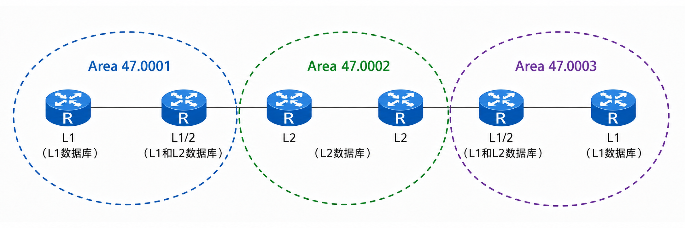
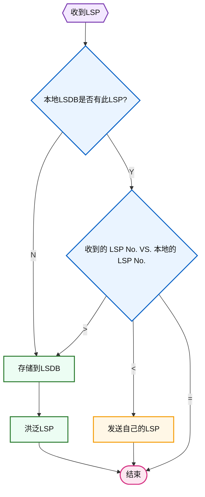
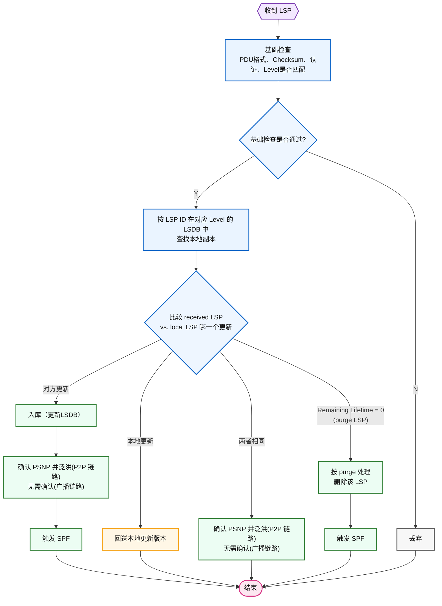
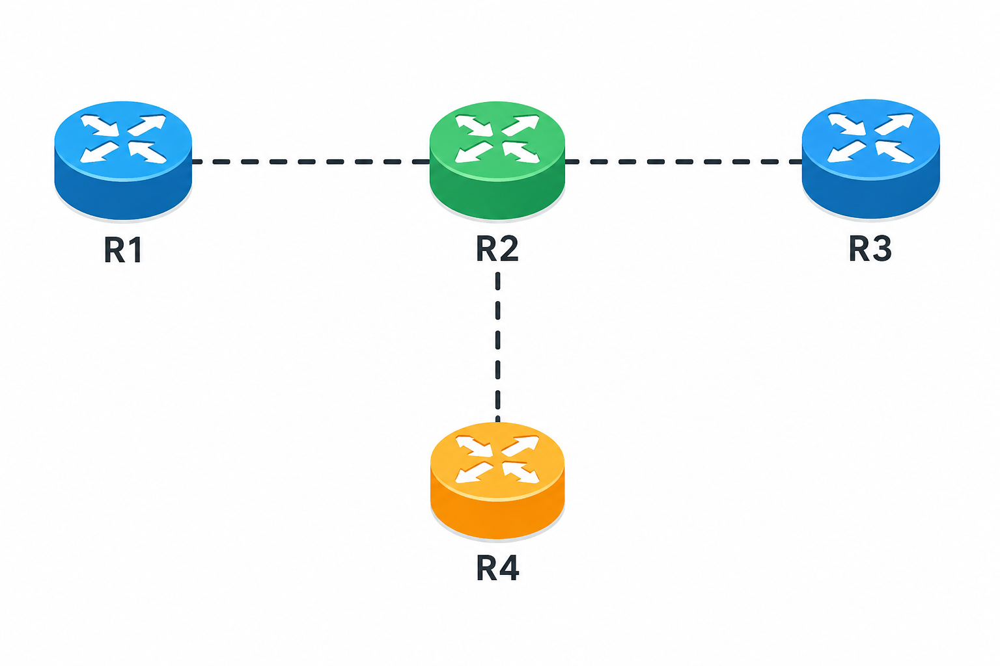
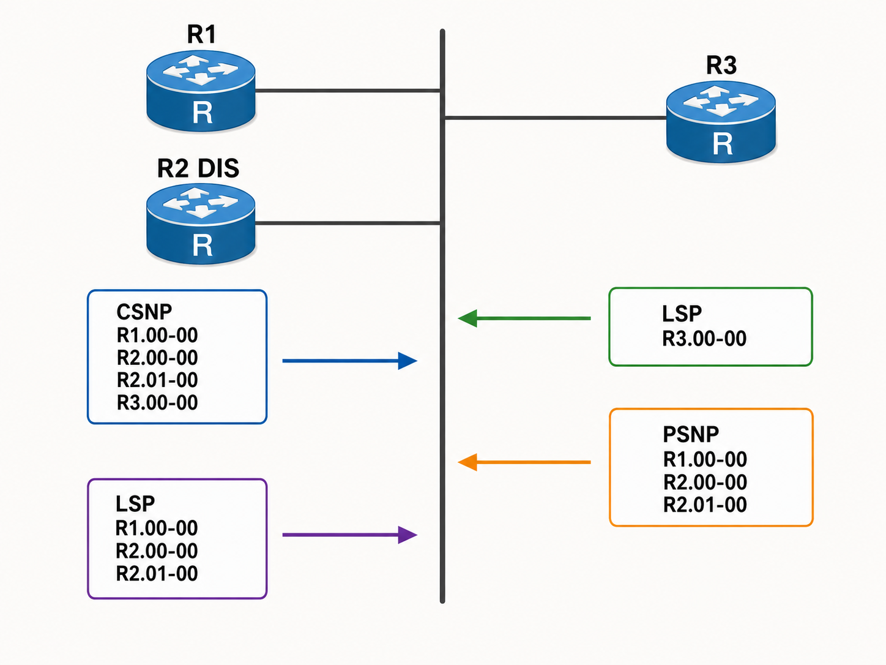
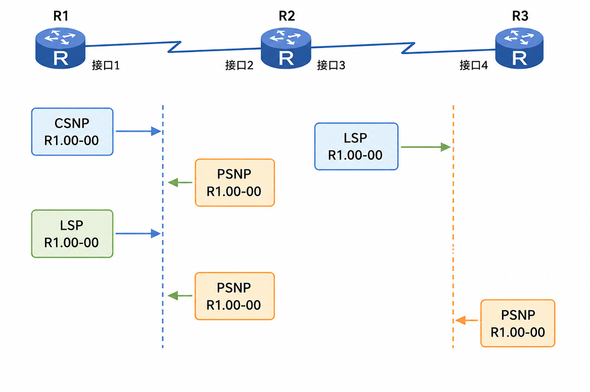

# ISIS 链路状态数据库

IS-IS 支持两级区域的网络分层体系结构，两级区域分别是 L1 区域和 L2 区域，L1 区域只支持区域内的路由，而 L2 区域支持区域间的路由。**<font color="red">每个区域内的路由器都会在区域内泛洪自己的 LSP，也就是说 L1 的 LSP 在 L1 区域内泛洪，L2 的 LSP 会在 L2 区域内泛洪，最终使得区域内的路由器的链路状态数据库都是同步的</font>**。在 L1 区域中的路由器只需要构建和维护一张 L1 的数据库，L2 区域内的路由器也只有一张 L2 的数据库，但是 L1/2 路由器需要两张数据库（L1 和 L2），下图显示了一个典型的 IS-IS 网络结构及其链路状态数据库的情况。

<div align="center">
    
</div>

## 1 LSP 介绍

IS-IS 路由器都会生成 LSP（L1 或者 L2），然后在区域中扩散 LSP，以此来构建链路状态数据库（L1 或 L2）。从本质上讲，IS-IS 的 LSP 和 OSPF 的 LSA 的功能是一样的，L1 的 LSP 用来描述 L1 区域内的链路状态和路由信息，L2 的 LSP 用来描述 L2 区域内的链路状态和路由信息。

### 1.1 LSP 的格式

下面是对 AR8 的 **`G0/0/0`** 口进行抓包获取到的 LSP2 报文。

```java{.line-numbers}
Frame 21: 87 bytes on wire (696 bits), 87 bytes captured (696 bits) on interface -, id 0
IEEE 802.3 Ethernet 
Logical-Link Control
ISO 10589 ISIS InTRA Domain Routeing Information Exchange Protocol
ISO 10589 ISIS Link State Protocol Data Unit
    PDU length: 70
    Remaining lifetime: 1199
    LSP-ID: 0000.0000.0008.00-00
    Sequence number: 0x00000004
    Checksum: 0xb4fc [correct]
    [Checksum Status: Good]
    Type block(0x03): Partition Repair:0, Attached bits:0, Overload bit:0, IS type:3
        0... .... = Partition Repair: Not supported
        .000 0... = Attachment: 0
        .... .0.. = Overload bit: Not set
        .... ..11 = Type of Intermediate System: Level 2 (3)
    Protocols supported (t=129, l=1)
        Type: 129
        Length: 1
        NLPID: IP (0xcc)
    Area address(es) (t=1, l=4)
        Type: 1
        Length: 4
        Area address (3): 49.0002
    IS Reachability (t=2, l=12)
        Type: 2
        Length: 12
        Reserved: 0x00
        IS Neighbor: 0000.0000.0006.01
    IP Interface address(es) (t=132, l=4)
        Type: 132
        Length: 4
        IPv4 interface address: 10.1.158.8
    IP Internal reachability (t=128, l=12)
        Type: 128
        Length: 12
        IPv4 prefix: 10.1.158.0/24
```

这里从 LSP 的专用报头开始解释一下各字段的含义。

- PDU 长度：是指整个 LSP 报文的长度；
- Remaining Lifetime：剩余生存时间，表示 LSP 到期之前的生存时间；
- LSP-ID：LSP 的标识号，用于 LSP 的鉴别。**<font color="red">一个完整的 LSP-ID 是由源路由器的系统 ID、伪节点 ID 和 LSP 报文编号构成的</font>**；
- Sequence Number：LSP 的序列号，是一个 32 位的无符号整数；
- Checksum：从 Sys-ID 开始到报文末尾所有字段的校验和；
- Partition Repair：区域修复位，表示源路由器是否支持区域修复，华为 VRP 系统目前不支持该功能，始终设置为 0；
- Attachment：区域关联位，用于表明源路由器是否与多个区域相连。**<font color="red">L1/2 路由器连接了多个区域，所以会在它的 L1 LSP 中设置该位为 1</font>**。L1 路由器利用该位来判断本区域的 L1/2 路由器。
- Overload Bit：链路状态数据库的超载位，超载时表明初始发路由器的内存和 CPU 资源已经严重不足。
- IS Type：路由器类型，用于表明 LSP 源路由器是 L1 路由器还是 L2 路由器。

下面是拓扑图中 AR1 的 isis 链路状态数据库，该路由器为 L1/2 路由器，因为有两张独立放置的数据库（L1 和 L2）。数据库中的每一行代表了一个 LSP，表示每一个 LSP 显示了以下信息：LSPID、LSP 序列号、LSP 校验和、LSP 剩余生存时间、LSP 长度、区域关联位、区域修复位和数据库过载位。LSPID 之后的星号*表示该 LSP 是本地路由器生成的。

```java{.line-numbers}
<AR1>display isis lsdb 
                        Database information for ISIS(1)
                          Level-1 Link State Database
LSPID                 Seq Num      Checksum      Holdtime      Length  ATT/P/OL
-------------------------------------------------------------------------------
0000.0000.0001.00-00* 0x0000000a   0xa5ca        424           117     1/0/0   
0000.0000.0002.00-00  0x00000007   0xa5f         420           117     1/0/0   
0000.0000.0003.00-00  0x00000005   0x8707        409           113     0/0/0   
0000.0000.0004.00-00  0x00000009   0x5d2f        1178          113     0/0/0   

Total LSP(s): 4
    *(In TLV)-Leaking Route, *(By LSPID)-Self LSP, +-Self LSP(Extended), 
           ATT-Attached, P-Partition, OL-Overload
                          Level-2 Link State Database
LSPID                 Seq Num      Checksum      Holdtime      Length  ATT/P/OL
-------------------------------------------------------------------------------
0000.0000.0001.00-00* 0x0000000c   0xfb0b        426           189     0/0/0   
0000.0000.0002.00-00  0x00000009   0x9b74        421           189     0/0/0   
0000.0000.0005.00-00  0x00000007   0x693c        456           140     0/0/0   
0000.0000.0006.00-00  0x00000009   0x6026        454           140     0/0/0   
0000.0000.0006.01-00  0x00000002   0xc127        455           66      0/0/0   
0000.0000.0008.00-00  0x00000004   0xb4fc        453           70      0/0/0   

Total LSP(s): 6
    *(In TLV)-Leaking Route, *(By LSPID)-Self LSP, +-Self LSP(Extended), 
           ATT-Attached, P-Partition, OL-Overload
<AR1>display isis peer
                          Peer information for ISIS(1)
  System Id     Interface          Circuit Id       State HoldTime Type     PRI
-------------------------------------------------------------------------------
0000.0000.0003  GE0/0/0            0000000001        Up   28s      L1       -- 
0000.0000.0002  GE0/0/1            0000000002        Up   22s      L1L2     -- 
0000.0000.0005  GE0/0/2            0000000001        Up   28s      L2       -- 
```

在上面 isis 链路状态数据库的显示中，**`0000.0000.0006.01-00`** 这条记录是 AR6 作为 Level-2 DIS 为 Area **`49.0002`** 中的 **`10.1.158.0/24`** 广播网络生成的 Level-2 伪节点 LSP，不是 AR6 的普通路由器 LSP，也不是 AR1 的直连邻居。IS-IS 的 LSP 可以由 System ID、Pseudonode ID、LSP Fragment Number 唯一标识，其中 Pseudonode ID 通常为 0，只有伪节点 LSP 才是非 0。

### 1.2 LSP ID

**<font color="red">LSP ID 用来在链路状态数据库中唯一标识一条 LSP，使接收路由器能区别出每条不同的 LSP 及其始发源路由器</font>**。LSP ID 总长 8Byte。前 6Byte 表示始发路由器的系统 ID，在系统 ID 之后的 1 个字节表示伪节点 ID。如果这个字节值是零，表示 LSP 是由普通路由器发出的；如果是非零，则表示 LSP 是由 DIS 发出的。**`system ID + pseudonode ID`** 一起构成了 LAN ID。

LSP ID 最后的 1Byte 表示 LSP 分片号。因为 IS-IS 协议的 LSP 只有 L1 和 L2 两类，所以不论是在 L1 区域，还是在 L2 区域，**一台路由器会把本区域的所有路由信息都放在一条 LSP 传送**。如果路由信息很多，会导致 LSP 报文很大以至于超过了发出接口的 MTU 值，这时需要分段处理，也就是将路由信息放在不同分段的 LSP 传送。LSP 第一个分段的编号为 0，第二个分段的编号为 1，以此类推。如果某些分段在传递过程中丢失了，那么接收端路由器也会放弃所有其他分段，导致该 LSP 的所有分段都必须重传，造成带宽的浪费。

LSPID 由一段数字组成，可读性不强，为使管理员更容易、直观地区别不同的 LSP，可以使用主机名映射功能，也就是使用始发路由器的主机名来替代系统 ID。华为 VRP 系统启用主机名映射功能的方法分为动态主机名映射和静态主机名映射。

动态主机名映射是指以类型 137 的 TLV 将自己的主机名随 LSP 发布到网络中，这个 TLV 是可选的，在其他 IS-IS 路由器上可以通过命令看到本地 System-ID 直接被主机名所替代。静态主机名映射是指在本地设备上对其他运行 IS-IS 协议的设备设置主机名与 System-ID 的映射。静态主机名映射仅在本地设备生效，并不会通过 LSP 报文发送出去。

下面，我们在 AR1 上配置 is-name AR1，让 AR1 在自己生成的 LSP 中携带 **`Dynamic Hostname TLV 137`**，也就是把 AR1 这个符号名随 LSP 泛洪出去。不过注意，映射关系不是完整的 **`0000.0000.0001.00-00 -> AR1`**，而是 **`0000.0000.0001 -> AR1`**。

```java{.line-numbers}
[AR1-isis-1]display isis lsdb 
                        Database information for ISIS(1)
                          Level-1 Link State Database
LSPID                 Seq Num      Checksum      Holdtime      Length  ATT/P/OL
-------------------------------------------------------------------------------
AR1.00-00*            0x0000000e   0xe436        1182          122     1/0/0   
0000.0000.0002.00-00  0x00000009   0x661         364           117     1/0/0   
0000.0000.0003.00-00  0x00000007   0x8309        487           113     0/0/0   
0000.0000.0004.00-00  0x0000000a   0x5b30        463           113     0/0/0   

Total LSP(s): 4
    *(In TLV)-Leaking Route, *(By LSPID)-Self LSP, +-Self LSP(Extended), 
           ATT-Attached, P-Partition, OL-Overload
[AR1-isis-1]display isis name-table 
                       Name table information for ISIS(1)
System ID            Hostname                            Type           
-------------------------------------------------------------------------------
0000.0000.0001       AR1                                 DYNAMIC   
<AR3>display isis name-table 
                       Name table information for ISIS(1)
System ID            Hostname                            Type           
-------------------------------------------------------------------------------
0000.0000.0001       AR1                                 DYNAMIC         

<AR3>display isis lsdb
                        Database information for ISIS(1)
                          Level-1 Link State Database
LSPID                 Seq Num      Checksum      Holdtime      Length  ATT/P/OL
-------------------------------------------------------------------------------
0000.0000.0001.00-00  0x0000000e   0xe436        978           122     1/0/0   
0000.0000.0002.00-00  0x0000000a   0x462         995           117     1/0/0   
0000.0000.0003.00-00* 0x00000008   0x810a        1129          113     0/0/0   
0000.0000.0004.00-00  0x0000000b   0x5931        1052          113     0/0/0   

Total LSP(s): 4
    *(In TLV)-Leaking Route, *(By LSPID)-Self LSP, +-Self LSP(Extended), 
           ATT-Attached, P-Partition, OL-Overload
```

但是在 AR3 上已经学到了 AR1 的动态主机名，但 **`display isis lsdb`** 的简表仍按原始 AR3 LSPID 显示。这时需要继续在 AR3 上配置 **`is-name AR3`**，因为 **`is-name`** 命令还可以用来使能识别 LSP 报文中主机名称的能力。

```java{.line-numbers}
[AR3-isis-1]display isis lsdb
                        Database information for ISIS(1)
                          Level-1 Link State Database
LSPID                 Seq Num      Checksum      Holdtime      Length  ATT/P/OL
-------------------------------------------------------------------------------
AR1.00-00             0x0000000f   0xe237        950           122     1/0/0   
0000.0000.0002.00-00  0x0000000a   0x462         690           117     1/0/0   
AR3.00-00*            0x00000009   0x2611        1197          118     0/0/0   
0000.0000.0004.00-00  0x0000000b   0x5931        747           113     0/0/0   

Total LSP(s): 4
    *(In TLV)-Leaking Route, *(By LSPID)-Self LSP, +-Self LSP(Extended), 
           ATT-Attached, P-Partition, OL-Overload
<AR3>display isis name-table 
                       Name table information for ISIS(1)
System ID            Hostname                            Type           
-------------------------------------------------------------------------------
0000.0000.0001       AR1                                 DYNAMIC         
0000.0000.0003       AR3                                 DYNAMIC  
```

### 1.3 LSP 序列号

LSP 序列号用来表示被刷新的次数，是一个 4Byte 长的无符号整数，从 0 开始计数，但是一台路由器启动 IS-IS 进程后，第一次生成 LSP 序列号是 1，以后 LSP 每刷新（重新生成）一次，序列号加 1，最大值为 **`2^32-1`**。通过 LSP 序列号，可以判断一条 LSP 的新旧。

如下所示，路由器在接收到 LSP 后，会跟本地链路状态数据库作比较。如果本地链路状态数据库没有此 LSP，则直接将其放进数据库，并且泛洪此 LSP 到区域中。如果数据库中已经有了这个 LSP，则比较新收到的 LSP 和本地数据库中已有的 LSP 序列号，如果新收到的 LSP 序列号大于数据库已有的，则用这个新的 LSP 替换掉数据库原有的 LSP，并产生新的 LSP 泛洪到区域中；如果本地数据库中的 LSP 序列号更大，则忽略掉新到的 LSP，并向接收端口发送自己的 LSP；如果新到的 LSP 和本地数据库中的 LSP 序列号一样，则忽略新到的 LSP，不做任何操作。



关于 LSP 的序列号，这里有两种情况需要注意。

**（1）第一种情况**

如果一台路由器发生故障而没有向其他路由器清除它的 LSP（序列号已经大于 1），等到这台路由器从故障中恢复后它会重新产生序列号为 1 的 LSP。其他路由器的 LSDB 里仍然保存着这台路由器旧的 LSP，而且这些旧 LSP 的 **`Sequence Number`** 可能已经大于 1，接收到这条 LSP 后会忽略，导致路由无法及时更新。**<font color="red">解决的办法是在其他路由器接收到这条序列号为 1 的 LSP 后，会立刻将本地数据库中的 LSP 拷贝一份扩散出来</font>**，这台路由器接收到自己 LSPID、但序列号更大”的旧 LSP 后，会把自己新的 LSP 序列号跳到比该旧 LSP 更大的值，然后重新生成并泛洪新的 LSP，保证了路由器故障前后生成的 LSP 的序列号的连续性。

根据 RFC 1142 的规定，If an Intermediate system R somewhere in the domain has information that the current sequence number for source S is greater than that held by S, R will return to S a Link State PDU for S with R's value for the sequence number. When S receives this LSP it shall change its sequence number to be the next number greater than the new one received, and shall generate a link state PDU. The sequence number is a 4 octet unsigned value. Sequence numbers shall increase from zero to (SequenceModulus- 1). When a system initialises, it shall start with sequence number 1 for its own Link State PDUs.

**（2）第二种情况**

**<font color="red">当 LSP 的序列号到达最大值时，这台路由器的 IS-IS 进程会停止一段时间，`这个时间=LSP 最大生存时间+零生存时间`</font>**，直到这条 LSP 在网络中其他路由器的数据库被老化并且清除。接着，路由器重新启动，启动完成后会生成一条序列号为 1 的新的 LSP。

IS-IS 的 LSP 序列号不能像普通计数器一样从最大值回绕到 1 或 0。因为其他路由器判断 LSP 新旧时，主要看序列号大小；如果一个 LSP 已经到了最大序列号，而本机又直接从 1 重新发布，那么网络中残留的最大序列号 LSP 会被认为更新，新的序列号 1 的 LSP 会被忽略，导致 LSDB 无法正确刷新。

RFC 1142 规定，LSP 序列号是 4 字节无符号值，系统初始化时自己的 LSP 从序列号 1 开始；如果需要继续增加序列号但已经等于最大值，就要产生试图超过最大序列号的通知（**`attemptToExceedMaximumSequenceNumber`**），并且把路由模块禁用至少 **`MaxAge + ZeroAgeLifetime`**，以确保网络中所有这个高序列号 LSP 都已经过期，然后再从序列号 1 重新开始。

### 1.4 LSP 剩余生存时间

在 ISO10589 中规定 IS-IS 的 LSP 最大生存时间为 1200s，华为 VRP 系统可以通过 **`timer lsp-max-age`** 命令设置 LSP 的最大生存年龄，最大可以配置到 65535s。**<font color="red">始发路由器产生 LSP 时，会将剩余生成时间设置到最大年龄值，然后泛洪到区域中</font>**，这条 LSP 被存储在数据库中，并且它的剩余生成时间会随着时间的推移而逐渐减少，如果没有及时得到刷新，这条 LSP 的剩余生存时间减少到 0 时会从数据库中清除。

IS-IS 和 OSPF 一样，也有周期性的刷新，IS-IS 的刷新间隔时间为 900s，华为 VRP 系统可以通过 **`timer lsp-refresh`** 命令修改刷新间隔时间，最小间隔为 1 秒，最大间隔为 65534s。在调整 LSP 的刷新间隔时间时，要记得 LSP 的最大生存时间也要做适当的调整，并且要保证最大生存时间要大于刷新间隔时间。

当一条 LSP 收到始发路由器的刷新时，剩余生存时间被重置到最大生存时间；如果没有得到及时刷新，LSP 的剩余生存时间会逐渐减少到 0，这时，路由器在等待 60s 后如果始发路由器还没发来更新，那么该 LSP 会被清除掉，**<font color="blue">这个 60s 的时间叫零年龄老化时间，相当于在宣判一条 LSP 死刑之前最后的宽限期</font>**。华为 VRP 系统无法修改零年龄老化时间的默认值。

### 1.5 区域关联位（ATT）

区域关联位用于指明一台 L2 或 L1/2 路由器具有其他区域的路由（与其他区域有连接）。由前面的内容可以知道，IS-IS 的 L1/2 路由器虽然是 L1 区域内的路由器，但它同时连接到了骨干区域（L2 区域），具备 L1 和 L2 两张数据库。有了 L2 数据库，也就等于有了其他区域的路由信息。

**<font color="red">一台 L1/2 路由器在向 L1 区域通告的 LSP 中将 ATT 位设置为 1，向 L1 区域内的路由器表明它具有到其他区域的路由信息</font>**。L1 路由器根据这条 LSP，生成一条指向最近的 L1/2 路由器的默认路由，用于将数据包发向其他区域。**<font color="red">这里需要注意的问题是，L1/2 通告 `ATT=1` 的 L1 LSP 的条件是至少在骨干区域有个活动的 L2 邻接</font>**。

虽然在 L1 和 L2 的 LSP 都能设置 ATT 位，**但是 ATT 位只能用于 L1 区域的选路**。同时，区域关联位允许一台 L1/2 路由器来表明它连接到骨干区域的链路使用的开销类型。下面是前面拓扑中 AR4 上的 **`isis lsdb`** 中的 LSP 信息。

```java{.line-numbers}
<AR4>display isis lsdb 
                        Database information for ISIS(1)
                          Level-1 Link State Database
LSPID                 Seq Num      Checksum      Holdtime      Length  ATT/P/OL
-------------------------------------------------------------------------------
0000.0000.0001.00-00  0x0000001d   0xc645        1105          122     1/0/0   
0000.0000.0002.00-00  0x00000018   0xe770        1017          117     1/0/0   
0000.0000.0003.00-00  0x00000017   0xa1f         944           118     0/0/0   
0000.0000.0004.00-00* 0x00000019   0x3d3f        745           113     0/0/0   

Total LSP(s): 4
    *(In TLV)-Leaking Route, *(By LSPID)-Self LSP, +-Self LSP(Extended), 
           ATT-Attached, P-Partition, OL-Overload
<AR4>display isis  route 
                         Route information for ISIS(1)
                        ISIS(1) Level-1 Forwarding Table
IPV4 Destination     IntCost    ExtCost ExitInterface   NextHop         Flags
-------------------------------------------------------------------------------
0.0.0.0/0            5          NULL    GE0/0/1         10.1.24.2       A/-/-/-
10.1.24.0/24         5          NULL    GE0/0/1         Direct          D/-/L/-
10.1.4.0/24          0          NULL    Loop0           Direct          D/-/L/-
10.1.13.0/24         30         NULL    GE0/0/0         10.1.34.3       A/-/-/-
10.1.3.0/24          10         NULL    GE0/0/0         10.1.34.3       A/-/-/-
10.1.12.0/24         35         NULL    GE0/0/1         10.1.24.2       A/-/-/-
10.1.2.0/24          5          NULL    GE0/0/1         10.1.24.2       A/-/-/-
10.1.1.0/24          30         NULL    GE0/0/0         10.1.34.3       A/-/-/-
10.1.34.0/24         10         NULL    GE0/0/0         Direct          D/-/L/-
     Flags: D-Direct, A-Added to URT, L-Advertised in LSPs, S-IGP Shortcut,
                               U-Up/Down Bit Set
<AR4>display ip routing-table 0.0.0.0
Route Flags: R - relay, D - download to fib
------------------------------------------------------------------------------
Routing Table : Public
Summary Count : 1
Destination/Mask    Proto   Pre  Cost      Flags NextHop         Interface
        0.0.0.0/0   ISIS-L1 15   5           D   10.1.24.2       GigabitEthernet0/0/1
```

如上面的输出显示，路由器 AR4 接收到 AR1 和 AR2 各发送的一条 ATT 设置为 1 的 LSP，在 AR4 的路由器表就会增加一条默认路由，下一跳指向离它最近的 L1/2 路由器 AR2。

也可以根据实际需要，配置 L1/2 是否通告 ATT 置位的 LSP，在华为 VRP 系统中，使用 **`attached-bit advertise`** 命令配置能让 L1/2 路由器在通告的 L1 LSP 中永远或永远不设置 ATT 位，也可以通过命令 **`attached-bit avoid-learning`** 配置在接收到 ATT 置位的 L1 LSP 时，L1 路由器也不生成默认路由。

如下所示，AR2 配置了 **`attached-bit advertise never`** 后，AR2 就不产生 ATT 置位的 LSP，AR4 接收到 AR2 的 LSP 后就不会生成指向 AR2 的默认路由了，AR4 的默认路由指向 AR1，因此下一跳为 AR3。

```java{.line-numbers}
[AR2]isis 1
[AR2-isis-1]attached-bit advertise never 
<AR4>display isis  lsdb 
                        Database information for ISIS(1)
                          Level-1 Link State Database
LSPID                 Seq Num      Checksum      Holdtime      Length  ATT/P/OL
-------------------------------------------------------------------------------
0000.0000.0001.00-00  0x0000001d   0xc645        621           122     1/0/0   
0000.0000.0002.00-00  0x00000019   0xdd81        1060          117     0/0/0   
0000.0000.0003.00-00  0x00000017   0xa1f         460           118     0/0/0   
0000.0000.0004.00-00* 0x0000001a   0x3b40        1118          113     0/0/0   

Total LSP(s): 4
    *(In TLV)-Leaking Route, *(By LSPID)-Self LSP, +-Self LSP(Extended), 
           ATT-Attached, P-Partition, OL-Overload
<AR4>display ip routing-table 0.0.0.0
Route Flags: R - relay, D - download to fib
------------------------------------------------------------------------------
Routing Table : Public
Summary Count : 1
Destination/Mask    Proto   Pre  Cost      Flags NextHop         Interface
        0.0.0.0/0   ISIS-L1 15   30          D   10.1.34.3       GigabitEthernet0/0/0
```

## 2.SNP（序列号报文）

IS-IS 协议通过 LSP 的泛洪来实现链路状态数据库的同步，SNP 就是用来跟踪和维护链路状态数据库的同步的报文，它分为两类：

- CSNP（Complete Sequence Number Packet：完全序列号报文）；
- PSNP（Partial Sequence Number Packet：部分序列号报文）。

CSNP 和 PSNP 的报文格式是相同的，而且都携带 LSP 的摘要信息。不同的地方是，**<font color="red">CSNP 报文携带的是当前路由器的链路状态数据库中的所有 LSP 的摘要信息</font>**，类似 OSPF 的 DD（数据库描述）报文；**<font color="red">而 PSNP 报文携带的是数据库中部分 LSP 的摘要信息</font>**。因为链路状态数据库有 L1 类型和 L2 类型的，所以 CSNP 和 PSNP 两种报文也有 L1 类型和 L2 类型的产生。

### 2.1 CSNP（完全序列号报文）

在链路状态数据库的同步过程中，CSNP 报文的作用是为了确保区域内所有路由器的链路状态数据库保持一致。不论是广播网络还是 P2P 网络，一台路由器接收到另一台路由器的 CSNP 报文后，会对比自己的链路状态数据库。如果发现自己的链路状态数据库中不完整（有缺失的 LSP），就会向接收 CSNP 报文的接口发送出 PSNP 报文，用来请求自己还没有的 LSP；如果发现自己的链路状态数据库中的 LSP 不是最新的，也会发送 PSNP 去请求最新的 LSP；如果发现比自己的 LSP 更加新，则将自己的 LSP 泛洪出去。这个过程用来帮助区域内的路由器完成数据库的同步。

在广播网络和 P2P 网络中，数据库同步的过程有些差别。在广播网络中，路由器之间在建立完邻接关系后，直接泛洪和交换 LSP，从而完成数据库的同步。但是，在广播网络中，由于 LSP 的泛洪是不可靠的（不需要接收端确认），所以为确保每台路由器数据库的完整性，DIS 会周期性地泛洪 CSNP 报文。在点对点网络中，路由器之间邻接关系建立之后，直接交换 CSNP 报文，而且需要在接收到 LSP 后需要向发送方确认。

```java{.line-numbers}
Frame 3271: 148 bytes on wire (1184 bits), 148 bytes captured (1184 bits) on interface -, id 0
IEEE 802.3 Ethernet 
Logical-Link Control
ISO 10589 ISIS InTRA Domain Routeing Information Exchange Protocol
    Intradomain Routing Protocol Discriminator: ISIS (0x83)
    Length Indicator: 33
    Version/Protocol ID Extension: 1
    ID Length: 6
    000. .... = Reserved: 0x0
    ...1 1001 = PDU Type: L2 CSNP (25)
    Version: 1
    Reserved: 0
    Maximum Area Addresses: 3
ISO 10589 ISIS Complete Sequence Numbers Protocol Data Unit
    PDU length: 131
    Source-ID: 0000.0000.0006
    Source-ID-Circuit: 00
    Start LSP-ID: 0000.0000.0000.00-00
    End LSP-ID: ffff.ffff.ffff.ff-ff
    LSP entries (t=9, l=96)
        Type: 9
        Length: 96
        LSP Entry
        LSP-ID: 0000.0000.0001.00-00
        LSP Entry
        LSP-ID: 0000.0000.0002.00-00
        LSP Entry
        LSP-ID: 0000.0000.0005.00-00
        LSP Entry
        LSP-ID: 0000.0000.0006.00-00
        LSP Entry
        LSP-ID: 0000.0000.0006.01-00
        LSP Entry
        LSP-ID: 0000.0000.0008.00-00
<AR6>display isis lsdb 
                        Database information for ISIS(1)
                          Level-2 Link State Database
LSPID                 Seq Num      Checksum      Holdtime      Length  ATT/P/OL
-------------------------------------------------------------------------------
0000.0000.0001.00-00  0x00000021   0x6e32        740           194     0/0/0   
0000.0000.0002.00-00  0x0000001c   0x7587        589           189     0/0/0   
0000.0000.0005.00-00  0x0000001a   0x434f        731           140     0/0/0   
0000.0000.0006.00-00* 0x0000001d   0x383a        1159          140     0/0/0   
0000.0000.0006.01-00* 0x00000016   0x993b        1159          66      0/0/0   
0000.0000.0008.00-00  0x00000018   0x8c11        1085          70      0/0/0   

Total LSP(s): 6
    *(In TLV)-Leaking Route, *(By LSPID)-Self LSP, +-Self LSP(Extended), 
           ATT-Attached, P-Partition, OL-Overload
```

AR6 产生的 CSNP 报文中各字段的介绍如下。

- PDU 长度：整个 CSNP 报文的长度。
- **`Source-ID`**：始发源路由器的系统 ID。在 P2P 网络中是指发送端路由器的系统 ID，在广播网络中指 DIS 的系统 ID。
- **`Start LSP-ID`**：起始 LSP-ID，代表 CSNP 报文描述的 LSP 条目中第一条 LSP 的 LSP-ID。
- **`End LSP-ID`**：结束 LSP-ID，代表 CSNP 报文描述的 LSP 条目中最后一条 LSP 的 LSP-ID。
- LSP 条目：LSP 条目，使用类型 9 的 TLV，用来携带描述的 LSP 摘要信息，所有 LSP 的摘要信息按 LSP-ID 的升序依次排列在 LSP 条目中。

由于有些链路状态数据库的信息较多，单个 CSNP 报文不能完整描述，所以 CSNP 报文引入了 **`Start LSP-ID`** 和 **`End LSP-ID`** 两个字段，用来说明一个 CSNP 报文所描述的 LSP 的范围。一个 CSNP 报文如果描述了整个链路状态数据库中的信息，那么它描述的 LSP-ID 就起始于 **`0000.0000.0000.00`**，结束于 **`FFFF.FFFF.FFFF.FF`**。

需要注意的是，**`Start LSP-ID`** 和 **`End LSP-ID`** 仅用于表示该 CSNP 所覆盖的 LSP-ID 范围，并不代表 AR6 的 LSDB 中实际存在 **`0000.0000.0000.00-00`** 或 **`FFFF.FFFF.FFFF.FF-FF`** 这两条 LSP。也就是说，范围字段表示清单覆盖的 LSP-ID 区间，LSP Entries 才表示该范围内实际存在的 LSP 记录。如果某个 LSP-ID 位于该范围内，但未出现在 LSP Entries 中，则说明 CSNP 发送方当前并没有该 LSP 的记录。

### 2.2 PSNP（不分序列号报文）

一个 PSNP 报文只携带部分 LSP 描述信息，而不是整个数据库的信息，所以在报文内部不需要起始和结束的 LSP-ID 字段。PSNP 有两个作用：

- 在广播网络和点对点网络中请求缺失或最新的 LSP；
- 在点对点网络中确认收到的 LSP。

```java{.line-numbers}
Frame 50: 68 bytes on wire (544 bits), 68 bytes captured (544 bits) on interface -, id 0
IEEE 802.3 Ethernet 
Logical-Link Control
ISO 10589 ISIS InTRA Domain Routeing Information Exchange Protocol
    Intradomain Routing Protocol Discriminator: ISIS (0x83)
    Length Indicator: 17
    Version/Protocol ID Extension: 1
    ID Length: 6
    000. .... = Reserved: 0x0
    ...1 1011 = PDU Type: L2 PSNP (27)
    Version: 1
    Reserved: 0
    Maximum Area Addresses: 3
ISO 10589 ISIS Partial Sequence Numbers Protocol Data Unit
    PDU length: 51
    Source-ID: 0000.0000.0008
    Source-ID-Circuit: 00
    LSP entries (t=9, l=32)
        Type: 9
        Length: 32
        LSP Entry
        LSP-ID: 0000.0000.0001.00-00
        LSP Entry
        LSP-ID: 0000.0000.0002.00-00
```

AR8 发现 DIS 的 CSNP 里 AR1、AR2 的 LSP 信息比自己新，或者自己缺少这些 LSP，AR8 就会发送 PSNP，用来针对 AR1 和 AR2 的 L2 LSP 做数据库同步。

## 3.泛洪机制

### 3.1 泛洪流程

作为一种链路状态路由协议，IS-IS 和 OSPF 一样，区域中的路由器首先要交换链路状态信息，最终所有路由器的链路状态数据库达到一致的状态，这就好比每台路由器都有了一张相同的网络拓扑。然后，每台路由器利用自己的 SPF 算法计算到区域内任何其他网络的最优路由。

路由器产生一个 LSP 后，然后从所有运行了 IS-IS 的接口扩散出去，区域中的其他路由器从一个接口接收到 LSP 后，**<font color="red">将这份 LSP 的一份拷贝装入 L1 或 L2 的数据库中，然后再将这份 LSP 从其他所有运行了 IS-IS 的接口继续扩散</font>**。路由器接收到一条 LSP 时，处理流程如下。收到邻居发来的新 LSP 后，本端会把 LSP 安装到 LSDB，并标记为待泛洪。具体的处理流程如下：



在上述流程图中，按 LSP ID 在对应 level 的 LSDB 中查找对应 LSP 副本， 并且比较谁更新，比较流程如下所示：

1. Sequence Number 大的更新。
2. Sequence Number 相同：
   - 如果收到的 **`LSP Remaining Lifetime = 0`**，而本地对应 LSP 不为 0，收到的 LSP 是更新的 purge LSP；
   - 如果收到的 **`LSP Remaining Lifetime ≠ 0`**，而本地对应 **`LSP = 0`**，本地 purge LSP 更新，应回发本地 LSP；
3. 如果双方 Remaining Lifetime 都不为 0，根据华为文档描述为比较 Checksum，Checksum 大的更新（tie-breaker）；
4. 如果 Sequence Number、Remaining Lifetime、Checksum 都相同，不再转发该 LSP；

因此根据上述流程图以及比较报文新旧的流程，处理从邻居收到的新 LSP 时，路由器会把 LSP 安装到 LSDB，并标记为待泛洪。如果收到 LSP 的序列号大于本地 LSDB 中对应 LSP 的序列号，设备把收到的 LSP 加入 LSDB，发送 PSNP 确认，并把该 LSP 发给除发送者之外的其他邻居。如果收到的 LSP 序列号小于本地 LSDB 中对应 LSP 的序列号，路由器会直接把本地 LSP 发给邻居。如果收到的是重复 LSP，原则上不再继续泛洪，否则会造成无意义的重复扩散。

### 3.2 计时器

#### 3.2.1 最大生存时间

最大生存时间是指一个 LSP 从产生开始直到过期经历的最长时间，ISO10589 定义的 LSP 最大生存时间为 1200s，一个 LSP 的生存时间是从最大生存时间向下递减的。正常情况下，一个 LSP 的始发源路由器会定期更新它的 LSP，路由器接收到新的 LSP 后，替换掉老的 LSP 并重置 LSP 的剩余生存时间到最大生存时间。如果 LSP 的剩余生存时间减少到 0 时，还没有得到源路由器的刷新，那么这个 LSP 就会被清除。在清除之前路由器还会等一个零阳寿生存时间（Zero Age Life Time），ISO 10589 定义的零阳寿生存时间为 60s。

>网络中的路由器使用的 LSP 最大生存时间必须一致，如果路由器接收到一个 LSP 的剩余生存时间比本地的最大生存时间还要大，那么会认为该 LSP 已经被破坏而将其丢弃，从而影响网络的稳定性。

#### 3.2.2 LSP 刷新间隔

LSP 始发路由器在 LSP 剩余生存时间减少到 0 之前，每隔一定时间会重新产生该 LSP 的新实例，这个时间间隔默认认为 900s。周期性的刷新有利于网络中所有路由器的链路状态数据库的完整性。华为 VRP 系统修改 LSP 刷新间隔的命令是 **`timer lsp-refresh`**。

#### 3.2.3 LSP 连续生成间隔

为了避免 LSP 频繁生成给网络带来的冲击，**<font color="red">LSP 的生成存在一个最小间隔的限制，即同一个 LSP 在最小间隔内不允许重复生成，一般缺省最小时间间隔为 5s</font>**。在一些不稳定的网络中，可以将 LSP 生成间隔设置大些，比如网络中有条链路持续翻滚的话，由于本地路由信息发生变化，路由器需要产生新的 LSP 来通告，就会导致路由器不停地产生新的 LSP，这会让网络中其他路由器的 SPF 进程频繁进行路由计算。另一方面，如果产生 LSP 的延迟时间过长，则本地路由信息的变化无法及时通告给邻居，导致网络的收敛速度变慢。可以使用 **`timer lsp-generation`** 命令来设置产生 LSP（这些 LSP 具有相同的 LSP ID）的延迟时间。

LSP 刷新间隔是即使网络没变化，始发路由器也要定期重新生成自己产生的 LSP，防止它老化到 0。LSP 连续生成时间间隔是当本地路由信息连续变化时，限制同一个 LSP ID 的新 LSP 生成频率，避免链路抖动导致设备不停生成 LSP。前者是周期性保活/刷新机制，后者是变化触发后的节流/抑制机制。

#### 3.2.4 LSP 传输间隔

LSP 传输间隔是指连续传送两个 LSP 的间隔，缺省情况下，接口上发送 LSP 的最小时间间隔为 50ms。如果邻居路由器的资源有限，其他路由器向其传递一个 LSP 后，它无法按时确认的话，其他路由器就会重传 LSP，这时可能使情况更加恶化，为了保护这样的邻居，LSP 传输间隔就得设置大些。

>LSP 连续生成间隔控制的是本地多久重新生成自己的 LSP，也就是当本地路由信息变化后，设备创建新版本 LSP 的最小间隔。它用于避免链路或路由频繁抖动时不断生成新 LSP，从而增加 CPU 和 LSDB 泛洪压力。
>LSP 传输间隔控制的是已生成或待泛洪的 LSP 从接口发出去的速度，也就是同一接口连续发送两个 LSP 的最小间隔。它属于出口限速，不会减少本地 LSP 的生成次数，只是放慢泛洪节奏，避免大量 LSP 瞬间压给邻居。

#### 3.2.5 CSNP 发送间隔

在广播网络中，为维护链路状态数据库的完整性，DIS 周期性地发送 CSNP，默认间隔是 10s。华为 VRP 系统可以通过接口命令 **`isis timer csnp`** 来修改该默认值。该值设得小些，有利于网络的快速收敛，但同时增加了带宽的开销。

## 4.链路状态数据库的同步过程

### 4.1 广播网络中的同步过程

在广播网络中，路由器在邻接关系初始化后，首先泛洪自己的 LSP，L1 的 LSP 发送到组播地址 **`01-80-C2-00-00-14（L1 IS）`**，L2 的 LSP 发送到组播地址 **`01-80-C2-00-00-15（L2 IS）`**。其他 L1 或 L2 邻居接收 LSP 后，并不需要确认，因此在广播网络中，LSP 的泛洪是不可靠的。因此 IS-IS 协议使用 DIS 周期性地发送 CSNP 来保证广播网络中链路状态数据库的同步。

DIS 是 IS-IS 协议用来在广播网络中控制数据库信息的泛洪和同步的。**<font color="red">在广播网络中，路由器都与 DIS 建立了邻接关系（当然，所有路由器之间都建立了邻接关系）</font>**，这就意味着，DIS 的数据库拥有其他所有路由器的数据库信息，基于这个前提，DIS 使用一个或多个 CSNP 描述自己整个链路状态数据库信息，然后周期性地（每隔 10 秒）扩散到网络中。

其他路由器接收到 DIS 的 CSNP 后，与自己的数据库中的内容作比较，比较后会发现自己缺失或较新的 LSP，然后发送 PSNP 来请求相应的 LSP。网络中的 DIS 或具有这份 LSP 的邻居收到请求后就会回应相应的 LSP。在广播链路上，**<font color="red">发送 LSP 之前会在接口上先设置一个 SRM 标志，待发送完 LSP 后立刻清除标志</font>**。如果路由器查看 DIS 发过来的 CSNP 内容后，发现自己数据库中具有的 LSP 而 DIS 没有或 DIS 具有的更老，这时它会主动将自己的 LSP 泛洪出来。

在一个广播网络中有可能存在多台路由器，在链路状态数据库的同步过程中，如果对每条接收的 LSP 都要给予确认的话，这就需要发送端路由器跟踪其他所有邻居的接收情况，从而让整个过程变得更复杂。

在 IS-IS 里，SRM 标志（Send Routing Message flag），可以理解为某个 LSP 在某个接口上需要被发送/泛洪出去的待发送标记。标准 RFC 1142 对 SRM 的定义是：Send Routeing Message (SRMflag)  if set, indicates that Link State PDU should be transmitted on that circuit.  On broadcast circuits SRMflag is cleared as soon as the LSP has been transmitted, but on non-broadcast circuits SRMflag is only cleared on reception of a Link State PDU or Sequence Numbers PDU as described below. SRMflag 置位就表示该 LSP 要在这条 circuit 上发送。广播电路上 LSP 发出后清 SRM；非广播电路上，SRM 要等收到 LSP 或 SNP 后才清。

IS-IS 的 LSP 泛洪并不是设备收到一个 LSP 后，就立刻从所有接口无差别转发。路由器需要判断这条 LSP 是否还需要从某个接口发出去。SRM 就是用来记录这个状态的标志位。简单理解，某个 LSP 在某个接口上的 **`SRM=1`**，就表示这条 LSP 还需要从这个接口发送出去；**`SRM=0`**，则表示不需要发送。The Update Process scans the Link State Database for Link State PDUs with SRMflags set. When one is found, provided the timestamp lastSent indicates that it was propagated no more recently than minimumLSPTransmissionInterval, the IS shall transmit it on all circuits with SRMflags set, and update lastSent.

<div align="center">
    
</div>

例如对于上述拓扑来说，假设 R2 从 R1 收到一个新的 LSP，序列号为 **`Seq=100`**，并且判断该 LSP 比本地 LSDB 中保存的版本更新，那么 R2 会先把这条 LSP 写入自己的 LSDB。由于这条 LSP 是从连接 R1 的接口收到的，R2 不需要再把它从原接口发回给 R1，因此会清除该入接口上的 SRM；但 R2 还需要把这条新的 LSP 继续泛洪给其他邻居 R3 和 R4，所以会在连接 R3、R4 的接口上设置 SRM。这样设备就能精确控制 LSP 的泛洪方向，避免无意义的回发和重复扩散。

如果收到的是旧版本 LSP，假设 R2 本地已经保存了 **`R1.00-00 Seq=100`**，但从 R3 收到的却是 **`R1.00-00 Seq=90`**，这说明 R3 的 LSDB 落后。此时 R2 要把自己保存的更新版本发回给 R3。因此，R2 会在收到旧 LSP 的那个接口上设置 SRM，表示需要从该接口把本地更新的 LSP 发送出去。

点到点链路要求可靠泛洪，发送 LSP 后不能立即清除 SRM，必须等对端通过 PSNP 确认后再清除；若未确认，则继续保留 SRM 以便重传。广播网络则主要依靠 DIS、CSNP 和 PSNP 完成 LSDB 同步，设备发送 LSP 后通常即可清除 SRM，不需要等待每个邻居逐一确认。

<div align="center">
    
</div>

上述数据库的同步过程如下。

- R3 与 R1、R2 建立邻居关系之后，它将自己的 LSP（**`R3.00-00`**）发送到 L1 和 L2 的组播地址。这样 R1 和 R2 都将收到该 LSP。
- R2（DIS）收到 R3 的 LSP 后将其加入到 LSDB 数据库中，并等待 CSNP 报文定时器超时并发送 CSNP 报文，进行该网络内的 LSDB 同步。
- R3 收到 DIS 发来的 CSNP 报文（里面描述了 4 个 LSP），对比自己的 LSDB 数据库，发现自己的数据库没有图中 3 个 LSP，接着它会向 DIS 发送 PSNP 报文请求。
- DIS 收到该 PSNP 报文请求后向 R3 发送对应的 LSP。

### 4.2 P2P 网络中的同步过程

跟广播网络不一样，IS-IS 协议在 P2P 网络中的数据库同步过程中，接收到邻居的 LSP 后是需要给予确认的（可靠方式）。因为在 P2P 链路上，每台路由器只有一个邻居，确认不会带来过多的资源开销。

在 P2P 网络中，当两台路由器建立好邻接关系后，首先交换 CSNP。对于缺少或过时的 LSP，路由器会发出 PSNP 进行请求，并且在收到邻居回应过来的 LSP 后使用 PSNP 确认；如果路由器发现邻居路由器有缺失或拥有更旧的 LSP，它会主动将 LSP 发送给邻居。如果发送的 LSP 没有得到邻居的 PSNP 确认，在重传间隔时间超时后，路由器会重传先前的 LSP，直到接收到邻居的 PSNP 确认为止。**<font color="red">在 P2P 链路上接收到一个 LSP 后，接口上会设置一个 SSN 标志表示需要向该接口发送 PSNP 确认，接收到确认后 SSN 标志就会被清除</font>**；同时，如果需要将 LSP 拷贝从一个接口发送出去，也会在该接口上设置 SRM 标志，发送后标志立刻被清除。

<div align="center">
    
</div>

SSN 的常见用途之一，是在点到点链路上确认已经收到 LSP。在 P2P 链路中，IS-IS 的 LSP 泛洪需要可靠确认。例如，R1 向 R2 发送 **`R1.00-00 Seq=100`**。R2 收到后发现该 LSP 比本地更新，便将其写入 LSDB。并且 R2 不需要再从入接口把它发回 R1，因此会清除入接口上的 SRM。

随后，R2 会在该入接口上设置 SSN。SSN 的作用是让这条 LSP 的摘要信息进入下一次发送的 PSNP 中。这样，R2 后续发送 PSNP 时，会携带 **`R1.00-00 Seq=100`**，R1 收到后就知道 R2 已经成功接收了这条 LSP。RFC 1142 对这个过程的描述是：如果收到的 LSP 比本地更新，或本地没有该 LSP，则将其存入数据库；对除入接口以外的其他 circuit 设置 SRM；对入接口清除 SRM；如果入接口是 **`non-broadcast circuit`**，则在该接口上为此 LSP 设置 SSN。

同步过程如下：

- R2 接收到 R1 的 CSNP（描述了一条 **`LSP：R1.00-00`**）后，发送 PSNP 进行请求；
- R1 收到请求后，将相应的 LSP 拷贝发送到网络中；
- R2 接收到请求的 LSP 后，将其拷贝存入数据库中，**并且在接口 2 设置 SSN 标志，在接口 3 设置 SRM 标志**；
- R2 向 R3 转发这个 LSP 的拷贝并向 R1 发送 PSNP 进行确认；
- R2 清除接口上的 SSN 标志；
- R3 从 R2 接收到这个 LSP 后，存入数据库中，并同时在接口 4 上设置 SSN 标志；
- R4 向 R2 发送 PSNP 确认，并同时清除接口 4 上的 SSN 标志；
- R2 接收到 R3 的 PSNP 确认后，清除接口 3 的 SRM 标志。

