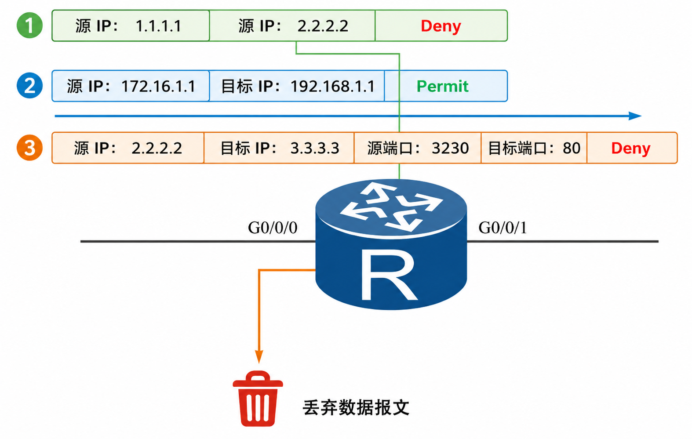
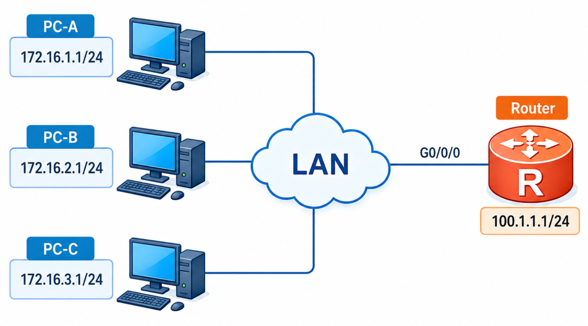
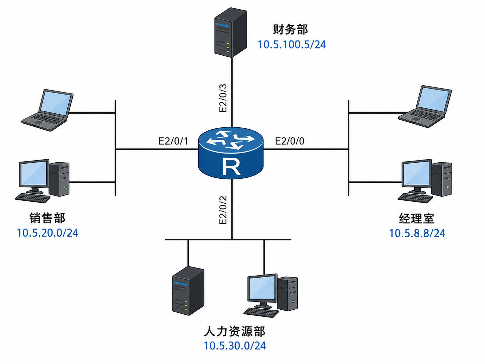

# 路由控制之 ACL

## 1.ACL 使用原理

ACL（access-list）访问控制列表，是用于定义匹配规则的过滤器列表。根据类型可分为命名的 ACL 和编号的 ACL；基于匹配报文能力的大小划分，可分为基本 ACL 和高级 ACL；根据匹配的内容划分，**<font color="red">ACL 可以用来匹配数据报文的头部字段，它也可以用来匹配路由表中的路由条目</font>**。

根据华为文档，基本 ACL 可以根据源 IP 地址过滤报文；高级 ACL 可以根据源 IP、目的 IP、IP 协议类型、TCP/UDP 源端口、目的端口等字段定义规则。这时 ACL 看的是真实经过设备的数据包头部。ACL 用来匹配数据报文的头部的例子如下所示，禁止办公网 **`192.168.10.0/24`** 访问服务器 **`10.1.1.10`** 的 HTTP 服务。

```java{.line-numbers}
acl number 3000
 rule 5 deny tcp source 192.168.10.0 0.0.0.255 destination 10.1.1.10 0 destination-port eq 80
 rule 10 permit ip

interface GigabitEthernet0/0/1
 traffic-filter inbound acl 3000
```

ACL 也可以应用在各种动态路由协议中，对发布和接收的路由信息进行过滤，可以通过和 **`filter-policy`**、**`route-policy`** 等联合使用用于路由接收、发布或引入。假设 OSPF 中有三条路由 **`172.16.17.0/24`**、**`172.16.18.0/24`**、**`172.16.19.0/24`**，现在希望某台设备只把 **`172.16.18.0/24`** 加入本地路由表，可以做如下配置：

```java{.line-numbers}
acl number 2000
 rule 5 permit source 172.16.18.0 0.0.0.255
ospf 1
 filter-policy 2000 import
```

在基本 ACL 里，命令形式通常是 **`rule permit source 172.16.18.0 0.0.0.255`**，如果它被用在数据流量过滤里，source 就是数据包的源 IP；**<font color="red">但如果它被用在路由过滤里，`source 172.16.18.0 0.0.0.255` 实际上是在匹配路由条目的网络地址</font>**。

ACL 是一组顺序排列的过滤器，每条过滤器是由匹配的条件和动作组成的，动作可以为允许或者拒绝。匹配条件可以决定匹配的内容，这些条件可以是数据包的源地址、目的地址、协议类型、TOS、端口号等。

ACL 定义在全局，真正让它发挥作用，需要被其他工具调用才能使用，仅配置 ACL 是无法发挥其匹配功能的。调用工具有很多，如 **`filter-policy`**、**`route-policy`**、**`traffic-filter`** 等工具，不同工具代表不同的含义。

>- **`filter-policy`**：在路由协议接收路由、发布路由、引入路由时，对路由信息做过滤。**`filter-policy`** 只能过滤路由信息，无法过滤 LSA，也不能修改路由属性值。
>- **`route-policy`**：用于匹配路由或路由属性，并在满足匹配条件时修改路由属性。
>- **`traffic-filter`**：用于直接过滤接口上的数据包，ACL 规则为 deny 时丢弃匹配报文，ACL 规则为 permit 时转发匹配报文，如果没有匹配任何规则，则允许通过。

## 2.ACL 的分类

按照创建 ACL 的命名方式分为数字型 ACL 和 命名型 ACL，按照 ACL 的功能分为基于接口的 ACL（编号范围 1000~1999）、基本 ACL（编号范围 2000~2999）、高级 ACL（编号范围 3000~3999）、二层 ACL（编号范围 4000~4999）。

## 3.ACL 过滤器的工作原理

一个数据包进入过滤器后具体的操作步骤如下。

- 数据包进入过滤器；
- 查找匹配条件，如果有匹配，再执行允许或者拒绝的动作；
- 如果没有匹配，将向下移动查找下面的匹配条件并重复上述过程；

<div align="center">
    
</div>

下面举例说明数据包经过 ACL 过滤器的整个过程，如上图所示，数据包进入过滤器，ACL 将会按照顺序查找第一个匹配条件。源地址为 **`1.1.1.1`** 的数据包将会被匹配，而执行动作为 deny，最终该数据包被丢弃掉。接着按照顺序查找第二个匹配条件，如果源地址为 **`172.16.1.1`** 网段，目标地址为 **`192.168.1.1`** 网段的数据包将会被匹配到，而执行动作为 permit，因此所有满足该条件的数据包将会从接口 **`G0/0/1`** 转发出去。第三个匹配条件中匹配到了源地址为 **`2.2.2.2`**、目标地址为 **`3.3.3.3`** 且目标端口为 80 的数据包，执行动作为 deny，因此所有满足条件的数据包将被丢弃掉。**<font color="red">当其他的数据包在没有被上述三个条件匹配到时，默认将会被允许通过</font>**。

在华为 VRP 平台上使用 ACL 过滤数据包时，没有被匹配到的数据包，都会默认允许通过。**<font color="red">高级 ACL 不能用于匹配路由，只能用于过滤数据包</font>**。基本 ACL 可以用于匹配路由，也可以过滤数据包。下面详细解释一下。

### 3.1 用于接口报文过滤时：基本 ACL 和高级 ACL 都可以使用

当 ACL 被用于接口报文过滤，例如通过 **`traffic-filter inbound acl`** 或 **`traffic-filter outbound acl`** 调用时，设备处理的对象是实际经过接口的 IP 报文。IP 报文本身携带源 IP 地址、目的 IP 地址、协议类型等字段；如果是 TCP 或 UDP 报文，还会携带源端口号和目的端口号。因此，在报文过滤场景中，基本 ACL 和高级 ACL 都可以使用。

基本 ACL 通常用于根据源 IP 地址对报文进行匹配，例如，只希望拒绝某个源主机或源网段的所有流量时，可以使用基本 ACL。下述的配置导致进入 **`GigabitEthernet0/0/0`** 接口、源地址为 **`172.16.2.1`** 的报文会被丢弃。

```java{.line-numbers}
[Huawei] acl number 2000
[Huawei-acl-basic-2000] rule 10 deny source 172.16.2.1 0
[Huawei] interface GigabitEthernet0/0/0
[Huawei-GigabitEthernet0/0/0] traffic-filter inbound acl 2000
```

高级 ACL 则可以根据源 IP 地址、目的 IP 地址、协议类型、TCP/UDP 端口号等字段对报文进行更精确的匹配，适合实现精细化的访问控制。例如，只拒绝某台主机访问服务器的 Telnet 服务，但不影响其他业务流量时，应使用高级 ACL。

```java{.line-numbers}
[Huawei] acl number 3000
[Huawei-acl-adv-3000] rule 10 deny tcp source 172.16.3.1 0 destination 100.1.1.1 0 destination-port eq 23 
[Huawei-acl-adv-3000] rule 20 permit ip 
[Huawei] interface GigabitEthernet0/0/0 
[Huawei-GigabitEthernet0/0/0] traffic-filter inbound acl 3000
```

上述配置表示源地址为 **`172.16.3.1`**、目的地址为 **`100.1.1.1`**、目的端口为 TCP 23 的报文会被丢弃，其他 IP 报文被允许通过。这里高级 ACL 能够生效，是因为设备匹配的是实际数据包，而数据包中存在协议号、端口号等高级 ACL 所需的字段。

### 3.2 用于匹配路由时：通常使用基本 ACL，而不是高级 ACL

当 ACL 被用于路由策略或路由过滤时，设备处理的对象不再是实际的数据包，而是控制平面的路由信息。路由条目与数据包不同。数据包具有源地址、目的地址、协议号、端口号等字段；而路由条目主要描述的是到达某个目的网络的转发信息，例如目的网络前缀、掩码长度、协议来源、优先级、开销、下一跳和出接口等。

因此，在匹配普通路由条目时，高级 ACL 中的目的地址、协议类型、TCP/UDP 源端口、TCP/UDP 目的端口等字段没有对应的匹配对象。路由条目本身并不存在 TCP 端口号或 UDP 端口号这样的报文字段，所以高级 ACL 不适合用于匹配路由信息。

## 4.基本 ACL

配置基本 ACL 时，需要先创建一个基本 ACL，基本 ACL 编号 **`acl-number`** 的范围是 **`2000~2999`**。配置基本 ACL 分为两步，首先创建 ACL 的编号，然后再配置规则。

### 4.1 创建基本 ACL

```java{.line-numbers}
acl [number] acl-number [match-order {auto|config}]
```

首先进入到基本 ACL 视图，创建数字型的基本 ACL，也可以将数字换成名称 **`acl [number] acl-number [match-order {auto|config}]`**，写成命名型的 ACL。**`match-order`** 代表匹配顺序，有 auto 和 config 两种，**<font color="red">auto 是自动排序，该方式会按照深度优先原则，越精确的地址越优先匹配</font>**。config 为配置顺序，用户可以自行定义，按照规则编号（rule-id）从小到大的顺序进行匹配。

对于华为的基本 ACL，**`rule permit source 192.168.1.0 0.0.0.255`** 中的 **`0.0.0.255`** 表示源地址通配符掩码，0 表示该位必须检查，必须与指定地址对应位一致； 1 表示该位不检查，可以是 0，也可以是 1。对于 **`rule permit source 192.168.1.10 0`**，这里的 0 等价于 **`0.0.0.0`**，表示源 IP 地址的所有二进制位都必须与 **`192.168.1.10`** 完全一致。因此，这条规则只匹配 **`192.168.1.10`** 这台主机，所以它的匹配范围最小，精确度最高。

接下来是 **`rule permit source 192.168.1.0 0.0.0.255`**，该规则表示源地址的前三个字节 **`192.168.1`** 必须严格匹配，最后一个字节可以从 0 变化到 255。因此，它匹配的地址范围是 **`192.168.1.0/24`** 网段。这条规则匹配的是一个网段，范围更大，因此精确度低一些。

基本 ACL 和高级 ACL 的深度优先匹配规则如下所示。

基本 ACL：

- VPN 实例；
- 源 IP 地址范围，源 IP 地址范围小（IP 地址通配符掩码中 0 位的数量多）的规则优先；
- 规则编号，规则编号小的优先；
- 高级 ACL；

VPN 实例：

- 协议范围，指定了 IP 协议承载的协议类型的规则优先；
- 源 IP 地址范围，源 IP 地址范围小（IP 地址通配符掩码中 0 位的数量多）的规则优先；
- 目的 IP 地址范围，目的 IP 地址范围小（IP 地址通配符掩码中 0 位的数量多）的规则优先；
- 四层端口号（TCP/UDP 端口号）范围，四层端口号范围小的规则优先；
- 规则编号，规则编号小的优先；

如果 ACL 配置为 **`match-order auto`**，设备会使用深度优先原则对规则进行自动排序，假设配置如下：

```java{.line-numbers}
acl number 2000 match-order auto 
rule deny source 192.168.1.10 0
rule permit source 192.168.1.0 0.0.0.255
rule deny source 192.168.0.0 0.0.255.255
```

现在有一个报文，其源 IP 地址为 **`192.168.1.10`**，如果 ACL 使用的是 **`match-order auto`** 模式，设备不会简单按照配置输入的先后顺序进行匹配，而是会根据深度优先原则，优先匹配范围最小、条件最精确的规则。因此，源地址为 **`192.168.1.10`** 的报文会优先命中这条 deny 规则，该报文会被拒绝。

### 4.2 配置基本 ACL 规则

```java{.line-numbers}
rule [rule-id] {deny|permit} [source{source-address source-wildcard | any} | time-range time-name | vpn-instance vpn-instance-name | [fragment | none-first-fragment]]
```

基本 ACL 可以通过配置 rule 规则来匹配报文信息。该规则可以多次配置来实现对报文的分类，可以进行添加、修改、删除。但是配置规则时注意排列顺序，优先将精确的地址在前面匹配，模糊的地址放在后面匹配。以免造成矛盾或者包含的错误关系，例如在 rule 10 中 **`permit source`** 为 **`172.16.0.0 0.0.255.255`**，而在 rule 20 中 deny source 为 **`172.16.1.0 0.0.0.255`**。这两者就存在包含的关系，rule 10 中包含了 rule 20，但是动作分别使用了 permit 和 deny，这将导致 rule 20 不会生效。

>在高级的 ACL 可以根据数据包的源 IP 地址、目的 IP 地址、源端口、目标端口、协议等内容来制定规则。

- **`rule-id`**：自动生成，初始步长为 5，按照倍数往后累加，也可以自定义步长。
- **`deny | permit`**：指定拒绝或允许符合条件的数据包。
- **`source-address`**：表示源地址。
- **`source-wildcard`**：表示指定源地址的通配符，any 表示任意源地址，也可以用 **`0.0.0.0 255.255.255.255`** 来表示。
- **`time-range`**：用来规定 ACL 生效的时间段。
- **`vpn-instance`**：用来指定 ACL 规则匹配报文的 VPN 实例名称。
- **`fragment`**：用来对分片的报文进行匹配。如果携带了该参数，被分片的数据包将会被匹配到。
- **`none-first-fragment`**：用来对非首片分片报文生效，如果携带参数则说明只用来匹配非首片报文。

基本 ACL 的匹配原则：

- 带 VPN 实例的规则优先；
- 源 IP 地址范围小的优先；
- **`rule-id`** 小的优先；

## 5.高级 ACL 

高级 ACL 可以根据源 IP 地址、目的 IP 地址、IP 优先级、ToS、DSCP、IP 协议类型、ICMP 类型、TCP 源端口/目的端口、UDP 源端口/目的端口号等信息对 IPv4 报文进行分类。配置高级 ACL 时，需要先创建一个高级 ACL，高级 ACL 编号 acl-number 的范围是 **`3000~3999`**。

创建高级 ACL 以后，需要配置高级 ACL 的规则。在 ACL 中添加新的规则时，不会影响已经存在的规则；**<font color="red">对已经存在的规则进行编辑时，如果新配置的规则内容与原规则内容存在冲突，则冲突的部分由新配置的规则内容代替</font>**，建议在编辑一个已存在的规则前，先将旧的规则删除，再创建新的规则，否则配置结果可能与预期的效果不同。

### 5.1 创建高级 ACL

```java{.line-numbers}
acl [number] acl-number [match-order { auto | config }]
```

### 5.2 配置高级 ACL 规则

```java{.line-numbers}
rule [rule-id] {deny | permit} ip [destination {destination-address any} | source {source-address any} | time-range time-name | [dscp dscp | [tos tos]]]
```

在高级的 ACL 可以根据数据包的源 IP 地址、目的 IP 地址、源端口、目标端口、协议等内容来制定规则。

- **`ip`**： 表示协议类型，此处可以指定特定的协议，比如 **`TCP/UDP/ICMP`** 等，如果是 ip 则代表所有的 ip 协议，包含了 **`TCP/UDP/ICMP`** 等。
- **`time-range`**： 表示时间段。

高级 ACL 的匹配原则：

- 带 VPN 实例的；
- 指定了特定 IP 协议类型；
- 源 IP 地址范围小的；
- 目的 IP 地址范围小的；
- 端口号范围小的；
- **`rule-id`** 小的；

## 6.基于时间的 ACL

网络中某些业务应用 ACL 时需要限制在一定的时间范围内生效，比如在企业中需要限制员工工作时间段内才能浏览互联网，其他时间不允许访问。可以通过 ACL 为用户创建生效时间段，通过在规则中引用时间段信息限制 ACL 生效的时间范围，从而使得该业务能在一定的时间范围内生效。

```java{.line-numbers}
time-range time-name {start-time to end-time days | from time1 date1 [to time2 date2]}
```

在 ACL 规则中引用的生效时间段存在两种模式：周期时间段和绝对时间段，周期时间段表示以星期为参数来定义时间范围，表示规则以一周为周期（如每周一的 8 至 12 点）循环生效。绝对时间段表示从某年某月某日的某一时间开始，到某年某月某日的某一时间结束，表示规则在这段时间范围内生效。

### 6.1 周期时间段

**`start-time to end-time days`** 表示的是周期时间段，也就是每周的哪些天，从几点到几点生效。它只关心星期几和当天时间，不指定具体年月日，所以会按周循环生效。例如每周一 8:00 到 12:00 生效；

```java{.line-numbers}
[Huawei] time-range work-time 08:00 to 18:00 working-day
```

这条命令的意思是创建一个名为 work-time 的时间段，在每个工作日的 08:00 到 18:00 生效。这里的 08:00 是 **`start-time`**，表示每天的开始时间；18:00 是 **`end-time`**，表示每天的结束时间；working-day 是 days，表示星期一到星期五。它不是只在某一天生效，而是每周重复。如果用 ACL 引用它，例如：

```java{.line-numbers}
[Huawei] time-range work-time 08:00 to 18:00 working-day
[Huawei] acl number 2000
[Huawei-acl-basic-2000] rule deny source 192.168.1.0 0.0.0.255 time-range work-time
[Huawei-acl-basic-2000] rule permit source any
```

上述 acl 命令的含义是在每个工作日的 08:00 到 18:00，拒绝源地址为 **`192.168.1.0/24`** 的流量；其他时间这条带 **`time-range work-time`** 的 deny 规则不生效。

### 6.2 绝对时间段

绝对时间段则是从某个具体日期时间到另一个具体日期时间，只在这段时间内生效。即 **`from time1 date1 to time2 date2`** 表示的是绝对时间段，也就是从某年某月某日某时某分开始，到某年某月某日某时某分结束，它定义的是从 **`YYYY/MM/DD hh:mm`** 到 **`YYYY/MM/DD hh:mm`** 的绝对时间范围。假设你希望在 2025 年 1 月 1 日 **`08:00`** 到 2025 年 1 月 31 日 **`18:00`** 期间，禁止 **`192.168.1.0/24`** 网段访问某些资源，可以这样写：

```java{.line-numbers}
[Huawei] time-range deny-time from 08:00 2025/01/01 to 18:00 2025/01/31
[Huawei] acl number 2000
[Huawei-acl-basic-2000] rule deny source 192.168.1.0 0.0.0.255 time-range deny-time
[Huawei-acl-basic-2000] rule permit source any
```

这时 ACL 中的 deny 规则只会在 **`deny-time`** 这个绝对时间段内生效。

### 6.3 多个时间段之间的交集

可以使用同一名称（time-name）配置内容不同的多条时间段，配置的各周期时间段之间以及各绝对时间段之间的交集将成为最终生效的时间范围。

**<font color="red">多个周期时间段之间是或的关系，多个绝对时间段之间也是或的关系，周期时间段和绝对时间段之间是与的关系</font>**。如果多个周期时间段之间冲突，那就这几个时间段都生效，多个绝对时间段也是一样的。如果周期时间段和绝对时间段之间冲突，配置的时间段不生效。

例如，你想让 ACL 只在 2025 年 6 月份的工作日 **`08:00`** 到 **`18:00`** 生效，可以这样配置：

```java{.line-numbers}
[Huawei] time-range june-work 08:00 to 18:00 working-day
[Huawei] time-range june-work from 00:00 2025/06/01 to 23:59 2025/06/30
[Huawei] acl number 2000
[Huawei-acl-basic-2000] rule deny source 192.168.1.0 0.0.0.255 time-range june-work
[Huawei-acl-basic-2000] rule permit source any
```

最终生效时间是只在 **`2025/06/01`** 到 **`2025/06/30`** 之间的工作日 **`08:00`** 到 **`18:00`** 生效。上述 deny 规则只会在 2025 年 6 月内的工作日 08:00 到 18:00 生效。另外一个例子如下所示，例如在 ACL 2001 中引用了时间段 test，test 包含了三个生效时间段：

```java{.line-numbers}
#  
time-range test 8:00 to 18:00 working-day 
time-range test 14:00 to 18:00 off-day 
time-range test from 00:00 2014/01/01 to 23:59 2014/12/31 
#  
acl number 2001                                                                 
 rule 5 permit time-range test 
```

- 第一个时间段，表示在周一到周五每天 8:00 到 18:00 生效，这是一个周期时间段。
- 第二个时间段，表示在周六、周日下午 14:00 到 18:00 生效，这是一个周期时间段。
- 第三个时间段，表示从 2014 年 1 月 1 日 00:00 起到 2014 年 12 月 31 日 23:59 生效，这是一个绝对时间段。

时间段 test 最终描述的时间范围为 2014 年的周一到周五每天 8:00 到 18:00 以及周六和周日下午 14:00 到 18:00。如果第三个时间配置为 2014 年 1 月 1 日 19:00 起到 2014 年 1 月 1 日 21:00，则时间段 test 无效。

## 7.ACL 案例

### 7.1 配置基本 ACL 进行访问控制

如下图所示，有三个 PC 需要访问远端路由器，通过基本 ACL 来进行限制源 PC 的访问，允许 PC-A 能够访问到路由器，拒绝 PC-B 在工作时间段访问路由器，其他用户不允许访问。

<div align="center">
    
</div>

配置命令如下所示：

```java{.line-numbers}
[Router]time-range FTP 9:00 to 18:00 working-day daily
[Router]acl 2000
[Router-acl-basic-2000]rule 10 permit source 172.16.1.1 0
[Router-acl-basic-2000]rule 20 deny source 172.16.2.1 0 time-range FTP
[Router-acl-basic-2000]rule 30 deny source any
[Router-acl-basic-2000]quit
[Router]interface GigabitEthernet0/0/0
[Router-GigabitEthernet0/0/0]traffic-filter inbound acl 2000
```

使用命令 traffic-filter 调用 ACL，可以用在 inbound（入）和 outbound（出）方向，基本 ACL 和高级 ACL 都可以使用该命令来调用，并且配置的 ACL 只有调用后才能生效。根据文档，traffic-filter 过滤器用于过滤接口的数据包，After the traffic-filter command is executed on an interface, the device filters packets matching ACL rules:

- If the action in an ACL rule is deny, the device discards packets matching the rule.
- If the action in an ACL rule is permit, the device forwards packets matching the rule.
- If no rule is matched, packets are allowed to pass through.

### 7.2 配置高级 ACL 进行访问控制

如下图所示，公司企业网通过 router 实现部门之间的连接，要求配置高级 ACL 禁止销售部门和人力资源部门在工作时间段（9:00~18:00）访问财务部，禁止人力资源部远程登录到财务部的主机，而经理室可以在任何时间段访问财务部的主机。

<div align="center">
    
</div>

```java{.line-numbers}
[Router]time-range ACCESS 9:00 to 18:00 working-day daily
[Router]acl 3000
[Router-acl-adv-3000]rule permit ip source 10.5.8.8 0 destination any
[Router-acl-adv-3000]rule deny ip source 10.5.20.0 0.0.0.255 destination 10.5.100.5 0 time-range ACCESS
[Router-acl-adv-3000]rule deny tcp source 10.5.30.0 0.0.0.255 destination 10.5.100.5 0 destination-port eq 23
[Router-acl-adv-3000]rule deny source any
[Router-acl-adv-3000]quit
[Router]interface Ethernet 2/0/3
[Router-Ethernet 2/0/3]traffic-filter outbound acl 3000
```

在 IANA 的端口号注册表中，23/tcp 对应的是 Telnet 服务，所以这条规则的实际含义就是禁止人力资源部网段通过 Telnet 远程登录财务部主机 **`10.5.100.5`**。**`destination-port eq 23`** 表示目的 TCP 端口等于 23。这条 **`destination-port eq 23`** 本身并不禁止人力资源部在工作时间访问财务部，它只是禁止人力资源部访问财务主机的 Telnet 服务。**`rule deny source any`** 这条规则会把前面没有匹配到的报文全部拒绝。**<font color="red">也就是说人力资源部访问财务部的非 Telnet 流量，是被最后的 `deny any` 拒绝的，而不是被 **`destination-port eq 23`** 这条规则拒绝的</font>**。

>ACL 过滤数据流放置原则：利用 ACL 过滤数据流，在接口调用 ACL 时，一般基本 ACL 用在靠近目标的位置，因为基本 ACL 不能匹配出目标地址，若想过滤某个数据流，而太靠近源位置则有可能导致该源 IP 去访问其他目的地时被过滤。而高级 ACL 尽量用在靠近源的位置，因为高级 ACL 能够精确地表示出数据流，此做法能够节省链路带宽的占用（尽快将数据包过滤掉）。

## 8.通配符

### 8.1.通配符的作用

通常在定义 ACL 规则时，都需要用到通配符。**<font color="red">通配符也被称为反掩码，使用全 255 减去正掩码得出的就是反掩码</font>**，例如 **`192.168.1.0/24`**，正掩码为 24 位，由 24 个 1 组成（**`255.255.255.0`**），那么反掩码就是 **`255.255.255.255-255.255.255.0`** 得出的反掩码就是 **`0.0.0.255`**。但是正掩码必须是由连续的 1 来组成的，中间不能有 0 的存在，比如不能有 **`192.255.255.0`** 这样的掩码，正掩码是路由的组成部分，用来表示一条路由。

而反掩码可以由不连续的 1 组成，例如 **`0.0.6.0`**，一般用来匹配一个或者一组地址。**<font color="red">通配符中用二进制 0 精确地匹配对应的地址位，用 1 来模糊地匹配对应的地址位</font>**。

```java{.line-numbers}
[HUAWEI]acl 2000
[HUAWEI]rule 10 permit source 10.1.1.1 0
```

该例中使用到的通配符为 0（实际应该为 **`0.0.0.0`**，可以简写成 0）。因此仅仅匹配出地址 **`10.1.1.1`**，其他的地址不能被匹配。

```java{.line-numbers}
[HUAWEI]acl 2001
[HUAWEI]rule 10 permit source 192.168.1.0 0.0.0.255
```

本例中使用通配符为 **`0.0.0.255`**，在第四个字节为 255，换算成二进制为 **`11111111`**，对应上面的位集中第 4 个 Byte 中每一位都可以模糊匹配。因此可以匹配源地址为 **`192.168.1.0/24`** 中的 C 类网络的所有主机地址。

### 8.2.ACL 中通配符使用技巧

匹配出 **`192.168.1.0~192.168.1.255`** 中所有的奇数地址，且只能使用一条 ACL。在这些路由条目中可以查找一下其中的规律，这个地址段中所有奇数地址，比如 **`192.168.1.1、192.168.1.3、192.168.1.5……192.168.1.255`**，这些地址中有一个规律就是最后一个 Byte 最后一位都为 1。

```java{.line-numbers}
192.168.1.1      最后一个字节换算成二进制 00000001
192.168.1.3      最后一个字节换算成二进制 00000011
192.168.1.5      最后一个字节换算成二进制 00000101
        :
192.168.1.255    最后一个字节换算成二进制 11111111
```

找到规律以后，使用 0 或者 1 来对应该地址位，由于在该地址段中只有最后一位都相同，那么反掩码中该位使用 0 来表示（精确匹配）。地址段中前面七位都不相同，那么反掩码使用 1 来表示（模糊匹配），因此最终可以使用 **`192.168.1.1 0.0.0.254`** 来表示该地址段中所有的奇数地址。

匹配 **`172.16.0.0/24、172.16.1.0/24、172.16.2.0/24、172.16.3.0/24……172.16.7.0/24`** 当中所有偶数路由，在这个例子中是第 3 个 Byte 不同，其他字节相同的用 0 来对应上面的地址位，最终得出的结果应该是 **`172.16.0.0 0.0.6.0`** 来描述该偶数地址。

