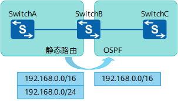
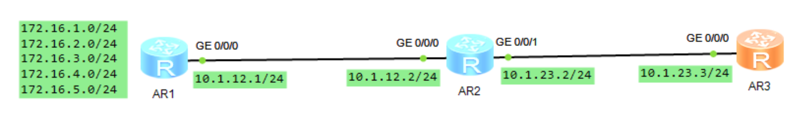
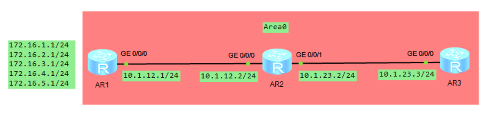
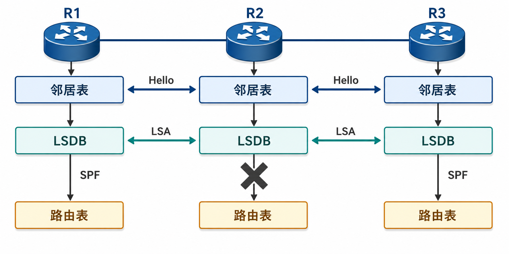
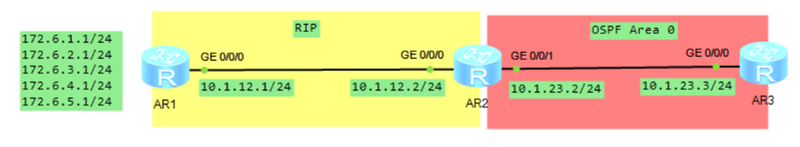
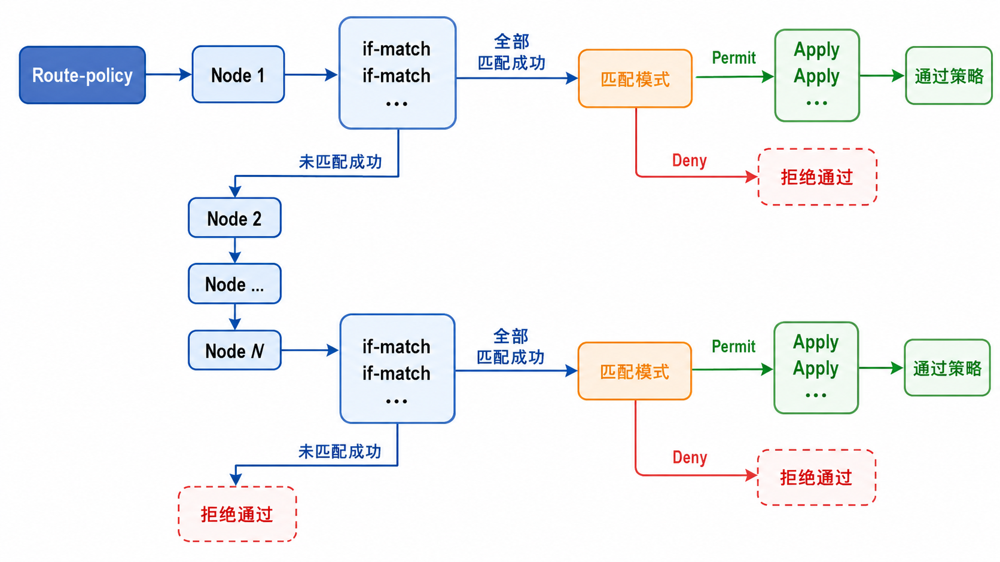
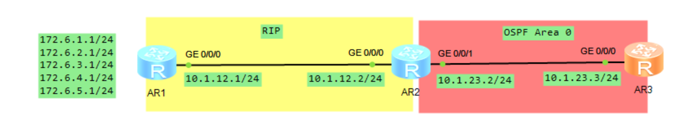

# 前缀列表和路由策略

## 1.前缀列表 ip-prefix

### 1.1 ip-prefix 的使用原理

前缀列表与 ACL 有点类似，两者都可以实现控制层对路由的匹配。**<font color="red">但前缀列表不同于 ACL，不具备过滤数据流的功能，而 ACL 具备过滤数据流及过滤路由的功能</font>**。前缀列表的特点是能够更精确地匹配到路由，可以将一条路由区分为网络前缀部分和掩码长度（子网掩码）部分，能分别进行匹配，这点是 ACL 无法做到的。配置命令如下所示：

```java{.line-numbers}
ip ip-prefix ip-prefix-name [index index-number] {permit | deny} ip-address mask-length [greater-equal greater-equal-value] [less-equal less-equal-value]
```

**`ip-prefix-name`** 为名称或者数字，**`index-number`** 为编号，**`ip-address`** 为路由前缀（网段），**`mask-length`** 为指定前缀所匹配的位数和掩码长度，**`greater-equal-value`** 与 **`less-equal-value`** 分别为大于等于和小于等于，代表子网掩码的位数，使用后面两个参数来确定子网掩码的范围（可以不配）。

前缀列表中 **`greater-equal-value`** 与 **`less-equal-value`** 就用于精确地匹配出掩码地长度。如果 mask-length 也都能够代表掩码的长度，这两者之间又有哪些区别呢？后面两个参数 **`greater-equal-value`** 与 **`less-equal-value`** 为可选参数，**<font color="red">如果不携带此参数，那么 `mask-length` 将会具备两种作用既匹配路由前缀的位数也用于匹配路由掩码位数</font>**。

路由前缀的位数，是用来判断地址前面多少位要相同，路由掩码的位数，是用来判断这条路由本身有多精确。**`ip ip-prefix TECH permit 172.16.1.0 24 greater-equal-value 25 less-equal-value 32`**，它包含两个条件，两个条件都满足，才会匹配成功。

- 条件 1：路由目的地址的前 24 位必须完全匹配 **`172.16.1.0/24`**
- 条件 2：这条路由自己的掩码长度必须是 /25 到 /32

**（1）例子 1**

**`ip ip-prefix TECH permit 172.16.1.0 24`**，这条前缀列表只有 mask-length 参数，值为 24，代表前缀中前面 24 位是需要完全匹配的，**如路由前 3 个 Byte（24 位）为 `172.16.1.*` 就能匹配到**。没有后面两个参数 greater-equal-value 与 less-equal-value，那么 24 这个数字也能代表该前缀的掩码长度同样也为 24 位，也就是说只能匹配到一条路由，为 **`172.16.1.0/24`**。

**（2）例子 2**

**`ip ip-prefix TECH permit 172.16.1.0 24 greater-equal-value 25 less-equal-value 32`**，这条前缀列表既有 mask-length 参数为 24，也携带了 **`greater/less-equal-value`** 参数。前缀中前面 24 位是需要完全匹配的，而 **`greater/less-equal-value`** 则定义了网络掩码必须大于或等于 25 位，小于等于 32 位，也就是该网络掩码设定的范围在 25~32 位之间。注意 mask-length 为 24 这里就不能够作为网络掩码了，仅仅用来匹配前缀的位数。如 **`172.16.1.0/25、172.16.1.0/26……172.16.1.0/32`** 都能匹配到。

### 1.2 ip-prefix 使用举例

**（1）例子 1**

**`ip ip-prefix TECH permit 0.0.0.0 0`**，匹配默认路由，**`0.0.0.0`** 后面跟一个 0 代表一共 0 位需要被匹配，因为只要求匹配前缀列表的 0 位，那任何 IPv4 地址从地址部分看都满足，由于后面没有规定掩码位数，说明掩码也为 0，因此只有默认路由才满足该条件。

**（2）例子 2**

**`ip ip-prefix TECH permit 0.0.0.0 0 less-equal 32`**，匹配全部 IP 地址，因为 **`0.0.0.0 0`** 表示只比较前缀列表的 0 位地址，所以地址范围上覆盖整个 IPv4 空间，再加上 **`less-equal 32`**，表示允许匹配 /0 到 /32 的所有掩码长度，因此最终匹配所有 IPv4 路由，相当于 ACL 中的 any。

**（3）例子 3**

**`ip ip-prefix TECH permit 0.0.0.0 0 greater-equal 32`**，匹配出所有的 32 位主机地址，前缀部分一共有 0 位需要被匹配，但是后面的参数表示掩码大于或者等于 32 位，而这个代表的是所有掩码为 32 位的主机地址。

### 1.3 ip-prefix 和 ACL 的区别

ACL 和地址前缀列表都可以对路由进行筛选，**<font color="red">ACL 匹配路由时只能匹配路由的网络号，但无法匹配掩码，也就是前缀长度</font>**。而地址前缀列表比 ACL 更为灵活，可以匹配路由的网络号及掩码。

**<font color="red">在路由控制场景中，过滤路由前缀应优先使用 ip-prefix，过滤数据报文应优先使用 ACL</font>**。ip-prefix 是面向路由条目的前缀匹配工具，主要用于匹配路由的目的网络及其掩码长度。ACL 的用途是访问控制和报文过滤，主要匹配数据报文中的源地址、目的地址、协议类型、端口号等字段，在路由策略中，ACL 也可以被 **`route-policy`** 引用，用来作为某些路由匹配条件。

<div align="center">
    
</div>

如上图所示，SwitchB 上有 2 条静态路由，如果只想将 **`192.168.0.0/16`** 这 1 条路由引入 OSPF 中，查看 SwitchB 上的路由表，有 2 条静态路由 **`192.168.0.0/16`** 和 **`192.168.0.0/24`**，只想将 **`192.168.0.0/16`** 这 1 条路由重发布到 OSPF 中。

```java{.line-numbers}
[SwitchB] display ip routing-table
Route Flags: R - relay, D - download to fib, T - to vpn-instance
-----------------------------------------------------------------------------
Routing Tables: Public         Destinations : 6        Routes : 6        
Destination/Mask    Proto   Pre  Cost      Flags NextHop         Interface
     10.10.12.0/24  Direct  0    0           D   10.10.12.1      Vlanif10
     10.10.12.1/32  Direct  0    0           D   127.0.0.1       Vlanif10
      127.0.0.0/8   Direct  0    0           D   127.0.0.1       InLoopBack0
      127.0.0.1/32  Direct  0    0           D   127.0.0.1       InLoopBack0
    192.168.0.0/16  Static  60   0           D   0.0.0.0         NULL0
    192.168.0.0/24  Static  60   0           D   0.0.0.0         NULL0
```

首先尝试用 **`ACL + route-policy`** 来实现，首先配置基本 ACL 2001，然后配置 **`route-policy RP`** 的节点 10，如果匹配基本 ACL 2001，则允许通过。其他所有未匹配成功的路由都被拒绝通过。

```java{.line-numbers}
[SwitchB] acl 2001
[SwitchB-acl-basic-2001] rule permit source 192.168.0.0 0.0.255.255
[SwitchB] route-policy RP permit node 10
[SwitchB-route-policy] if-match acl 2001
[SwitchB] ospf
[SwitchB-ospf-1] import-route static route-policy RP
```

配置完成后，在 SwitchC 上查看路由表如下：

```java{.line-numbers}
<SwitchC> display ip routing-table
Route Flags: R - relay, D - download to fib, T - to vpn-instance
-----------------------------------------------------------------------------
Routing Tables: Public
         Destinations : 6        Routes : 6        
Destination/Mask    Proto   Pre  Cost      Flags NextHop         Interface
     10.10.12.0/24  Direct  0    0           D   10.10.12.2      Vlanif10
     10.10.12.2/32  Direct  0    0           D   127.0.0.1       Vlanif10
      127.0.0.0/8   Direct  0    0           D   127.0.0.1       InLoopBack0
      127.0.0.1/32  Direct  0    0           D   127.0.0.1       InLoopBack0
    192.168.0.0/16  O_ASE   150  1           D   10.10.12.1      Vlanif10
    192.168.0.0/24  O_ASE   150  1           D   10.10.12.1      Vlanif10
```

在 SwitchC 的路由表中发现有 2 条 **`192.168.0.0`** 网段的路由，说明 2 条路由都被引入了。这是由于 ACL 2001 规则 **`rule permit source 192.168.0.0 0.0.255.255`** 中，**`0.0.255.255`** **<font color="red">实际上是通配符，而不是掩码长度</font>**。

所谓通配符，就是指换算成二进制后，0 表示需要匹配，1 表示不需要匹配。例如 **`192.168.0.0 0.0.255.255`** 表示匹配网络号 **`192.168.0.0～192.168.255.255`**，**`192.168.0.0/16`** 和 **`192.168.0.0/24`** 都能成功匹配 ACL 2001，因此这 2 条路由匹配了 **`route-policy RP`** 的节点 10，都被引入了。ACL 无法实现只匹配 **`192.168.0.0/16`** 或者只匹配 **`192.168.0.0/24`**，**<font color="red">ACL 只能匹配网络号，无法匹配掩码</font>**。

接下来，尝试用地址前缀列表对引入的路由进行过滤，看是否能实现引入 **`192.168.0.0/16`** 这 1 条路由，过滤掉 **`192.168.0.0/24`**。

首先配置地址前缀列表，过滤出想要的路由，地址前缀列表为 huawei，节点号 10，允许 **`192.168.0.0/16`** 的路由通过。接着配置 **`route-policy RP`** 的节点 10，如果匹配地址前缀列表 huawei，则允许通过，其他所有未匹配上的路由都将默认拒绝。然后配置在 OSPF 路由中引入通过 **`route-policy RP`** 过滤的静态路由。

```java{.line-numbers}
[SwitchB] ip ip-prefix huawei index 10 permit 192.168.0.0 16
[SwitchB] route-policy RP permit node 10
[SwitchB-route-policy] if-match ip-prefix huawei
[SwitchB] ospf
[SwitchB-ospf-1] import-route static route-policy RP
```

配置完成后，在 SwitchC 上查看路由表，成功实现了只引入 **`192.168.0.0/16`** 这 1 条路由。

```java{.line-numbers}
<SwitchC> display ip routing-table
Route Flags: R - relay, D - download to fib, T - to vpn-instance
-----------------------------------------------------------------------------
Routing Tables: Public
         Destinations : 5        Routes : 5        
Destination/Mask      Proto   Pre  Cost      Flags NextHop         Interface
     10.10.12.0/24    Direct  0    0           D   10.10.12.2      Vlanif10
     10.10.12.2/32    Direct  0    0           D   127.0.0.1       Vlanif10
     127.0.0.0/8      Direct  0    0           D   127.0.0.1       InLoopBack0
     127.0.0.1/32     Direct  0    0           D   127.0.0.1       InLoopBack0
     192.168.0.0/16   O_ASE   150  1           D   10.10.12.1      Vlanif10
```

## 2.路由策略 filter-policy

**`filter-policy`** 过滤策略，该工具主要应用在路由协议的进程中，可以调用 ACL、ip-prefix、route-policy 等工具来匹配路由，用于控制对路由的发布或接收，**<font color="red">只有通过该策略的路由才可以被发布或者接收，未通过策略的路由则被过滤掉</font>**。filter-policy 分为 import（入方向）和 export（出方向）。

import 主要影响路由器接收路由，影响自身路由表的变化，适合于任何路由协议。由于距离矢量协议（RIP 协议）基于自身路由表来通告，传递的是路由表信息，通过 **`filter-policy import`** 可以过滤路由的接收。而链路状态协议（如 OSPF、IS-IS）基于链路状态数据库的信息来通告，传递的是 LSA，并不是路由信息。而 **`filter-policy import`** 不能过滤 1/2 类 LSA，而是阻止路由表的生成。

export 在距离矢量协议中用于向邻居发布路由时的控制，影响邻居路由器的路由表变化。**<font color="red">在链路状态协议中往往用于自治系统边界路由器上，主要用来控制外部路由的引入</font>**。通常情况下，路由过滤只能过滤路由信息，不能过滤链路状态信息。

对于链路状态协议，例如 OSPF，情况需要分层理解。OSPF 路由器之间泛洪的是 LSA，而不是路由表项。同一区域内的路由器需要维护一致的链路状态数据库，并基于 LSDB 运行 SPF 算法生成路由表（详细请看 OSPF 路由协议之路由过滤和聚合章节）。

Type 1 LSA 和 Type 2 LSA 属于区域内部拓扑信息，不能通过 **`filter-policy`** 进行过滤。如果在同一区域内任意删除或过滤某台路由器看到的 Type 1 或 Type 2 LSA，就会破坏区域内 LSDB 的一致性，导致 SPF 计算结果不一致。

OSPF 进程视图下的 **`filter-policy import`** 主要影响本机最终生成的路由表项，而不是影响 LSDB 本身。也就是说，该命令会阻止路由被安装到本机 IP 路由表中，但不会阻止相关 LSA 被接收、保存到 LSDB，也不会阻止这些 LSA 继续泛洪给其他邻居。例如，Area 0 内存在一条区域内路由 **`10.1.1.0/24`**，该路由可能由 Type 1 或 Type 2 LSA 计算得到。如果在某台路由器上使用 **`filter-policy import`** 拒绝 **`10.1.1.0/24`**，结果只是该路由器的 IP 路由表中不安装这条 OSPF 路由，但在 **`display ospf lsdb`** 中，相关 LSA 仍然存在。

OSPF 中真正意义的过滤，主要发生在边界位置。对于区域间路由，ABR 会根据一个区域内的路由信息向其他区域产生 **`Type 3 Summary-LSA`**。此时可以在 ABR 上通过区域视图下的 **`filter import`** 或 **`filter export`** 控制 Type 3 LSA 的进入或离开，从而实现区域间路由发布控制，这里过滤的对象是 Type 3 LSA。**`filter-policy export`** 只能够用在 ASBR 上，用来过滤从其它协议进程进入 OSPF 域的路由，只将满足条件的外部路由引入 OSPF 域。该命令用来在 ASBR 上过滤 **`ASE(LSA 5)/NSSA(LSA 7)`**，其实是抑制 LSA 的生成。

总结如下所示：

- 对于 OSPF，可以在出方向和入方向上过滤 LSA 3、LSA 5、LSA 7。
- 对于链路状态路由协议，如 OSPF 和 IS-IS，在入方向过滤路由实际上并不能阻断链路状态信息的传递，过滤的效果仅仅是过滤的路由不能被添加到本地路由表中，但是代表该路由的 LSA 仍然会在 OSPF 域或者 IS-IS 域内传递。
- **<font color="red">路由过滤还可以针对从其他协议引入的路由进行过滤，比如把 RIP 路由引入到 OSPF，OSPF 可以使用路由过滤把某些从 RIP 引入的路由过滤掉</font>**，只将满足条件的外部路由转换为 **`Type-5 LSA (AS-external-LSA)`** 并发布出去，进而使其他 OSPF 路由器只有特定的从 RIP 引入的路由，这种配置只能用在出方向上。

### 2.1 案例研究：filter-policy import（RIP）

由于 RIP 属于距离矢量路由协议，发布的是路由信息，而将 **`filter-policy`** 用在 import 方向可以控制路由的接收。配置命令如下所示：

```java{.line-numbers}
filter-policy {acl-number | acl-name acl-name | ip-prefix ip-prefix-name [gateway ip-prefix-name]} import [interface-type interface-number]
```

拓扑图如下所示，R1 有 5 个网段通告进 RIP 协议，要求 R2 过滤掉其中奇数路由：

<div align="center">
    
</div>

AR2 和 AR3 的路由表如下所示：

```java{.line-numbers}
<AR2>display ip routing-table protocol rip
Route Flags: R - relay, D - download to fib
------------------------------------------------------------------------------
Public routing table : RIP
         Destinations : 5        Routes : 5        
RIP routing table status : <Active>
         Destinations : 5        Routes : 5
Destination/Mask    Proto   Pre  Cost      Flags NextHop         Interface
     172.16.1.0/24  RIP     100  1           D   10.1.12.1       GigabitEthernet0/0/0
     172.16.2.0/24  RIP     100  1           D   10.1.12.1       GigabitEthernet0/0/0
     172.16.3.0/24  RIP     100  1           D   10.1.12.1       GigabitEthernet0/0/0
     172.16.4.0/24  RIP     100  1           D   10.1.12.1       GigabitEthernet0/0/0
     172.16.5.0/24  RIP     100  1           D   10.1.12.1       GigabitEthernet0/0/0
RIP routing table status : <Inactive> Destinations : 0        Routes : 0
[AR3]display ip routing-table protocol rip
Route Flags: R - relay, D - download to fib
------------------------------------------------------------------------------
Public routing table : RIP Destinations : 6        Routes : 6        
RIP routing table status : <Active> Destinations : 6        Routes : 6
Destination/Mask    Proto   Pre  Cost      Flags NextHop         Interface
      10.1.12.0/24  RIP     100  1           D   10.1.23.2       GigabitEthernet0/0/0
     172.16.1.0/24  RIP     100  2           D   10.1.23.2       GigabitEthernet0/0/0
     172.16.2.0/24  RIP     100  2           D   10.1.23.2       GigabitEthernet0/0/0
     172.16.3.0/24  RIP     100  2           D   10.1.23.2       GigabitEthernet0/0/0
     172.16.4.0/24  RIP     100  2           D   10.1.23.2       GigabitEthernet0/0/0
     172.16.5.0/24  RIP     100  2           D   10.1.23.2       GigabitEthernet0/0/0
RIP routing table status : <Inactive> Destinations : 0        Routes : 0
```

现在利用 ACL 使用最少的命令来过滤路由，**<font color="red">ACL 用于控制层面的过滤路由时，最后都会有一条隐含拒绝所有，因此需要匹配其他的流量，将其允许</font>**。

```java{.line-numbers}
[AR2]acl number 2000
[AR2-acl-basic-2000]rule deny source 172.16.1.0 0.0.6.0
[AR2-acl-basic-2000]rule permit source any 
```

进入到进程中使用 **`filter-policy`**，并且在 import 方向调用 ACL，使用 **`filter-policy`** 工具在 import 方向应用时，R2 的路由表中无法看到被过滤的路由，由于 R3 的路由是 R2 传递过来的，R3 的路由表信息应该与 R2 是一致的，也不会看到被过滤的路由。

```java{.line-numbers}
[AR2]rip 1
[AR2-rip-1]filter-policy 2000 import 
[AR2-rip-1]display ip routing-table protocol rip 
Route Flags: R - relay, D - download to fib
------------------------------------------------------------------------------
Public routing table : RIP Destinations : 2        Routes : 2        
RIP routing table status : <Active> Destinations : 2        Routes : 2
Destination/Mask    Proto   Pre  Cost      Flags NextHop         Interface
     172.16.2.0/24  RIP     100  1           D   10.1.12.1       GigabitEthernet0/0/0
     172.16.4.0/24  RIP     100  1           D   10.1.12.1       GigabitEthernet0/0/0
RIP routing table status : <Inactive> Destinations : 0        Routes : 0
<AR3>display ip routing-table protocol rip 
Route Flags: R - relay, D - download to fib
------------------------------------------------------------------------------
Public routing table : RIP Destinations : 3        Routes : 3        
RIP routing table status : <Active> Destinations : 3        Routes : 3
Destination/Mask    Proto   Pre  Cost      Flags NextHop         Interface
      10.1.12.0/24  RIP     100  1           D   10.1.23.2       GigabitEthernet0/0/0
     172.16.2.0/24  RIP     100  2           D   10.1.23.2       GigabitEthernet0/0/0
     172.16.4.0/24  RIP     100  2           D   10.1.23.2       GigabitEthernet0/0/0
RIP routing table status : <Inactive> Destinations : 0        Routes : 0
```

使用 filter-policy 在 export 时，**在发送路由时进行过滤，被过滤掉的路由将不会被发送给邻居路由器，但不会影响本地路由表**。

### 2.2 案例研究：filter-policy import（OSPF）

如下图所示，路由协议运行 OSPF，在 R2 上使用 **`filter-policy`** 调用 import 过滤掉 **`172.16.X.0`** 上的奇数路由。

<div align="center">
    
</div>

现在 AR2 和 AR3 的全局路由表中 OSPF 的路由如下所示：

```java{.line-numbers}
<AR2>display ip routing-table protocol ospf 
Route Flags: R - relay, D - download to fib
------------------------------------------------------------------------------
Public routing table : OSPF Destinations : 5        Routes : 5        
OSPF routing table status : <Active> Destinations : 5        Routes : 5
Destination/Mask    Proto   Pre  Cost      Flags NextHop         Interface
     172.16.1.0/24  OSPF    10   1           D   10.1.12.1       GigabitEthernet0/0/0
     172.16.2.0/24  OSPF    10   1           D   10.1.12.1       GigabitEthernet0/0/0
     172.16.3.0/24  OSPF    10   1           D   10.1.12.1       GigabitEthernet0/0/0
     172.16.4.0/24  OSPF    10   1           D   10.1.12.1       GigabitEthernet0/0/0
     172.16.5.0/24  OSPF    10   1           D   10.1.12.1       GigabitEthernet0/0/0
OSPF routing table status : <Inactive> Destinations : 0        Routes : 0
[AR3]display ip routing-table protocol ospf 
Route Flags: R - relay, D - download to fib
------------------------------------------------------------------------------
Public routing table : OSPF Destinations : 6        Routes : 6        
OSPF routing table status : <Active> Destinations : 6        Routes : 6
Destination/Mask    Proto   Pre  Cost      Flags NextHop         Interface
      10.1.12.0/24  OSPF    10   2           D   10.1.23.2       GigabitEthernet0/0/0
     172.16.1.0/24  OSPF    10   2           D   10.1.23.2       GigabitEthernet0/0/0
     172.16.2.0/24  OSPF    10   2           D   10.1.23.2       GigabitEthernet0/0/0
     172.16.3.0/24  OSPF    10   2           D   10.1.23.2       GigabitEthernet0/0/0
     172.16.4.0/24  OSPF    10   2           D   10.1.23.2       GigabitEthernet0/0/0
     172.16.5.0/24  OSPF    10   2           D   10.1.23.2       GigabitEthernet0/0/0
OSPF routing table status : <Inactive> Destinations : 0        Routes : 0
```

在 AR2 上做好配置，进入到 OSPF 进程中使用 **`filter-policy`**，并且在 import 方向调用 ACL，使用 **`filter-policy`** 工具在 import 方向应用时，路由无法在路由表中安装相关路由条目。

```java{.line-numbers}
[AR2]acl number 2000
[AR2-acl-basic-2000]rule 10 deny source 172.16.1.0 0.0.6.0
[AR2-acl-basic-2000]rule 20 permit source any 
[AR2]ospf 1
[AR2-ospf-1]filter-policy 2000 import 
```

在 AR2 的路由表中只有 **`172.16.2.0/24`**、**`172.16.4.0/24`** 两条偶数路由进入到路由表中，奇数路由已经被过滤了，已经实现目的了。

```java{.line-numbers}
[AR2]display ip routing-table protocol ospf 
Route Flags: R - relay, D - download to fib
------------------------------------------------------------------------------
Destination/Mask    Proto   Pre  Cost      Flags NextHop         Interface
     172.16.2.0/24  OSPF    10   1           D   10.1.12.1       GigabitEthernet0/0/0
     172.16.4.0/24  OSPF    10   1           D   10.1.12.1       GigabitEthernet0/0/0
OSPF routing table status : <Inactive> Destinations : 0        Routes : 0
```

AR3 的全局路由表是正常的，奇数路由并没有被过滤。

```java{.line-numbers}
<AR3>display ip routing-table protocol ospf 
Route Flags: R - relay, D - download to fib
------------------------------------------------------------------------------
Destination/Mask    Proto   Pre  Cost      Flags NextHop         Interface
      10.1.12.0/24  OSPF    10   2           D   10.1.23.2       GigabitEthernet0/0/0
     172.16.1.0/24  OSPF    10   2           D   10.1.23.2       GigabitEthernet0/0/0
     172.16.2.0/24  OSPF    10   2           D   10.1.23.2       GigabitEthernet0/0/0
     172.16.3.0/24  OSPF    10   2           D   10.1.23.2       GigabitEthernet0/0/0
     172.16.4.0/24  OSPF    10   2           D   10.1.23.2       GigabitEthernet0/0/0
     172.16.5.0/24  OSPF    10   2           D   10.1.23.2       GigabitEthernet0/0/0
OSPF routing table status : <Inactive> Destinations : 0        Routes : 0
```

并且在 AR2 的 LSDB 中，AR1 通告的 LSA1 和 LSA2 出现在 LSDB 中，并没有过滤。

```java{.line-numbers}
[AR2]display ospf lsdb network 10.1.12.1
	 OSPF Process 1 with Router ID 2.2.2.2
		         Area: 0.0.0.0
		 Link State Database 
  Type      : Network
  Ls id     : 10.1.12.1
  Adv rtr   : 1.1.1.1  
  Ls age    : 1518 
  Len       : 32 
  Options   :  E  
  seq#      : 80000002 
  chksum    : 0xca66
  Net mask  : 255.255.255.0
  Priority  : Low
     Attached Router    1.1.1.1
     Attached Router    2.2.2.2
[AR2]display ospf lsdb router 1.1.1.1
	 OSPF Process 1 with Router ID 2.2.2.2
		         Area: 0.0.0.0
		 Link State Database 
  Type      : Router
  Ls id     : 1.1.1.1
  Adv rtr   : 1.1.1.1  
  Ls age    : 1449 
  Len       : 96 
  Options   :  E  
  seq#      : 8000000e 
  chksum    : 0xd826
  Link count: 6
   * Link ID: 10.1.12.1    
     Data   : 10.1.12.1    
     Link Type: TransNet     
     Metric : 1
   * Link ID: 172.16.1.0   
     Data   : 255.255.255.0 
     Link Type: StubNet      
     Metric : 0 
     Priority : Low
   * Link ID: 172.16.2.0   
     Data   : 255.255.255.0 
     Link Type: StubNet      
     Metric : 0 
     Priority : Low
   * Link ID: 172.16.3.0   
     Data   : 255.255.255.0 
     Link Type: StubNet      
     Metric : 0 
     Priority : Low
   * Link ID: 172.16.4.0   
     Data   : 255.255.255.0 
     Link Type: StubNet      
     Metric : 0 
     Priority : Low
   * Link ID: 172.16.5.0   
     Data   : 255.255.255.0 
     Link Type: StubNet      
     Metric : 0 
     Priority : Low
```

在一个区域中的 OSPF 路由器，通过泛洪机制在路由器间同步 LSDB，三台路由器在同一区域中有一样的 LSDB，由于路由器间交互的是 LSA，并非路由，所以无法在邻居间过滤路由。在 AR2 上使用 **`filter-policy import`** 进行过滤，但是 AR2 继续泛洪 AR1 产生的 LSA1/2 报文给 AR3，并且在 AR3 上未对进入路由表的路由进行过滤，所以在 AR2 上被过滤的路由在 AR3 上依然存在。

<div align="center">
    
</div>

### 2.3 案例研究：filter-policy export（OSPF）

在 OSPF 中，**`filter-policy import`** 只能过滤路由，不能过滤 LSA，**`filter-policy export`** 用于控制外部路由的引入。如下图所示，要求 R2 只将 RIP 中的前三条路由引入到 OSPF 中。在 R2 上使用 **`filter-policy export`** 将下图中所示的 **`172.16.1.0~172.16.3.0`** 子网引入到 OSPF 中。

<div align="center">
    
</div>

AR3 上的全局路由表如下所示：

```java{.line-numbers}
[AR3-ospf-1]display ip routing-table 
Route Flags: R - relay, D - download to fib
------------------------------------------------------------------------------
Routing Tables: Public Destinations : 7        Routes : 7        
Destination/Mask    Proto   Pre  Cost      Flags NextHop         Interface
      10.1.23.0/24  Direct  0    0           D   10.1.23.3       GigabitEthernet0/0/0
      10.1.23.3/32  Direct  0    0           D   127.0.0.1       GigabitEthernet0/0/0
    10.1.23.255/32  Direct  0    0           D   127.0.0.1       GigabitEthernet0/0/0
      127.0.0.0/8   Direct  0    0           D   127.0.0.1       InLoopBack0
      127.0.0.1/32  Direct  0    0           D   127.0.0.1       InLoopBack0
127.255.255.255/32  Direct  0    0           D   127.0.0.1       InLoopBack0
255.255.255.255/32  Direct  0    0           D   127.0.0.1       InLoopBack0
```

在 AR2 上使用 filter-policy export 将上图中所示的 **`172.16.1.0 ~ 172.16.3.0`** 子网引入到 OSPF 中。AR2 使用基本 acl 2000 匹配来自 RIP 的三条特定子网 **`172.16.1.0/24`**、**`172.16.2.0/24`**、**`172.16.3.0/24`**，并应用在 export 方向。没有匹配前缀列表的路由将不会被引入到 OSPF 中。

```java{.line-numbers}
[AR2]acl 2000
[AR2-acl-basic-2000]rule 10 permit source 172.6.0.0 0.0.3.0 
[AR2]ospf 1
[AR2-ospf-1]import-route rip 1
[AR2-ospf-1]filter-policy 2000 export rip 1
```

在过滤之后的 AR3 的路由表如下所示，**`172.16.4.0/24`** 和 **`172.16.5.0/24`** 没有出现，说明精确控制了路由引入。

```java{.line-numbers}
<AR3>display ip routing-table 
Route Flags: R - relay, D - download to fib
------------------------------------------------------------------------------
Routing Tables: Public Destinations : 10       Routes : 10       
Destination/Mask    Proto   Pre  Cost      Flags NextHop         Interface
      10.1.23.0/24  Direct  0    0           D   10.1.23.3       GigabitEthernet0/0/0
      10.1.23.3/32  Direct  0    0           D   127.0.0.1       GigabitEthernet0/0/0
    10.1.23.255/32  Direct  0    0           D   127.0.0.1       GigabitEthernet0/0/0
      127.0.0.0/8   Direct  0    0           D   127.0.0.1       InLoopBack0
      127.0.0.1/32  Direct  0    0           D   127.0.0.1       InLoopBack0
127.255.255.255/32  Direct  0    0           D   127.0.0.1       InLoopBack0
      172.6.1.0/24  O_ASE   150  1           D   10.1.23.2       GigabitEthernet0/0/0
      172.6.2.0/24  O_ASE   150  1           D   10.1.23.2       GigabitEthernet0/0/0
      172.6.3.0/24  O_ASE   150  1           D   10.1.23.2       GigabitEthernet0/0/0
255.255.255.255/32  Direct  0    0           D   127.0.0.1       InLoopBack0
```

filter-policy 工具是一种非常灵活的路由控制工具，**<font color="red">主要用在矢量路由协议中对邻居间通告的路由执行过滤控制；或在链路状态路由协议中，在区域或路由域的边界设备上对路由表中的路由进行过滤</font>** (链路状态路由协议的矢量特性)。但它无法在链路状路由协议中对路由器间泛洪的 LSA 或 LSP 中的网段信息进行过滤。

## 3.路由策略 route-policy

route-policy 是一种比较复杂的过滤器，用于过滤路由信息以及为通过过滤的路由信息设置路由属性。一个 route-policy 由多个节点构成，一个节点包括多个 if-match 和 apply 子句，if-match 子句用来定义该节点的匹配条件，apply 子句用来定义通过过滤的路由行为。

在逻辑关系上，所谓与，主要是指同一个 route-policy 节点内部多个匹配条件之间的关系。一般情况下，一条路由要匹配某个节点，必须同时满足该节点中配置的所有 if-match 条件，才认为该节点匹配成功。因此，同一节点内多个不同类型的 if-match 条件通常可以理解为逻辑 AND。针对相同属性的多个 if-match 子句是或的关系，系统按序号依次检查各个 if-match 子句，如果通过了其中一个 if-match 子句，就意味着通过该策略，不再对其他 if-match 子句进行匹配测试。例如：在 **`node 10`** 中，**`if-match community-filter 1`** 和 **`if-match as-path-filter 1`** 分别针对不同属性进行过滤，是与的关系。在 **`node 20`** 中，**`if-match community-filter 1`** 和 2 都是针对 community 进行过滤，是或的关系。apply 子句指定动作，也就是在通过节点的匹配后，对路由信息的一些属性进行配置。

所谓或，主要是指同一个 **`route-policy`** 中多个节点之间的关系。一个 **`route-policy`** 可以包含多个节点，设备会按照节点编号从小到大依次进行匹配。**<font color="red">对于某一条路由而言，只要它匹配到了某个节点，通常就不会再继续匹配后续节点</font>**。

route-policy 不仅可以匹配给定路由信息的某些属性，还可以在条件满足时改变路由信息的属性。

### 3.1 route-policy 工作流程

<div align="center">
    
</div>

route-policy 具体工作过程如下：一个路由策略中包含 N (N>=1) 个节点 (Node)，路由进入路由策略后，按节点序号从小到大依次检查各个节点是否匹配，匹配条件由 if-match 子句定义。当路由与该节点的所有 if-match 子句都匹配成功后，进入匹配模式选择，匹配模式分 permit 和 deny 两种。

- permit：路由将被允许通过，并且执行该节点的 Apply 子句，对路由信息的一些属性进行设置，后续的 Node 节点不再执行匹配测试；
- deny：路由将被拒绝通过；

当路由与该节点的任意一个 if-match 子句匹配失败后，进入下一节点，如果和所有节点都匹配失败，路由信息将被拒绝通过。配置命令如下所示：

```java{.line-numbers}
route-policy route-policy-name {permit | deny} node node
```

### 3.2 route-policy 案例研究

如下拓扑图所示，在 AR2 上，将 RIP 引入进 OSPF，通过 route-policy 修改路由的属性，并将所有奇数路由的 cost 值修改为 100，偶数路由打上路由标记 (Tag) 200。

<div align="center">
    
</div>

首先通过两条 ACL 分别将奇数路由和偶数路由匹配出来。

```java{.line-numbers}
[R2] acl 2000
[R2-acl-basic-2000] rule 10 permit 172.16.1.0 0.0.6.0
[R2-acl-basic-2000] quit
[R2] acl 2001
[R2-acl-basic-2000] rule 10 permit 172.16.0.0 0.0.6.0
```

接下来配置策略工具 route-policy，配置两个节点，在节点 10 中通过 if-match 语句匹配 ACL 2000，由于该 ACL 匹配的是奇数路由，被匹配的路由使用 apply 修改 cost 值为 100。没有被匹配到的路由将向下执行策略，在节点 20 中匹配到 ACL 2001，该 ACL 匹配到偶数路由并且被 apply 修改了 Tag 为 200。

```java{.line-numbers}
[R2]route-policy R2O permit node 10
[R2-route-policy]if-match acl 2000
[R2-route-policy]apply cost 100
[R2]route-policy R2O permit node 20
[R2-route-policy]if-match acl 2001
[R2-route-policy]apply tag 200
```

>**<font color="red">由于后面已经没有手工定义的节点，如果还有未被匹配的其他路由，则隐含的节点会将其全部过滤掉</font>**。通常为了使未匹配的路由不被过滤掉，则可以增加一个节点，并不需要为新节点配置 if-match 和 apply，其作用就是将前面节点没有匹配到的路由在本节点中全部匹配到，如果前面已经匹配到的路由则不会被该节点匹配。

最后应用策略工具 route-policy，route-policy 策略工具配置好策略以后需要被调用才能够生效，否则没有意义。可以与 import-route、filter-policy 等结合使用。

```java{.line-numbers}
[R2] ospf 1
[R2-ospf-1] import-route rip route-policy R2O
```

在使用 route-policy 策略工具之前，AR3 的全局路由表如下所示：

```java{.line-numbers}
<AR3>display ip routing-table 
Route Flags: R - relay, D - download to fib
------------------------------------------------------------------------------
Routing Tables: Public Destinations : 13       Routes : 13       

Destination/Mask    Proto   Pre  Cost      Flags NextHop         Interface
      172.6.1.0/24  O_ASE   150  1           D   10.1.23.2       GigabitEthernet0/0/0
      172.6.2.0/24  O_ASE   150  1           D   10.1.23.2       GigabitEthernet0/0/0
      172.6.3.0/24  O_ASE   150  1           D   10.1.23.2       GigabitEthernet0/0/0
      172.6.4.0/24  O_ASE   150  1           D   10.1.23.2       GigabitEthernet0/0/0
      172.6.5.0/24  O_ASE   150  1           D   10.1.23.2       GigabitEthernet0/0/0
<AR3>display ospf lsdb ase

	 OSPF Process 1 with Router ID 3.3.3.3
		 Link State Database

  Type      : External
  Ls id     : 172.6.4.0
  Adv rtr   : 2.2.2.2  
  Ls age    : 308 
  Len       : 36 
  Options   :  E  
  seq#      : 80000001 
  chksum    : 0x8988
  Net mask  : 255.255.255.0 
  TOS 0  Metric: 1 
  E type    : 2
  Forwarding Address : 0.0.0.0 
  Tag       : 1 
  Priority  : Low

  Type      : External
  Ls id     : 172.6.5.0
  Adv rtr   : 2.2.2.2  
  Ls age    : 310 
  Len       : 36 
  Options   :  E  
  seq#      : 80000001 
  chksum    : 0x7e92
  Net mask  : 255.255.255.0 
  TOS 0  Metric: 1 
  E type    : 2
  Forwarding Address : 0.0.0.0 
  Tag       : 1 
  Priority  : Low

  Type      : External
  Ls id     : 172.6.2.0
  Adv rtr   : 2.2.2.2  
  Ls age    : 1246 
  Len       : 36 
  Options   :  E  
  seq#      : 80000001 
  chksum    : 0x9f74
  Net mask  : 255.255.255.0 
  TOS 0  Metric: 1 
  E type    : 2
  Forwarding Address : 0.0.0.0 
  Tag       : 1 
  Priority  : Low

  Type      : External
  Ls id     : 172.6.3.0
  Adv rtr   : 2.2.2.2  
  Ls age    : 1247 
  Len       : 36 
  Options   :  E  
  seq#      : 80000001 
  chksum    : 0x947e
  Net mask  : 255.255.255.0 
  TOS 0  Metric: 1 
  E type    : 2
  Forwarding Address : 0.0.0.0 
  Tag       : 1 
  Priority  : Low

  Type      : External
  Ls id     : 172.6.1.0
  Adv rtr   : 2.2.2.2  
  Ls age    : 1247 
  Len       : 36 
  Options   :  E  
  seq#      : 80000001 
  chksum    : 0xaa6a
  Net mask  : 255.255.255.0 
  TOS 0  Metric: 1 
  E type    : 2
  Forwarding Address : 0.0.0.0 
  Tag       : 1 
  Priority  : Low
```

在使用 route-policy 策略工具之后，AR3 的全局路由表如下所示：

```java{.line-numbers}
<AR3>display ip routing-table
Route Flags: R - relay, D - download to fib
------------------------------------------------------------------------------
Routing Tables: Public Destinations : 12       Routes : 12       
Destination/Mask    Proto   Pre  Cost      Flags NextHop         Interface
      172.6.1.0/24  O_ASE   150  100         D   10.1.23.2       GigabitEthernet0/0/0
      172.6.2.0/24  O_ASE   150  1           D   10.1.23.2       GigabitEthernet0/0/0
      172.6.3.0/24  O_ASE   150  100         D   10.1.23.2       GigabitEthernet0/0/0
      172.6.4.0/24  O_ASE   150  1           D   10.1.23.2       GigabitEthernet0/0/0
      172.6.5.0/24  O_ASE   150  100         D   10.1.23.2       GigabitEthernet0/0/0
<AR3>display ospf lsdb ase
	 OSPF Process 1 with Router ID 3.3.3.3
		 Link State Database
  Type      : External
  Ls id     : 172.6.4.0
  Adv rtr   : 2.2.2.2  
  Ls age    : 39 
  Len       : 36 
  Options   :  E  
  seq#      : 80000001 
  chksum    : 0x95b4
  Net mask  : 255.255.255.0 
  TOS 0  Metric: 1 
  E type    : 2
  Forwarding Address : 0.0.0.0 
  Tag       : 200 
  Priority  : Low

  Type      : External
  Ls id     : 172.6.5.0
  Adv rtr   : 2.2.2.2  
  Ls age    : 54 
  Len       : 36 
  Options   :  E  
  seq#      : 80000003 
  chksum    : 0x5c4f
  Net mask  : 255.255.255.0 
  TOS 0  Metric: 100 
  E type    : 2
  Forwarding Address : 0.0.0.0 
  Tag       : 1 
  Priority  : Low

  Type      : External
  Ls id     : 172.6.2.0
  Adv rtr   : 2.2.2.2  
  Ls age    : 40 
  Len       : 36 
  Options   :  E  
  seq#      : 80000001 
  chksum    : 0xaba0
  Net mask  : 255.255.255.0 
  TOS 0  Metric: 1 
  E type    : 2
  Forwarding Address : 0.0.0.0 
  Tag       : 200 
  Priority  : Low

  Type      : External
  Ls id     : 172.6.3.0
  Adv rtr   : 2.2.2.2  
  Ls age    : 55 
  Len       : 36 
  Options   :  E  
  seq#      : 80000003 
  chksum    : 0x723b
  Net mask  : 255.255.255.0 
  TOS 0  Metric: 100 
  E type    : 2
  Forwarding Address : 0.0.0.0 
  Tag       : 1 
  Priority  : Low

  Type      : External
  Ls id     : 172.6.1.0
  Adv rtr   : 2.2.2.2  
  Ls age    : 56 
  Len       : 36 
  Options   :  E  
  seq#      : 80000003 
  chksum    : 0x8827
  Net mask  : 255.255.255.0 
  TOS 0  Metric: 100 
  E type    : 2
  Forwarding Address : 0.0.0.0 
  Tag       : 1 
  Priority  : Low
```

### 3.3 route-policy 难点研究

一个 route-policy 由多个节点组成，每个节点都会由匹配模式 permit 和 deny 来构成。通过 if-match 匹配到路由将会被 apply 进行应用策略。if-match 后面可以通过 ACL 或 ip-prefix 来进行匹配路由，在 ACL 和 ip-prefix 中也有 permit 和 deny。

在 route-policy 中调用 ACL 或 ip-prefix 时，需要特别区分两层 **`permit/deny`** 的含义：一层是过滤器内部的 **`permit/deny`**，另一层是 route-policy 节点自身的 **`permit/deny`**，二者作用不同。

ACL 或 ip-prefix 中的 **`permit/deny`**，主要用于判断一条路由是否能够通过当前 if-match 条件的匹配检查。也就是说，当 route-policy 通过 **`if-match acl`** 或 **`if-match ip-prefix`** 调用过滤器时，**<font color="red">过滤器内部的 permit 表示该路由满足该 if-match 条件；过滤器内部的 deny 表示该路由不满足该 if-match 条件</font>**。它们本身并不直接决定该路由最终是否被 route-policy 放行。

真正决定路由最终是被允许通过还是被过滤的，是 route-policy 节点自身的匹配模式，即节点后面的 permit 或 deny。如果一条路由通过了某个 permit 节点的所有 if-match 条件，则该路由匹配该节点，设备会执行相应的 apply 动作，并且通常不再继续匹配后续节点。如果一条路由通过了某个 deny 节点的所有 if-match 条件，则该路由被该节点拒绝，且通常不再继续匹配后续节点。如果路由没有匹配当前节点，则继续按照节点号从小到大匹配后续节点。如果最终没有匹配任何节点，则默认被拒绝。

例如，ACL 配置如下：

```java{.line-numbers}
acl 2000
    rule 10 deny source 172.16.1.0 0 
    rule 20 permit source 172.16.2.0 0
```

从普通 ACL 过滤报文的直觉来看，可能会把它理解为：

```java{.line-numbers}
deny 172.16.1.0 表示过滤 172.16.1.0 
permit 172.16.2.0 表示放行 172.16.2.0
```

但是，当该 ACL 被 route-policy 的 **`if-match acl 2000`** 调用时，应当换一种理解方式 **`rule 10 deny source 172.16.1.0 0`** 表示路由 **`172.16.1.0`** 虽然命中了 ACL 规则，但由于该规则动作为 deny，因此该路由没有通过 **`if-match acl 2000`** 的匹配检查。**`rule 20 permit source 172.16.2.0 0`** 表示路由 **`172.16.2.0`** 命中了 ACL 规则，并且该规则动作为 permit，因此该路由通过了 **`if-match acl 2000`** 的匹配检查。

```java{.line-numbers}
[R2] acl 2000
[R2-acl-basic-2000] rule 10 deny source 172.16.1.0 0
[R2-acl-basic-2000] rule 20 permit source 172.16.2.0 0
[R2-acl-basic-2000] quit
[R2] acl 2001
[R2-acl-basic-2001] rule 10 deny source 172.16.3.0 0
[R2-acl-basic-2001] rule 20 permit source 172.16.4.0 0
[R2-acl-basic-2001] quit
[R2]route-policy R2O deny node 10
[R2-route-policy]if-match acl 2000
[R2-route-policy]quit
[R2]route-policy R2O permit node 20
[R2-route-policy]if-match acl 2001
[R2-route-policy]apply COST 50
[R2-route-policy]quit
[R2]route-policy R2O permit node 30
```

这里使用了三个节点，分析如下。

节点 10: route-policy 匹配模式为 deny，if-match 中调用了 ACL 2000，该节点将会匹配到 **`172.16.2.0`** 这条路由，而 **`172.16.1.0`** 满足 ACL 2000 中的 deny 条件，表示该路由不满足 if-match 条件。并且会放到下面的节点进行匹配，因此这个节点所实现的作用是将 **`172.16.2.0`** 过滤掉。

节点 20: route-policy 匹配模式为 permit，if-match 中调用了 ACL 2001，该节点匹配到的路由为 **`172.16.4.0`**，而 **`172.16.3.0`** 网段同样会被放到下面的节点来匹配。该节点实现的作用是将 **`172.16.4.0`** 路由的 cost 值属性改为 50。

节点 30: 没有定义 if-match 和 apply，匹配模式为 permit，**其作用是将前面节点没有被匹配到的路由全部匹配到，动作为允许通过**。因此在上面的节点未被匹配的 **`172.16.1.0`**、**`172.16.3.0`** 将被允许通过，且不修改任何属性。

