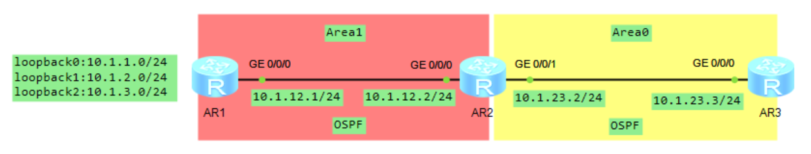
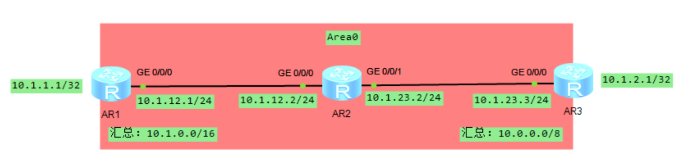
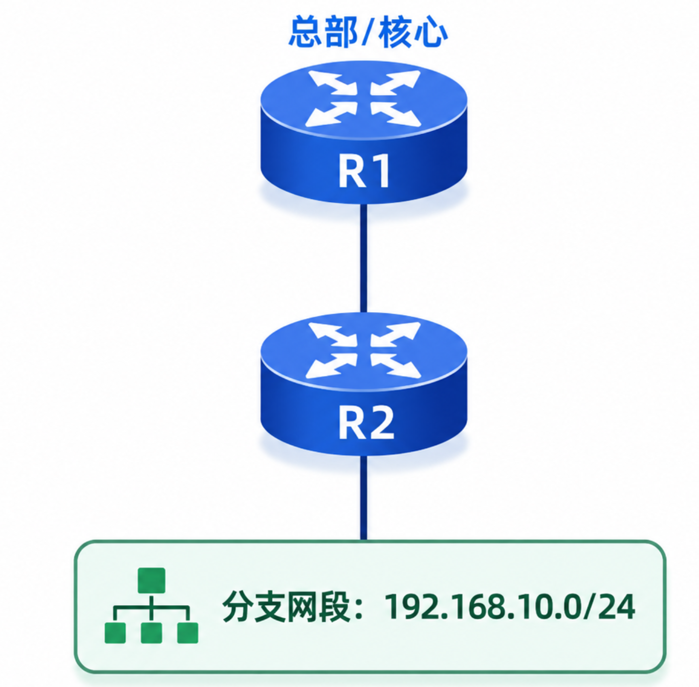
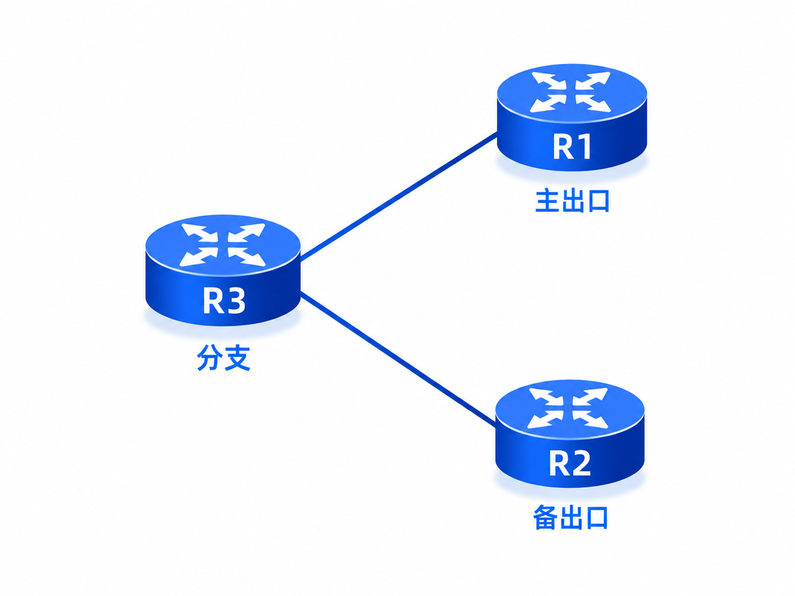
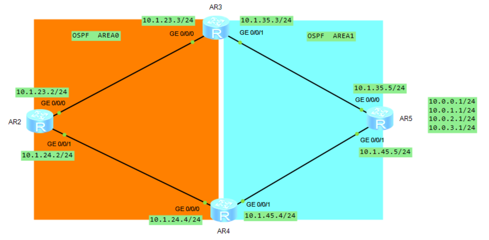

# 路由控制之聚合路由和默认路由

## 1.聚合路由的特点

任何路由协议都设计了路由聚合的技术，设计初衷是考虑当网络规模变大时，路由表中路由条目过多会降低路由器查找速度。聚合路由的特点如下所示：

1. 多条细（更精确）路由聚合成一条粗”路由，这条粗路由其实是所有细”路由共同拥有的路由前缀。
2. **<font color="red">路由聚合时，至少有一条细路由，聚合路由就可以生成；某条成员路由的消失，不会影响聚合路由的生成；而如果聚合路由范围内的细路由不存在，则聚合路由也将消失</font>**。
3. 聚合路由的存在和是否通告完全依赖于细路由（也可称为聚合路由的成员路由）。例：**`10.1.1.0/24`**、**`10.1.2.0/24`**、**`10.1.3.0/24`** 这 3 条路由可以聚合成 **`10.1.0.0/16`** 位的路由，**<font color="red">只要 3 条路由中的任何一条或多条存在在路由表中，聚合路由就可以通告</font>**。
4. **<font color="red">聚合发生后，路由器将会自动抑制成员路由的通告，而仅通告聚合路由</font>**。
5. 执行聚合的路由器会向外通告聚合路由，某些路由协议会在聚合路由器的路由表中生成一条指向 NULL0 接口的聚合路由，华为的协议实现中，仅 IS-IS 有能力在聚合后的路由表中出现一条指向 NULL0 接口的路由，这条路由用于避免环路。
6. 某些路由协议的聚合路由会继承成员路由的某些属性，OSPF 协议将会继承细路由中最大的 cost 值、IS-IS 协议会继承细路由中最小的 cost 值。

下面通过实验来验证上述 2、3、4 这 3 个特点，拓扑图如下所示：

<div align="center">
    
</div>

不做聚合时，AR3 上可以看到以下 3 条明细路由，这说明 AR1 在 Area 1 中产生的 3 条细路由，经由 ABR AR2 以区域间路由的形式通告到了 Area 0。

```java{.line-numbers}
[AR3-ospf-1]display ip routing-table protocol ospf
Route Flags: R - relay, D - download to fib
------------------------------------------------------------------------------
Destination/Mask    Proto   Pre  Cost      Flags NextHop         Interface
       10.1.1.1/32  OSPF    10   2           D   10.1.23.2       GigabitEthernet0/0/0
       10.1.2.1/32  OSPF    10   2           D   10.1.23.2       GigabitEthernet0/0/0
       10.1.3.1/32  OSPF    10   2           D   10.1.23.2       GigabitEthernet0/0/0
      10.1.12.0/24  OSPF    10   2           D   10.1.23.2       GigabitEthernet0/0/0
OSPF routing table status : <Inactive> Destinations : 0        Routes : 0
[AR2-ospf-1]display ip routing-table protocol ospf 
Route Flags: R - relay, D - download to fib
------------------------------------------------------------------------------
Destination/Mask    Proto   Pre  Cost      Flags NextHop         Interface
       10.1.1.1/32  OSPF    10   1           D   10.1.12.1       GigabitEthernet0/0/0
       10.1.2.1/32  OSPF    10   1           D   10.1.12.1       GigabitEthernet0/0/0
       10.1.3.1/32  OSPF    10   1           D   10.1.12.1       GigabitEthernet0/0/0
OSPF routing table status : <Inactive> Destinations : 0        Routes : 0
```

接下来在 AR2 上配置 OSPF 区域间聚合，这里的含义是 AR2 作为 ABR，把 Area 1 中 **`10.1.1.0/24-10.1.3.0/24`** 范围内的路由聚合成 **`10.1.0.0/22`**，再向其他区域通告。聚合前缀是 **`10.1.0.0/22`**，这说明第三个字节只有前 6 位是网络位，后 2 位是主机位，因此覆盖地址范围为 **`10.1.0.0~10.1.3.255`**。判断一个明细路由是否在聚合网络中，只需要将明细网络地址和聚合掩码 **`255.255.252.0`** 做与运算，结果在聚合网络中，就说明该明细路由在聚合网络覆盖范围内。

```java{.line-numbers}
[AR2]ospf 1
[AR2-ospf-1]area 1
[AR2-ospf-1-area-0.0.0.1]abr-summary 10.1.0.0 255.255.252.0
```

可以看到，AR2 只向 AR3 通告了一条聚合路由 **`10.1.0.0/22`**，而没有通告任何成员路由了。但是在 AR2 的路由表中，成员路由仍然存在。因此对于第 4 点，要特别注意它说的是对外通告层面，不是说本机路由表里明细路由消失了。**<font color="red">在聚合设备本机上，明细路由通常仍然存在，因为本机转发流量还需要靠这些更精确的路由</font>**。根据华为文档，**<font color="blue">在配置 IPv4 路由聚合后，本地 IS-IS 设备的 IPv4 路由表保持不变，仍然会显示聚合前的路由。收到该设备发送的 LSP 的其他 IS-IS 设备，其 IPv4 路由表中不显示聚合前路由，只有聚合后的路由</font>**。直到网络中被聚合的路由都消失时，聚合路由才会消失。

```java{.line-numbers}
<AR3>display ip routing-table 
Route Flags: R - relay, D - download to fib
------------------------------------------------------------------------------
Routing Tables: Public Destinations : 9        Routes : 9        
Destination/Mask    Proto   Pre  Cost      Flags NextHop         Interface
       10.1.0.0/22  OSPF    10   2           D   10.1.23.2       GigabitEthernet0/0/0
      10.1.12.0/24  OSPF    10   2           D   10.1.23.2       GigabitEthernet0/0/0
      10.1.23.0/24  Direct  0    0           D   10.1.23.3       GigabitEthernet0/0/0
      10.1.23.3/32  Direct  0    0           D   127.0.0.1       GigabitEthernet0/0/0
    10.1.23.255/32  Direct  0    0           D   127.0.0.1       GigabitEthernet0/0/0
      127.0.0.0/8   Direct  0    0           D   127.0.0.1       InLoopBack0
      127.0.0.1/32  Direct  0    0           D   127.0.0.1       InLoopBack0
127.255.255.255/32  Direct  0    0           D   127.0.0.1       InLoopBack0
255.255.255.255/32  Direct  0    0           D   127.0.0.1       InLoopBack0
<AR2>display ip routing-table
Route Flags: R - relay, D - download to fib
------------------------------------------------------------------------------
Routing Tables: Public Destinations : 13       Routes : 13       
Destination/Mask    Proto   Pre  Cost      Flags NextHop         Interface
       10.1.1.1/32  OSPF    10   1           D   10.1.12.1       GigabitEthernet0/0/0
       10.1.2.1/32  OSPF    10   1           D   10.1.12.1       GigabitEthernet0/0/0
       10.1.3.1/32  OSPF    10   1           D   10.1.12.1       GigabitEthernet0/0/0
      10.1.12.0/24  Direct  0    0           D   10.1.12.2       GigabitEthernet0/0/0
      10.1.12.2/32  Direct  0    0           D   127.0.0.1       GigabitEthernet0/0/0
    10.1.12.255/32  Direct  0    0           D   127.0.0.1       GigabitEthernet0/0/0
      10.1.23.0/24  Direct  0    0           D   10.1.23.2       GigabitEthernet0/0/1
      10.1.23.2/32  Direct  0    0           D   127.0.0.1       GigabitEthernet0/0/1
    10.1.23.255/32  Direct  0    0           D   127.0.0.1       GigabitEthernet0/0/1
      127.0.0.0/8   Direct  0    0           D   127.0.0.1       InLoopBack0
      127.0.0.1/32  Direct  0    0           D   127.0.0.1       InLoopBack0
127.255.255.255/32  Direct  0    0           D   127.0.0.1       InLoopBack0
255.255.255.255/32  Direct  0    0           D   127.0.0.1       InLoopBack0
```

在 AR1 上关闭某一个成员路由，观察 AR3 上的路由表，发现聚合路由仍然存在，这验证了第 2 点的说法。

```java{.line-numbers}
<AR3>display ip routing-table protocol ospf
Route Flags: R - relay, D - download to fib
------------------------------------------------------------------------------
Destination/Mask    Proto   Pre  Cost      Flags NextHop         Interface
      10.1.12.0/24  OSPF    10   2           D   10.1.23.2       GigabitEthernet0/0/0
OSPF routing table status : <Inactive> Destinations : 0        Routes : 0 
```

当我们将 AR1 上的 3 个 loopback 接口都关闭时，AR3 上的聚合路由也消失了，这验证了第 3 点的说法。

```java{.line-numbers}
<AR3>display ip routing-table 
Route Flags: R - relay, D - download to fib
------------------------------------------------------------------------------
Routing Tables: Public Destinations : 8        Routes : 8        
Destination/Mask    Proto   Pre  Cost      Flags NextHop         Interface
      10.1.12.0/24  OSPF    10   2           D   10.1.23.2       GigabitEthernet0/0/0
      10.1.23.0/24  Direct  0    0           D   10.1.23.3       GigabitEthernet0/0/0
      10.1.23.3/32  Direct  0    0           D   127.0.0.1       GigabitEthernet0/0/0
    10.1.23.255/32  Direct  0    0           D   127.0.0.1       GigabitEthernet0/0/0
      127.0.0.0/8   Direct  0    0           D   127.0.0.1       InLoopBack0
      127.0.0.1/32  Direct  0    0           D   127.0.0.1       InLoopBack0
127.255.255.255/32  Direct  0    0           D   127.0.0.1       InLoopBack0
255.255.255.255/32  Direct  0    0           D   127.0.0.1       InLoopBack0
```

聚合路由的优点如下所示：

- 能减少路由表的大小，降低系统开销，减少路由更新的大小。
- 聚合路由能有效解决路由震荡的问题，**<font color="red">例如被聚合的 IP 地址范围内的某条链路频繁 Up 和 Down，该变化并不会影响到被聚合的 IP 地址范围外的设备</font>**。因此，可以避免网络中的路由振荡，在一定程度上提高了网络的稳定性。

聚合路由的缺点如下所示：

- 聚合路由的 IP 范围若设计得过大会存在路由黑洞。例：在聚合路由器上对 **`10.1.0.0/24`**、**`10.1.1.0/24`**、**`10.1.2.0/24`**、**`10.1.3.0/24`** 做聚合，聚合路由 **`10.1.0.0/16`** 被通告给下游路由器，访问 **`10.1.4.x`** 的数据包会沿聚合路由访问到聚合点路由器，因没有细路由而被丢弃，形成黑洞。
- 聚合路由能减少路由表中精确路由的数量，某些场景下，会引起次优路由。
- 某些路由协议没有在聚合后生成用于防环的 NULL0 接口的路由，所以网络中易引起路由环路。

## 2.单个路由协议聚合造成的环路问题

如下图所示，AR1 上对 **`10.1.1.1/32`** 执行路由聚合，生成 **`10.1.0.0/16`** 聚合路由，并通告给 AR2 和 AR3。同理，AR3 对 **`10.1.2.1/32`** 聚合后，生成 **`10.0.0.0/8`** 聚合路由，通告给 AR2 和 AR1。

<div align="center">
    
</div>

在 AR1 上配置了路由聚合 **`10.1.0.0/16`**，但是 AR3 上没有配置路由聚合时，AR1、AR2、AR3 的路由表如下所示。AR1 的全局路由表中没有 **`10.1.0.0/16`** 的路由，AR2、AR3 上的全局路由表中都有 **`10.1.0.0/16`** 的聚合路由。

```java{.line-numbers}
[AR1-ospf-1]display ip routing-table 10.1.0.0
[AR1-ospf-1]
[AR2-ospf-1]display ip routing-table 10.1.0.0
Route Flags: R - relay, D - download to fib
------------------------------------------------------------------------------
Routing Table : Public
Summary Count : 1
Destination/Mask    Proto   Pre  Cost      Flags NextHop         Interface
       10.1.0.0/16  O_ASE   150  2           D   10.1.12.1       GigabitEthernet0/0/0
[AR3-ospf-1]display ip routing-table 10.1.0.0
Route Flags: R - relay, D - download to fib
------------------------------------------------------------------------------
Routing Table : Public
Summary Count : 1
Destination/Mask    Proto   Pre  Cost      Flags NextHop         Interface
       10.1.0.0/16  O_ASE   150  2           D   10.1.23.2       GigabitEthernet0/0/0
```

接着在 AR3 上配置了聚合路由 **`10.0.0.0/8`** 之后，AR3 自身的全局路由表中没有 **`10.0.0.0/8`** 路由，但是 AR1 和 AR2 上有 **`10.0.0.0/8`** 聚合路由。

```java{.line-numbers}
<AR1>display ip routing-table 10.0.0.0
Route Flags: R - relay, D - download to fib
------------------------------------------------------------------------------
Routing Table : Public
Summary Count : 1
Destination/Mask    Proto   Pre  Cost      Flags NextHop         Interface
       10.0.0.0/8   O_ASE   150  2           D   10.1.12.2       GigabitEthernet0/0/0
<AR2>display ip routing-table 10.0.0.0
Route Flags: R - relay, D - download to fib
------------------------------------------------------------------------------
Routing Table : Public
Summary Count : 1
Destination/Mask    Proto   Pre  Cost      Flags NextHop         Interface
       10.0.0.0/8   O_ASE   150  2           D   10.1.23.3       GigabitEthernet0/0/1
[AR3-ospf-1]display ip routing-table 10.0.0.0
[AR3-ospf-1]
```

这是因为 AR1 将本地明细路由 **`10.1.1.1/32`** 聚合为 **`10.1.0.0/16`** 并通告给其他路由器。但由于该协议/设备不会自动生成指向 Null0 的本地聚合路由，所以 AR1 的本地路由表中仍只有明细直连路由和从 AR3 学到的 **`10.0.0.0/8`** 聚合路由，对于 AR3 同理。因此 AR1 路由表中仅有 2 条路由，一条是直连路由 **`10.1.1.1/32`**，一条是从 AR3 学到的动态路由 **`10.0.0.0/8`**，指向 AR2。同理，AR2 上有 2 条路由，一条是 **`10.1.0.0/16`**，指向 AR1；一条是 **`10.0.0.0/8`** 指向 AR3。AR3 上有 2 条路由，一条是 **`10.1.2.1/32`** 的直连路由，一条是 **`10.1.0.0/16`** 的路由，指向 AR2。

```java{.line-numbers}
<AR2>display ip routing-table 
Route Flags: R - relay, D - download to fib
------------------------------------------------------------------------------
Routing Tables: Public Destinations : 12       Routes : 12       
Destination/Mask    Proto   Pre  Cost      Flags NextHop         Interface
       10.0.0.0/8   O_ASE   150  2           D   10.1.23.3       GigabitEthernet0/0/1
       10.1.0.0/16  O_ASE   150  2           D   10.1.12.1       GigabitEthernet0/0/0
<AR1>display ip routing-table 
Route Flags: R - relay, D - download to fib
------------------------------------------------------------------------------
Routing Tables: Public Destinations : 10       Routes : 10       
Destination/Mask    Proto   Pre  Cost      Flags NextHop         Interface
       10.0.0.0/8   O_ASE   150  2           D   10.1.12.2       GigabitEthernet0/0/0
       10.1.1.1/32  Direct  0    0           D   127.0.0.1       LoopBack0
<AR3>display ip routing-table 
Route Flags: R - relay, D - download to fib
------------------------------------------------------------------------------
Routing Tables: Public Destinations : 10       Routes : 10       
Destination/Mask    Proto   Pre  Cost      Flags NextHop         Interface
       10.1.0.0/16  O_ASE   150  2           D   10.1.23.2       GigabitEthernet0/0/0
       10.1.2.1/32  Direct  0    0           D   127.0.0.1       LoopBack0
```

如果 AR1 收到访问 **`10.1.5.5`** 的数据报文，AR1 查路由表并转发给 AR2，AR2 继续查路由表，按 **`10.1.0.0/16`** 精确路由的指向而转发给 AR1。重复这个过程，AR1 再次把报文转发给 AR2，路由环路出现，数据包直至 TTL 减到 0 而丢弃，过程如下所示：

```java{.line-numbers}
<AR1>tracert 10.1.5.5
 traceroute to  10.1.5.5(10.1.5.5), max hops: 30 ,packet length: 40,press CTRL_C to break 
 1 10.1.12.2 20 ms  10 ms  10 ms 
 2 10.1.12.1 10 ms  10 ms  10 ms 
 3 10.1.12.2 20 ms  20 ms  20 ms 
 4 10.1.12.1 20 ms  20 ms  10 ms 
//......
```

>在做路由聚合时，可能会造成环路问题，可考虑在执行聚合的路由器上添加 NULL0 路由或过滤路由，使其不接收其他默认路由或粗路由，以避免环路。但由于部分路由协议的 preference 值小于静态路由的 preference 值 60，防止静态路由配置后无法进入路由表，可为 NULL0 路由指定 preference。如上例中，AR1 上可添加 **`ip route-static 10.1.0.0 16 null 0 preference 1`**，AR3 上添加 **`ip route-static 10.0.0.0 8 null 0 preference 1`**。

## 3.默认路由

任何路由协议都有生成默认路由的命令，路由器如果在路由表中无法找到数据包所匹配的精确的路由，会把数据包按默认路由转发，每个路由协议都提供自动生成默认的的配置。默认路由多用在远端分支机构单链路上连或多链路上连，备用路径由上游向下游通告默认路由。或不需要太多路由条目的场合——单宿主场合。

>产生默认路由的路由器，一定不要再接收默认路由，否则会出现环路。

### 3.1 单上联分支场景中的默认路由应用

在远端分支机构只有一条链路上联到总部或核心网络时，分支路由器通常没有必要学习总部、核心网或 Internet 的大量明细路由。此时，可以由上游设备向分支设备通告一条默认路由，使分支设备将所有未知目的地址的流量统一转发给上游出口。例如，分支路由器 R2 只有一条链路连接总部路由器 R1：

<div align="center">
    
</div>

在这种场景下，R2 的路由表可以简化为：

```java{.line-numbers}
192.168.10.0/24    Direct
0.0.0.0/0          via R1
```

其中，**`192.168.10.0/24`** 是 R2 的本地直连网段，**`0.0.0.0/0`** 是由 R1 通告给 R2 的默认路由。由于默认路由的前缀长度为 0，它可以匹配所有 IPv4 目的地址，但它并不是优先级最高的路由；只有当路由表中不存在更具体的匹配路由时，流量才会命中默认路由。

### 3.2 多上联主备路径场景中的默认路由

在分支机构存在多条上联链路时，也可以由多个上游设备同时向分支通告默认路由，并通过不同的 cost 或 metric 控制主备路径选择。例如：

<div align="center">
    
</div>

在该拓扑中，R1 和 R2 都可以向分支路由器 R3 通告默认路由，但为两条默认路由设置不同的度量值：

```java{.line-numbers}
R1 通告：0.0.0.0/0，cost 10
R2 通告：0.0.0.0/0，cost 100
```

R3 收到两条默认路由后，会根据路由协议的度量值选择最优路径。通常情况下，cost 越小，路径越优，因此 R3 会优先选择经由 R1 的默认路由作为主用路径；经由 R2 的默认路由则作为备选路径。如果 R1 设备故障，或者 R3 到 R1 的链路中断，R3 将不再收到 R1 通告的默认路由，或者该默认路由会因邻接失效、路由老化等原因从有效路由中移除。此时，R3 会重新选择经由 R2 的默认路由，流量切换到备用出口。

### 3.3 默认路由造成的环路

如下拓扑图所示，AR5 上对 **`10.0.X.1/24`** 进行汇总，汇总为 **`10.0.0.0/16`**，在 AR3 和 AR4 向 OSPF 区域 1 下发默认路由。AR3 访问 **`10.0.4.1`**，AR3 转发给 AR5，AR5 转发给 AR4，AR4 转发给 AR5，AR5 转发给 AR3，环路产生。

<div align="center">
    
</div>

AR3 和 AR4 都会收到 AR5 发布的聚合路由 **`10.0.0.0/16`**，而 AR5 会收到两条默认路由。

```java{.line-numbers}
<AR3>display ip routing-table 
Route Flags: R - relay, D - download to fib
------------------------------------------------------------------------------
Routing Tables: Public Destinations : 13       Routes : 13       
Destination/Mask    Proto   Pre  Cost      Flags NextHop         Interface
       10.0.0.0/16  O_ASE   150  2           D   10.1.35.5       GigabitEthernet0/0/1
      10.1.23.0/24  Direct  0    0           D   10.1.23.3       GigabitEthernet0/0/0
      10.1.23.3/32  Direct  0    0           D   127.0.0.1       GigabitEthernet0/0/0
    10.1.23.255/32  Direct  0    0           D   127.0.0.1       GigabitEthernet0/0/0
      10.1.24.0/24  OSPF    10   2           D   10.1.23.2       GigabitEthernet0/0/0
      10.1.35.0/24  Direct  0    0           D   10.1.35.3       GigabitEthernet0/0/1
      10.1.35.3/32  Direct  0    0           D   127.0.0.1       GigabitEthernet0/0/1
    10.1.35.255/32  Direct  0    0           D   127.0.0.1       GigabitEthernet0/0/1
      10.1.45.0/24  OSPF    10   2           D   10.1.35.5       GigabitEthernet0/0/1
<AR4>display ip routing-table 
Route Flags: R - relay, D - download to fib
------------------------------------------------------------------------------
Routing Tables: Public Destinations : 13       Routes : 13       
Destination/Mask    Proto   Pre  Cost      Flags NextHop         Interface
       10.0.0.0/16  O_ASE   150  2           D   10.1.45.5       GigabitEthernet0/0/1
      10.1.23.0/24  OSPF    10   2           D   10.1.24.2       GigabitEthernet0/0/0
      10.1.24.0/24  Direct  0    0           D   10.1.24.4       GigabitEthernet0/0/0
      10.1.24.4/32  Direct  0    0           D   127.0.0.1       GigabitEthernet0/0/0
    10.1.24.255/32  Direct  0    0           D   127.0.0.1       GigabitEthernet0/0/0
      10.1.35.0/24  OSPF    10   2           D   10.1.45.5       GigabitEthernet0/0/1
      10.1.45.0/24  Direct  0    0           D   10.1.45.4       GigabitEthernet0/0/1
      10.1.45.4/32  Direct  0    0           D   127.0.0.1       GigabitEthernet0/0/1
    10.1.45.255/32  Direct  0    0           D   127.0.0.1       GigabitEthernet0/0/1
<AR5>display ip routing-table 
Route Flags: R - relay, D - download to fib
------------------------------------------------------------------------------
Routing Tables: Public Destinations : 25       Routes : 26       
Destination/Mask    Proto   Pre  Cost      Flags NextHop         Interface
        0.0.0.0/0   O_ASE   150  1           D   10.1.35.3       GigabitEthernet0/0/0
                    O_ASE   150  1           D   10.1.45.4       GigabitEthernet0/0/1
       10.0.0.0/24  Direct  0    0           D   10.0.0.1        LoopBack0
       10.0.0.1/32  Direct  0    0           D   127.0.0.1       LoopBack0
     10.0.0.255/32  Direct  0    0           D   127.0.0.1       LoopBack0
       10.0.1.0/24  Direct  0    0           D   10.0.1.1        LoopBack1
       10.0.1.1/32  Direct  0    0           D   127.0.0.1       LoopBack1
     10.0.1.255/32  Direct  0    0           D   127.0.0.1       LoopBack1
       10.0.2.0/24  Direct  0    0           D   10.0.2.1        LoopBack2
       10.0.2.1/32  Direct  0    0           D   127.0.0.1       LoopBack2
     10.0.2.255/32  Direct  0    0           D   127.0.0.1       LoopBack2
       10.0.3.0/24  Direct  0    0           D   10.0.3.1        LoopBack3
       10.0.3.1/32  Direct  0    0           D   127.0.0.1       LoopBack3
     10.0.3.255/32  Direct  0    0           D   127.0.0.1       LoopBack3
      10.1.23.0/24  OSPF    10   2           D   10.1.35.3       GigabitEthernet0/0/0
      10.1.24.0/24  OSPF    10   2           D   10.1.45.4       GigabitEthernet0/0/1
```

如果 AR3 访问一个网段为 **`10.0.4.1`**，只能匹配到聚合路由，数据包到达 AR5，AR5 匹配到默认路由发送给 AR4，AR4 再次匹配到聚合路由发布给 AR5，然后再到达 AR3，继而产生环路。

```java{.line-numbers}
<AR3>tracert 10.0.4.1
traceroute to  10.0.4.1(10.0.4.1), max hops: 30 ,packet length: 40,press CTRL_C to break 
 1 10.1.35.5 30 ms  30 ms  20 ms 
 2 10.1.45.4 40 ms 10.1.35.3 20 ms 10.1.45.4 10 ms 
 3 10.1.35.5 20 ms 10.1.45.5 30 ms 10.1.35.5 30 ms 
 4 10.1.45.4 30 ms 10.1.35.3 20 ms 10.1.45.4 20 ms 
 5 10.1.35.5 30 ms 10.1.45.5 30 ms 10.1.35.5 40 ms 
 6 10.1.45.4 30 ms 10.1.35.3 30 ms 10.1.45.4 30 ms 
 7 10.1.35.5 40 ms 10.1.45.5 30 ms 10.1.35.5 50 ms 
 8 10.1.45.4 40 ms 10.1.35.3 40 ms 10.1.45.4 30 ms 
 9 10.1.35.5 50 ms 10.1.45.5 40 ms 10.1.35.5 50 ms 
10 10.1.45.4 50 ms 10.1.35.3 50 ms 10.1.45.4 60 ms 
11 10.1.35.5 60 ms 
//......
```
