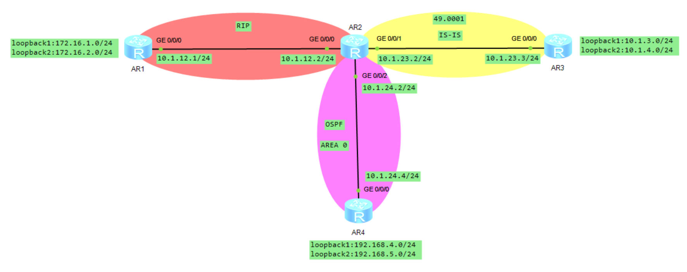
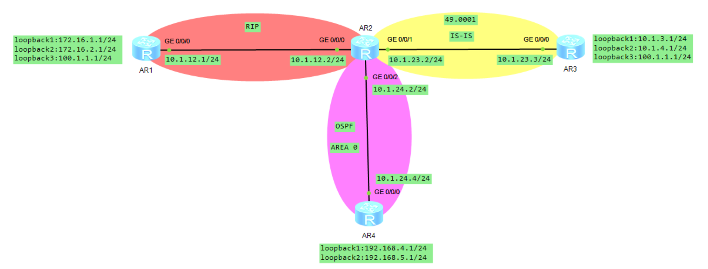
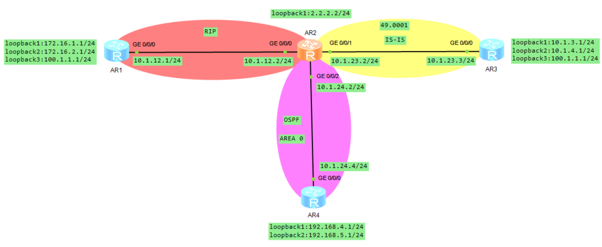
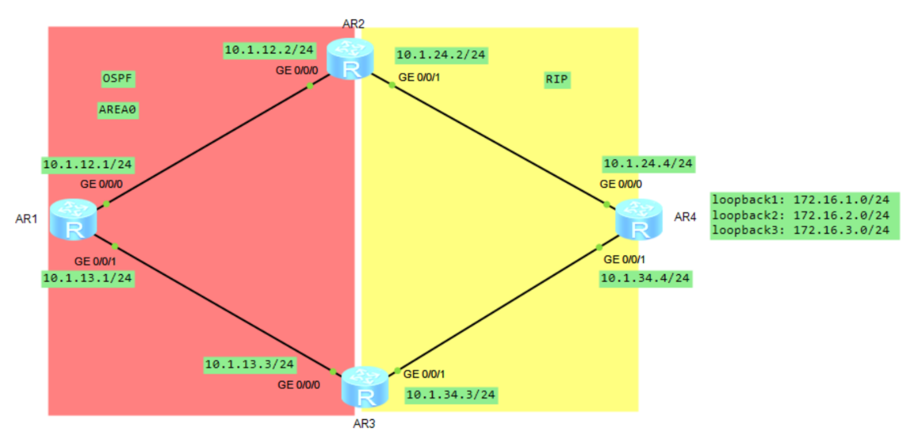
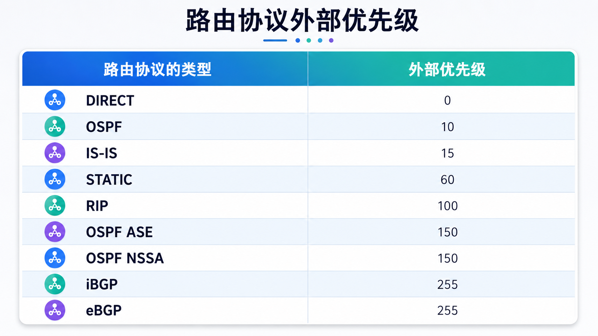
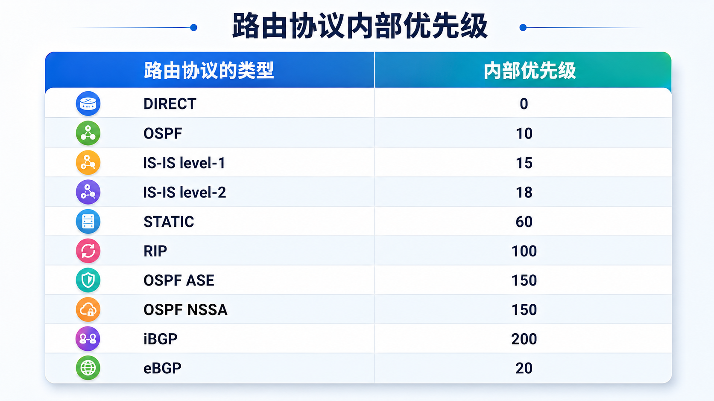
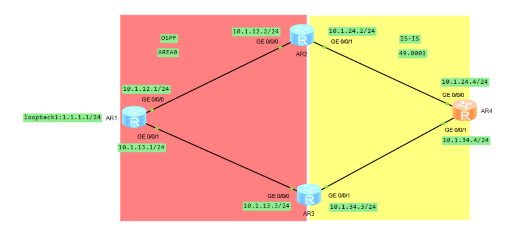

# 路由控制之路由引入

## 1.路由引入的原理

如果网络中存在多种协议并存，而一台自治系统边界设备上同时运行了两种路由协议，为了确保路由被其他协议学习到，需要做路由的引入操作。**<font color="red">路由引入时，将出现在路由表中的一个协议的路由注入到另一个路由协议中</font>**，对另外的协议而言，这些引入的路由称为外部路由。任何路由协议彼此间都可以引入其他协议的路由（如：RIP、IS-IS、OSPF、BGP），也可以将直连或静态路由进行引入，目的是为了使运行本协议的路由器能够学习到外部的路由。

```java{.line-numbers}
import-route {{static | direct | unr} | {rip | ospf | isis} [process-id]} [cost cost | route-policy route-policy-name]
```

在 RIP 进程中可以选择引入其他协议或者静态/直连路由，可以通过 cost 来指定外部路由的开销值，如果没有配置则用缺省，通过 route-policy 来定义引入符合指定策略的路由。

```java{.line-numbers}
import-route {limit limit-number} | {bgp [ permit-ibgp ] | direct | unr | rip [process-id-rip] | static | isis [process-id-isis] | ospf [process-id-ospf]} [cost cost | type type | tag tag | route-policy route-policy-name]
```

在 OSPF 进程中可以选择引入其他协议或者静态/直连路由，通过 cost 来指定外部路由的开销值，通过 type 设置类型，通过 tag 设置路由标记，通过 route-policy 来定义引入符合指定策略的路由。

```java{.line-numbers}
import-route protocol [process-id] [cost-type {external | internal} | cost cost | tag tag | route-policy route-policy-name | [level-1 | level-2 | level-1-2]]
```

在 IS-IS 引入外部路由时，cost-type 用来指定外部路由的开销类型，缺省为 external (**`cost=源 cost+64`**)、internal（继承源 cost 值）。**`level-1/2`** 用来指定外部路由引入到哪个路由表中，如果未指定级别，默认引入到 level-2 中。

### 1.1 路由引入规则 1

#### 1.1.1 案例一

**<font color="red">路由引入规则 1：一种路由协议在引入其他路由协议时，只引入路由协议在路由表中存在的路由，不出现在路由表中的路由是不会被引入的，这种对路由表中路由进行控制的行为是矢量行为</font>**。

<div align="center">
    
</div>

我们使用如下拓扑图来进行说明，AR2 是 ASBR，在没有做路由引入时，观察 AR2 的路由表，可以看到 AR2 的路由表中学习到了 OSPF、RIP、IS-IS 的路由。AR3 和 AR4 的路由表中只学习到本地的直连路由，并没有学习到其他区域的其他协议的路由。

```java{.line-numbers}
<AR1>display ip routing-table 
Route Flags: R - relay, D - download to fib
------------------------------------------------------------------------------
Routing Tables: Public Destinations : 13       Routes : 13       
Destination/Mask    Proto   Pre  Cost      Flags NextHop         Interface
      10.1.12.0/24  Direct  0    0           D   10.1.12.1       GigabitEthernet0/0/0
      10.1.12.1/32  Direct  0    0           D   127.0.0.1       GigabitEthernet0/0/0
    10.1.12.255/32  Direct  0    0           D   127.0.0.1       GigabitEthernet0/0/0
      127.0.0.0/8   Direct  0    0           D   127.0.0.1       InLoopBack0
      127.0.0.1/32  Direct  0    0           D   127.0.0.1       InLoopBack0
127.255.255.255/32  Direct  0    0           D   127.0.0.1       InLoopBack0
     172.16.1.0/24  Direct  0    0           D   172.16.1.1      LoopBack1
     172.16.1.1/32  Direct  0    0           D   127.0.0.1       LoopBack1
   172.16.1.255/32  Direct  0    0           D   127.0.0.1       LoopBack1
     172.16.2.0/24  Direct  0    0           D   172.16.2.1      LoopBack2
     172.16.2.1/32  Direct  0    0           D   127.0.0.1       LoopBack2
   172.16.2.255/32  Direct  0    0           D   127.0.0.1       LoopBack2
<AR2>display ip routing-table 
Route Flags: R - relay, D - download to fib
------------------------------------------------------------------------------
Routing Tables: Public Destinations : 19       Routes : 19       
Destination/Mask    Proto   Pre  Cost      Flags NextHop         Interface
       10.1.3.0/24  ISIS-L2 15   10          D   10.1.23.3       GigabitEthernet0/0/1
       10.1.4.0/24  ISIS-L2 15   10          D   10.1.23.3       GigabitEthernet0/0/1
      10.1.12.0/24  Direct  0    0           D   10.1.12.2       GigabitEthernet0/0/0
      10.1.12.2/32  Direct  0    0           D   127.0.0.1       GigabitEthernet0/0/0
    10.1.12.255/32  Direct  0    0           D   127.0.0.1       GigabitEthernet0/0/0
      10.1.23.0/24  Direct  0    0           D   10.1.23.2       GigabitEthernet0/0/1
      10.1.23.2/32  Direct  0    0           D   127.0.0.1       GigabitEthernet0/0/1
    10.1.23.255/32  Direct  0    0           D   127.0.0.1       GigabitEthernet0/0/1
      10.1.24.0/24  Direct  0    0           D   10.1.24.2       GigabitEthernet0/0/2
      10.1.24.2/32  Direct  0    0           D   127.0.0.1       GigabitEthernet0/0/2
    10.1.24.255/32  Direct  0    0           D   127.0.0.1       GigabitEthernet0/0/2
     172.16.1.0/24  RIP     100  1           D   10.1.12.1       GigabitEthernet0/0/0
     172.16.2.0/24  RIP     100  1           D   10.1.12.1       GigabitEthernet0/0/0
    192.168.4.1/32  OSPF    10   1           D   10.1.24.4       GigabitEthernet0/0/2
    192.168.5.1/32  OSPF    10   1           D   10.1.24.4       GigabitEthernet0/0/2
<AR4>display ip routing-table 
Route Flags: R - relay, D - download to fib
------------------------------------------------------------------------------
Routing Tables: Public Destinations : 13       Routes : 13       
Destination/Mask    Proto   Pre  Cost      Flags NextHop         Interface
      10.1.24.0/24  Direct  0    0           D   10.1.24.4       GigabitEthernet0/0/0
      10.1.24.4/32  Direct  0    0           D   127.0.0.1       GigabitEthernet0/0/0
    10.1.24.255/32  Direct  0    0           D   127.0.0.1       GigabitEthernet0/0/0
      127.0.0.0/8   Direct  0    0           D   127.0.0.1       InLoopBack0
      127.0.0.1/32  Direct  0    0           D   127.0.0.1       InLoopBack0
127.255.255.255/32  Direct  0    0           D   127.0.0.1       InLoopBack0
    192.168.4.0/24  Direct  0    0           D   192.168.4.1     LoopBack1
    192.168.4.1/32  Direct  0    0           D   127.0.0.1       LoopBack1
  192.168.4.255/32  Direct  0    0           D   127.0.0.1       LoopBack1
    192.168.5.0/24  Direct  0    0           D   192.168.5.1     LoopBack2
    192.168.5.1/32  Direct  0    0           D   127.0.0.1       LoopBack2
<AR3>display ip routing-table 
Route Flags: R - relay, D - download to fib
------------------------------------------------------------------------------
Routing Tables: Public Destinations : 13       Routes : 13       
Destination/Mask    Proto   Pre  Cost      Flags NextHop         Interface
       10.1.3.0/24  Direct  0    0           D   10.1.3.1        LoopBack1
       10.1.3.1/32  Direct  0    0           D   127.0.0.1       LoopBack1
     10.1.3.255/32  Direct  0    0           D   127.0.0.1       LoopBack1
       10.1.4.0/24  Direct  0    0           D   10.1.4.1        LoopBack2
       10.1.4.1/32  Direct  0    0           D   127.0.0.1       LoopBack2
     10.1.4.255/32  Direct  0    0           D   127.0.0.1       LoopBack2
      10.1.23.0/24  Direct  0    0           D   10.1.23.3       GigabitEthernet0/0/0
      10.1.23.3/32  Direct  0    0           D   127.0.0.1       GigabitEthernet0/0/0
    10.1.23.255/32  Direct  0    0           D   127.0.0.1       GigabitEthernet0/0/0
      127.0.0.0/8   Direct  0    0           D   127.0.0.1       InLoopBack0
      127.0.0.1/32  Direct  0    0           D   127.0.0.1       InLoopBack0
127.255.255.255/32  Direct  0    0           D   127.0.0.1       InLoopBack0
255.255.255.255/32  Direct  0    0           D   127.0.0.1       InLoopBack0
```

AR2 将 IS-IS 引入到 OSPF 中，AR4 中多了 **`10.1.3.0`**、**`10.1.4.0`**、**`10.1.23.0`** 的路由，这些路由都是通过 AR2 引入到 OSPF 中的，AR3 中的路由表没有任何变化，AR1 中的路由表也没有任何变化。

```java{.line-numbers}
[AR2]ospf 1
[AR2-ospf-1]import-route isis 1
<AR4>display ip routing-table 
Route Flags: R - relay, D - download to fib
------------------------------------------------------------------------------
Routing Tables: Public Destinations : 16       Routes : 16       
Destination/Mask    Proto   Pre  Cost      Flags NextHop         Interface
       10.1.3.0/24  O_ASE   150  1           D   10.1.24.2       GigabitEthernet0/0/0
       10.1.4.0/24  O_ASE   150  1           D   10.1.24.2       GigabitEthernet0/0/0
      10.1.23.0/24  O_ASE   150  1           D   10.1.24.2       GigabitEthernet0/0/0
      10.1.24.0/24  Direct  0    0           D   10.1.24.4       GigabitEthernet0/0/0
      10.1.24.4/32  Direct  0    0           D   127.0.0.1       GigabitEthernet0/0/0
    10.1.24.255/32  Direct  0    0           D   127.0.0.1       GigabitEthernet0/0/0
      127.0.0.0/8   Direct  0    0           D   127.0.0.1       InLoopBack0
      127.0.0.1/32  Direct  0    0           D   127.0.0.1       InLoopBack0
127.255.255.255/32  Direct  0    0           D   127.0.0.1       InLoopBack0
    192.168.4.0/24  Direct  0    0           D   192.168.4.1     LoopBack1
    192.168.4.1/32  Direct  0    0           D   127.0.0.1       LoopBack1
  192.168.4.255/32  Direct  0    0           D   127.0.0.1       LoopBack1
    192.168.5.0/24  Direct  0    0           D   192.168.5.1     LoopBack2
    192.168.5.1/32  Direct  0    0           D   127.0.0.1       LoopBack2
  192.168.5.255/32  Direct  0    0           D   127.0.0.1       LoopBack2
<AR1>display ip routing-table 
Route Flags: R - relay, D - download to fib
------------------------------------------------------------------------------
Routing Tables: Public Destinations : 13       Routes : 13       
Destination/Mask    Proto   Pre  Cost      Flags NextHop         Interface
      10.1.12.0/24  Direct  0    0           D   10.1.12.1       GigabitEthernet0/0/0
      10.1.12.1/32  Direct  0    0           D   127.0.0.1       GigabitEthernet0/0/0
    10.1.12.255/32  Direct  0    0           D   127.0.0.1       GigabitEthernet0/0/0
      127.0.0.0/8   Direct  0    0           D   127.0.0.1       InLoopBack0
      127.0.0.1/32  Direct  0    0           D   127.0.0.1       InLoopBack0
127.255.255.255/32  Direct  0    0           D   127.0.0.1       InLoopBack0
     172.16.1.0/24  Direct  0    0           D   172.16.1.1      LoopBack1
     172.16.1.1/32  Direct  0    0           D   127.0.0.1       LoopBack1
   172.16.1.255/32  Direct  0    0           D   127.0.0.1       LoopBack1
     172.16.2.0/24  Direct  0    0           D   172.16.2.1      LoopBack2
     172.16.2.1/32  Direct  0    0           D   127.0.0.1       LoopBack2
   172.16.2.255/32  Direct  0    0           D   127.0.0.1       LoopBack2
```

接下来 AR2 继续将 OSPF 引入到 RIP 中，在 AR1 的路由表中新增了 **`10.1.24.0/24`**、**`192.168.4.1/32`**、**`192.168.5.1/32`** 这 3 条 OSPF 路由。但是 IS-IS 中的三条路由 **`10.1.x.0/24`** 是无法学习到的，原因在于 AR2 通过 IS-IS 协议学到这三条路由，但 AR2 并没有将 IS-IS 引入进 RIP 协议（只引入了 OSPF 协议到 RIP 中），所以路由也不会传递给 AR1。

```java{.line-numbers}
[AR2-rip-1]display current-configuration configuration rip 
[V200R003C00]
#
rip 1
 undo summary
 version 2
 network 10.0.0.0
 silent-interface all
 silent-interface disable GigabitEthernet0/0/0
 import-route ospf 1 cost 2
#
[AR2-rip-1]display ospf routing 
	 OSPF Process 1 with Router ID 2.2.2.2
		  Routing Tables 
 Routing for Network 
 Destination        Cost  Type       NextHop         AdvRouter       Area
 10.1.24.0/24       1     Transit    10.1.24.2       2.2.2.2         0.0.0.0
 192.168.4.1/32     1     Stub       10.1.24.4       4.4.4.4         0.0.0.0
 192.168.5.1/32     1     Stub       10.1.24.4       4.4.4.4         0.0.0.0
 Total Nets: 3  
 Intra Area: 3  Inter Area: 0  ASE: 0  NSSA: 0 
<AR1>display ip routing-table 
Route Flags: R - relay, D - download to fib
------------------------------------------------------------------------------
Routing Tables: Public Destinations : 17       Routes : 17       
Destination/Mask    Proto   Pre  Cost      Flags NextHop         Interface
      10.1.12.0/24  Direct  0    0           D   10.1.12.1       GigabitEthernet0/0/0
      10.1.12.1/32  Direct  0    0           D   127.0.0.1       GigabitEthernet0/0/0
    10.1.12.255/32  Direct  0    0           D   127.0.0.1       GigabitEthernet0/0/0
      10.1.23.0/24  RIP     100  1           D   10.1.12.2       GigabitEthernet0/0/0
      10.1.24.0/24  RIP     100  1           D   10.1.12.2       GigabitEthernet0/0/0
      127.0.0.0/8   Direct  0    0           D   127.0.0.1       InLoopBack0
      127.0.0.1/32  Direct  0    0           D   127.0.0.1       InLoopBack0
127.255.255.255/32  Direct  0    0           D   127.0.0.1       InLoopBack0
     172.16.1.0/24  Direct  0    0           D   172.16.1.1      LoopBack1
     172.16.1.1/32  Direct  0    0           D   127.0.0.1       LoopBack1
   172.16.1.255/32  Direct  0    0           D   127.0.0.1       LoopBack1
     172.16.2.0/24  Direct  0    0           D   172.16.2.1      LoopBack2
     172.16.2.1/32  Direct  0    0           D   127.0.0.1       LoopBack2
   172.16.2.255/32  Direct  0    0           D   127.0.0.1       LoopBack2
    192.168.4.1/32  RIP     100  3           D   10.1.12.2       GigabitEthernet0/0/0
    192.168.5.1/32  RIP     100  3           D   10.1.12.2       GigabitEthernet0/0/0
```

#### 1.1.2 案例二

<div align="center">
    
</div>

假设现在的拓扑图如上所示，此时 IS-IS 路由没有引入到 OSPF 协议中，OSPF 协议路由也没有被引入到 RIP 协议中，此时 AR2 的路由表如下所示：

```java{.line-numbers}
[AR2-ospf-1]display ip routing-table 100.1.1.1
Route Flags: R - relay, D - download to fib
------------------------------------------------------------------------------
Routing Table : Public
Summary Count : 1
Destination/Mask    Proto   Pre  Cost      Flags NextHop         Interface
      100.1.1.0/24  ISIS-L2 15   10          D   10.1.23.3       GigabitEthernet0/0/1
```

接着只将 RIP 协议的路由引入 OSPF 协议中。

```java{.line-numbers}
[AR2]ospf 1
[AR2-ospf-1]import-route rip 1
```

AR2 从 IS-IS 和 RIP 同时学到此路由，但出现在 AR2 的路由表中最优的路由条目来自于 IS-IS 协议（IS-IS 优先级优于 RIP），而 AR2 只将 RIP 引入进 OSPF，并没有将 IS-IS 引入到 OSPF，因此只能将 RIP 的直连网段 **`10.1.23.0/24`** 以及 **`172.16.1.1/24`**、**`172.16.2.1/24`** 引入进 OSPF 去，而 **`100.1.1.0/24`** 路由将会引入失败，AR4 无法看到该路由。

```java{.line-numbers}
<AR4>display ip routing-table
Route Flags: R - relay, D - download to fib
------------------------------------------------------------------------------
Routing Tables: Public Destinations : 17       Routes : 17       
Destination/Mask    Proto   Pre  Cost      Flags NextHop         Interface
      10.1.12.0/24  O_ASE   150  1           D   10.1.24.2       GigabitEthernet0/0/0
      10.1.23.0/24  O_ASE   150  1           D   10.1.24.2       GigabitEthernet0/0/0
      10.1.24.0/24  Direct  0    0           D   10.1.24.4       GigabitEthernet0/0/0
      10.1.24.4/32  Direct  0    0           D   127.0.0.1       GigabitEthernet0/0/0
    10.1.24.255/32  Direct  0    0           D   127.0.0.1       GigabitEthernet0/0/0
      127.0.0.0/8   Direct  0    0           D   127.0.0.1       InLoopBack0
      127.0.0.1/32  Direct  0    0           D   127.0.0.1       InLoopBack0
127.255.255.255/32  Direct  0    0           D   127.0.0.1       InLoopBack0
     172.16.1.0/24  O_ASE   150  1           D   10.1.24.2       GigabitEthernet0/0/0
     172.16.2.0/24  O_ASE   150  1           D   10.1.24.2       GigabitEthernet0/0/0
    192.168.4.0/24  Direct  0    0           D   192.168.4.1     LoopBack1
    192.168.4.1/32  Direct  0    0           D   127.0.0.1       LoopBack1
  192.168.4.255/32  Direct  0    0           D   127.0.0.1       LoopBack1
    192.168.5.0/24  Direct  0    0           D   192.168.5.1     LoopBack2
    192.168.5.1/32  Direct  0    0           D   127.0.0.1       LoopBack2
  192.168.5.255/32  Direct  0    0           D   127.0.0.1       LoopBack2
```

### 1.2 路由引入规则 2

路由引入规则 2：引入直连（**`import direct`**）和引入协议（**`import xxx`**）同时存在时，直连路由是否引入由 **`import direct`** 来决定。

<div align="center">
    
</div>

如上图所示，在 AR2 上将 RIP 路由引入到 OSPF 中，AR2 上有直连（direct）和 RIP 协议学习到的路由，引入到 OSPF 时，这几条路由都会被引入 OSPF。所以在 OSPF 中能看到 **`10.1.12.0/24`**、**`172.16.1.1/24`**、**`172.16.2.1/24`** 这三条路由。其中 **`172.16.1.0/24`**、**`172.16.2.0/24`** 是 AR2 从 AR1 通过 RIP 学到的路由；**`10.1.12.0/24`**、**`10.1.23.0/24`** 是 AR2 本机直连网段，但由于 AR2 的 RIP 使用 **`network 10.0.0.0`**，这些 10 网段接口也被纳入 RIP 进程，所以在只配置 **`import-route rip 1`** 时，它们会被 OSPF 作为外部路由发布出去。

```java{.line-numbers}
<AR4>display ip routing-table
Route Flags: R - relay, D - download to fib
------------------------------------------------------------------------------
Routing Tables: Public Destinations : 17       Routes : 17       
Destination/Mask    Proto   Pre  Cost      Flags NextHop         Interface
      10.1.12.0/24  O_ASE   150  1           D   10.1.24.2       GigabitEthernet0/0/0*
      10.1.23.0/24  O_ASE   150  1           D   10.1.24.2       GigabitEthernet0/0/0
      10.1.24.0/24  Direct  0    0           D   10.1.24.4       GigabitEthernet0/0/0
      10.1.24.4/32  Direct  0    0           D   127.0.0.1       GigabitEthernet0/0/0
    10.1.24.255/32  Direct  0    0           D   127.0.0.1       GigabitEthernet0/0/0
      127.0.0.0/8   Direct  0    0           D   127.0.0.1       InLoopBack0
      127.0.0.1/32  Direct  0    0           D   127.0.0.1       InLoopBack0
127.255.255.255/32  Direct  0    0           D   127.0.0.1       InLoopBack0
     172.16.1.0/24  O_ASE   150  1           D   10.1.24.2       GigabitEthernet0/0/0*
     172.16.2.0/24  O_ASE   150  1           D   10.1.24.2       GigabitEthernet0/0/0*
    192.168.4.0/24  Direct  0    0           D   192.168.4.1     LoopBack1
    192.168.4.1/32  Direct  0    0           D   127.0.0.1       LoopBack1
  192.168.4.255/32  Direct  0    0           D   127.0.0.1       LoopBack1
    192.168.5.0/24  Direct  0    0           D   192.168.5.1     LoopBack2
    192.168.5.1/32  Direct  0    0           D   127.0.0.1       LoopBack2
  192.168.5.255/32  Direct  0    0           D   127.0.0.1       LoopBack2
```

如果 AR2 新增 LoopBack1：

```java{.line-numbers}
interface LoopBack1
 ip address 2.2.2.2 255.255.255.0
```

但该 LoopBack1 没有宣告进 RIP，则只配置 **`import-route rip 1`** 时，OSPF 不会发布 **`2.2.2.0/24`**。如果 OSPF 域中的 AR4 需要访问 AR2 的 **`2.2.2.0/24`**，需要在 AR2 的 OSPF 进程中引入直连路由：

```java{.line-numbers}
[R2]route-policy DIRECT permit node 10
[R2-route-policy]if-match interface LoopBack1
[R2-route-policy]quit
[R2]ospf 1
[R2-ospf1]import-route direct route-policy DIRECT
```

配置完成后，AR4 的全局路由表如下所示，此时可能不再看到 **`10.1.12.0/24 O_ASE`**、**`10.1.23.0/24 O_ASE`**。

```java{.line-numbers}
<AR4>display ip routing-table 
Route Flags: R - relay, D - download to fib
------------------------------------------------------------------------------
Routing Tables: Public Destinations : 16       Routes : 16       
Destination/Mask    Proto   Pre  Cost      Flags NextHop         Interface
        2.2.2.0/24  O_ASE   150  1           D   10.1.24.2       GigabitEthernet0/0/0
      10.1.24.0/24  Direct  0    0           D   10.1.24.4       GigabitEthernet0/0/0
      10.1.24.4/32  Direct  0    0           D   127.0.0.1       GigabitEthernet0/0/0
    10.1.24.255/32  Direct  0    0           D   127.0.0.1       GigabitEthernet0/0/0
      127.0.0.0/8   Direct  0    0           D   127.0.0.1       InLoopBack0
      127.0.0.1/32  Direct  0    0           D   127.0.0.1       InLoopBack0
127.255.255.255/32  Direct  0    0           D   127.0.0.1       InLoopBack0
     172.16.1.0/24  O_ASE   150  1           D   10.1.24.2       GigabitEthernet0/0/0
     172.16.2.0/24  O_ASE   150  1           D   10.1.24.2       GigabitEthernet0/0/0
    192.168.4.0/24  Direct  0    0           D   192.168.4.1     LoopBack1
    192.168.4.1/32  Direct  0    0           D   127.0.0.1       LoopBack1
  192.168.4.255/32  Direct  0    0           D   127.0.0.1       LoopBack1
    192.168.5.0/24  Direct  0    0           D   192.168.5.1     LoopBack2
    192.168.5.1/32  Direct  0    0           D   127.0.0.1       LoopBack2
  192.168.5.255/32  Direct  0    0           D   127.0.0.1       LoopBack2
255.255.255.255/32  Direct  0    0           D   127.0.0.1       InLoopBack0
```

当 AR2 上同时存在 **`import-route rip 1`** 和 **`import-route direct route-policy DIRECT_TO_OSPF`** 时，AR2 本机直连路由是否作为 OSPF 外部路由发布，由 **`import-route direct`** 的过滤策略决定。由于 **`DIRECT_TO_OSPF`** 只允许出接口为 LoopBack1 的直连路由通过，所以 **`2.2.2.0/24`** 可以被引入 OSPF，而 **`10.1.12.0/24`**、**`10.1.23.0/24`** 这类出接口不是 LoopBack1 的直连网段不会被引入 OSPF。

## 2.路由的度量

路由度量是指用来衡量到达目标网络所需要花费的代价，每种路由协议的衡量标准不一样，如 RIP 协议要参考的是跳数 (hop)，OSPF 协议参考的是 cost 值 (通过计算链路的带宽得出的值)。**<font color="red">每个出现在协议路由域内部的目标路由会计算域内的路径成本。而外部引入的路由在引入时要考虑引入的成本，称为外部路由成本</font>**。

每个协议的 metric 计算方式是不一样的，OSPF 和 IS-IS 是根据 cost 值来计算的，而 RIP 协议根据 hop 来计算。特别是 RIP 协议修改 metric 时不能改得比 15 大，否则路由将无法学习到。

<div align="center">
    
</div>

如上图所示，AR2 和 AR3 分别进行双向路由引入，AR1 和 AR4 分别都从 AR2 和 AR3 收到来自对方的路由。但是 AR1 和 AR4 都会有两条次优路径，AR1 针对 **`10.1.24.0/24`**、**`10.1.34.0/24`** 网段分别会经过 AR2 和 AR3 到达，而 AR4 针对 **`10.1.12.0/24`**、**`10.1.13.0/24`** 网段也会经过 AR2 和 AR3 到达。

```java{.line-numbers}
<AR1>display ip routing-table 10.1.24.0
Route Flags: R - relay, D - download to fib
------------------------------------------------------------------------------
Routing Table : Public
Summary Count : 2
Destination/Mask    Proto   Pre  Cost      Flags NextHop         Interface
      10.1.24.0/24  O_ASE   150  1           D   10.1.12.2       GigabitEthernet0/0/0
                    O_ASE   150  1           D   10.1.13.3       GigabitEthernet0/0/1
<AR1>display ip routing-table 10.1.34.0
Route Flags: R - relay, D - download to fib
------------------------------------------------------------------------------
Routing Table : Public
Summary Count : 2
Destination/Mask    Proto   Pre  Cost      Flags NextHop         Interface
      10.1.34.0/24  O_ASE   150  1           D   10.1.12.2       GigabitEthernet0/0/0
                    O_ASE   150  1           D   10.1.13.3       GigabitEthernet0/0/1
<AR4>display ip routing-table 10.1.12.0
Route Flags: R - relay, D - download to fib
------------------------------------------------------------------------------
Routing Table : Public
Summary Count : 2
Destination/Mask    Proto   Pre  Cost      Flags NextHop         Interface
      10.1.12.0/24  RIP     100  1           D   10.1.34.3       GigabitEthernet0/0/1
                    RIP     100  1           D   10.1.24.2       GigabitEthernet0/0/0
<AR4>display ip routing-table 10.1.13.0
Route Flags: R - relay, D - download to fib
------------------------------------------------------------------------------
Routing Table : Public
Summary Count : 2
Destination/Mask    Proto   Pre  Cost      Flags NextHop         Interface
      10.1.13.0/24  RIP     100  1           D   10.1.34.3       GigabitEthernet0/0/1
                    RIP     100  1           D   10.1.24.2       GigabitEthernet0/0/0
```

由于引入的路由 metric 值都相等，路由表中将会等价负载分担。这样 AR1 到达 **`10.1.24.0/24`** 应该优先从 AR2 访问，而从 AR3 访问则是次优路径，同理，AR1 从 AR2 访问 **`10.1.34.0/24`** 也是次优路径。AR4 到达 **`10.1.12.0/24`** 和 **`10.1.13.0/24`** 网段也会出现同样的问题。以上原因都是因为路由引入的 metric 值相同造成的，从同一个路由协议学习到的相同路由就会比较 metric 值，小的优先，如相等则同时放进路由表。

在 AR2 和 AR3 分别进行路由引入时使用 **`route-policy`** 工具将引入的路由设置 metric，AR2 将 RIP 引入进 OSPF 时，将 **`10.1.34.0/24`** 网段 metric 设置为 10，目的是为了让 AR1 优先选 AR3 到达 **`10.1.34.0/24`** 网段。因为 AR2 和 AR3 引入该路由时默认 metric 都为 1，而在 AR2 上修改了 metric 值以后，AR1 将会把最优的下一跳为 AR3(metric=1) 的路由放进路由表。

而在 AR3 引入路由时将 **`10.1.24.0/24`** 网段的 metric 改为 10，目的是让 AR1 优先选择 AR2 作为下一跳 (metric=1) 到达 **`10.1.24.0`**。而 AR2 和 AR3 将 OSPF 引入 RIP 时，同样采用修改 metric 的方式来实现，确保每个设备走最优路由。AR2 和 AR3 的路由策略配置如下所示：

```java{.line-numbers}
// AR2 的过滤策略
[AR2]ip ip-prefix R2_IMPORT index 10 permit 10.1.34.3 24
[AR2]route-policy R2_POLICY permit node 10
Info: New Sequence of this List.
[AR2-route-policy]if-match ip-prefix R2_IMPORT 
[AR2-route-policy]apply cost 10
[AR2]route-policy R2_POLICY permit node 20
[AR2-ospf-1]import-route rip 1 route-policy R2_POLICY
[AR2]route-policy R2_POLICY permit node 20
// AR3 的过滤策略
[AR3]ip ip-prefix R3_IMPORT index 10 permit 10.1.24.0 24
[AR3]route-policy R3_POLICY permit node 10
Info: New Sequence of this List.
[AR3-route-policy]if-match ip-prefix R3_IMPORT
[AR3-route-policy]apply cost 10
[AR3]route-policy R3_POLICY permit node 20
[AR3-ospf-1]import-route rip 1 route-policy R3_POLICY
```

AR1 的全局路由表中 **`10.1.24.0`** 和 **`10.1.34.0`** 的路由条目如下所示，AR1 去往 **`10.1.34.0`** 的下一跳是 AR3，去往 **`10.1.24.0`** 的下一跳是 AR2。

```java{.line-numbers}
<AR1>display ip routing-table 10.1.34.0
Route Flags: R - relay, D - download to fib
------------------------------------------------------------------------------
Routing Table : Public
Summary Count : 1
Destination/Mask    Proto   Pre  Cost      Flags NextHop         Interface
      10.1.34.0/24  O_ASE   150  1           D   10.1.13.3       GigabitEthernet0/0/1
<AR1>display ip routing-table 10.1.24.0
Route Flags: R - relay, D - download to fib
------------------------------------------------------------------------------
Routing Table : Public
Summary Count : 1
Destination/Mask    Proto   Pre  Cost      Flags NextHop         Interface
      10.1.24.0/24  O_ASE   150  1           D   10.1.12.2       GigabitEthernet0/0/0
```

## 3.路由协议的优先级

任何出现在路由表里面的路由，除非直连路由，都会由 cost 来衡量到目标网络的距离。如果路由器学到多条相同路由，分别源自不同路由协议，按照以下步骤进行比较。

- 先比较各协议的外部优先级。
- 如果外部优先级一致，再比较内部优先级。
- 如果内外部优先级都一样，则比较多条路由的 cost。
- 如果 cost 一致，多条路由都将出现在路由表中，负载分担，否则只放入 cost 最小的路由。

路由表中到目的地路由，不同的路由协议 (包括静态路由) 可能会发现不同的路由，但这些路由并不都是最优的。事实上，在某一时刻，到某一目的地的当前路由仅能由唯一的路由协议来决定。为了判断最优路由，各路由协议 (包括静态路由) 都被赋予了一个优先级，**<font color="red">当存在多个路由信息源时，具有较高优先级 (取值较小) 的路由协议发现的路由将成为最优路由，并将最优路由放入本地路由表中</font>**。路由器分别定义了外部优先级和内部优先级，**<font color="red">外部优先级是指用户可以手工为各路由协议配置的优先级</font>**。

<div align="center">
    
</div>

>数值越小表示路由的可信度越高，数值越大说明越不可信，路由器优先选择数值小的路由。

<div align="center">
    
</div>

**选择路由时先比较路由的外部优先级，当不同的路由协议配置了相同的优先级后，系统会通过内部优先级决定哪个路由协议发现的路由将成为最优路由**。例如，到达同一目的地 **`100.1.1.0/24`** 有两条路由可供选择，一条是静态路由，另一条是 OSPF 路由，且这两条路由的外部优先级都被配置成 8。这时路由器系统将根据上图所示的内部优先级进行判断。因为 OSPF 协议的内部优先级是 10，高于静态路由的内部优先级 60，所以系统选择 OSPF 协议学习的路由作为最优路由。

>路由协议内部优先级不能被人工修改。

```java{.line-numbers}
preference { preference | route-policy route-policy-name }
```

该命令直接在路由进程下配置，如 **`preference 80`**，则将该协议学习到的路由优先级全部调整为 80。也可以通过调用 route-policy 工具来匹配特定的路由，仅对特定的路由修改优先级，其他没有被匹配的路由采用默认值。具体示例如下所示：

```java{.line-numbers}
rip 1
 preference route-policy PRE
#
route-policy PRE permit node 10
 if-match ip-prefix TECH
 apply preference 80
#
ip ip-prefix TECH index 10 permit 10.1.1.0 24
```

使用前缀列表将路由匹配，通过 route-policy 调用前缀列表，并设置优先级为 80，在路由进程中通过 preference 调用 route-policy。

如下表所示，在 OSPF 中修改内部路由优先级为 100，且通过 route-policy 将所有路由优先级改为 200，请问此时路由表中的内部路由和外部路由的优先级分别是多少?

```java{.line-numbers}
ospf 1
 preference route-policy PRE 100
#
route-policy PRE permit node 10
 apply preference 200
```

如果在路由进程中使用 preference 工具修改 OSPF 内部路由优先级，值设置为 100，且同时调用了 route-policy 策略工具并修改路由优先级，那么该设备将会优先使用策略当中定义的优先级。策略当中匹配到所有的路由，最终路由表中所有 OSPF 内部路由优先级被设置为 200，而不是 100。由于没有设置外部优先级，因此为默认值 150。

如下表所示，在 OSPF 中修改外部路由优先级为 100，且通过 route-policy 将所有路由优先级改为 200，请问此时路由表中的内部路由和外部路由的优先级分别是多少?

```java{.line-numbers}
acl number 2000
 rule 10 permit source 172.16.1.0 0
#
ospf 1
 preference ase route-policy PRE 100
#
route-policy PRE permit node 10
 if-match acl 2000
 apply preference 200
```

在 OSPF 进程中修改了外部路由优先级，值为 100，同时调用了 route-policy，且将其中的 ACL 2000 中匹配的路由 **`172.16.1.0`** 的路由优先级改为了 200。最终路由表中所有 OSPF 外部路由中除了 **`172.16.1.0`** 被设置为 200 以外，其他的外部路由都被设置为 100，而内部路由优先级没有修改，因此为默认的 10。

## 4.路由引入

### 4.1 双向路由引入造成的次优路径问题

<div align="center">
    
</div>

如上图所示，AR1 将路由 **`10.0.0.0/24`** 网段引入进 OSPF：

```java{.line-numbers}
[AR1]ip ip-prefix R1_EXPORT index 10 permit 1.1.1.0 24
[AR1-ospf-1]display route-policy R2_POLICY
Route-policy : R2_POLICY
  permit : 10 (matched counts: 9)
    Match clauses : 
      if-match ip-prefix R1_EXPORT
[AR1-ospf-1]import-route direct route-policy R2_POLICY
```

由于 OSPF 有两种优先级，从外部引入进 OSPF 的路由优先级为 150，而 AR2 和 AR3 又将 OSPF 引入进 IS-IS 中。路由引入存在优先顺序，假设 AR2 优先将 OSPF 引入到 IS-IS 中，AR3 从 IS-IS 和 OSPF 同时学习到这条路由，那么 AR3 将会比较路由优先级，最终会选择较小的值 (15)。

```java{.line-numbers}
<AR2>display ip routing-table 1.1.1.1
Route Flags: R - relay, D - download to fib
------------------------------------------------------------------------------
Routing Table : Public
Summary Count : 1
Destination/Mask    Proto   Pre  Cost      Flags NextHop         Interface
        1.1.1.0/24  O_ASE   150  1           D   10.1.12.1       GigabitEthernet0/0/0
<AR3>display ip routing-table 1.1.1.1
Route Flags: R - relay, D - download to fib
------------------------------------------------------------------------------
Routing Table : Public
Summary Count : 1
Destination/Mask    Proto   Pre  Cost      Flags NextHop         Interface
        1.1.1.0/24  ISIS-L2 15   84          D   10.1.34.4       GigabitEthernet0/0/1
<AR4>display ip routing-table 1.1.1.1
Route Flags: R - relay, D - download to fib
------------------------------------------------------------------------------
Routing Table : Public
Summary Count : 1
Destination/Mask    Proto   Pre  Cost      Flags NextHop         Interface
        1.1.1.0/24  ISIS-L2 15   74          D   10.1.24.2       GigabitEthernet0/0/0
```

因此 AR3 将会沿着 **`AR3-AR4-AR2-AR1`** 的路径转发，这样次优路径就形成了。

```java{.line-numbers}
<AR3>tracert 1.1.1.1
 traceroute to  1.1.1.1(1.1.1.1), max hops: 30 ,packet length: 40,press CTRL_C to break 
 1 10.1.34.4 50 ms  30 ms  10 ms 
 2 10.1.24.2 20 ms  20 ms  20 ms 
 3 10.1.12.1 30 ms  30 ms  20 ms 
```

解决办法就是通过修改 AR3 的路由优先级，可以修改 AR3 的 OSPF 优先级，将其调整得更小（比 IS-IS 优先级更小，小于 15），比如将 OSPF 的优先级调整为 14，那么 AR3 将会选择 OSPF 去往 **`1.1.1.1/24`** 网段。如下所示，在 AR2 的 OSPF 进程中使用 preference 命令调整 OSPF 外部路由的优先级。

```java{.line-numbers}
[AR3]ospf 1
[AR3-ospf-1]preference ase route-policy PREFER
[AR3-ospf-1]q
[AR3]route-policy PREFER permit node 10
Info: New Sequence of this List.
[AR3-route-policy]if-match acl 2000
[AR3-route-policy]apply preference 14
[AR3]acl 2000
[AR3-acl-basic-2000]rule 10 permit source 1.1.1.1 0
```

由于 **`1.1.1.1/24`** 是外部路由，**<font color="red">因此使用 preference 命令时后面添加 ase 参数，用于调整 OSPF 的外部路由的优先级，如不携带则调整内部优先级</font>**。使用 route-policy 参数用于调用策略，通过 ACL 匹配到 **`1.1.1.1/24`**，将其外部优先级设置为 14。AR3 的路由表如下：

```java{.line-numbers}
<AR3>display ip routing-table 1.1.1.1
Route Flags: R - relay, D - download to fib
------------------------------------------------------------------------------
Routing Table : Public
Summary Count : 1
Destination/Mask    Proto   Pre  Cost      Flags NextHop         Interface
        1.1.1.0/24  O_ASE   150  1           D   10.1.13.1       GigabitEthernet0/0/0
[AR3-acl-basic-2000]tracert 1.1.1.1
 traceroute to  1.1.1.1(1.1.1.1), max hops: 30 ,packet length: 40,press CTRL_C to break 
 1 10.1.13.1 30 ms  20 ms  20 ms 
```

### 4.2 双向路由引入造成的环路问题

#### 4.2.1 造成的环路问题

<div align="center">
    
</div>

如上图所示，当 AR1 到 **`1.1.1.1/24`** 的网段引入进 OSPF，AR2 和 AR3 做双向路由引入：

```java{.line-numbers}
[R2]isis1
[R2-isis-1]import-routeospf1
[R2-isis-1]quit
[R2]ospf1
[R2-ospf-1]import-routeisis1
[R3]isis1
[R3-isis-1]import-routeospf1
[R3-isis-1]quit
[R3]ospf1
[R3-ospf-1]import-routeisis1
```

AR2 首先将 OSPF 引入进了 IS-IS，AR3 从 OSPF 和 IS-IS 都学习到该路由，由于优先级的问题，IS-IS 学习的路由出现在 AR3 的路由表中。而 AR3 从 OSPF 学习的 1.**`1.1.1.1/24`** 路由引入 IS-IS 时会失败（因为路由引入只会将路由表中的路由引入进来，而此时 AR3 路由表中只有 IS-IS 的路由），因此 AR3 全局路由表中 IS-IS 的路由 **`1.1.1.1/24`** 又被重新引入进 OSPF 中。从 AR1 的 OSPF LSDB 数据库中可以看出，AR1 和 AR3 都会产生 **`1.1.1.1/24`** 的 LSA5 在 OSPF 的 Area0 中进行泛洪。

```java{.line-numbers}
<AR1>display ospf lsdb 
	 OSPF Process 1 with Router ID 1.1.1.1
		 Link State Database 
		         Area: 0.0.0.0
 Type      LinkState ID    AdvRouter          Age  Len   Sequence   Metric
 Router    2.2.2.2         2.2.2.2           1450  36    80000004       1
 Router    1.1.1.1         1.1.1.1           1458  48    80000005       1
 Router    3.3.3.3         3.3.3.3           1450  36    80000004       1
 Network   10.1.13.3       3.3.3.3           1450  32    80000002       0
 Network   10.1.12.2       2.2.2.2           1450  32    80000002       0
		 AS External Database
 Type      LinkState ID    AdvRouter          Age  Len   Sequence   Metric
 External  1.1.1.0         1.1.1.1            773  36    80000001       1
 External  10.1.24.0       3.3.3.3           1482  36    80000001       1
 External  10.1.24.0       2.2.2.2           1502  36    80000001       1
 External  10.1.34.0       3.3.3.3           1502  36    80000001       1
 External  10.1.34.0       2.2.2.2           1482  36    80000001       1
 External  1.1.1.0         3.3.3.3           1458  36    80000001       1
```

此时 AR2 的全局路由表中，**`1.1.1.1/24`** 路由是通过 OSPF 协议学习到的，只能引入到 IS-IS 区域中。

```java{.line-numbers}
<AR2>display ip routing-table 1.1.1.1
Route Flags: R - relay, D - download to fib
------------------------------------------------------------------------------
Routing Table : Public
Summary Count : 1
Destination/Mask    Proto   Pre  Cost      Flags NextHop         Interface
        1.1.1.0/24  O_ASE   150  1           D   10.1.12.1       GigabitEthernet0/0/0
```

此时该条路由 **`1.1.1.1/24`** 发生故障了，从而使 AR1 和 AR2 又通过 AR3 学习到该路由，此时只有 AR3 能够向 OSPF Area0 区域中泛洪 **`1.1.1.1/24`** 的 LSA5，因此 AR1 的全局路由表中 **`1.1.1.1/24`** 路由条目的下一跳指向 **`10.1.13.3/24`**。

```java{.line-numbers}
[AR1]display ospf lsdb
		 AS External Database
 Type      LinkState ID    AdvRouter          Age  Len   Sequence   Metric
 External  10.1.24.0       3.3.3.3             38  36    80000002       1
 External  10.1.24.0       2.2.2.2             58  36    80000002       1
 External  10.1.34.0       3.3.3.3             58  36    80000002       1
 External  10.1.34.0       2.2.2.2             38  36    80000002       1
 External  1.1.1.0         3.3.3.3             14  36    80000002       1
<AR2>display ospf lsdb 
		 AS External Database
 Type      LinkState ID    AdvRouter          Age  Len   Sequence   Metric
 External  10.1.24.0       2.2.2.2             76  36    80000002       1
 External  10.1.34.0       2.2.2.2             56  36    80000002       1
 External  10.1.24.0       3.3.3.3             57  36    80000002       1
 External  10.1.34.0       3.3.3.3             78  36    80000002       1
 External  1.1.1.0         3.3.3.3             33  36    80000002       1
[AR1]display ip routing-table 1.1.1.1
Route Flags: R - relay, D - download to fib
------------------------------------------------------------------------------
Routing Table : Public
Summary Count : 1
Destination/Mask    Proto   Pre  Cost      Flags NextHop         Interface
        1.1.1.0/24  O_ASE   150  1           D   10.1.13.3       GigabitEthernet0/0/1
```

当 AR3 访问 **`1.1.1.1/24`** 网段时，流量会经过 **`AR3-AR4-AR2-AR1-AR3`**，最终形成环路。

```java{.line-numbers}
<AR3>tracert 1.1.1.1
 traceroute to  1.1.1.1(1.1.1.1), max hops: 30 ,packet length: 40,press CTRL_C to break 
 1 10.1.34.4 30 ms  20 ms  10 ms 
 2 10.1.24.2 30 ms  20 ms  40 ms 
 3 10.1.12.1 30 ms  20 ms  30 ms 
 4 10.1.13.3 20 ms  20 ms  10 ms 
 5 10.1.34.4 20 ms  20 ms  30 ms 
 6 10.1.24.2 40 ms  10 ms  30 ms 
 7 10.1.12.1 50 ms  30 ms  30 ms 
```

#### 4.2.2 解决方案

解决办法就是使用路由标记 Tag 来解决环路的问题，具体的思路如下。

顺时针的路由引入：AR2 将 OSPF 引入进 IS-IS 时将路由打上 tag100，此时会将 OSPF 所有的路由引入进 IS-IS 的路由都标记为 100。由于 AR3 会从 AR4 学到 IS-IS 的路由，那么 AR3 将 IS-IS 路由引入 OSPF 时，会将源自 OSPF 的路由又重新引入进 OSPF，这样会导致环路隐患，那么这时可以在 AR3 引入时过滤掉 tag100，这样就可以避免环路。同时，为了防止 IS-IS 路由的环路，在 AR3 将 IS-IS 引入 OSPF 的时候使用另外一个 tag200 来标识 IS-IS 路由，接着在 AR2 上面将 OSPF 引入进 IS-IS 的时候过滤掉 tag200。

逆时针的路由引入：AR2 将 IS-IS 引入进 OSPF 时将路由打上 tag300，那么 AR3 再将 OSPF 引入 IS-IS 时将 tag300 过滤掉，同时 AR3 将 OSPF 引入 IS-IS 时打上 tag400，而 AR2 将 IS-IS 引入进 OSPF 时过滤掉 tag400。

具体的配置如下所示：

```java{.line-numbers}
// R2 的配置
isis 1
    import-route ospf 1 route-policy O2I
ospf1
    import-route isis 1 route-policy I2O
route-policy O2I deny node 5
    if-match tag 200
route-policy O2I permit node 10
    apply tag 100
route-policy I2O deny node 5
    if-match tag 400
route-policy I2O permit node 10
    apply tag 300
// R3 的配置
isis 1
    import-route ospf 1 route-policy O2I
ospf 1
    import-route isis 1 route-policy I2O
route-policy I2O deny node 5
    if-match tag 100
route-policy I2O permit node 10
    apply tag 200
route-policy O2I deny node 5
    if-match tag 300
route-policy O2I permit node 10
    apply tag 400
```